# 预期目标——我如何将学习数据科学与我对足球的痴迷结合起来

> 原文：<https://medium.com/analytics-vidhya/expected-goals-how-i-combined-learning-data-science-with-my-soccer-obsession-f81d721432c7?source=collection_archive---------0----------------------->

[*GitHub 资源库*](https://github.com/j-v-n/Springboard/tree/master/capstone_projects/capstone1)

去年秋天，我接触到了克里斯托弗·比尔曼(Christoph Biermann)写的精彩的《足球黑客》(Football Hackers)。这是一篇很有启发性的文章，讲述了分析世界是如何缓慢但肯定地改变足球世界的。一周后，我狂热地阅读了所有我能找到的足球分析博客/播客。

与此同时，我启动了一个在线数据科学项目，需要我参与一个顶点项目。我决定把我的学术努力和一种半关心的痴迷结合起来。由于这是我的第一个主要数据科学项目，我决定开发一个预期目标(xG)模型，作为涉足足球分析世界的一种方式。不是因为它容易，而是因为它已经被广泛研究，是一个很好的起点，并且在今天无处不在。

***什么是 xG？***

最简单地说，xG 是射门得分的概率，即射门有多好。下面是一些低和高 xG 镜头的例子。

本杰明·帕瓦尔在世界杯上打进了一个神奇的进球

莱昂内尔·梅西做着莱昂内尔·梅西做的事情，为 Samuel Eto'o 创造了最容易的结局

在 2018 年世界杯上，帕瓦德的进球理所当然地被评为比赛进球。这是一个神奇的进球，因为它是如此的不可思议。他位于禁区外，凌空抽射，不在球场中央，在他射门和进球之间有球员。这个进球来自一次非常低的 xG 射门。然而，埃托奥的进球来自莱昂内尔·梅西娴熟的运球，是在球门线的一次简单射门。这个进球来自一个 xG 的高射。两个目标都很出色，但出于完全不同的原因。

***获取数据***

要创建 xG 模型，就像数据科学中的任何问题一样，您需要良好的数据。几乎所有足球数据分析领域的公司都将他们的数据放在付费墙后，这是理所当然的；记录详细的比赛数据并确保质量是昂贵的。然而， [StatsBomb](http://statsbomb.com) 最近免费发布了大量比赛数据，供像我这样的业余分析师参考。

在这个项目中，我使用了 StatsBomb 发布的女子足球数据，其中包含了超过 5900 次射门。这个数据集覆盖了英足总女超联赛(英国)、全国女足联赛(美国)和 2019 年女足世界杯。数据文件是 json 格式的。

***扯皮数据***

StatsBomb 数据非常详细，具有诸如射门位置、射门前传球类型、射门瞬间所有球员的位置、比赛模式类型等特征。由 StatsBomb 预测的 xG 也提供了数据。这对于基准测试非常有用。

一些特征必须被设计，例如射门距离、射门角度和密集度，即射门和进球之间的球员数量。

必须对之前的传球和球员信息中丢失的值进行清理。详情可以在这里找到[。](https://github.com/j-v-n/Springboard/blob/master/capstone_projects/capstone1/data_wrangling.ipynb)

***探索数据***

数据探索由假设树引导。下面转载了这一点。详细的勘探成果在这里是。一些突出的结果如下。

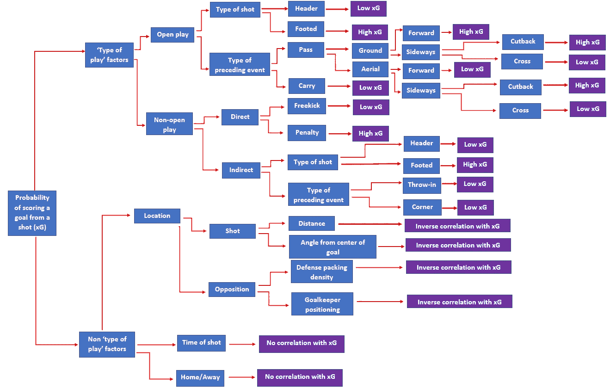

假设树

如下图所示，分析成功和不成功射门的距离，很明显，成功的射门距离球门更近。

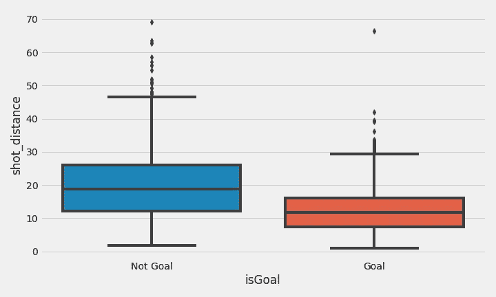

射击距离的箱线图

拍摄角度也很重要。你在球场上的位置越靠前，你瞄准的球门面就越多。

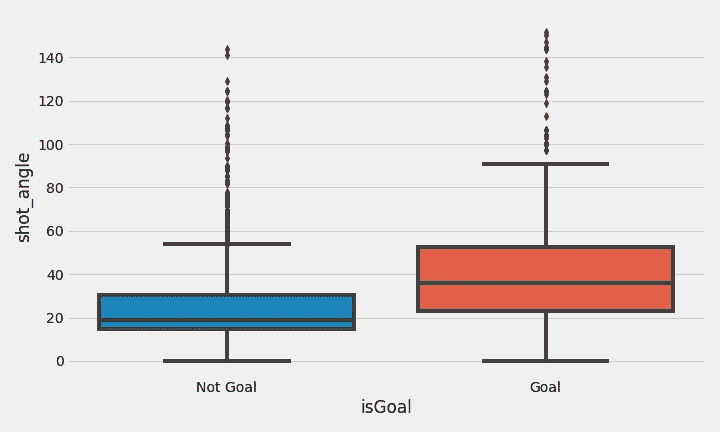

射击角度的箱线图

球门和射门地点之间的区域越拥挤，进球的可能性就越小。

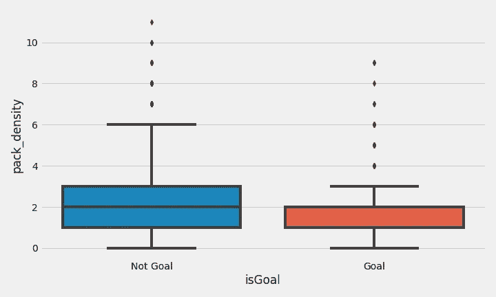

堆积密度箱线图

据观察，第一次射门得分的几率更高。

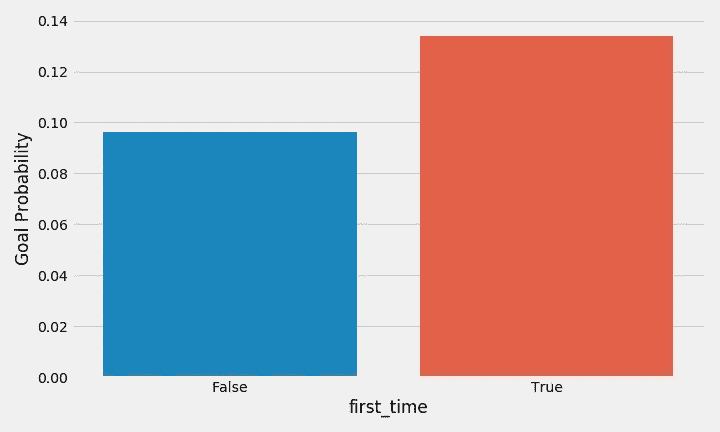

第一次射门和非第一次射门的进球概率柱状图

其他因素，如前面的传球类型，比赛模式，用于投篮的身体部位等。也进行了分析。因为样本大小的问题，直接任意球和点球被排除在分析的其余部分之外。

对于每个特征，使用 A/B 测试检查这些观察的统计显著性。

***构建和测试模型***

建立 xG 模型的目的是预测射门得分的概率。于是几个分类器被[评估](https://github.com/j-v-n/Springboard/blob/master/capstone_projects/capstone1/predictive_model_selection.ipynb)。评估的目的是检查哪些模型在测试数据上尽可能接近匹配 StatsBomb 模型性能。StatsBomb 模型是在一个广泛的数据集(> 30，000)上开发的，而我测试的分类器是在一个小得多的数据集上开发的(在清理并分成训练集和测试集之后约为 4400)。

每个分类器的超参数使用粗略的网格搜索来调整。评估指标是 [AUC 分数](https://developers.google.com/machine-learning/crash-course/classification/roc-and-auc)。结果如下所示。作为比较，StatsBomb 模型在测试数据上的 AUC 得分为 0.81

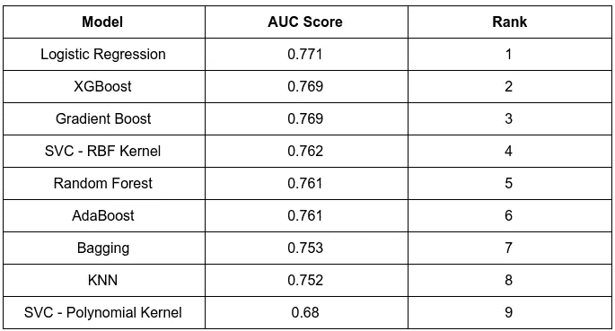

令人惊讶的是，最简单的模型，逻辑回归是表现最好的一个。此外，与只有支持向量机多项式核分类器获得小于 0.75 的 AUC 分数的 StatsBomb 模型相比，该模型相当不错

作为最终模型，从表现最好的 3 个模型——逻辑回归、XGBoost 和梯度增强——中创建集成。集成分类器的测试数据的 AUC 分数是 0.773，因此略微好于单个最佳表现分类器。下图显示了该模型的 ROC 曲线。

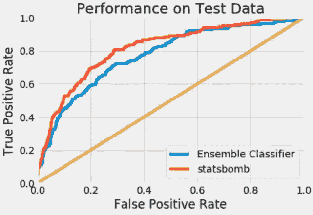

集成分类器的 ROC 曲线

转眼间。我终于有我的 xG 模型全部建成！但是现在呢？

***模型应用***

xG 模型可以用于各种目的。大体上，我认为这些可以分为三个不同的层次:

*   运动员
*   比赛
*   组

让我们用我的 xG 模型来看看这三个层面上的一些例子。为此，我选择使用 WSL 2018–2019 数据，因为它包含一个完整的季节。

首先我们来看一些玩家级别的 xG 应用。下面是一张基于 xG 差异(即总非点球和直接任意球进球与累积 xG 之间的差异)排名前 10 名球员的表格

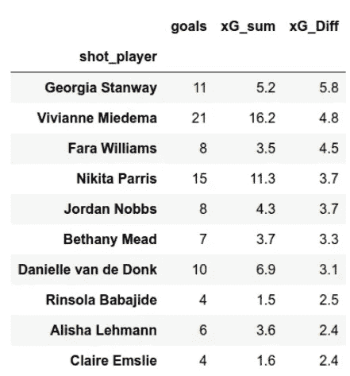

基于 xG 差异的前 10 名玩家

从上表中，我们可以看到乔治亚·斯坦威和薇薇安·米德玛有着出色的赛季表现，超过了他们的累积 xG，正如我的模型所预测的那样。可以理解的是，前 10 名大多是前锋和进攻型中场。

同时，在底部…

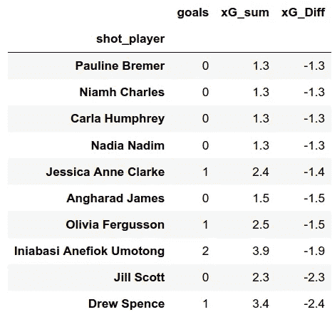

基于 xG 差异的后 10 名玩家

德鲁·斯彭斯，一名来自我钟爱的切尔西的中场球员，没有一个完美的赛季。后卫吉儿·斯科特也投了一些球，但没有得分。

令人惊讶的是，像波林·布雷默和纳迪亚·纳迪姆这样的前锋都在倒数 10 名之列。但考虑到他们的累积 xG 是如此之低，我怀疑这是因为缺乏上场时间。因此，每 90 分钟 xG 是一个更好的指标，因为它将 xG 与上场时间标准化。但是我不会在这里做这些。

在匹配级别，累积 xG 图可用于叙述和分析。浏览 2018-2019 赛季的结果，我决定选择埃弗顿-布莱顿的比赛，因为它以 3 比 3 结束。

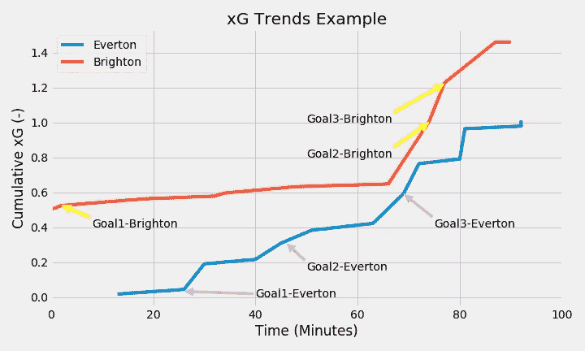

来自埃弗顿 3-3 布莱顿的累积 xG 趋势，2018-2019 WSL

这种类型的情节是一种极好的分析工具。以下是你可以从这个情节中得出的一些观察结果，即使你从未看过这个游戏:

*   布莱顿开局非常好，在比赛一开始就创造了非常好的射门，因为 xG 剧情在 0.45 左右开始。但是他们并没有从这个镜头中得分。不过他们很快就进球了，所以这是比赛的一个很强的开场——他们在前 5 分钟就领先了！从开场投篮到得分投篮的 xG 增益不显著，说明得分投篮本身不是高几率投篮。也许是一个长距离的腰带？
*   另一方面，埃弗顿队尽管是主队，却以不利的姿态开始了比赛。他们直到第 10 分钟才有机会。即使这样，他们的投篮也不是最高质量的，因为直到第 25 分钟，累积 xG 低于 0.1。这表明埃弗顿队在比赛中防守非常严密，在罕见的情况下，他们在前 25 分钟有一次射门，射门次数很少(无论是从远处还是从远处或者密集的防守中)。)
*   在布莱顿的伟大开始之后，他们放松了油门，因为在累积 xG 曲线中没有急剧的跳跃。这表明他们可能已经改变了游戏计划来控制游戏，现在他们已经领先了
*   尽管埃弗顿被迫接受低 xG 射门，但他们在第 27 分钟左右成功扳平了比赛，这似乎是一个神奇的进球，因为 xG 非常非常低！这似乎给了他们更多的进攻动力，因为他们开始创造更好的投篮机会(看看累积 xG 图中的尖峰)。在上半场的剩余时间里，埃弗顿队控制了局面，因为布莱顿队没有创造出更多的好球。上半场结束，埃弗顿资本化，取得领先。2–1!
*   下半场在上半场结束的地方继续进行，埃弗顿创造了更好的射门，而布莱顿则努力创造好的射门。埃弗顿队在第 70 分钟又进了一球，3 比 1 领先！
*   在这一点上，布莱顿做了一个战术上的转变，尽可能地专注于进攻。这得到了回报，因为他们在第 75 分钟到第 80 分钟之间的两次精彩射门得分。现在比赛打成平手了！
*   从这一点上来说，两个队都试图赢得比赛，因为我们可以在 xG 图中看到尖锐的尖峰，表明双方的防守失误。但比赛以 3 比 3 结束。
*   总体而言，累计开放比赛 xG 预测布莱顿队将有 1.4 个进球，埃弗顿队将有 1.0 个进球
*   两支球队都超越了他们的 xG，要么是因为出色的收尾，要么是防守失误
*   尽管最终得分，布莱顿将会失望没有赢得这场比赛，因为他们创造了明显更好的机会。他们有两次很好的机会，分别在比赛开始和结束时，错过这两次机会代价很高

你也可以创建匹配级别的音高地图来添加更多的细节，如下所示。

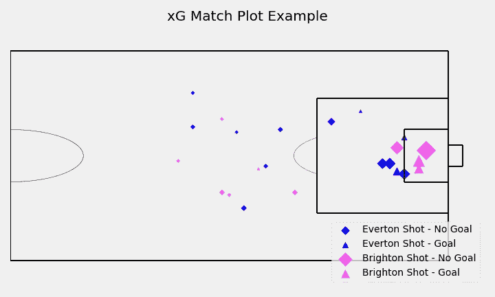

埃弗顿-布莱顿球场地图

标记大小是每个镜头的 xG 的函数。布莱顿在球门附近有几次精彩的射门。最大的 xG 机会接近球门，被布莱顿错过。这是他们在比赛开始时错过的大好机会。还要注意布莱顿在禁区外的进球。这是比赛的第一个进球。埃弗顿的第一个进球实际上是在禁区内，但角度很小。

xG 模型也可以用来评估一个赛季的团队表现。下表列出了所有球队的累积 xG 排名和他们的实际联赛排名。

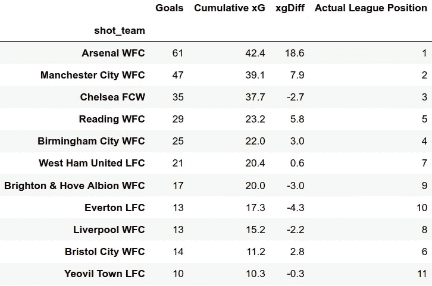

2018–2019 WSL 赛季团队 xG 表

看看最后的联赛排名，并与 xG 表进行比较，我们可以看到，开放比赛 xG 是一个相当不错的球队表现的预测指标。

阿森纳的表现明显优于 xG，理所当然地名列榜首，而耶奥维尔在创造精彩射门方面表现不佳，排名垫底。埃弗顿明显低于他们的 xG，实际上获得了倒数第二名，但根据 xG，他们应该获得第八名。布里斯托尔城的表现超过了 xG，获得了第六名，而 xG 将他们排在了第十名。

除了排名表，我们还可以使用球场地图和 xG 来描述比赛风格和进攻质量。下图显示了 2018-2019 WSL 赛季所有球队的球场地图和拍摄地点。

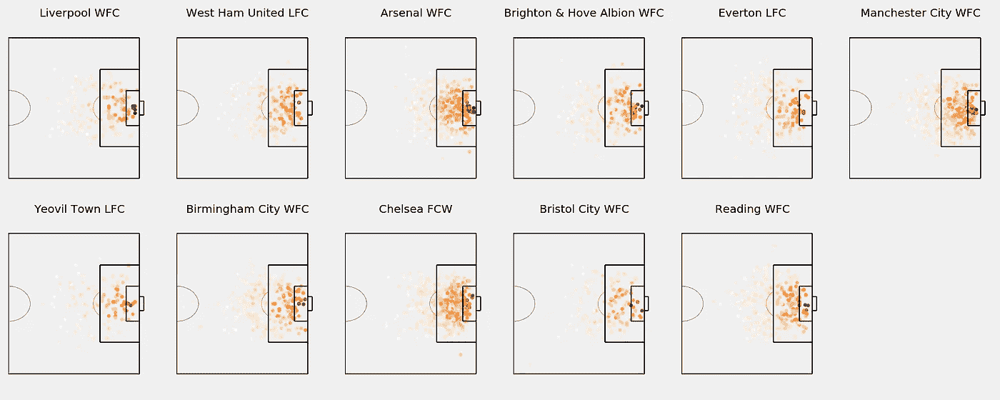

2018-2019 WSL 赛季所有球队的 xG 拍摄地图

作为参考，下面给出了本赛季的整体拍摄图。

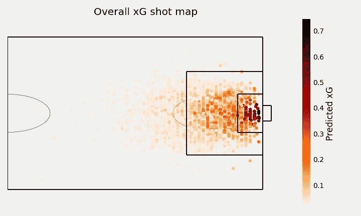

2018-2019 WSL 赛季的整体 xG 拍摄图

阿森纳、曼城和切尔西大部分时间都在禁区内创造了高质量的射门，而像耶奥维尔这样的球队创造的射门总数较少，而且大多数射门都是在禁区外。这表明在进攻中缺乏力量。他们打得“超出了他们的水平”，被降级到较低的级别。

还有很多其他的方式来用 xG 来形象化足球。例如:xG 也可以通过查看 xGA (xG 对抗)来量化你的防守有多好。如果 xGA 低，说明防守好。但为了这个项目的目的，这并没有被研究。

***最终想法***

这确实是一个我享受每一秒钟的项目。但是如果没有我的跳板导师[安库尔·维尔马](https://www.linkedin.com/in/ankur-verma-350b7844/)的帮助，当然，还有免费数据的 StatsBomb，这是不可能的！

如果你想和我讨论这个项目，或者需要帮助开发你自己的 xG 模型，请在下面留言或者在 LinkedIn 上给我发消息。