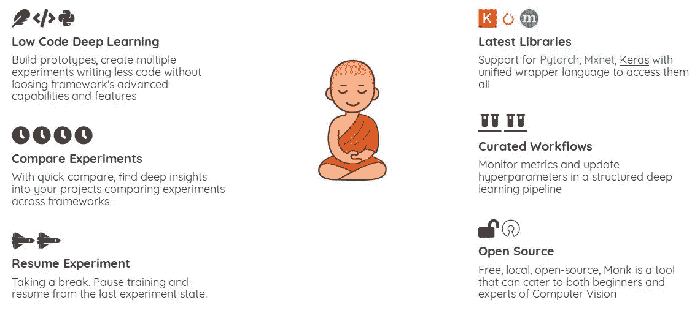
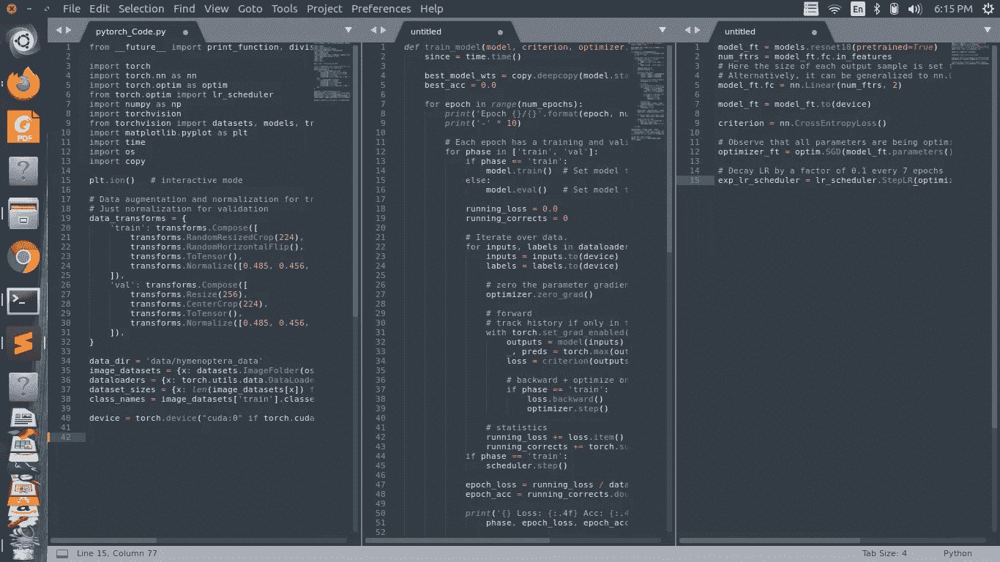
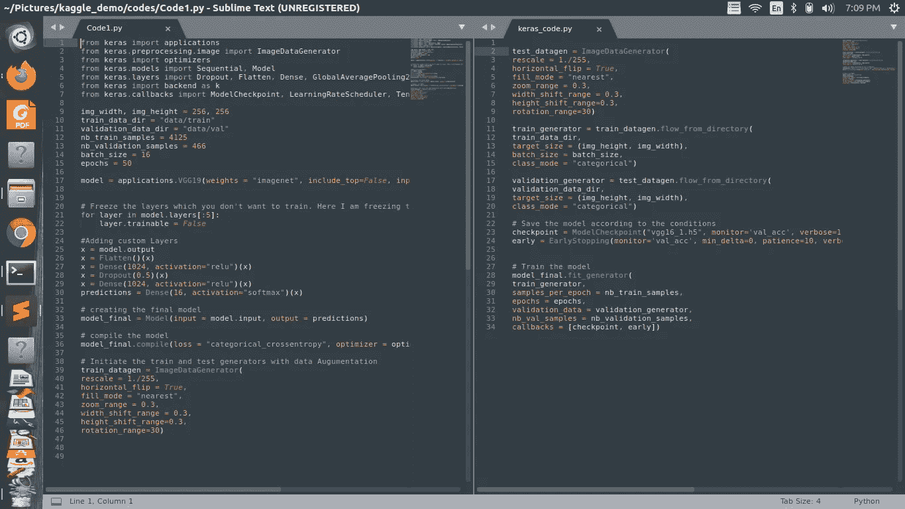
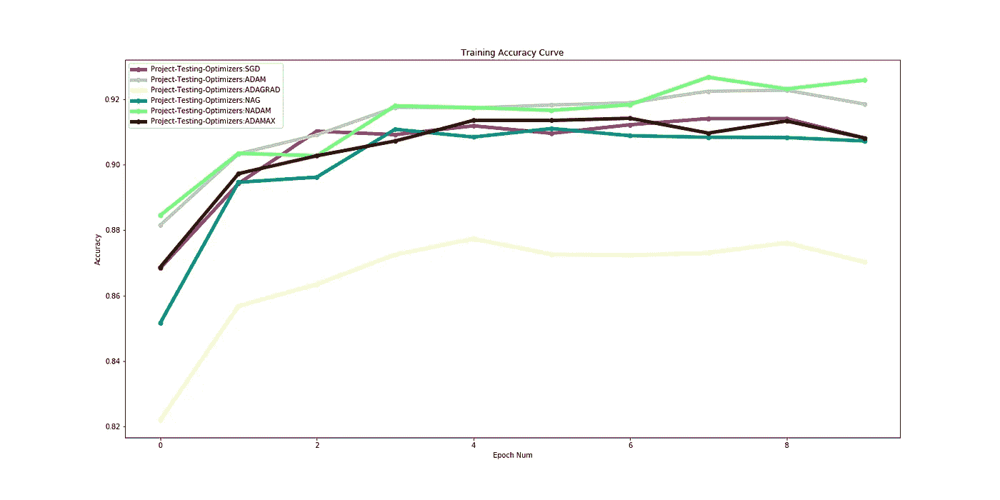

# 跟和尚转移学习

> 原文：<https://medium.com/analytics-vidhya/expediting-transfer-learning-the-monks-way-422d7ec40ec6?source=collection_archive---------19----------------------->

介绍 MONK:一个**开源低代码**迁移学习工具包，作为深度学习框架的统一包装器



MONK 工具功能

网址:【https://monkai-42.firebaseapp.com/ T3

github:【https://github.com/Tessellate-Imaging/monk_v1 

## 迁移学习

迁移学习是训练计算机视觉模型中最常用的技术之一。简单地说，一个已经训练好的模型被挑选出来，并为一个不同的用例重新训练。

## 涉及的关键步骤是

1.  数据摄取
2.  型号选择
3.  设置参数
4.  培养
5.  评估结果
6.  将结果与之前的培训课程进行比较
7.  改变参数并重新训练，直到我们找到最适合的模型
8.  ……重复相同的操作

**让我们比较一下传统方式和僧侣方式的步骤**

# 1.编写更少的代码来开始原型制作过程

为了解决迁移学习的问题，通常会使用像 keras、pytorch 或 mxnet 这样的框架



使用 pytorch 迁移学习—Ref:[https://py torch . org/tutorials/beginner/transfer _ learning _ tutorial . html](https://pytorch.org/tutorials/beginner/transfer_learning_tutorial.html)

**传统方式:**转移学习的第一步是*理解 pytorch* 并编写*这许多行代码！！！！*

## 修道士的方式:从 5 行代码开始，而不是 40 行——使用修道士的快速模式

```
from monk.pytorch_prototype import prototypegtf = prototype(verbose=1);gtf.Prototype("Project-1", "Experiment-1");gtf.Default(dataset_path="train",model_name="resnet18_v1",
           num_epochs=10);gtf.Train();
```

# 2.无缝切换后端框架



使用 keras 转移学习—Ref:[https://medium . com/@ 14 Prakash/transfer-learning-using-keras-d 804 b 2e 04 ef 8](/@14prakash/transfer-learning-using-keras-d804b2e04ef8)

**传统方式:**学习 keras，再次编写多行代码。

## Monk 方式:从 Monk 导入 Keras 实用程序并编写相同的代码

```
from monk.**keras**_prototype import prototypegtf = prototype(verbose=1);gtf.Prototype("Project-1", "Experiment-1");gtf.Default(dataset_path="train",model_name="resnet18_v1",
           num_epochs=10);gtf.Train()
```

Monk 在一定的抽象层次上是语法不变的。

现在，有人可能会问，仅仅这 5 行代码就让我失去了操作参数的能力

# 3.以标准化的方式操作参数

以快速模式加载您的实验，并在每个阶段更改参数

**数据集更新**

```
gtf.update_input_size(256); - Change input shapegtf.update_trainval_split(0.6); - Change splits
```

还有更多…..

**型号更新**

```
ptf.update_freeze_layers(10); - freeze layersptf.append_linear(final_layer=True); - append layers
```

还有更多。

**查看和尚的更新模式**—[https://clever-noy ce-f9d 43 f . net lify . com/#/Update _ Mode/Update _ layers](https://clever-noyce-f9d43f.netlify.com/#/update_mode/update_dataset)

**查看和尚的专家模式**——【https://clever-noyce-f9d43f.netlify.com/#/expert_mode 

# 4.比较使用 Monk 执行的所有实验

**传统的方法:**编写额外的代码来创建比较，并对训练代码进行大量的修改，以便生成这些度量。

**修道士之道**:如果我想检查哪个优化器最适合我的训练(一旦这些实验经过训练)

```
ctf = compare(verbose=1);
ctf.Comparison("Sample-Comparison-1")# Step 1 - Add experiments
ctf.Add_Experiment("Project-Testing-Optimizers", "SGD");
ctf.Add_Experiment("Project-Testing-Optimizers", "ADAM");
ctf.Add_Experiment("Project-Testing-Optimizers", "ADAGRAD");
ctf.Add_Experiment("Project-Testing-Optimizers", "NAG");
ctf.Add_Experiment("Project-Testing-Optimizers", "NADAM");
ctf.Add_Experiment("Project-Testing-Optimizers", "ADAMAX");# Step 2 - Compare
ctf.Generate_Statistics();
```



比较多个实验的训练准确度

# 5.使用 Monk 的其他好处

1.  **从上一个时期中断时，恢复训练课程**
2.  运行**实验数据分析—** 发现类别不平衡、缺失数据、损坏数据
3.  **将实验**从一个系统复制到另一个系统，无论是本地系统还是云系统
4.  **估计实际运行前的训练次数**

请在这里试用该工具并注册社区和论坛:[https://monkai-42.firebaseapp.com/](https://monkai-42.firebaseapp.com/)

请在评论中告诉我们你的想法。

即将发布的故事:使用 MONK 的教程

编码快乐！！！