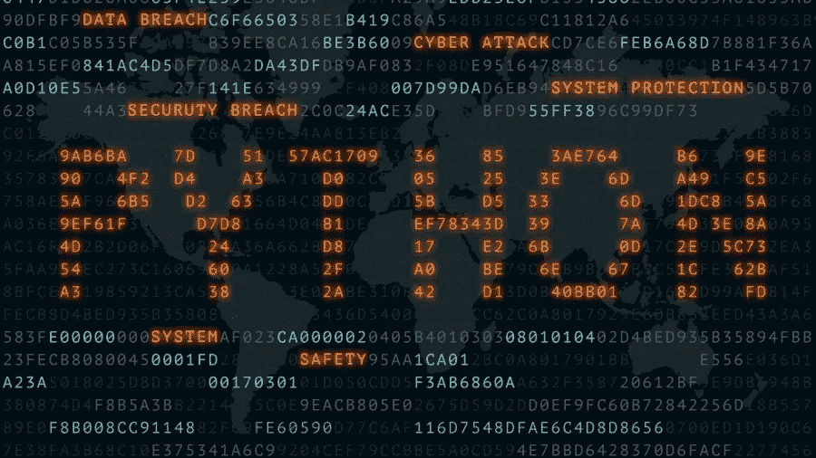
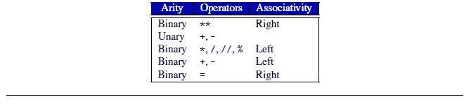
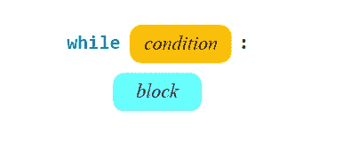
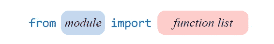

# 用 PYTHON 体验它，明智地进化

> 原文：<https://medium.com/analytics-vidhya/experience-it-with-python-and-evolve-wisely-2c781790eab3?source=collection_archive---------28----------------------->

# 面向所有人的 Python:学习基本术语，无需可怕的代码

**什么是程序？什么是编程？**

## 从一个角度来看，计算机程序是一个指令序列，它规定了计算机系统内电脉冲的流动，这些脉冲与显示屏、键盘、鼠标，甚至可能与网络上的其他计算机相互作用，从而产生“魔力”，允许人类执行有用的任务、解决高级问题和玩游戏。

编程既是科学，又是艺术，还是一次伟大的冒险，你所创造的一切都是你的，是你自己创造的，它会按照你的要求去做。

## **为什么是 Python？**

通过学习 Python，你将能够创建一个程序，无论它是一个简单的游戏，一个小工具，还是商业产品。使用 Python，您可以快速编写一个小项目，但是 PYTHON 也可以很好地扩展，并且可以用于任务关键的商业应用程序。

**PYTHON 简介:**

1.  Python 易于使用:它是一种高级编程语言，允许程序员用几行代码表达概念。
2.  Python 功能强大: Python 拥有除了现代编程语言之外的所有功能。
3.  **Python 是面向对象的:**面向对象编程(OOP)是一种思考和解决现实世界问题的编程方法。
4.  **Python 是一种“粘合”语言:**程序员在使用 Python 时，可以利用已经用另一种语言完成的工作。
5.  PYTHON 可以在任何地方运行: PYTHON 程序是独立于平台的，这意味着不管你用什么操作系统来创建你的程序，它都可以在任何其他装有 Python 的计算机上运行。
6.  **Python 有一个强大的社区:** Python 语言有一个专门的新闻组和 Python 支持社区。
7.  **Python 免费开源:** Python 免费。你可以把它安装在你的电脑上，而且不用付一分钱。

## **理解变量:**

1.  ***创建变量:*** *变量代表存储在计算机内存中的一个值，变量提供了一种标记和访问信息的方式。*
2.  **使用变量:** *变量一旦被创建，就引用某个值。变量的便利之处在于它可以像它所引用的值一样使用。*
3.  **命名变量:** *就像你的程序的骄傲的父母一样，你选择你的变量的名字。*

## 理解基本术语:-

**源代码** :- *更高级别的语言代码称为源代码。*

**目标代码** :- *对应的机器语言代码称为目标代码。*

**解释器** :-将源代码逐行翻译成目标机器语言。

由于只有格式良好的程序才能被翻译成可执行的机器代码，一些语法感知编辑器可以使用颜色或其他特殊的注释来提醒程序员在编辑过程中的语法错误。

**编译器:-** *编译器翻译源文件的内容，生成包含所有目标代码的文件。*

**缩进:-** *语句开头使用的空格和制表符。具有相同缩进的语句属于同一个组，称为一个组。*

**Dictionary**:-Dictionary 是键值对的集合，Dictionary 让你不用任何顺序就可以组织信息。

**赋值:-** 计算机语言中的赋值(=)使其左边的变量取其右边表达式的值。

**串联:-** 加号运算符(+)在一个称为串联的过程中将两个字符串拼接在一起。

**浮点数:-** 具有小数部分的非整数称为浮点数。

List 是 Python 中的一种数据结构，它是可变的有序元素序列。

Tuple 是 Python 中的一种数据结构，它是一个不可变的或者不可改变的有序元素序列。

## **了解整数和字符串值:-**

**字符串:-** 是一个字符序列。

**整数:-** 整数在 Python 中与数学相同，是不含小数部分的数，包括负数、正数和零。

> 任何整数都有一个字符串表示形式，但并不是所有的字符串都有等价的整数。

## 介绍报价的概念:-

1.  Python 将单引号(')和双引号(")视为分隔字符串值的有效方式。
2.  整数表达式没有引号
3.  在引号(' 4 ')下它的字符串表达式和 4 是整数表达式，两者是不同的。
4.  **三重引号** -三重引号字符串可以跨越多行，它们在屏幕上的显示方式与你输入的完全一样。

> 重要-如果一个单引号标志着一个字符串值的开始，单引号必须界定字符串的结束，反之亦然。

## **了解标识符:-**

标识符是用来命名事物的词，标识符可以命名的事物之一是变量。

标识符命名其他事物，如函数、类和方法。

**标识符遵循的规则是:-**

1.  标识符必须包含至少一个字符。
2.  标识符的第一个字符必须是字母(大写或小写)或下划线。
3.  其余字符(如果有)可以是字母字符(大写或小写)、下划线或数字。
4.  标识符中不允许有其他字符(包括空格)。
5.  保留字不能用作标识符。

## 运算符优先级和结合性:-

当不同的运算符出现在同一个表达式中时，通常的算术规则适用。

**优先级:-** 当一个表达式包含两种不同的运算符时，应该先应用哪一种？

**结合律:-** 当一个表达式包含两个优先级相同的运算符时，应该先应用哪个？

乘法运算符(*、/、//、%)彼此具有相同的优先级。

加法运算符(二元+和-)具有相同的优先级。

> 乘法运算符优先于加法运算符。
> 
> 为了做加法，第一个程序员使用括号来覆盖优先规则。

运算符优先级和结合性。每行中的运算符都比它下面的运算符优先级高。同一行中的运算符具有相同的优先级。

## **了解循环/迭代:-**

**迭代:-** 迭代重复执行一系列代码。这种反复执行代码的过程被称为迭代或循环。

Python 支持不同形式的迭代，我们将在这里讨论 WHILE 和 for，

**理解 WHILE 循环:-**

while 关键字后面的表达式是确定语句块是执行还是继续执行的条件。只要条件为真，程序就反复执行代码块。当条件变为假时，循环结束。如果条件最初为假，程序将根本不执行循环体内的代码块。

while 语句的一般形式。

> While 语句是无限循环的理想选择。

**了解 FOR 循环:-**

Python 提供了一种便捷的方式来表达遵循规则模式的整数序列。以下代码使用范围表达式打印 1 到 10 之间的整数:

对于范围(1，11)中的 n:

打印(n)

表达式 range(1，11)创建一个 range 对象，该对象允许 for 循环将值 1，2，.。。, 10.概念上，表达式 range(1，11)表示整数 1 的序列；2;3;4;5;6;7;8;9;10.

PYTHON 中 for 循环的格式如下:- **范围(开始、结束、步进)**

**嵌套循环:-** 就像 if 语句一样，while 和 for 块可以包含任意 Python 语句，包括其他循环。因此，一个循环可以嵌套在另一个循环中。

**BREAK 语句:** - Python 提供 BREAK 语句实现中间退出循环控制逻辑。break 语句使程序的执行立即从循环体中退出。

**continue 语句:-**continue 语句类似于 break 语句，只是 continue 语句不一定退出循环。continue 语句跳过循环体的其余部分，并立即检查循环的条件。如果循环的条件保持为真，循环的执行将在循环的顶部继续。

**while/else 和 for/else** :-如果循环由于 break 语句而终止，则循环的 else 块中的代码不会执行。循环上下文中的 else 块提供当循环正常退出时要执行的代码。

**无限循环:-** 无限循环是指重复执行语句块直到用户强制程序退出的循环。

## 理解 Python 中的函数:-

**函数:**——在 Python 中，函数是执行特定任务的命名代码块。如果一个正在执行的程序需要执行这样的任务，它就调用函数来完成这项工作。函数的一个例子是数学平方根函数。Python 的标准库中有一个名为 sqrt 的函数。平方根函数接受一个数值(整数或浮点)并产生一个浮点结果。

**模块:-** 模块是可以在其他程序中使用的 Python 代码的集合。

**导入:**-IMPORT 关键字使一个模块对解释器可用。

导入模块可用函数子集的语句的一般形式。

**黑盒函数:-** 调用者严格关心函数做什么，而不是函数如何完成任务。

## 从调用者的角度来看，一个函数有 3 个重要部分

1.  **NAME** :-每个函数都有一个名字，用来标识要执行的代码，函数名遵循与变量名相同的规则。
2.  **参数** :-一个函数必须用一定数量的参数来调用，并且每个参数都必须是正确的类型。
3.  **结果类型**:-函数计算结果后返回值给调用者，函数结果类型和它的参数类型可以完全不相关。

**内建函数:-** 内建模块很特别，因为它的组件可以自动供任何 Python 程序使用，不需要 import 语句。

这些函数包括 print、input、int、float、str 和 type。

> 一些函数不接受任何参数(例如:-随机函数)

# 就是这样！希望你已经学到了很多关于 Python 的基础知识。

> 和诗人一样，程序员的工作只是稍微偏离了纯粹的思想。他通过发挥想象力，从空中建造空中楼阁。佛瑞德·P·布鲁克斯

这些基础知识足以让你今天就开始你的编码之旅！

玩得开心，保持安全，永远保持学习。如果你喜欢这些内容，请支持我在 Github([https://github.com/Srishti-17/this-girl-can-code](https://github.com/Srishti-17/this-girl-can-code))和 linkedIn([https://www.linkedin.com/in/srishti-singh-935a2812b](https://www.linkedin.com/in/srishti-singh-935a2812b?lipi=urn%3Ali%3Apage%3Ad_flagship3_profile_view_base_contact_details%3BAVzGAglCRFWljsRZiaqqDw%3D%3D))上的工作。