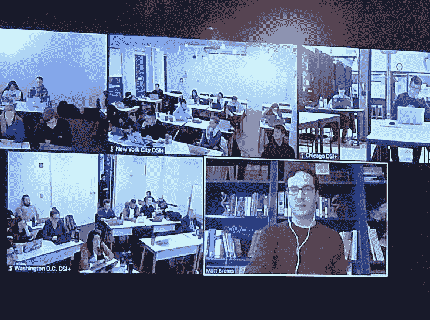
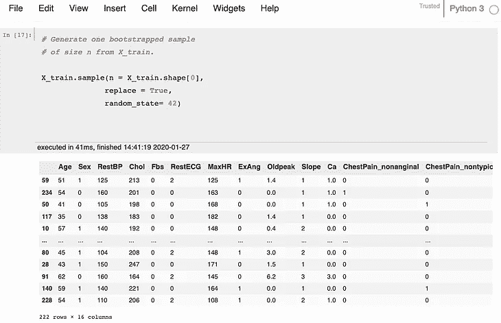
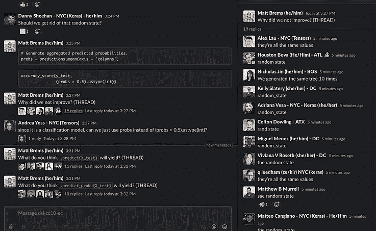
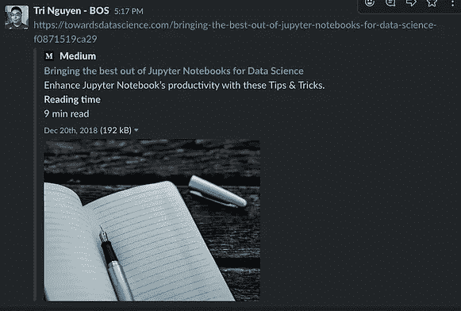

# 体验嘎和它的秘制酱

> 原文：<https://medium.com/analytics-vidhya/experiencing-ga-and-its-secret-sauce-99f449601b5?source=collection_archive---------16----------------------->

从 2019 年 12 月开始，我来到大会学习数据科学，我对他们的学习模式印象深刻。有时候确实感觉像是在喝自来水。但比起我之前的两个研究生学位(一个商科，另一个计算机科学)，我更喜欢这种学习方式。

该教学系统将传统课堂教学与他们所谓的互联课堂相结合。当他们指的是“互联课堂”时，他们不仅仅指电视屏幕上的讲师，尽管乍一看可能是这样。

课程从上午 10 点开始，由我们的一名全球讲师讲授两个 55 分钟的讲座，根据主题在一周内轮流授课。

首先，在两个并排的屏幕上有一个很好的远程讲座，一边是讲师，在旁边的屏幕上，我们可以观看讲师的幻灯片或数字笔记本。

在我们的电脑上，我们每个人都开着两个窗口。其中一个就是屏幕上的那个笔记本。

这是开源的 Jupyter 笔记本，其中既有我们与老师和我们班上的同学一起分析的课程(有图表和方程)，也有其他几个课程(会议)。

笔记本上还有一些单元格，供我们在学习或试验预填充的演示代码时用来编码和查看结果，我们可以执行、查看和跟踪这些代码，并讨论…

…或者当我们复习理论知识时，也许是一些图表或数学方程式…

然后是秘方:使用 Slack 让讨论继续进行。Slack 是一个企业消息应用程序，但它被 GA 用得相当新颖，允许学生和教师相互交流。

讲师会在讲座中向我们提出问题，无论是理论、实践还是代码方面的问题，我们会通过各种调查和线程回复来回答。如果有人在讲座中有问题，通常频道中的一个或几个同学可以回答。当讲师讲到一个重点时，他可以回顾或详述任何问题的答案，或者对于那些没有回答的问题，他可以直接回答。在这个社交媒体时代，表情符号甚至还有一个作用:不仅让我们作为学生参与进来，还能回答问题或把握理解的脉搏。

在这个 slack 帖子中，这个人的问题用 AWS 表情符号回答了。

AWS 是一种云计算服务，这个答案通过表情符号表明，在更强大的 AWS EC2 云实例上运行所谓的“引导”过程可能是一种“加速”的方式。

此外，如果在我们的实验过程中，我们使用 Slack 来相互传递信息或在各种渠道发布可能对彼此有用的内容…

稍后，在下午，我们的课堂讲师会引导各种讨论，这可能会加强他认为我们薄弱的领域，深入了解当天所涵盖的更多细节，或者就我们的实验室、项目或我们正在进行的编码挑战进行问答。

我们(包括老师、助教和我们学生)做了很多白板练习。所有的墙壁都涂上了白板漆，房间里到处都是马克笔套、喷雾瓶和橡皮。此外，有相当多的小组和结对工作。

我已经怀孕五周了，我觉得这很有趣也很刺激。很累，是的。我非常希望获得这一领域的能力。我感觉到了我们在很短的时间内建立起来的友情。