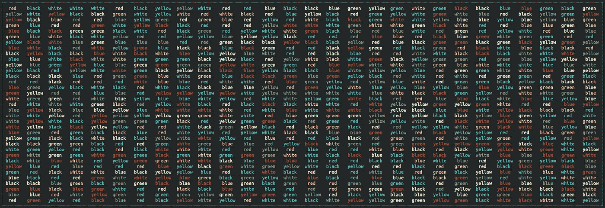

# 使用 Ruby CLI 体验 Stroop 效果

> 原文：<https://medium.com/analytics-vidhya/experiencing-the-stroop-effect-with-a-ruby-cli-e2789a2ee7e?source=collection_archive---------14----------------------->

你可能以前见过这些奇怪的颜色词列表。文字颜色与其内容不匹配的单词。也许你甚至尝试过快速大声读出文本颜色，但却很难做到？

这些列表是心理测试的一部分，用来证明所谓的“Stroop 效应”。它是以美国心理学家约翰·里德利·斯特鲁普的名字命名的，他首次发表了…