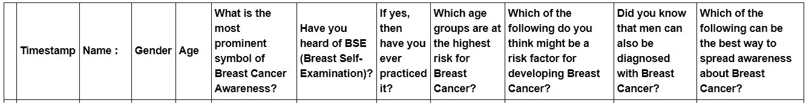
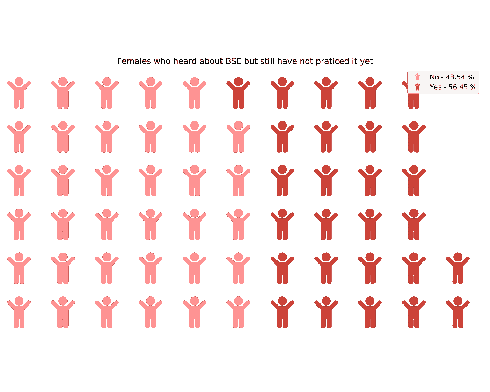
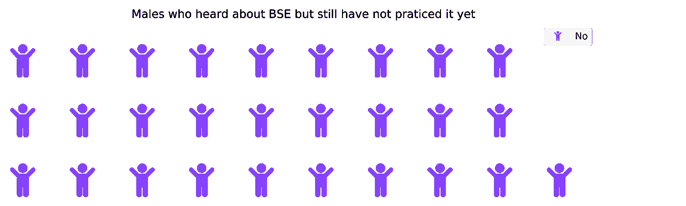
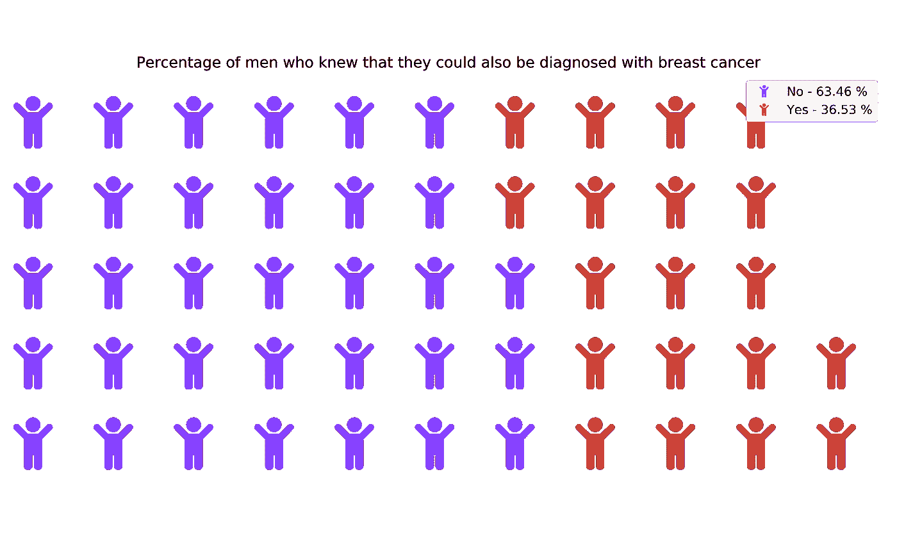
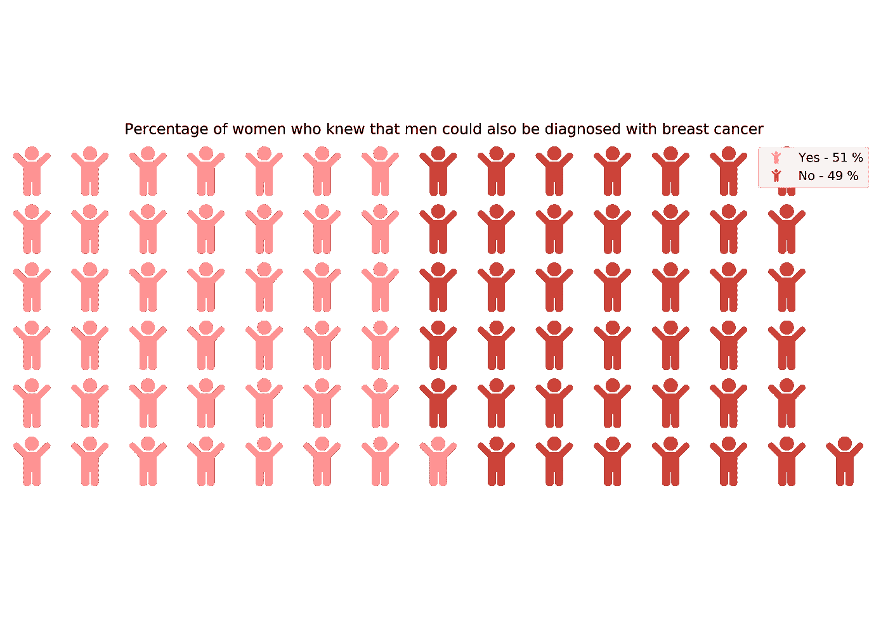
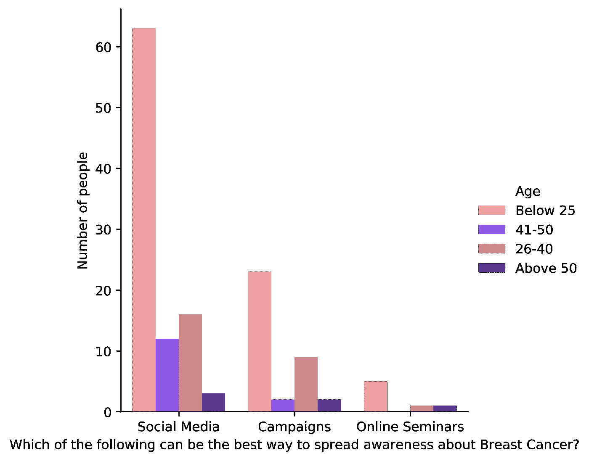
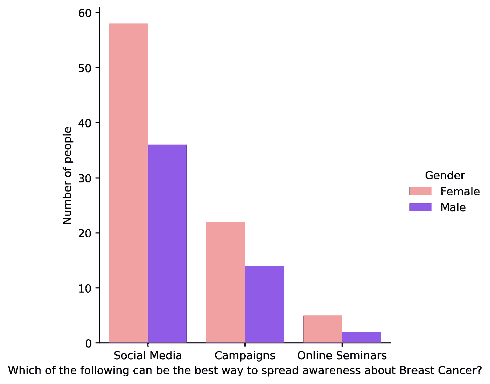
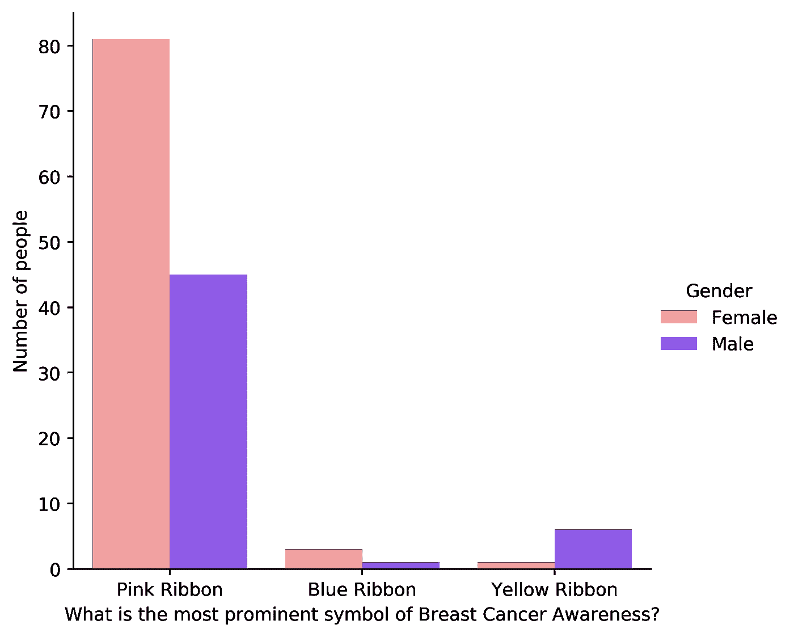
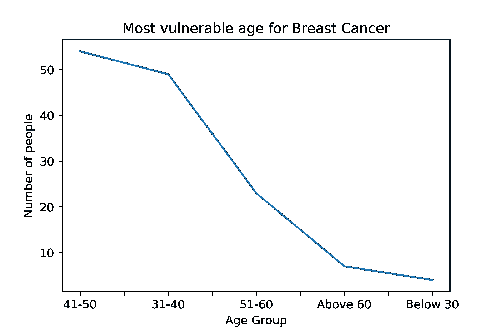

# 乳腺癌认知调查的实验数据分析。

> 原文：<https://medium.com/analytics-vidhya/experimental-data-analysis-on-a-breast-cancer-awareness-survey-c9b1c372f88a?source=collection_archive---------26----------------------->

在 [Unsplash](https://unsplash.com?utm_source=medium&utm_medium=referral) 上由[angula Harry](https://unsplash.com/@ang10ze?utm_source=medium&utm_medium=referral)拍摄的照片

***乳腺癌*** 是世界上最常见的癌症之一，所以提高对它的认识很重要。为了提高认识并了解人们目前对乳腺癌的认识程度，进行了一项调查，询问关于这种癌症的基本问题。

在进行调查后，对所创建的数据集进行分析和可视化，以供进一步分析。

> **导入数据集**

该数据集是谷歌表单创建的调查的一部分。

数据集由以下各列组成:

> **听说过乳房自查但还没有实践过的人**

正如我们从下面的华夫饼图表中看到的，43.54%的妇女听说过疯牛病，但还没有实施过，而另外 56.45%的妇女实施过。

EDA_BSE 的输出

根据所进行的调查，即使男性听说过疯牛病，他们也没有患过。

EDA_BSE_M 的输出

> **知道**男性**也可能被诊断为乳腺癌**的人的百分比

63.46%的男性不知道自己可能被诊断为乳腺癌，36.53%的男性知道。

EDA_1 的输出

49%的女性不知道 ***男性*** 可能被诊断为乳腺癌，而其中 51%的人知道此事。

EDA_2 的输出

> **根据年龄组和性别向人们宣传乳腺癌知识的最佳方式。**

根据年轻人的意见，社交媒体被评为最受欢迎的传播乳腺癌知识的方式。另一方面，活动和在线研讨会就没那么多了。

图表 3 的输出

图表 4 的输出

> **知道乳腺癌最突出标志的人**

粉红丝带是乳腺癌的显著标志，更多的女性比男性更了解它。

图表 5 的输出

> **最易患乳腺癌的年龄**

根据调查，人们认为乳腺癌最容易发生的年龄是 41-50 岁，这是事实。

图表 6 的输出

> **结论**

我们可以通过加强癌症教育来减少乳腺癌的耻辱感。上述文章的目的是在人群中传播关于乳腺癌的意识和知识，每年都有很多人患有乳腺癌，我相信这有助于传播意识和降低乳腺癌的风险。

在我的 GitHub 存储库中，可以找到以下可视化内容和源代码:

 [## ygarg704/Pink-Plus

### 此时您不能执行该操作。您已使用另一个标签页或窗口登录。您已在另一个选项卡中注销，或者…

github.com](https://github.com/ygarg704/Pink-Plus)