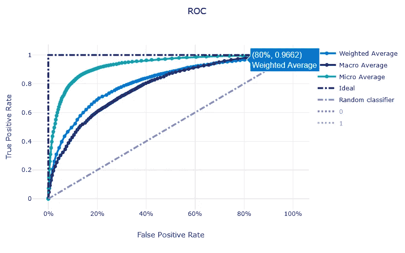
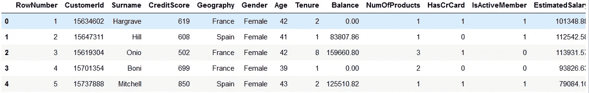
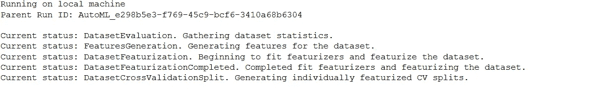
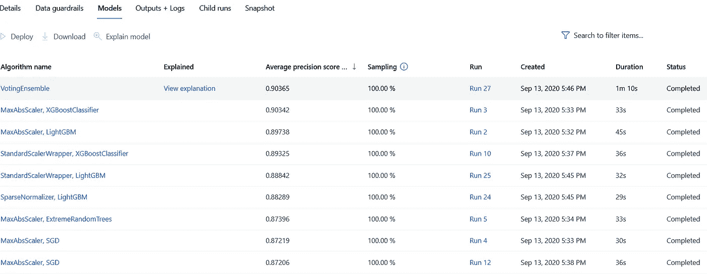
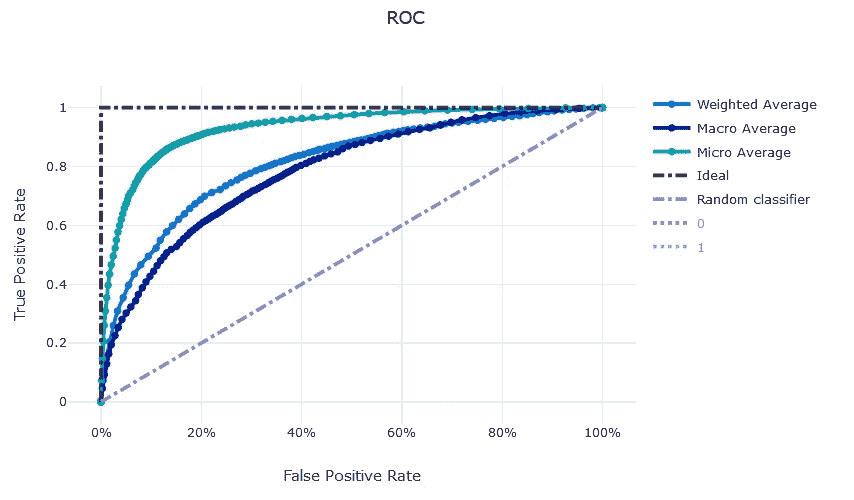
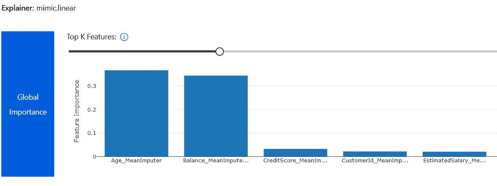

# 实验 Azure 自动机器学习

> 原文：<https://medium.com/analytics-vidhya/experimenting-azure-automated-machine-learning-f5b5db75eae9?source=collection_archive---------20----------------------->



ROC 曲线 Azure 机器学习

# 客户流失

2 年前我在 LinkedIn 上发表了一系列关于客户流失的文章(这是第一部分[https://www . LinkedIn . com/pulse/machine-learning-predict-customer-churn-accuracy-Patrick-rotz etter/](https://www.linkedin.com/pulse/machine-learning-predict-customer-churn-accuracy-patrick-rotzetter/))。我测试了一些方法，展示了如何使用 Lime 解释模型，如何度量特性重要性，对抗类不平衡，以及其他一些相关的主题。

我最近在 Azure 上做了一个认证，想在一个简单的例子上测试 Azure Auto ML 特性。所以，我想用前面的例子，看看 Azure AutoML 是如何简化整个过程的。

# Azure 机器学习设置

要从 Azure 使用 Auto ML，你当然需要一个 Azure 帐户。然后，您可以执行几个简单的步骤来创建一个机器学习工作区，在这里可以注册您的实验。机器学习工作空间中还有很多东西，但现在让我们专注于我们的实验。

你可以在微软文档中找到关于如何设置和准备环境的完整文档:[https://docs . Microsoft . com/en-us/azure/machine-learning/how-to-configure-auto-train](https://docs.microsoft.com/en-us/azure/machine-learning/how-to-configure-auto-train)

# 实验

我决定使用我的本地机器运行我的实验，同时享受 Azure 机器学习 Auto ML 特性的好处。让我们一步一步来。

安装微软文档中记录的 Azure Machine earning Python SDK([https://docs . Microsoft . com/en-us/Python/API/overview/Azure/ml/install？view=azure-ml-py](https://docs.microsoft.com/en-us/python/api/overview/azure/ml/install?view=azure-ml-py) )。您现在已经准备好使用 python SDK 了。

让我们设置环境和 ML 工作区，我已经删除了需要由您自己的订阅和工作区详细信息替换的特定环境详细信息:

```
import os
subscription_id = os.getenv(“SUBSCRIPTION_ID”, default=”xxxxx”)
resource_group = os.getenv(“RESOURCE_GROUP”, default=”yyyyy")
workspace_name = os.getenv(“WORKSPACE_NAME”, default=”zzzz”)
workspace_region = os.getenv(“WORKSPACE_REGION”, default=”South Central US”)
```

让我们使用先前定义的参数访问工作区，并测试一切正常

```
from azureml.core import Workspacetry:
    ws = Workspace(subscription_id = subscription_id, resource_group = resource_group, workspace_name = workspace_name)
    # write the details of the workspace to a configuration file to the notebook library
    ws.write_config()
    print("Workspace configuration succeeded. Skip the workspace creation steps below")
except:
    print("Workspace not accessible. Change your parameters or create a new workspace below")
```

然后定义实验

```
ws = Workspace.from_config()# choose a name for experiment
experiment_name = 'automl-classification-customer_churn'experiment=Experiment(ws, experiment_name)
```

现在我们都设置好了，让我们加载数据并看一看:

```
data = pd.read_csv(“churn_modelling.csv”)
data.head()
```



数据集提取

数据集由“地理”和“性别”等分类值组成。它还包括数值和布尔值。在正常情况下，必须对分类值进行热编码，但是在我们的例子中，Azure Auto ML 会处理这一点。这真是一个伟大的时间节省。

现在，我们只需要定义实验参数并开始训练，就这样:

```
import logging
automl_settings = {
    "n_cross_validations": 3,
    "primary_metric": 'average_precision_score_weighted',
    "experiment_timeout_hours": 0.25, # This is a time limit for testing purposes, remove it for real use cases, this will drastically limit ability to find the best model possible
    "verbosity": logging.INFO,
    "enable_stack_ensemble": False
}automl_config = AutoMLConfig(task = 'classification',
                             debug_log = 'automl_errors.log',
                             training_data =data,
                             label_column_name = 'Exited',
                             **automl_settings
                            )
local_run = experiment.submit(automl_config, show_output = True)
```

实验现在在我的本地机器上运行，同时在 Azure 机器学习工作区中记录结果。相当不错！

在评估不同的模型之前，这项工作从不同的数据准备步骤开始。



在本地机器上运行的实验

# 实验结果

所有的结果都可以使用 Azure 机器学习工作空间来访问。可以访问许多指标，并且可以使用许多图表来了解各种模型指标并选择最佳指标。



模型评估

最好的模型似乎表现得相当好，尽管平均精度分数超过 90%的类不平衡。平均精度分数将精度-召回曲线总结为在每个阈值处实现的精度的加权平均值，召回从前一阈值的增加用作权重([https://sci kit-learn . org/stable/modules/generated/sk learn . metrics . average _ precision _ score . html](https://scikit-learn.org/stable/modules/generated/sklearn.metrics.average_precision_score.html))。



集合投票法的 ROC 曲线

该模型明显优于随机模型，其曲线下面积约为 86%。对于不平衡的类，这是比精确度更好的度量。

请注意，您可以将鼠标悬停在图表上，在曲线的每个点显示单独的指标。这是一个非常好的特性。



集成投票方法的特征重要性

与其他预测因素相比，年龄和账户余额这两大决定性因素似乎对客户流失的影响最大。请注意，AutoML 在做了一些预处理后转换了列名。似乎我们有一些缺失值，算法用平均值(Age _ MeanImputer)估算缺失值。

# 结论

AutoML 提供了一种非常快速的方法来评估监督学习的不同模型，并节省了大量时间。它有很好的报告功能，所有这些都只需要很少几行代码。不代表不需要机器学习知识，但是我发现它极其有用。它还生成了很好的交互式图表，在记录你的实验时会很有影响力。