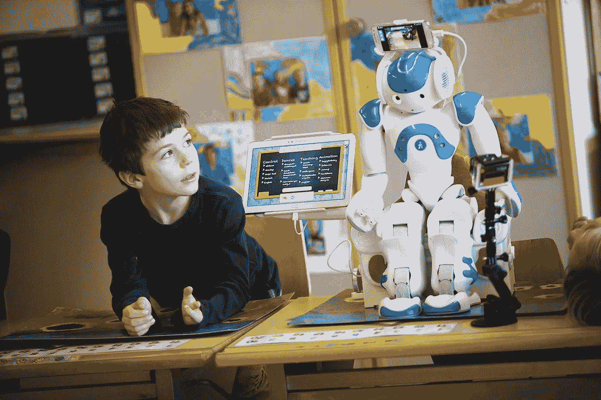

# 向你的孩子解释机器学习

> 原文：<https://medium.com/analytics-vidhya/explain-machine-learning-to-your-kids-9d7bfc6e05c4?source=collection_archive---------18----------------------->

在过去的几年里，围绕机器学习有太多的宣传，拥有直觉非常重要，所以这里你可以用非常简单的话来描述机器学习。

# 什么是机器学习？

**机器学习**是计算机科学的一个领域，它赋予计算机学习的能力，而无需显式编程。
在我们不能学习的情况下，我们需要学习