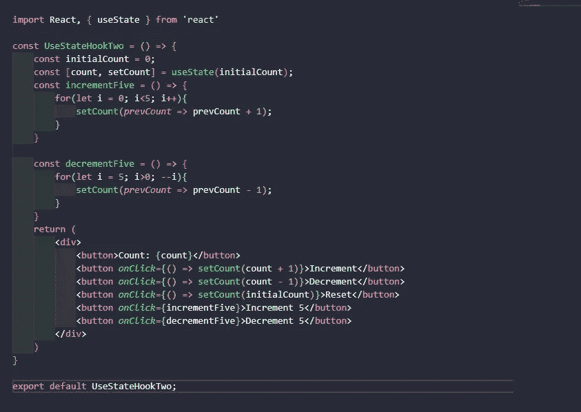
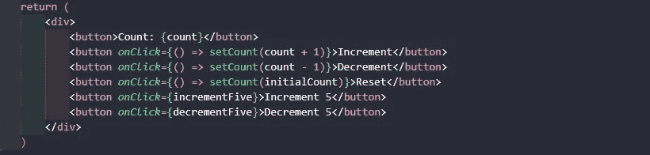
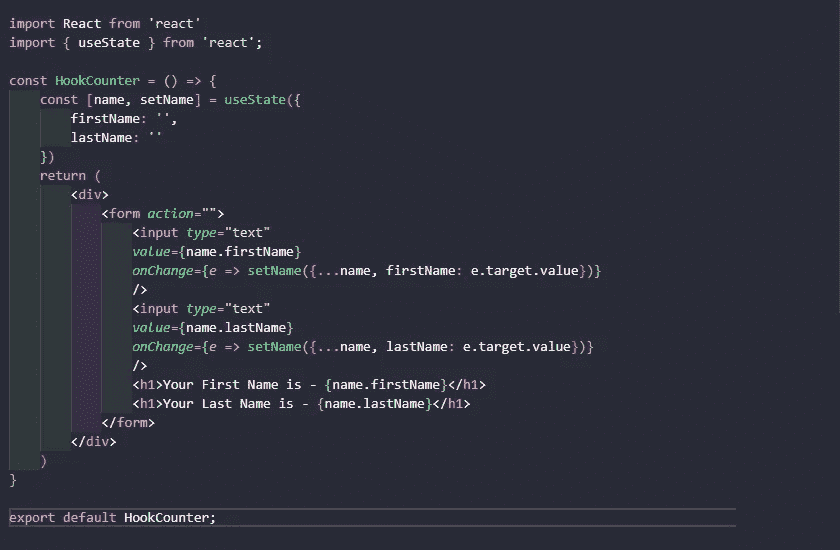
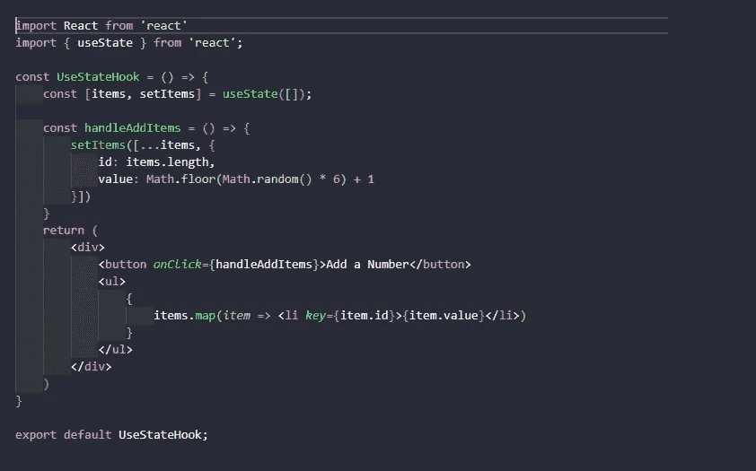

# 有趣地解释反应使用状态挂钩

> 原文：<https://medium.com/analytics-vidhya/explain-react-usestate-hook-with-fun-c3c9bd559cfe?source=collection_archive---------17----------------------->

|***React 多神奇啊！还有，最疯狂的是钩子。我非常兴奋地分享我关于 useState hook 的知识。***

照片由[费伦茨·阿尔马西](https://unsplash.com/@flowforfrank?utm_source=medium&utm_medium=referral)在 [Unsplash](https://unsplash.com?utm_source=medium&utm_medium=referral) 拍摄

毫无疑问，React 是每个 JavaScript 开发人员最热门和最现代的字体端库之一。在实现 React v 16.8 之后，理解整个 React 变得简单、灵活和可扩展。猜猜看，是什么新功能让反应变得超级快速和简单？实际上，这个术语叫做钩子，它与之前版本的 React 有很大的不同。因此，不做进一步的工作，让我们更深入地研究 React Hook——use state。

## 什么是 React Hook？

钩子基本上是一个函数，它允许你使用 React 新特性而不必写一个类。一句话——钩子在类内部不起作用。它主要用于处理反应功能组件中的状态和副作用。React 提供了一些内置的挂钩，如 useState、useEffect。如果愿意，您还可以创建自己的定制挂钩，以便在不同组件之间重用有状态行为。

## 使用状态简单示例

下面是一个简单的 useState 钩子的例子，它为每次点击更新一个计数值。

让我们详细描述代码。首先导入一个 useState 钩子，然后创建一个 useState 钩子或函数，基本上除了一个参数，它是状态属性的初始值，返回状态属性的当前值，以及一个能够更新状态属性的方法。听起来很累，对吧。别担心，我在这里会正确理解每一步。

**使用 State(0)** 钩子，除了一个参数，即初始值是状态属性，这里的状态属性是 **0** 。这个钩子或者函数返回一对值，比如， **const [count，setCount]** 。这里，**‘count’**是当前值为 0 的值&第二个元素**‘set count’**是一个方法。它正在更新 JSX onClick 事件处理程序的值。请记住，对值的语法叫做数组分解。是 ES6 的特色。

基本上，在这个 JSX 我们有 6 个按钮，每个按钮有不同的工作。我想如果你理解我之前的解释，这个代码对你来说真的很简单。然而，你看不懂任何一行代码，请把我注释掉。

## 对对象使用状态

现在，我们来看一下，useState 钩子如何作用于对象？

这里有一个最重要的想法，你必须记住，根据你的需求，状态变量可以是字符串，数字，布尔，对象，数组等等。在上面的例子中，我们有两个空字符串的对象属性。期待 JSX 部分通过 OnChange 事件处理程序更新 setName 的时候这里来了一个新的操作符叫做[**传播操作符**](https://developer.mozilla.org/en-US/docs/Web/JavaScript/Reference/Operators/Spread_syntax) (…name)。如果没有扩展运算符，此代码将无法正常工作。这个操作符首先复制 name 对象，然后更新 setName 方法。

## 对数组使用状态

这是一个使用数组创建随机数的程序。

这里，useState 初始当前值是空字符串。当我们通过 JSX setItems 上的 onClick 事件处理程序调用 handleAddItems 方法时，首先用 spread 运算符(…Items)复制 items 对象，然后推一个新对象，该对象的 id 决定了项的长度和值，决定了 1 到 6 之间的随机数。实际上，这个代码示例的关键部分是扩展运算符。没有这个操作符，这个代码是没有意义的。

## 摘要

1.  useState 变量可以是字符串、数字、布尔、对象、数组等。
2.  useState 钩子返回一个包含两个元素的数组。
3.  第一个元素是状态的当前值，第二个元素是状态设置函数。
4.  新的状态值取决于先前的状态值。您可以将函数传递给 setter 函数。
5.  当使用 State 处理对象和数组时，它总是确保扩展你的状态变量，然后调用 setter 函数。

这都是关于使用状态的。我相信，读完这篇文章后，你已经对使用状态钩子有了基本的了解。更多细节请查看 React 官方网站。

***我所有的 React 爱人不要错过你对这篇文章的反馈。保持冷静&时髦！***