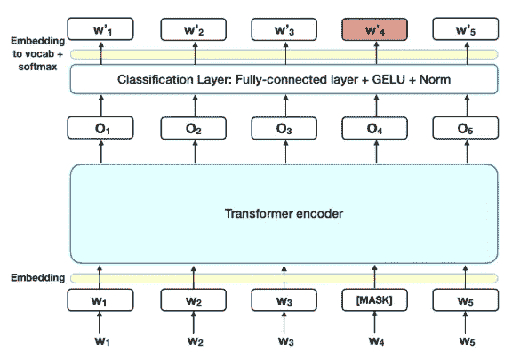
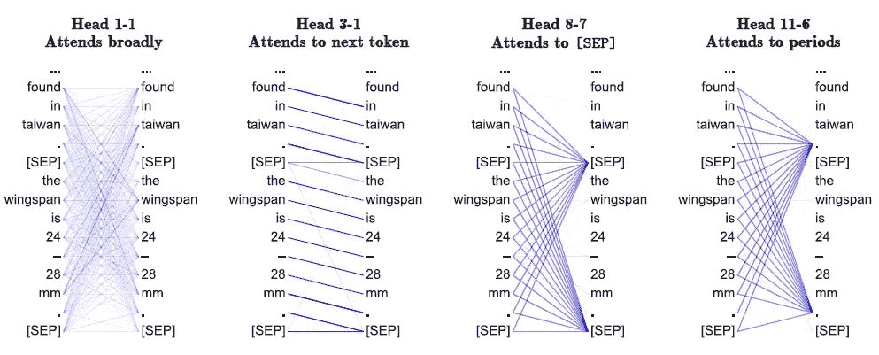
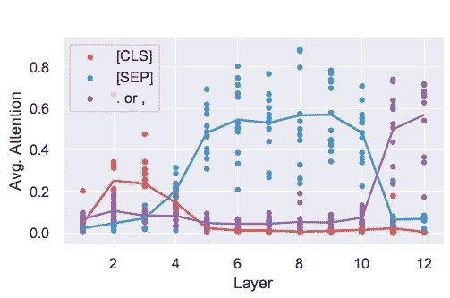
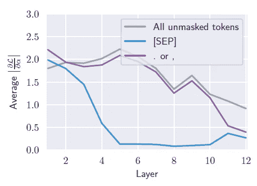
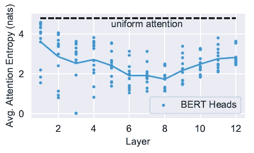
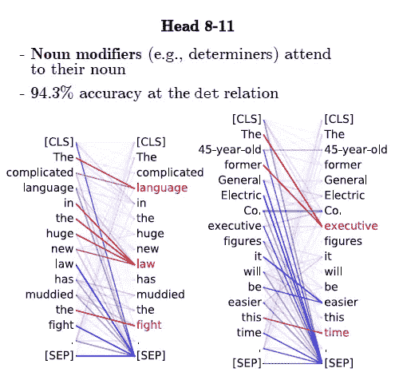
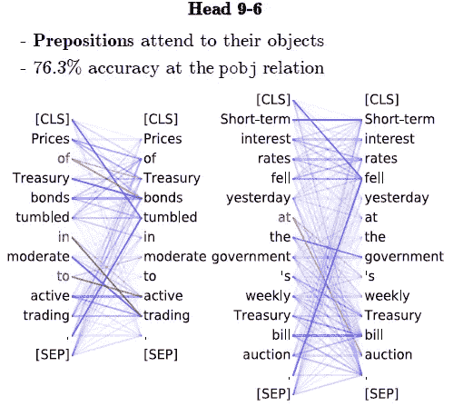
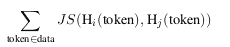
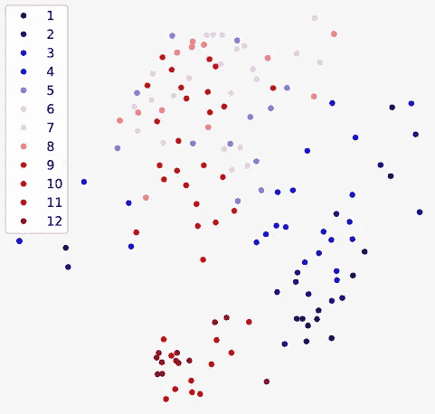

# 伯特通过注意的可解释性

> 原文：<https://medium.com/analytics-vidhya/explainability-of-bert-through-attention-7dbbab8a7062?source=collection_archive---------3----------------------->

在这篇文章中，我们将向伯特的可解释性迈进一步，通过分析最近的一篇论文《伯特在看什么？伯特注意力分析 [(Clark et al .，2019)](https://arxiv.org/pdf/1906.04341.pdf) 。

# **简介**

BERT(来自 Transformer 的双向编码器表示)是由谷歌人工智能语言在 2018 年推出的。它通过出色地完成机器翻译、句子分类、问题回答等广泛的任务，呈现出最先进的结果。

BERT 使用 Transformer 的双向训练(一个纯粹基于注意力的模型来捕捉长期依赖)。本文还介绍了 Masked-LM 算法，使双向训练成为可能。

伯特模型体系结构

调查伯特正在学习语言的哪个方面有助于验证我们模型的稳健性。因为 BERT 也是基于注意力机制，所以最简单的方法是可视化不同输入句子的注意力权重。更好地理解语言模型的一些其他方法是检查精心手工制作的句子的输出，或者使用调查模型的内部向量表示的探测分类器。作者关于伯特的一些发现是-

*   伯特的注意力呈现出一些模式，比如注意定界符、特定的位置偏移或者广泛地注意整个句子。
*   同一层的注意力头经常表现出相似的行为。
*   一些中心词很好地符合语言学的句法和共指概念。

从最近的工作中，我们可以说预训练的 BERT 嵌入向模型教授语言结构，但是我们并不确切地知道我们的模型正在学习哪种语言特征。这里有几个图，显示了模型的不同头部在注意力权重的帮助下学习到的不同语言特征。

不同的头脑关注句子的不同部分的例子。

# 注意分隔符标记

作者观察到的一个重要现象是，BERT 的大部分注意力都集中在少数几个标记上。比如 6-10 层的 BERT 超过 50%的注意力都集中在[SEP] token 上。[SEP]和[CLS]令牌保证存在，并且它们从不被屏蔽。

每个点对应于一个特定的 BERT 注意力头对一个标记的平均注意力

一个可能的原因是，当注意头不适用时，这些特殊标记充当“无操作”。为了验证这一假设，作者计算了每个注意力权重的基于梯度的损失。结果显示，从第 5 层开始-----------------------------------------------------------------------------------《体感诱发电位》的关注权重变得很高，对《体感诱发电位》的关注梯度变得很小，表明《体感诱发电位》基本上不影响 BERT 的输出。

基于梯度的特征重要性估计，用于对[SEP]、句号/逗号和其他标记的关注

# 注意整个句子还是注意单个标记

为了分析注意力有多广，我们计算了每个头部注意力分布的平均熵。作者发现，下层的一些注意头具有非常广泛的注意。这些大脑在任何一个单词上最多花费 10%的注意力。这些头的输出几乎是一个单词表示的包。而中间层的关注范围有所缩小。

注意力分布的熵

他们还测量了所有注意力头部的[CLS]表征的熵。对于起始层，熵很高，然后随着中间层(6-10)注意力权重的增加而降低，但是随后再次增加到大约 3.89，表明非常广泛的注意力。当我们进入最后一层时，注意力的焦点从多余的单词如[CLS]，“，”等转移到更重要的单词上。

# 学习语法

现在，我们将调查我们的注意力头学习语言的哪一方面。BERT 使用字节对记号化，这个记号化器有时会把单词分成多个记号。因此，为了评估单词级注意头，将标记-标记注意图转换为单词-单词注意图。我们通过以下方式发现注意力:

*   将单词拆分成单个单词:取其标记上注意力权重的平均值。
*   单个单词到拆分单词:对其标记上的所有注意力权重求和。

他们还提出，一些注意力头专门捕捉特定的依赖关系。这里显示了对应于标题 8-11(名词修饰语)和标题 9-6(介词)的两个句子的注意力图的可视化，这些图指的是句子中所有词对之间的注意力权重。深色线条表示更多的注意力权重。

# 聚集注意力

本文中提出的另一个重要结果是，同一层中的头部通常彼此非常接近，这意味着同一层中的头部具有相似的注意力分布。为了找到这种 Jensen-Shanon 发散，我们使用了所有可能的注意力头对。为了使这些相似性可视化，每个头部都使用多维缩放投影到二维空间。原来是一层对应的注意力头相互靠近，它们形成一个集群。

两个头之间的距离，其中 JS 是 Jensen-Shanon 散度

伯特的注意力集中在嵌入二维平面的头部。

从上图可以明显看出，同一层的注意头聚集在一起，具有相似的注意权重。

> 注- [Jain 和 Wallace(2019)](https://arxiv.org/abs/1902.10186) 认为，注意力通常不能解释模型预测，并且这些注意力权重通常与特征重要性的其他度量不相关。我认为，注意力只是决定结果的几个重要因素之一。

# 参考

*   凯文·克拉克、乌尔瓦希·汉德尔瓦尔、奥默·利维和克里斯托弗·曼宁。2019.伯特在看什么？伯特注意力分析。 [abs/1906.04341](https://arxiv.org/pdf/1906.04341.pdf) 。
*   雅各布·德夫林、张明蔚、肯顿·李和克里斯蒂娜·图塔诺娃。2019.伯特:[深度双向转换语言理解预训练](https://arxiv.org/pdf/1810.04805.pdf)。在 NAACL-HLT
*   Ashish Vaswani、Noam Shazeer、Niki Parmar、Jakob Uszkoreit、Llion Jones、Aidan Gomez、Lukasz Kaiser 和 Illia Polosukhin。2017.你所需要的只是注意力。神经信息处理系统进展，6000-6010 页。
*   [Kawin Ethayarajh](https://arxiv.org/search/cs?searchtype=author&query=Ethayarajh%2C+K) ， [David Duvenaud](https://arxiv.org/search/cs?searchtype=author&query=Duvenaud%2C+D) ， [Graeme Hirst](https://arxiv.org/search/cs?searchtype=author&query=Hirst%2C+G) 。理解线性单词类比，ACL 2019。
*   贾恩和华莱士(2019) [萨尔萨克·贾恩和拜伦·c·华莱士。2019.注意不是解释。 *CoRR* ，abs/1902.10186。](https://www.arxiv-vanity.com/papers/1902.10186/)