# 可解释的人工智能:下一个层次

> 原文：<https://medium.com/analytics-vidhya/explainable-ai-the-next-level-c6b4dadc240?source=collection_archive---------9----------------------->

## **可解释的人工智能** ( **XAI** )指的是人工智能/人工智能中的方法和技术，使得解决方案的结果能够被人类理解。这与机器学习中的“黑匣子”概念形成了对比，在黑匣子中，即使是他们的设计师也无法解释为什么人工智能会做出特定的决定。

## 我们为什么需要 XAI？

我将保持这一部分简短但内容丰富，因为作为一名数据科学家，我们非常清楚为什么我们需要解释我们的模型。

## **建立信任**

## 正当理由；辩解

## 加快广泛采用

让我们在下面的场景中理解 XAI 表单的需求。

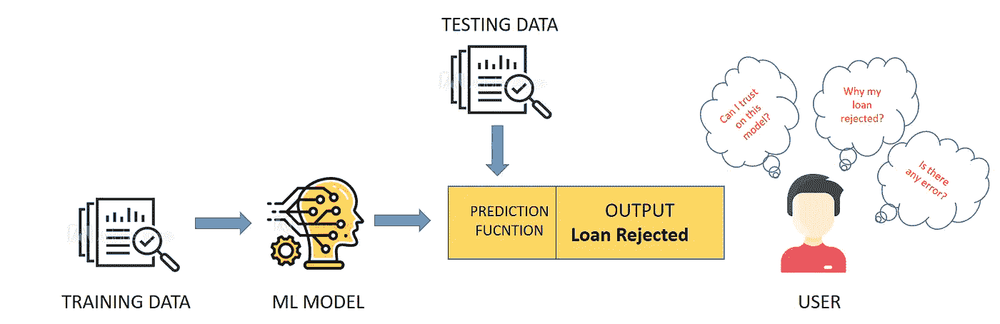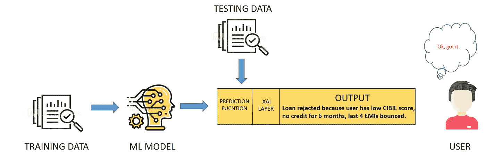

我认为从上面两张图片可以清楚地看出，为什么我们在进行预测时需要 XAI 层。

# XAI 可用的服务/图书馆

有许多服务可供 XAI 使用，但我只能说只有三种足够成熟，可以使用。

以下是我探索的与 XAI 相关的服务。

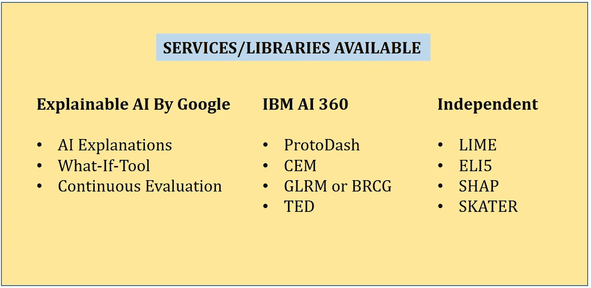

# 独立图书馆

今天，我将介绍 ELI5 和 LIME 来解释这些模型。

**ELI5** :是一个 python 包，有助于以直观的方式理解模型预测，但是它不支持真正的模型无关解释，对模型的支持大多局限于基于树的和其他参数\线性模型。

对于独立的图书馆，我使用的是**电信客户流失**数据集。

**数据集细节:**形状:(7032，20)，目标变量:Churn( 1:是，0:否)

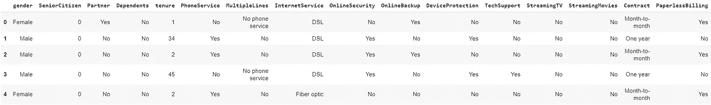

***Dataset Columns =****['性别'，'老年人'，'伴侣'，'家属'，'任期'，'电话服务'，'多线'，'互联网服务'，'在线安全'，'在线备份'，'设备保护'，'技术支持'，'流媒体电视'，'流媒体电影'，'合同'，'无纸计费'，'支付方式'，'月度费用'，'总费用'，'流失']*

我正在使用 XG boost 分类器对 Churn 中的数据点进行分类(是/否)，**完整代码可在我的**[**GitHub**](https://github.com/vishals2911/XAI)**repo**获得。

应用 XG boost 和 ELI5 后，我得到了以下结果:

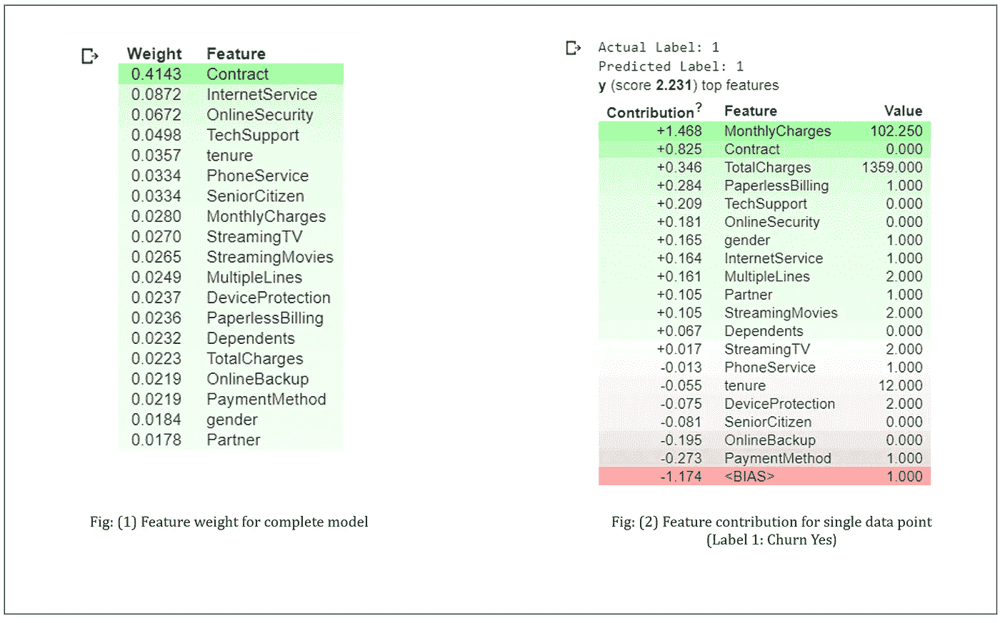

让我们来理解每个图形:

**图(1)** :显示独立特征在模型上的重要性，所有这些特征按降序排列。

**图(2):** 显示了用于预测类别的单个数据点上的特征贡献。正如我们可以看到的，实际标签为 1，模型也预测为 1，这意味着客户将会流失，如果我们看到功能贡献，那么我们可以理解，因为每月费用高(102.250)，用户只有月合同(0:“按月”，1:“一年”，2:“两年”)，高总费用是将数据点分类为 1(流失-是)影响最大的三个因素。

**LIME:** 本地可解释的与模型无关的解释，从名字本身就可以清楚地看出，我们只能将这个库用于本地解释，而不能像在 ELI5 部分那样用于全局解释(图 1)。

我再次使用相同的数据集，甚至相同的模型 XG boost，但这次我将解释类 0 的数据点(流失-否)。

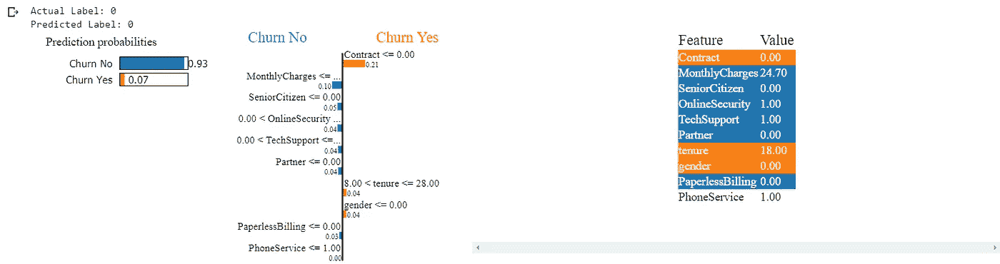

**实际 0(流失率)，预测 0(流失率)**

正如我们可以看到的，类 0 的概率是 0.93，实际标签也是 0，所以我们可以说是的，我们的模型工作正常，现在让我们检查一下解释。我们可以看到用户只有月合同(0:“逐月”，1:“一年”，2:“两年”)，就像以前的情况一样，但月费用太低，而且用户不是老年人，所以这两个因素在预测期间影响最大，预测数据点为 0(流失-否)，但是合同仍然以相反的方式影响，使其为 1(流失-是)。

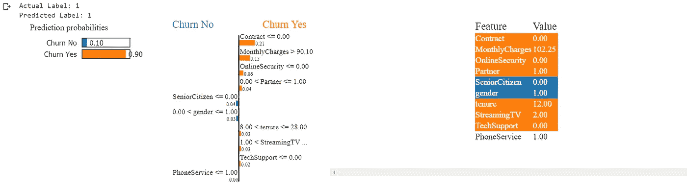

**实际 1(流失-是)，预测 1(流失-是)**

现在让我们来理解我们使用 ELI5 解释的相同数据点，我们可以清楚地看到结果几乎与 ELI5 相似。

由于每月费用高(102.250)，每月合同(0:“逐月”，1:“一年”，2:“两年”)模型将数据点分类为 1(流失-是)。

## 重要链接:独立图书馆

[](https://github.com/oracle/Skater) [## 先知/溜冰者

### Skater 是一个统一的框架，能够对所有形式的模型进行模型解释，以帮助人们建立一个可解释的…

github.com](https://github.com/oracle/Skater)  [## 教程- ELI5 0.9.0 文档

### 编辑描述

eli5.readthedocs.io](https://eli5.readthedocs.io/en/latest/tutorials/) [](https://github.com/slundberg/shap) [## slundberg/shap

### SHAP 是一种博弈论的方法来解释任何机器学习模型的输出…

github.com](https://github.com/slundberg/shap) 

# IBM 人工智能可解释性 360

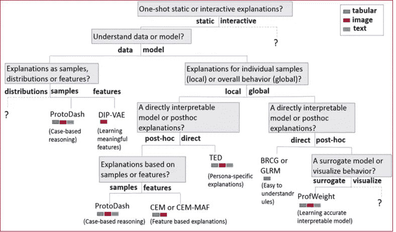

AI 360 是 IBM 提供的开源工具包，里面有各种各样的算法。我已经研究了所有这些算法，但我最喜欢 BRCG 和 Protodash，所以我们今天将讨论这两个算法。你也可以看看其他算法，IBM 在 GitHub 上有非常直观的教程。

## 如何使用 IBM AI Explainability 360 Toolkit

```
 conda create --name aix360 python=3.6
conda activate aix360
git clone [https://github.com/Trusted-AI/AIX360](https://github.com/Trusted-AI/AIX360)Then, navigate to the root directory of the project which contains setup.py file and run:pip install -e .
```

## **BRCG**

布尔规则列生成解释器，它实现了一种直接可解释的监督学习方法，用于二进制分类，使用列生成(CG)来学习析取范式(DNF)或合取范式(CNF)中的布尔规则。

这直接学习准确的和可解释的“or”-of-”逻辑分类规则，并且这仅适用于表格数据。

在这个项目中，我使用了乳腺癌数据集，我们需要预测一个人是否患有癌症。

**在将模型直接传递到 BRCG 模型之前，我们需要相应地转换数据，为此我们将使用“`FeatureBinarizer".`**

****特征二进制化器:**标准`FeatureBinarizer`通过将数据宁滨成用户指定数量的分位数来创建阈值。默认阈值是 9。**

**准备好数据后，我们将把它传递给 BRCG 模型，并找到我们分类的规则。BRCG 和 ProtoDash 的代码都可以在我的 [**GitHub**](https://github.com/vishals2911/XAI) repo 中获得。**

**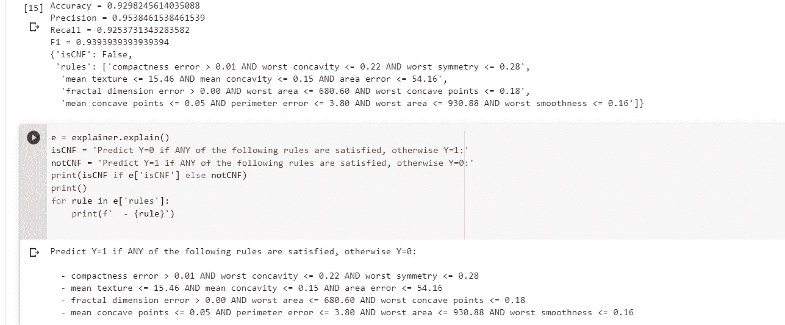**

**我们有四个规则来解释我们的分类，如果我们的输入数据满足四个规则中的任何一个，那么模型将预测为 1(患有癌症)。**

## **原破折号**

**ProtoDash 提供了来自数据集的原型示例。假设你有一个客户，他申请贷款，你使用 ML 模型批准/拒绝贷款。现在，如果贷款被拒绝，那么您可能希望查看与当前贷款被拒绝的案例类似的案例，以便进行验证。下图显示了目标变量为 0 的两个最相似的案例。**

**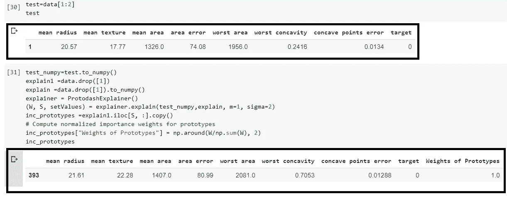**

**现在假设您有一个客户列表，其中包含所有详细信息及其贷款状态，您想要两个完全不同的客户，一个来自批准类，另一个来自拒绝类，然后您可以使用 Protodash 来获取这些详细信息。**

**下图显示了两个最独特的客户。**

**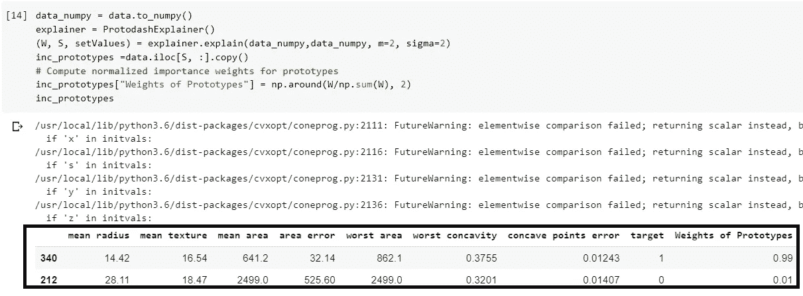**

## **重要链接:IBM AI 360**

 **[## 人工智能可解释性 360

### 这个可扩展的开源工具包可以帮助您理解机器学习模型如何通过各种方式预测标签…

aix360.mybluemix.net](https://aix360.mybluemix.net/)** **[](https://github.com/Trusted-AI/AIX360) [## 可信 AI/AIX360

### AI Explainability 360 toolkit 是一个开源库，它支持…

github.com](https://github.com/Trusted-AI/AIX360)** 

# ****可解释的人工智能——谷歌****

**谷歌为可解释的人工智能提供了三种服务。**

****人工智能解说****

****假设分析工具****

****连续评估****

**可解释的人工智能工具(而不是 WIT)要求客户在谷歌云中构建和实现他们的模型。不过，它们是免费提供给 AutoML 表或 AI 平台的用户的。**

**WIT 是一个开源工具，与 TensorBoard、Jupyter 和 Colaboratory 笔记本兼容。**

## ****AI 解说****

**人工智能解释有助于理解分类和回归任务的模型输出。它说明了数据中的每个要素对预测结果的影响程度。这些信息可用于验证模型是否按预期运行，识别模型中的偏差，并获得改进模型和训练数据的方法。**

**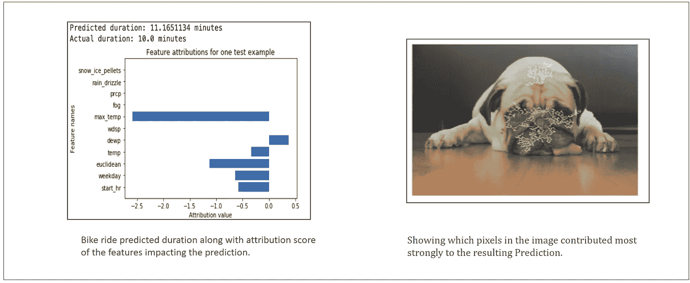**

## **假设工具**

**对于这个神奇的工具，我已经写了一篇文章。**

**你可以看看，我会说这个工具具有我在本教程中解释的所有功能。**

**[](/@vishalsolanki_42311/understand-your-data-and-ml-model-using-what-if-tool-57b7cf0d5541) [## 使用假设分析工具了解您的数据和 ML 模型

### 假设分析工具是一种基于可视化的工具，用于探测已训练的 ML 模型的行为。

medium.com](/@vishalsolanki_42311/understand-your-data-and-ml-model-using-what-if-tool-57b7cf0d5541) 

## 持续评估(测试版)

持续评估定期从已部署到人工智能平台预测的经过训练的机器学习模型中采样预测输入和输出。人工智能平台数据标签服务然后指派人类评论者为预测输入提供地面真实标签；或者，用户可以提供他们自己的基本事实标签。数据标注服务将您的模型预测与实际标注进行比较，以提供关于您的模型随时间推移表现如何的持续反馈。

为了实现人工智能的解释和持续评估，我们需要 GCP 访问，我不知道，所以我跳过这两个实现，但是下面提供了链接，如果你希望你可以探索。

## **重要链接:谷歌可解释的人工智能**

[](https://cloud.google.com/ai-platform/prediction/docs/ai-explanations/overview) [## 人工智能介绍人工智能平台的解释

### AI 解释将特征属性集成到 AI 平台预测中。本页提供了一个简短的概念性…

cloud.google.com](https://cloud.google.com/ai-platform/prediction/docs/ai-explanations/overview) [](https://cloud.google.com/ai-platform/prediction/docs/continuous-evaluation) [## 持续评估概述| AI 平台预测|谷歌云

### 测试版谷歌云平台服务条款中的预发布产品条款涵盖了该功能。正式上市前…

cloud.google.com](https://cloud.google.com/ai-platform/prediction/docs/continuous-evaluation) 

## **本文使用的代码可以在**[**GitHub**](https://github.com/vishals2911/XAI)**上获得。****