# 与 RNN 和 LSTM 一起解释深度层序建模

> 原文：<https://medium.com/analytics-vidhya/explained-deep-sequence-modeling-with-rnn-and-lstm-e71521f86036?source=collection_archive---------5----------------------->

照片来自 [Unsplash](https://unsplash.com/photos/505eectW54k)

嘿，你好！😃

你难道不好奇知道…… *谷歌是怎么把德语翻译成法语的吗？【Alexa 和 Siri 是如何如此恰当地互动的？
或者💭
ML 怎样才能谱出一首清新的新歌？*

拿着你的咖啡。疏导你的思想，让我们克服你的好奇心。😏

# 路标

*   序列输入
*   什么是序列建模
    为什么不是前馈或者 CNN？
*   数列问题的算法
    RNN
    LSTM
*   具有序列的架构变体
*   履行
*   现实生活的应用

# 序列输入

在 ML 中，我们通常处理用于预测的训练/测试数据，其中样本的顺序或位置不重要。当需要排序时，相同的数据就成为一个序列。序列作为输入在现实世界中是无处不在的。医院里的音乐、人类语言甚至心电图都是有顺序的。基于序列的预测称为序列建模预测。

# 什么是序列建模

序列建模是**根据前面的实体预测输入序列(单词/字母)中的下一个实体**的任务。深度学习中的普通 ANN 或 CNN 不适合这样的输入，这引发了 RNN、LSTM、变形金刚等算法的出现。

## 为什么不是前馈或者 CNN？

无法根据前馈或 CNN 架构中的前一个实体预测下一个实体，如下所示:

*   **独立输出:**输出独立于之前的输出。*说*，预测狗不依赖于更早的预测输出，猫。
*   **固定长度输入:**输入的长度是相同的，其中我们固定输入层中神经元的数量以进行结转。
*   **不可共享的参数:**不共享不同职位之间学习到的特性。

如果还是不清楚也不用担心。要了解更多还有很长的路要走...

# 序列问题的算法

基本上，可以处理输入序列的算法有 RNN、LSTM、变形金刚。考虑到博客的范围，我们将研究 RNN 和 LSTM。

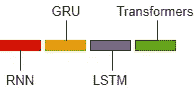

图 1

# RNN(递归神经网络)

与普通的人工神经网络不同，RNN 将多个人工神经网络链接起来，以便跟踪以前的输出。当前时间步长的输出充当下一个时间步长的输入。在需要记忆先前输入的情况下，必须基于过去的输入进行预测。因此，RNN 有“**隐藏状态**”，作为所有信息计算的**存储器**。

## 体系结构

RNN 类似于安，只是链式人工神经网络有所不同。左图显示了展开时的神经网络，其中每个神经网络都有输入层、隐藏状态层和输出层。**相同的权重(W)和偏差(b)在每个时间步**中共享。由于绿色箭头所示的重复模块只有一个 tanh 层，因此称为循环模块。

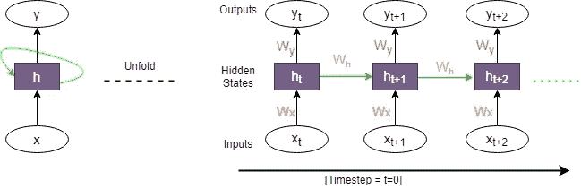

图 2

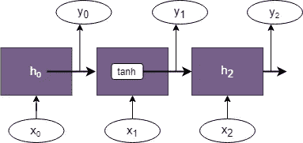

图 3

## RNN 背后的数学

**前馈传播**

在 MLP(图 4)，输出是通过将权重与当前输入相乘并加上偏差来表示的。RNN 也是如此，如图 6 所示。

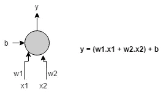

图 4

*(参考等式 1)* 考虑时间步长=2，当传递给激活函数时，使用权重、当前输入和偏置来计算隐藏状态。它的输出、权重和传递到激活的偏差导致了我们的目标预测。

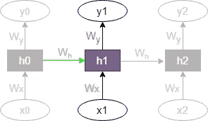

图 5

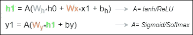

Eq1

**反向传播**

在到达输出时，在每个时间步长计算损失，因此称为通过时间的**反向传播，然后传播以更新权重，从而最小化误差。**

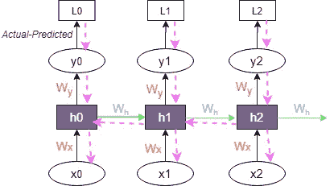

图 6

损耗当在每个输出的每个时间步计算时，将这些相加得到总损耗。

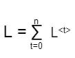

Eq2

现在对于一个长序列，权重将从最后一个时间步反向传播到初始时间步，导致可忽略的权重变化，导致**消失梯度问题**缺点:

*   消失梯度问题比爆炸梯度问题更受关注
*   长期依赖

在 RNN 的堆栈上，其他算法解决了它的缺点，接下来我们将了解 LSTM。因此，跳过 RNN 的实现，让我们检查一下 LSTM 的实现。

# LSTM(长短期记忆)

LSTM 是一种 RNN，是为了克服长期依赖问题而出现的。它通过细胞状态和门实现了对信息的长时间记忆。让我们来了解两者的架构差异。

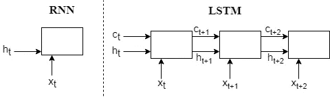

图 7

RNN 单元接收隐藏状态(h)和输入(x)的输入，而 LSTM 单元具有称为单元状态(c)的附加输入。单元状态是存储信息的内部存储器，隐藏状态是进行计算的地方。

## LSTM 电池的基本元件

遗忘门(f):具有 Sigmoid
输入门的神经网络(I):具有 Sigmoid
候选门的神经网络(g):具有 tanh
输出门的神经网络(o):具有 Sigmoid
单元状态的神经网络(c):向量
隐藏状态(h):向量

## **详细流程**

如图 8 所示，输入数据与前一个单元格状态和隐藏状态一起传递。让我们一步一步来理解这个过程。

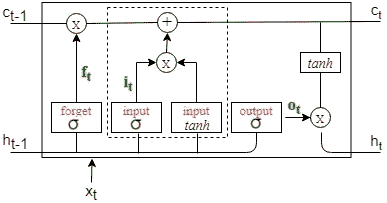

图 8

1.  **忘记不相关的** :
    这里，来自前一时间步(ht-1)的**不相关信息**被移除。该决定由具有范围(0，1)的 **Sigmoid** 函数的**遗忘门**做出。然后，将其输出与先前的单元状态相乘，得到必要的信息(cft)。
    如果遗忘门的值为 0，那么来自单元状态的信息应该被移除。
    *例如，*沙池是印度人。她会多种语言。雪莉是一名国际瑜伽老师。
    这里，主语从沙池到雪莱的变化应该被识别，因此“沙池”主语应该被忘记。

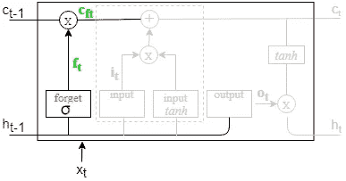

图 9

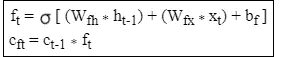

Eq3

**2。存储/更新当前单元格状态:**
**决定单元格状态中应该存储什么信息。**先前的单元格信息被传递给**输入门** (it)的**s 形函数**。值 0 表示不需要存储信息。先前的时间步长信息传递到 **tanh 层**以创建要添加到当前单元格状态中的候选值。
以上两者相乘的结果加到单元状态时，**当前单元状态用新的必要信息(ct)** 更新。

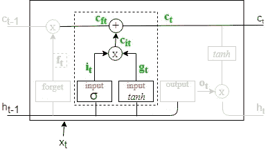

图 10

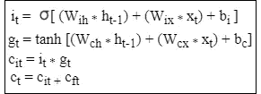

Eq4

**3。输出单元状态的某些部分:**
**输出门**具有 **Sigmoid** 功能，决定从单元输出什么。对于值 0，隐藏状态(ht-1)不会传递到输出。更新的单元信息(ct)被传递到 **tanh** 并乘以输出门的输出，以给出当前时间步长信息(ht)。

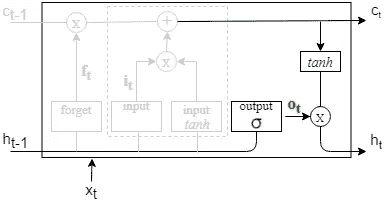

图 11

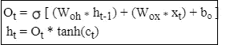

Eq5

现在，当所需的信息被传递时，如果它是最后一个 LSTM 单元，则隐藏状态(ht)被传递给 **softmax** 函数以给出输出 y

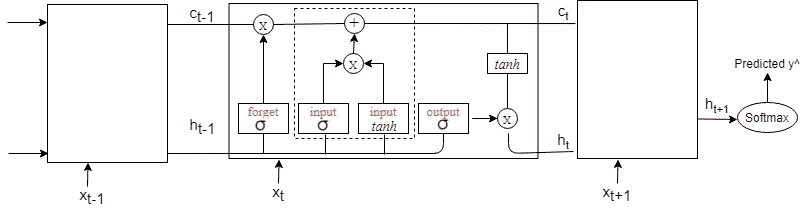

图 12

## 缺点:

*   长期依赖问题依然存在

根除了这个问题，变形金刚出现了，这将在我的下一篇博客中讨论，[NLP](https://medium.com/p/58d952fc476c/edit?source=your_stories_page-------------------------------------)中深度序列建模的变形金刚时代。

# 具有序列的架构变体

这是基于安德鲁的[课程的学习。](https://www.coursera.org/learn/nlp-sequence-models/lecture/fyXnn/bidirectional-rnn)

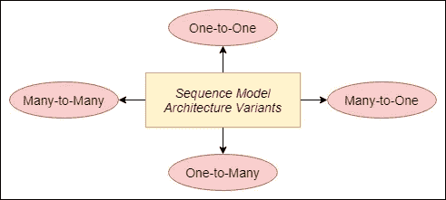

图 13

1.  **一对一**
    用于常规 ML 问题的标准神经网络。

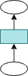

**2。一对多**
一个单一的输入(比如说整数)被给定输出一个序列。
例如，
音乐生成(通过给定流派名称来生成音乐歌词)，
文本生成&图像字幕(将图像放入有序字幕中)

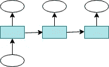

**3。多对一**
根据输入序列预测类别标签。
例如，DNA 序列分类、异常检测、天气预报、股市预测

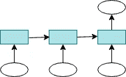

**4。多对多**
预测与输入序列长度相同/不同的序列长度。
例如，问答、机器翻译、语音识别

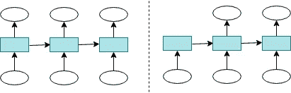

这是基于从[这篇博客](https://machinelearningmastery.com/sequence-prediction/)中学到的。

# 履行

要进行实际操作，最好从预测股票价格一个非常基本的模型开始。找到在股票价格数据集上实现的 LSTM 模型，链接如下所示。

> GitHub 知识库中的 LSTM 模型

# 现实生活的应用

让我们来看看一些实现序列建模的非常酷的用例。

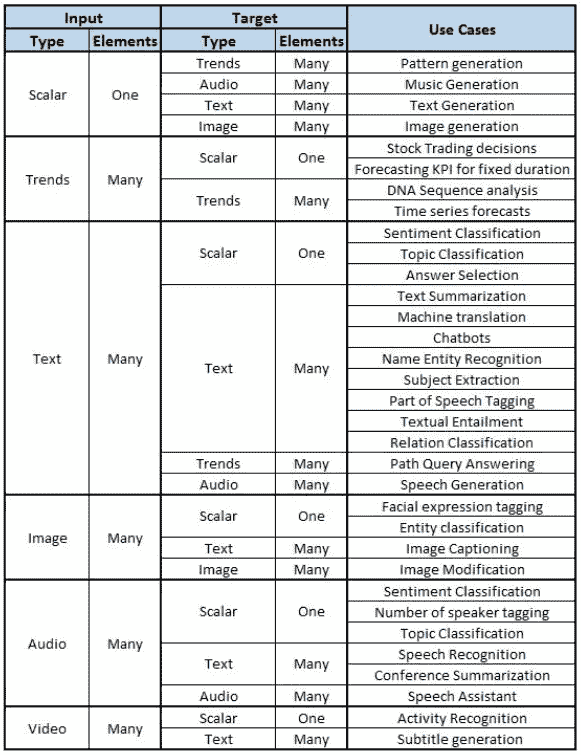

[表](https://www.analyticsvidhya.com/blog/2018/04/sequence-modelling-an-introduction-with-practical-use-cases/)

# 参考

如果你喜欢这位作者的博客，请随意关注，因为这位作者保证会带来更多有趣的人工智能相关内容。
感谢，
学习愉快！😄

***可以通过***[***LinkedIn***](https://www.linkedin.com/in/kaul-shachi)***取得联系。***