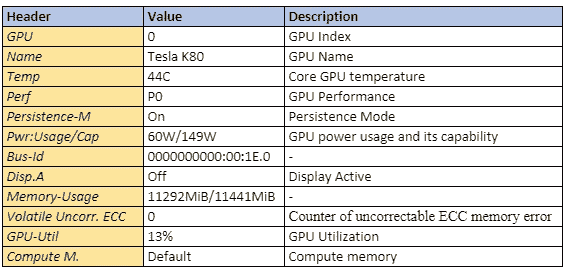

# 解释了 Nvidia-smi 实用程序的输出

> 原文：<https://medium.com/analytics-vidhya/explained-output-of-nvidia-smi-utility-fc4fbee3b124?source=collection_archive---------0----------------------->

嘿学员们！

图片来自[https://www.nvidia.com/en-us/about-nvidia/partners/](https://www.nvidia.com/en-us/about-nvidia/partners/)

M 机器学习和深度神经网络当进化时，CPU 上的计算需要很长时间，甚至不可能按时完成。此后，GPU 被引入这些，尽管它已经被用于游戏。要了解更多关于 GPU 及其监控的信息，可以快速浏览一下[的博客](/@shachikaul35/crux-of-gpu-28fe7d37dd28)。

NVIDIA GPUs 开始广泛用于许多机器学习和深度学习模型，然后需要监控和管理多 GPU 设置以获得其好处。好吧，那好消息！其中一个命令行实用工具“nvidia-smi”就是救星。我们来了解一下。

# ***Nvidia-smi***

有一个命令行实用工具 Nvidia-smi ( *也叫 NVSMI* )可以监控和管理 NVIDIA GPUs，如 Tesla、Quadro、GRID 和 GeForce。它与 CUDA 工具包一起安装，为您提供有意义的见解。

下面是“nvidia-smi”命令行的输出。

图 1

生成两个表作为输出，其中第一个表反映了所有可用 GPU 的信息(上面的示例显示了 1 个 GPU)。第二个表格告诉你使用 GPU 的进程。

我们一个一个来。

# 表一

图 2

图 3

让我们深入了解一下。

***Temp:*** 核心 GPU 温度以摄氏度为单位。我们不需要担心它，因为它将由 AWS 数据中心控制，除了关心你的硬件。表格中显示的上述“44C”是正常的，但当它达到 90+ C 时，请拨打电话

***Perf:*** 表示 GPU 当前的性能状态。范围从 P0 到 P12，分别指最大和最小性能。

***Persistence-M:***Persistence 模式标志的值，其中“On”表示 NVIDIA 驱动程序将保持加载状态(persist ),即使 Nvidia-smi 等活动客户端没有运行。这降低了 CUDA 程序等依赖应用程序的驱动程序加载延迟。

***Pwr:Usage/Cap:****是指*GPU 当前的功耗占总功耗的比例。它的单位是瓦特。

***Bus-Id:*** GPU 的 PCI 总线 Id 为“domain:bus:device.function”，十六进制格式，用于过滤特定设备的统计信息。

***显示。*** *:* Display Active 是一个标志，决定是否要在 GPU 设备上为显示分配内存，即初始化 GPU 上的显示。这里，“关闭”表示没有任何使用 GPU 设备的显示。

***内存使用:*** 表示总内存中 GPU 上的内存分配。Tensorflow 或 Keras(TensorFlow 后端)在启动时会自动分配整个内存，即使它不需要。因此，请浏览 Keras 上的 [GPU 和 Tensorflow](/@shachikaul35/gpu-on-keras-and-tensorflow-357d629fb7e2) 以了解更多有趣的信息。

***挥发不掉。ECC:*** ECC 代表纠错码，通过定位和纠正传输错误来验证数据传输。NVIDIA GPUs 提供 ECC 错误的错误计数。这里，易失性错误计数器检测自上次加载驱动程序以来的错误计数。

***GPU-Util:*** 表示 GPU 利用率的百分比，即内核在采样周期内使用 GPU 的时间百分比。这里，周期可以在 1 到 1/6 秒之间。*例如*，上表中的输出显示时间为 13%。在低百分比的情况下，如果代码花费时间从磁盘读取数据(小批量)，则 GPU 未得到充分利用。
更详细参考:[https://docs . NVIDIA . com/deploy/nvml-API/structnvmlUtilization _ _ t . html # structnvmlUtilization _ _ t](https://docs.nvidia.com/deploy/nvml-api/structnvmlUtilization__t.html#structnvmlUtilization__t)

***计算 M.*** :特定 GPU 的计算模式是指每次重启后计算模式设置为默认的共享访问模式。“默认”值允许多个客户端同时访问 CPU。

这就是 GPU 在进程中的应用。现在，让我们浏览一下第二个表格，它给出了使用 GPU 的每个进程的概念。

# 表二

图 4

***GPU:*** 表示 GPU 索引，有利于多 GPU 设置。这决定了哪个进程使用哪个 GPU。此索引代表设备的 NVML 索引。

**PID:** 使用 GPU 通过进程 ID 引用进程。

***类型*** *:* 是指“C”(计算)、“G”(图形)、“C+G”(计算和图形上下文)等进程的类型。

***流程名称:*** 不言自明

**GPU 内存使用:**每个进程使用的特定 GPU 的内存。

*其他指标和详细描述在 Nvidia-smi 手册页上。*

快乐阅读！

***可以通过***[***LinkedIn***](https://www.linkedin.com/in/kaul-shachi)***与我联系。***