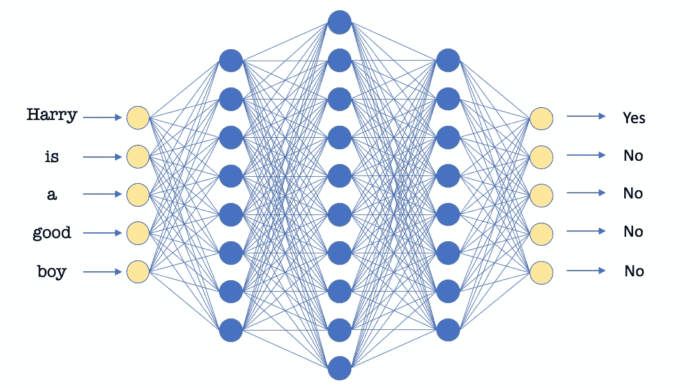

# 解释:递归神经网络

> 原文：<https://medium.com/analytics-vidhya/explained-recurrent-neural-networks-2832ca147700?source=collection_archive---------35----------------------->

递归神经网络是专门为序列形式的可用数据设计的专用神经网络。序列数据的几个例子可以是文本数据，如推文或评论、股票的每日收盘价、传感器读数等。在本文中，我们将主要关注作为 RNNs 输入的文本数据。在我们开始研究 RNNs 的技术细节之前，让我们先讨论一下为什么标准的神经网络不能处理序列数据。

## **为什么是 RNNs？**

假设我们的目标是名称实体识别问题，并希望在给定的句子集中检测人名。如果我们使用一个标准的神经网络来解决这个问题，我们的架构可能看起来像下面这样。

*NER 标准神经网络*

现在，我们注意到这种架构的第一个问题是，我们固定了输入和输出的长度。因此，如果我们在测试数据中遇到一个比这个固定长度更长的句子，我们可能不得不截断它。同样，所有短于这个固定长度的句子都必须被填充。这并不理想，可能会导致意想不到的结果。关于输出，虽然在这种情况下，我们可能需要固定长度的输出，但在许多情况下，输出的长度是未知的。例如在语言翻译的情况下。这种情况不能由标准的神经网络架构来处理。

第二个问题是，在这种架构中学习到的特性不会在文本的不同位置之间共享。特别是，如果网络知道出现在句子第一个位置的‘Harry’是一个人名。然后，在预测时，如果“Harry”和类似的词出现在第一个位置，它可以将它们标记为人名。但是，如果“哈利”出现在句子的第三个位置，就不会出现同样的情况。这是使用这种架构的主要缺点。

用于文本处理的标准神经网络的输入大小计算

另一个问题是输入层的大小。在上面的例子中，如果我们对输入单词使用独热向量，并且序列长度为 100，那么输入大小将是用于生成独热向量的词汇大小的 100 倍。词汇量通常从 10K 开始，最高可达 50 万。这种表示将导致输入大小从 1M 到 50M，这在任何情况下都是非常大的。即使我们使用单词嵌入，我们仍然会以序列长度乘以嵌入长度作为输入层的大小。这可以通过 RNNs 显著降低。

记住上面强调的问题，我们现在将讨论 rnn，它有望以更好的方式处理序列数据。

## **RNNs 基础**

在递归神经网络中，每个单词都经过一个隐藏层。这个隐藏层为每个单词产生两个向量——一个输出向量和一个激活向量。来自前一个单词的激活向量与当前单词结合使用。这两者结合起来，产生当前单词的输出向量和将与下一个单词一起使用的激活向量。这个过程一直持续到序列结束。

*递归神经网络架构*

递归神经网络从左到右扫描数据，并且参数是共享的，即相同的参数集用于序列的每个单词。因此，上面的 RNN 在对特定单词*、*进行预测时，不仅从该单词中获得信息，还从激活向量传递给它的先前单词中获得信息。

使用以下等式计算每个单词的激活向量和输出向量:

以上方程中， *ga* 和 *gy* 为激活函数如 tanh、ReLu 和 Sigmoid。对于激活向量*和*，通常使用的激活函数有 tanh 和 ReLu 两种，前者是最常用的选择。对于输出向量 *yn，*激活函数取决于所需的输出类型，例如，我们可以使用 Sigmoid 处理二分类问题，使用 Softmax 处理多分类问题。

**基本 RNN 结构的局限性**

上述基本 RNN 结构的一个缺点是它遇到了消失梯度的问题。你可以在这里阅读关于渐变消失问题[的详细内容。简而言之，在非常深的神经网络中，来自后面层的输出的梯度可能很难传播回来以改变前面层的权重。](https://en.wikipedia.org/wiki/Vanishing_gradient_problem)

*开头词影响后面词的句子*

假设我们正在通过一个具有如上所示基本结构的 RNN 传递一个很长的句子。这个练习的目标是预测序列中的下一个单词。第一个输入将是单词“男孩”,在这个阶段的预期输出将是单词“谁”。类似地，在下一步，输入将是“who”以及上一步的激活向量，预期输出将是“got”。

*RNN 处理开头词影响后面词的句子*

当我们到达预期输出为“was”的步骤时，我们将需要上一步的激活向量来包含名词是单数还是复数的信息。这一信息在句子的开头就被捕捉到了。因此，在该步骤的反向传播期间，来自输出的梯度将想要以这样的方式更新 *Wa* 和 *Wx* ，使得在处理“男孩”时可以捕获该信息。但是，由于这两个词之间有一个很长的间隔，梯度可能会消失，可能不会按要求更新参数。因此，遇到了渐变消失的问题。

*识别句子中的人名。“泰迪”仅在第二句中用作人名*

这种基本结构的另一个问题是序列是从左到右处理的。在处理一个单词时，我们只能使用这个单词所传达的信息。然而，该单词右侧的信息可能对其处理至关重要，并可能影响该阶段的输出，如上图所示。

我们将在本系列的下一篇博客中解决这些问题。具体来说，我们将讨论 LSTMs、双向 rnn 和深度 rnn。