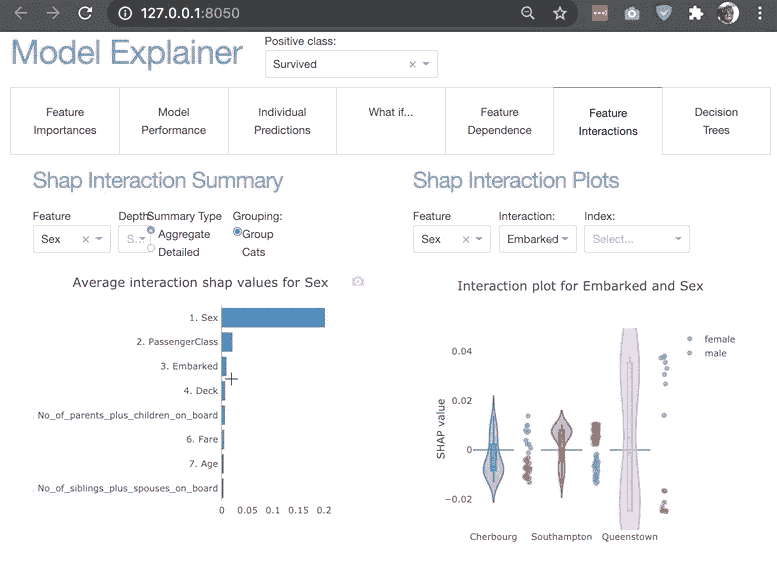

# 解释器仪表板-为机器学习模型构建交互式仪表板

> 原文：<https://medium.com/analytics-vidhya/explainer-dashboard-build-interactive-dashboards-for-machine-learning-models-fda63e0eab9?source=collection_archive---------1----------------------->

## 分析，解释，预测，机器学习模型的工作

## Python 包来快速构建交互式仪表盘，解释适合的机器学习模型的内部工作原理。

解释器仪表板