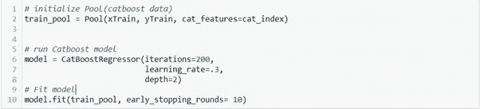
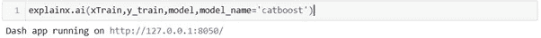
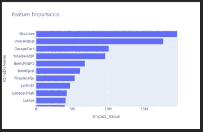
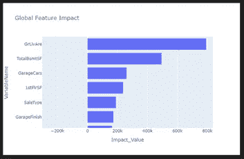
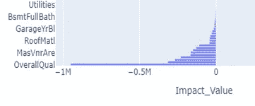
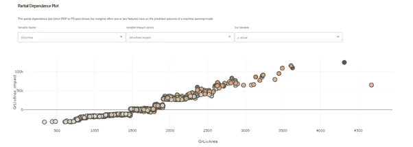
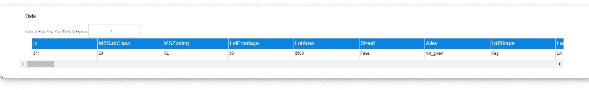
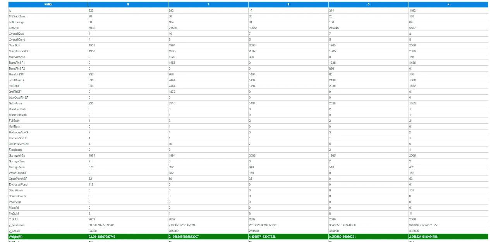

# 使用 Explainx.ai 解释机器学习 Catboost 模型

> 原文：<https://medium.com/analytics-vidhya/explaining-the-machine-learning-catboost-model-using-explainx-8e62130b7800?source=collection_archive---------14----------------------->

房屋预测

大多数商业利益相关者对采用基于人工智能的解决方案表现出抵触情绪。这种不愿意接受的最重要原因是机器学习模型的黑盒方法。

[**Explainx.ai**](https://www.explainx.ai/) 推出了一个库，帮助解释机器学习模型，并将 Ml 模型的黑盒性质分解为有用的解释和见解

我们将采用房屋预测数据，并尝试使用[**explainex**](https://github.com/explainX/explainx)库来解释模型结果。

**如何使用 Explainx:**

1.  构建 Catboost 机器学习模型

训练和测试数据帧中的数据分割

使用 Catboost 模型训练数据

2.通过**explaix**库中的测试数据传递模型

在 explainx.ai 模块中传递带有测试数据的模型

该链接将直接带您到仪表板，在那里使用多个图表解释模型。

**型号说明**:

1.  *特征重要性*

特征重要性

水平条形图，显示在 Catboost 模型中对销售价格预测贡献最大的功能

贡献最大的三大功能是:

GrLivArea:地面以上居住面积平方英尺

总体质量:对房屋的整体材料和装修进行评级

车库汽车:车库在汽车容量中的大小

因此，我们从该图表中得到的直觉是，房屋的面积、车库的大小以及用于建造房屋的整体材料是 cat boost 模型预测房屋销售价格的关键因素。

2.*功能影响*

功能影响

功能影响 2

水平条形图显示了特征对房屋销售价格的影响。

贡献最大的特征与目标特征正相关/负相关，在我们的例子中，目标特征是销售价格

1.GrLivArea:积极影响

2.总体平等:负面影响

3.车库汽车:积极影响

所以，我们从这张图表中得到的直觉是，房子的面积，车库的大小与销售价格成正比，而总体上是负相关的。

3.*部分依赖图(PDP)* :

PDP 显示了一个或两个特征对机器学习模型的预测结果的边际影响。

图表显示房屋的地面面积增加，地面面积对销售价格的影响是积极的。图形形状类似于线性函数，这解释了我们的模型在高地面区域的情况下预测更高的销售价格。

Explain-x 不仅提供了对数据集全局级别的洞察，还提供了对单行数据的洞察。Explain-x 还提供了帮助查找相似数据行的建议。

数据集的单行

相似的数据点/行

与地产**区域**相关的项目是主要因素。借助“Explain-x ”,您可以对模型预测进行宏观和微观层面的分析。

我希望这篇文章给出与机器学习模型的可解释性相关的新鲜知识，鼓励在您的机器学习项目中使用 **Explain-x 库**，并为您的模型预测提供更大的洞察力。

请用你的**掌声**鼓励一下，并在评论区分享你的评论