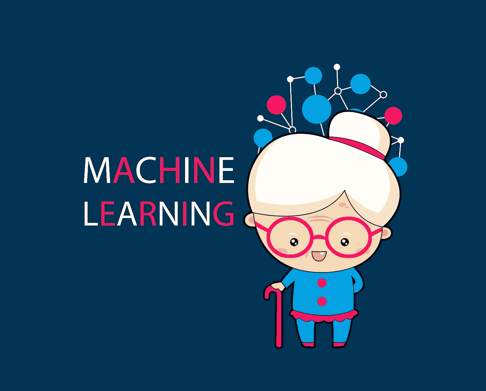
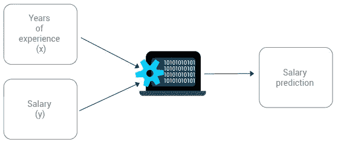
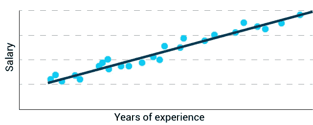
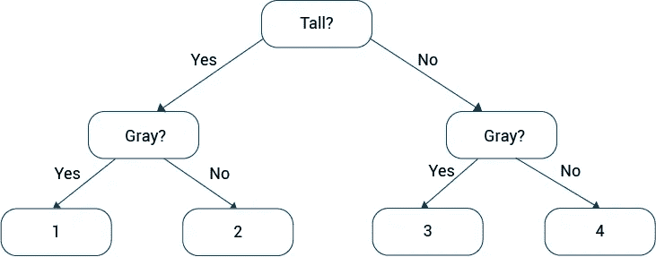
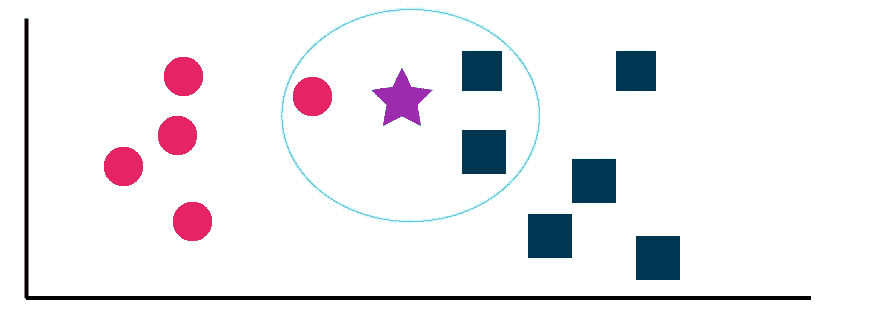

# 向我祖母解释一些机器学习

> 原文：<https://medium.com/analytics-vidhya/explaining-to-my-grandmother-some-machine-learning-ab822aabcb4a?source=collection_archive---------16----------------------->



亲爱的奶奶，我正在做一个练习，以提高我用简单的方式解释复杂问题的能力。

今天我将选择谈论机器学习，如果我是真诚的，我对这个话题知之甚少，但这是我必须做的事情。

你是一个非常幸运的人，因为在你的一生中，你设法看到了人类在科技背景下的伟大成就。你设法看到人类去月球旅行，向彩色电视的过渡，互联网和手机的发展以及其他许多事情。

那你一定对什么是机器和机器人有概念。但是也许你认为这两个概念是一样的。以防万一，我会解释两者的区别。

机器人是一种智能机器。换句话说，机器人是一种能够对环境刺激做出反应的机器，甚至能够从这种反应中学习。另一方面，机器被设计来重复特定的任务，它没有对环境做出反应或从中学习的智能。

缝纫机是一种机器。但是，如果缝纫机能够识别线的类型、面料和颜色，并提出建议，然后在没有帮助的情况下进行缝纫，那么它将是一个机器人。

现在想象一个世界，所有的东西都变成了机器人，扫帚，窗户，床。人类通常需要做的所有功能，比如打扫房间，都会变得更容易。事实上，已经有机器人在你工作的时候打扫你的房子了。

关键是，只有人类设法让机器变得越来越智能，这个美好的世界才是真实的。当我们让机器智能化时，我们谈论的是人工智能。智能并非来自自然，而是由于我们的干预而创造出来的。

事实上，具有人工智能的机器有能力通过一些方法进行自我学习。但目前总会有人在某个时候进行干预，即使是物理干预。

# **什么是机器学习？**

是达到人工智能的自动方式。

想象一下，你想教你的侄子什么是好的，什么是坏的。告诉他在每种情况下应该如何行动几乎是不可能的。所以你试着举一些情况的例子，然后等待他理解大意。

当你教一台机器时，情况是一样的。机器学习技术用于自动教机器做数百万次。

有两种方法可以让机器变得智能:

1.  监督学习
2.  无监督学习

**监督学习**

想象一下，你想教你的侄子辨认一只猫。然后你给他看有猫的照片，告诉他他是一只猫。然后你给他一些新的图片，让他去寻找那些有猫的图片。他将能够识别带有猫的图像，因为你首先帮助他识别了一只猫。

那么监督学习包括从一开始就帮助识别，然后期望它独自完成。

**无监督学习**

想象一下，你想教你的侄子自己解决他的问题。这里你有一个问题，因为你不能像在猫的例子中那样给出答案。如果你知道，他就不会独自解决问题。然后你能做的就是等待问题来找他，他找到解决问题的方法。

那么无监督学习就是不帮助机器。机器应该学会自己查找相关信息。

# **基础知识**

此时，在您继续之前，我有必要解释以下概念:

1.  相关和回归
2.  编程语言
3.  人类偏见

**相关和回归**

关系是一种联系或通信。相关性是一段关系的强度和方向。

相关性分析产生一个数字，它概括了两个变量之间的相关程度；回归分析产生了描述这种关系的数学方程。

这些是数学概念，被那些致力于用机器学习来制造机器的人所使用。

**编程语言**

编程语言是程序员用来让技术遵循指令的东西。例如，一个计算器可以加上感谢程序员在对象内部写的事实。他用编程语言编写了计算器执行这一操作所需的指令。

因此，当你听说 Python、c ++或 R 时，你会知道它们是编程语言，实际上是用于这种人工智能连接的。

**人类偏见**

虽然在未来我们会让机器控制国家的政治体系。过去那些人工智能机器用光了从我们自己提供的数据中学习。这意味着，尽管表面上他们可以得出自己的结论，但这些结论将真正成为我们的结论，因为我们会影响他们。

最后，关于机器学习，你需要知道的最后一件事是，有以下几种技术:

1.  线性回归(监督)
2.  逻辑回归(监督)
3.  决策树(有监督的)
4.  支持向量机(监督)
5.  k-最近邻(有监督的)
6.  随机森林(有监督的)
7.  k-均值聚类(无监督)
8.  分层聚类(无监督)

以上我只解释其中的一些，因为我还没有能力把它们全部简化。

**什么是因变量，什么是自变量？**

自变量就是我们所知道的。自变量是我们想要知道其值的变量。

例如，我们有这个公式:

```
y = 2 * x + 3
```

我们知道 x 等于 5。所以我们替换了它。

```
y = 2 * 5 + 3
```

我们不知道 y 的值，所以我们必须对已知的值进行运算才能知道 y 的值

```
y = 10 + 3
y = 13
```

然后自变量是“x”，自变量是“y”。

**线性回归**

基本上我们使用线性方程，也就是画一条线来预测数据行为的方程。



因此，如果我们使用这种技术，我们可以根据多年的经验(因变量)预测工资(自变量)。

**决策树**

我们通常使用嵌套条件，即条件中的条件。一般来说，这个想法是通过条件过滤来对数据进行分类。



例如，猫可以根据它们的大小和颜色来分类。首先，我们会问他们是否高，最后，如果他们的灰色。这样，我们将有 4 个分类:

1.  又高又灰的猫
2.  高大的非灰色猫
3.  小灰猫
4.  小型非灰色猫

**K-最近邻**

我们使用这种技术来预测数据属于哪个集合。解释这种方法的最好方式是用图表。



如您所见，我有 2 种类型的数据，我选择了一个数据子集。然后，我必须想知道在恒星周围有多少每种类型的数据。因为子集中有更多的正方形，所以星形将是正方形。

# **IBM 沃森**

是商业的人工智能平台。沃森可以带来 AI(人工智能)工具和 app。

我想让你了解这家公司的一些项目:

1.  沃森视觉识别
2.  沃森文本到语音
3.  沃森语言翻译器
4.  沃森自然语言分类器
5.  沃森个性见解
6.  沃森音调分析仪

**沃森视觉识别**

使用机器学习快速准确地标记、分类和搜索视觉内容。

**沃森文本到语音**
将书面文本转换成各种语言和声音的自然声音。

**沃森语言翻译器**
动态翻译新闻、专利或会话文档。

**Watson 自然语言分类器**
使文本分类变得容易。快速训练定制的机器学习模型来分析和标记您的文本数据。

**沃森个性洞察**
通过书面文本预测个性特征、需求和价值观。大规模地了解个人层面的客户习惯和偏好。

**沃森语气分析仪**
理解文本中的情感和交流方式。

# **结论**

数学的使用对于理解与人工智能相关的一切是必不可少的。我们的知识有多丰富，我们使用的算法有多有效？我认为有必要使用科学方法来理解和预测我们使用的算法将不得不如何改变，以防止任何人类级别的人工智能出现。

我认为这是我们如此涉足这一领域的原因之一。仍然有许多挑战需要克服，其中一些与人类的动机和目标有关，例如“找到价值观的组合”或“拥有一个可以思考的人类级别的人工智能。”但随着越来越多的机器学习系统变得更加智能，并在互联网上使用，这样的问题将会得到解决。

机器学习提供的可能性是无限的。总是会寻找适应数学模型的方法。

由于互联网，信息的扩展极大地有利于自动学习，因为它是你训练技巧的信息来源。对这一主题的关注将帮助大量的人，因为这将使他们有机会掌握常用的分析方法。预训练模型的知识也将使你成为一个更好的研究者，更有效地理解问题。

我印象深刻的是，一个神经网络写了这篇博文的部分内容，而你却没有注意到。