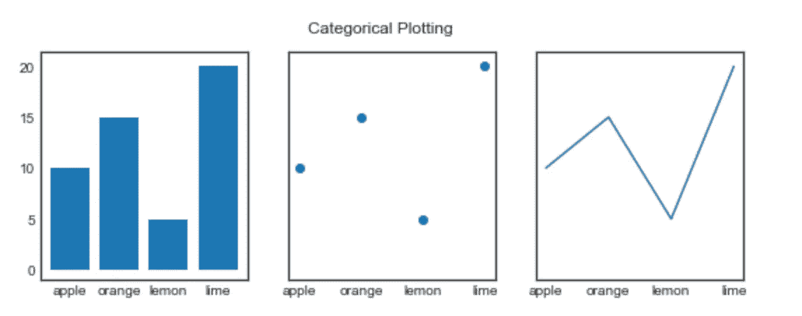
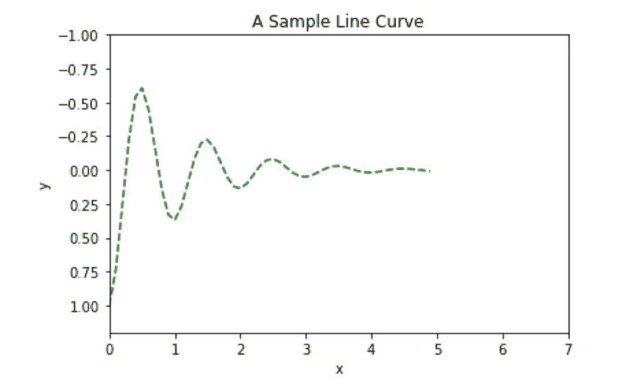
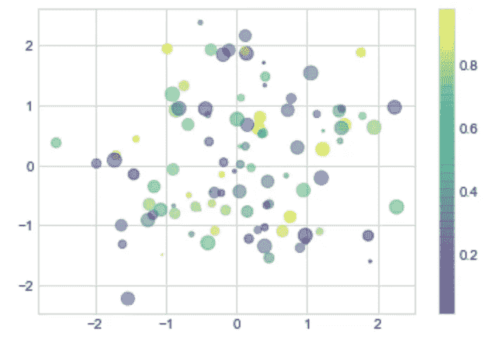
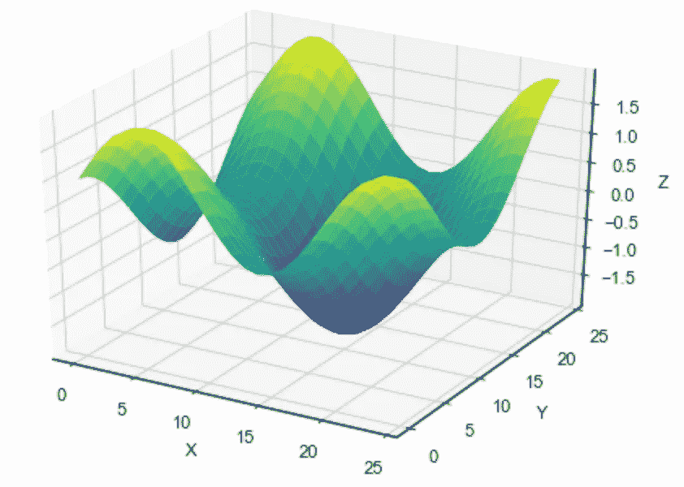
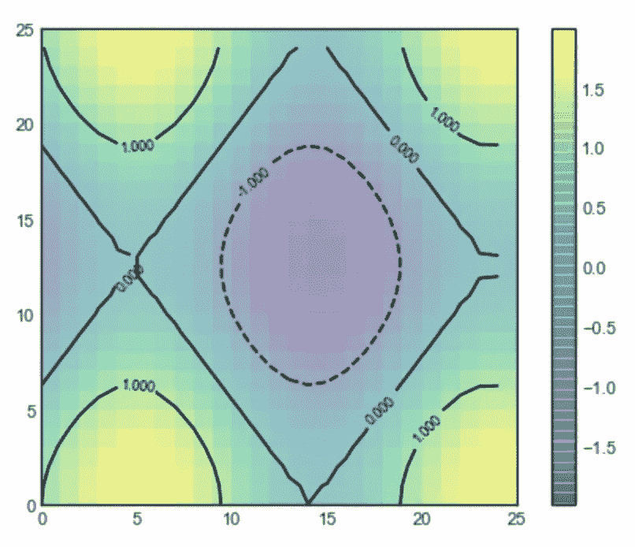
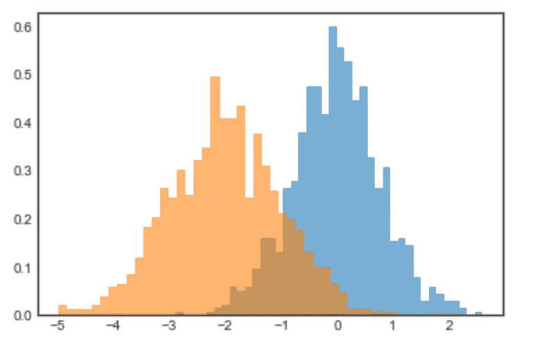
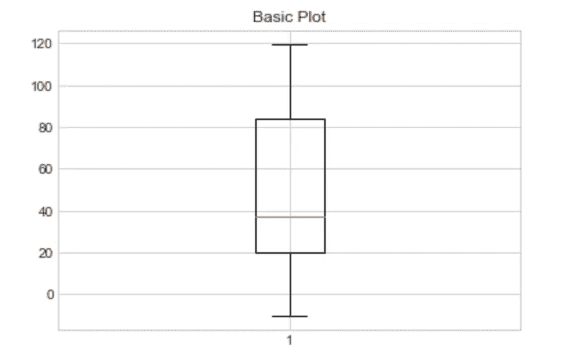

# 利用 matplotlib

> 原文：<https://medium.com/analytics-vidhya/exploiting-matplotlib-81f1c4030734?source=collection_archive---------17----------------------->

有太多的东西可以利用人类，但宗教和爱国主义是最重要的——塔里夫·纳兹， [**【天堂中的伤害】**](https://www.goodreads.com/work/quotes/40771387)


让我们开门见山吧。

下面是一个使用 matplotlib 显示基本图形的非常基本的例子。

```
**import** **matplotlib.pyplot** **as** **plt**

data = {'apple': 10, 'orange': 15, 'lemon': 5, 'lime': 20}
names = list(data.keys())
values = list(data.values())

fig, axs = [plt.subplots](https://matplotlib.org/api/_as_gen/matplotlib.pyplot.subplots.html#matplotlib.pyplot.subplots)(1, 3, figsize=(9, 3), sharey=**True**)
axs[0].bar(names, values)
axs[1].scatter(names, values)
axs[2].plot(names, values)
fig.suptitle('Categorical Plotting')
```



基于我们拥有的数据和我们想要显示的信息，可以绘制不同种类的图表。

1.  **线图**

*   它们通常用于寻找不同轴上的两个数据集之间的关系；例如 X，y。

```
**import** numpy as np
**import** matplotlib.pyplot as plt
**def** f(t):
    **return** np.exp(-t) * np.cos(2*np.pi*t)
**t1** = np.arange(0.0, 5.0, 0.1)plt.**figure**()
plt.**plot**(t1, f(t1), color='g', linestyle="--", label='Frequency')
plt.**xlim**(0, 7)
plt.**ylim**(1.2, -1.0);
plt.**title**("A Sample Line Curve")
plt.**xlabel**("x")
plt.**ylabel**("y")
plt.**legend**(loc='upper right')
plt.**show**()
```



2.**散点图**

```
%**matplotlib** inline
**import** **matplotlib.pyplot** **as** **plt**
plt.style.use('seaborn-whitegrid')
**import** **numpy** **as** **np**rs = np.random.RandomState(0)
x = rs.randn(100)
y = rs.randn(100)
colors = rs.rand(100)
sizes = 100 * rs.rand(100)plt.scatter(x, y, c=colors, s=sizes, alpha=0.5, cmap='viridis')
plt.colorbar();
```



*   一个例子是绘制相对于纬度/经度的人口分布。

3.**等高线 2D 和 3D 图形**

```
%**matplotlib** inline
import numpy as np
from mpl_toolkits.mplot3d import Axes3D 
import matplotlib.pyplot as plt
import random
from matplotlib import cm**def** fun(x, y):
    **return** np.sin(x/3) + np.cos(y/4)fig = plt.figure(num=None, figsize=(7, 5), dpi=80, facecolor=’w’, edgecolor=’k’)
ax = plt.axes(projection=’3d’)x = y = np.arange(0, 25, 1)
X, Y = np.meshgrid(x, y)
zs = np.array(fun(np.ravel(X), np.ravel(Y)))
Z = zs.reshape(X.shape)ax.plot_surface(X, Y, Z, cmap=’viridis’)ax.set_xlabel(‘X’)
ax.set_ylabel(‘Y’)
ax.set_zlabel(‘Z’)
plt.show()ax.view_init(60, 35)
plt.show()plt.figure(figsize=(7, 5), dpi=80, facecolor=’w’, edgecolor=’k’)
contours = plt.contour(X, Y, Z, 3, colors=’black’)
plt.clabel(contours, inline=True, fontsize=8)
plt.imshow(Z, extent=[0, 25, 0, 25], origin=’lower’,
 cmap=’viridis’, alpha=0.5)
plt.colorbar();
```



*   有助于可视化某些属性的分布，如密度/电位差/亮度。

4.**直方图**

*   它用于汇总离散或连续数据。
*   它类似于[条形图](https://www.mathsisfun.com/data/bar-graphs.html)，但是直方图将数字分组到**范围**中。

```
%**matplotlib** inline
import numpy as np
import matplotlib.pyplot as plt
plt.style.use('seaborn-white')data = np.random.randn(1000)x1 = np.random.normal(0, 0.8, 1000)
x2 = np.random.normal(-2, 1, 1000)kwargs = dict(histtype='stepfilled', alpha=0.6, density=True, bins=40)plt.hist(x1, **kwargs)
plt.hist(x2, **kwargs);
```



5.**箱线图**

*   **箱线图**可能是最常见的图形类型之一。
*   将方框分成两部分的线代表数据的中位数**和**。

```
%**matplotlib** inline
import numpy as np
import matplotlib.pyplot as plt# fake up some data
spread = np.random.rand(50) * 100
center = np.ones(25) * 20
flier_high = np.random.rand(10) * 20 + 100
flier_low = np.random.rand(5) * (-20)
data = np.concatenate((spread, center, flier_high, flier_low))fig1, ax1 = plt.subplots()
ax1.set_title('Basic Plot')
ax1.boxplot(data);
```



*   由于各种各样的可视化模式，使用 seaborn 会更方便，但同样在引擎盖下，它只是 matplotlib。
*   更好的做法是尝试一些实用的数据可视化，并探索更多的 matplotlib API。你可以在 kaggle 上找到很多坚持相同的[笔记本](https://www.kaggle.com/notebooks\)。

伙计们，现在就到这里吧。感谢阅读。

特别信贷给:

*   [https://jakevdp . github . io/python datascience handbook/04.04-density-and-contour-plots . html](https://jakevdp.github.io/PythonDataScienceHandbook/04.04-density-and-contour-plots.html)
*   [https://matplotlib . org/3 . 1 . 1/gallery/py plots/box plot _ demo _ py plot . html](https://matplotlib.org/3.1.1/gallery/pyplots/boxplot_demo_pyplot.html)