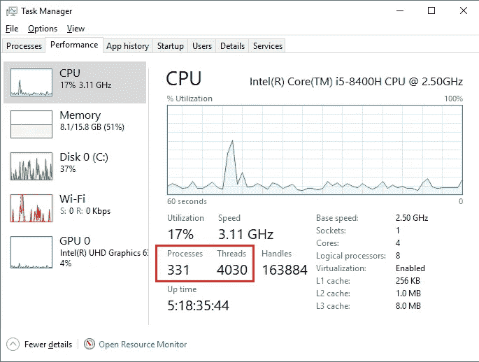
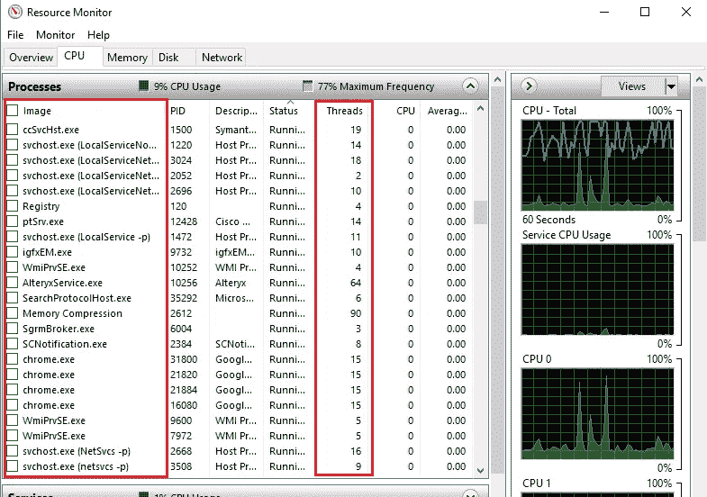
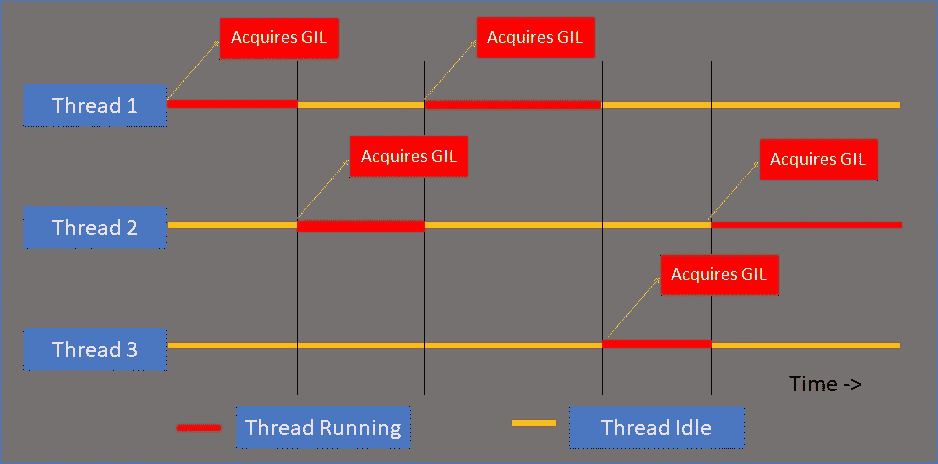

# 作为数据科学家利用 Python 中的多重处理和多线程

> 原文：<https://medium.com/analytics-vidhya/exploiting-multithreading-and-multiprocessing-in-python-as-a-data-scientist-e2c98b61997a?source=collection_archive---------3----------------------->


我们生活在这样一个时代，每天大约有 5 亿条推文被发出，每小时大约有 400 万张照片被上传到 Instagram，每分钟大约有 300 个小时的视频被上传到 YouTube，每秒钟大约有 75 万条消息在 WhatsApp 上被发送，每毫秒大约有 2900 封电子邮件被发送，这样的例子不胜枚举。到 2025 年，每天收集的数据量估计约为 463！。开发消耗如此海量数据的机器学习或深度学习算法对数据科学家来说将是一个挑战。在这一点上，有效地开发这些算法变得非常必要，以便它们能够以更快的速度处理数据(当然，我们需要更好的硬件来运行这些算法，但让我们把这交给 NVIDIA 的人吧！).这就是并行计算发挥作用的地方。顾名思义，这是一种计算类型，其中计算或过程的执行是同时进行的，从而大大提高了算法的性能。多重处理和线程是 Python 中的两个内置模块，允许我们执行并行计算。在本文中，我们将探讨数据科学家如何利用这些模块来加速他们的管道。在本文的最后，我们将把这些技术应用到深度学习中两个众所周知的领域，即计算机视觉和自然语言处理，并看到并行计算的好处。

# **一些准备工作**

在深入研究并行计算之前，让我们先弄清楚基础知识。首先，让我们看看程序、进程和线程在计算机环境中的含义。

**程序:**它是指令的集合，是一个可执行文件，驻留在计算机的辅助存储器中，当被执行时执行特定的任务。因为它们驻留在辅助存储器中，所以即使当系统关闭时它们也持续存在。例如，在 Windows 机器中，计算器是一个驻留在*C:\ Windows \ system32 \ calc . exe*中的程序，同样，如果你在 Linux 系统中，ls 命令是一个存储在 */bin/ls* 中的二进制文件。

**进程:**它是一个程序的运行实例，总是存储在 ram 中，每个进程都有自己的内存、数据和执行程序所需的其他资源。可能有多个进程与同一个程序相关联，例如，你的谷歌 chrome 浏览器的每个标签都是一个独立的进程(如果你使用的是 windows 系统的机器，你可以通过从控制面板打开任务管理器来验证它),程序【chrome.exe 位于你的辅助内存中。由于进程存储在 RAM 中，一旦系统关闭，它们就会丢失。此外，一个 CPU 在任何时候只能执行一个进程，哦，等等，那么只有一个处理器的单处理器计算机是如何工作的呢，因为在一台计算机中有许多进程(比如网络浏览器、音乐播放器、文本编辑器等等)。)同时运行？先把这个问题放一放。

**线程:**它是一个驻留在进程中的实体，每个进程都是由一个叫做主线程的线程启动的。它是操作系统分配处理器时间的基本单位。一个进程中可以产生一个或多个线程，所有线程共享分配给该进程的相同内存空间，并在一个进程的范围内执行。

下面是我的计算机的任务管理器和资源监视器的屏幕截图，显示了截图时系统中运行的每个进程的进程数和线程数。



任务管理器的屏幕截图



资源监视器的屏幕截图

更多关于这个的信息可以在[这里](https://stackoverflow.com/questions/200469/what-is-the-difference-between-a-process-and-a-thread)和[这里](https://docs.microsoft.com/en-us/windows/win32/procthread/about-processes-and-threads?redirectedfrom=MSDN)找到。

# **多重处理和多线程**

现在我们已经对基础有了一些了解，我们准备看看什么是多重处理和多线程:

多处理是系统同时支持多个进程的能力，如果你参考上图，你可以看到我的电脑在截图时正在运行 331 个进程。有趣的部分来了，我们已经说过一个 CPU 在任何时候只能运行一个进程，那么为什么我的电脑能够运行 331 个进程呢？肯定的是，我的 PC 没有 331 个 CPU，这就是我们需要了解[上下文切换](https://en.wikipedia.org/wiki/Context_switch)的地方。这是操作系统暂停并保存当前运行的进程的状态，并切换到另一个进程来执行的能力，以便它可以在稍后的时间点恢复对先前暂停的进程的操作。在现实中，这些进程之间的切换以非常高的速度发生，以至于没有人能够察觉到它，这给我们造成了一种错觉，即我们的系统正在同时运行多个进程，而实际情况并非如此(由于上下文切换，这就是只有一个 CPU 的计算机如何工作的)。每个进程都有自己的内存空间，并且非常独立，所以即使一个进程被破坏，也不会对其他进程产生任何影响，但这是有代价的，因为每个进程都有自己的内存空间，在它们之间共享对象变得很困难，这就是为什么我们有 [IPC](https://www.webopedia.com/TERM/I/interprocess_communication_IPC.html) ，它非常复杂，涉及更多的开销。

多线程是操作系统在一个进程中产生多个线程来执行它的能力。一个进程的所有线程都在同一个内存空间中运行，所以在不同的线程之间共享对象是非常容易的。话虽如此，允许多个线程在一个进程中访问相同的对象可能会导致争用情况。当多个线程试图同时更改单个变量的值时，根据操作系统在不同进程之间切换上下文的方式，可能会导致不可预测的行为，在这里可以找到一个有趣的竞争条件不良影响的示例。为了解决这个问题，计算机使用[互斥锁](https://en.wikipedia.org/wiki/Mutual_exclusion)，防止多个线程同时修改同一个变量的值。遗憾的是，CPython 的内存管理不是[线程安全](https://en.wikipedia.org/wiki/Thread_safety)，所以为了防止竞态条件，Python 使用了全局解释器锁(GIL)作为互斥体。GIL 确保在任何时刻，一个进程中只有一个线程处于执行状态，因此没有两个线程可以同时修改一个变量。对于任何开始执行的线程，它必须获得 GIL，并且对于一个进程只有一个可用的 GIL。一旦一个线程完成了它的执行，它就释放 GIL，以便它可以被其他线程获取。更多关于 GIL 的讨论可以在[这里](https://realpython.com/python-gil/)找到。

在一定程度上讨论了多重处理和多线程之后，我们仍然需要回答一个重要的问题:如何在两者之间做出选择？答案真的取决于你将做什么类型的手术。Python 中防止竞态条件的 GIL 有其自身的缺点，它的存在在 Python 社区中总是引起争论。由于在任何时候只有一个线程可以获取 GIL，因此只有已经获取 GIL 的线程将处于执行状态，而所有剩余的线程将处于空闲状态，等待获取 GIL，这使得 python 中的“所有”多线程操作都是单线程的。下图解释了这个缺点。



线程争取获得 GIL

首先，线程一获取 GIL 并开始运行，同时，线程二和线程三只是空闲，一旦线程一释放 GIL，它就被线程二获取，这使得线程一和线程三空闲。所以本质上它只是一个单线程操作，但它只是在多个线程中执行。但是，当您执行 I/O 绑定操作(如从网络下载内容、等待用户输入、写入数据库等)时，GIL 总是被释放。在这些场景中，CPU 只是等待来自外部代理的资源开始处理它们。在这些情况下，多线程是一个非常好的加速管道的解决方案。另一方面，有 CPU 密集型任务，如矩阵乘法、排序、搜索、图形遍历等。，这些操作需要 CPU 的大量关注，非常适合多处理。同样重要的是要注意，生成一个进程比生成一个线程会带来更多的开销。


那是 GIL 给你的

# **例题**

好了，理论讲够了，让我们写一些代码，把我们的理论付诸实践。

注意:对于那些对跟随这篇文章的代码感兴趣的人，请参考这里的。

首先，在进入真实世界的用例之前，让我们考虑几个玩具例子。照例先进口。

```
import os
import time
import cv2
import dlib
import glob
import random
import nltk
import numpy as np
from functools import reduce
import concurrent.futures
import xml.etree.ElementTree as ET
from nltk.stem import PorterStemmer, LancasterStemmer
from nltk.tokenize import sent_tokenize, word_tokenize
```

让我们写一个简单的函数，它只是将执行延迟给定的秒数。

```
def sleep_fun(seconds):
    print(“Sleeping for {} second(s)”.format(seconds))
    time.sleep(seconds)
```

因为这不是一个 CPU 密集型任务，所以这是多线程的一个很好的候选，让我们在使用和不使用多线程的情况下执行这段代码，看看有什么不同。

```
sleep_times = [1,2,3]
start = time.time()
for i in sleep_times:
    sleep_fun(i)
end = time.time()
print(“Series computation: {} secs “.format(end — start))Sleeping for 1 second(s)
Sleeping for 2 second(s)
Sleeping for 3 second(s)
**Series computation: 6.0069239139556885 secs**start = time.time()
with concurrent.futures.ThreadPoolExecutor() as executor:
    executor.map(sleep_fun, sleep_times) 
end = time.time()
print(“Multithreading computation: {} secs “.format(end — start))Sleeping for 1 second(s)
Sleeping for 2 second(s)
Sleeping for 3 second(s)
**Multithreading computation: 3.0123729705810547 secs**
```

我们可以很好地看到，当我们使用多线程时，代码只需要大约三秒钟就可以完成执行，而当我们使用常规方法时，需要六秒钟。与串行执行不同，在串行执行中， *sleep_fun* 在前一个调用完成后被一个接一个地调用三次，而在多线程执行中 *sleep_fun* 被同时调用三次，因此完成代码执行所用的总时间大约只有三秒钟( *sleep_fun(1)* 和 *sleep_fun(2)* 在 *sleep_fun(3)* 完成时应该已经完成)。

现在让我们转到另一个玩具示例，考虑以下功能:

```
def calculation(number):
    random_list = random.sample(range(10000000), number)
    return reduce(lambda x, y: x*y, random_list)
```

这个函数实际上是寻找一个列表中所有元素的乘积。请记住，这个函数涉及大量的数字运算，因此它是 CPU 密集型的。由于所涉及的操作的性质，以及 GIL 的存在，多线程在这里肯定不是一个好的选择。让我们看看当我们尝试在串行和多线程模式下执行这个函数时会发生什么。

```
numbers = [200000, 200000, 200000]
start = time.time()
for i in numbers:
    result = calculation(i)
end = time.time()
print(“Series computation: {} sec”.format(end — start))**Series computation: 39.342278718948364 sec**start = time.time()
with concurrent.futures.ThreadPoolExecutor() as executor:
    executor.map(calculation, numbers)   
end = time.time()
print("Multithreading computation: {} secs ".format(end - start))**Multithreading computation: 40.37465953826904 secs**
```

正如所料，多线程并不比系列执行好，事实上，它比后者稍慢，这是因为在生成线程和整理它们的结果时总会有一些开销。现在让我们试着使用多重处理，看看它如何帮助我们。

```
start = time.time()
with concurrent.futures.ProcessPoolExecutor() as executor:
    executor.map(calculation, numbers) 
end = time.time()
print(“MultiProcessing computation: {} secs “.format(end — start))**MultiProcessing computation took 13.569030284881592 secs**
```

ta-da…代码执行只用了我们以串行/多线程方式运行时所用时间的三分之一，这是因为产生了三个进程来执行函数*计算*的三个调用。由于所有这三个进程都有自己的内存空间，因此不涉及 GIL，因此所有这三个进程都是并发执行的。

# **计算机视觉的一个例子**

现在让我们来看一些对数据科学家真正有用的更有用的例子。计算机视觉中最常见的任务之一是人脸检测，其目标是检测图像中是否有人脸，如果有，则输出人脸的包围盒。而 *dlib* 是用于此目的的最流行的库之一。在这个练习中，让我们使用十张图片，每张图片都包含一个或多个人。让我们写一个函数，它接受一个图像的路径，检测图像中的所有人脸，在人脸周围画一个边界框，并将它们写入我们的磁盘。

```
def face_detection(image_path):
    image_name = os.path.basename(image_path)
    image = cv2.imread(image_path)
    face_rect = image.copy()
    faces = face_detector(image)
    if len(faces) !=0:
        for face in faces:
            x1 = face.left()
            y1 = face.top()
            x2 = face.right()
            y2 = face.bottom()
            face_rect = cv2.rectangle(face_rect, (x1,y1), (x2,y2), (255,0,0), 5)
        cv2.imwrite("./Datasets/face_processed/" + image_name, face_rect)
```

像往常一样，让我们比较在串行、多线程、多处理模式下执行这个函数的结果。

```
face_detector = dlib.get_frontal_face_detector()
images = list(glob.iglob(“./Datasets/face_raw/*.jpg”))
images.sort()start = time.time()
for i in images:
    face_detection(i)
end = time.time()
print("Series computation: {} seconds".format(end - start))**Series computation 17.05126118659973 seconds** start = time.time()
with concurrent.futures.ProcessPoolExecutor() as executor:
    executor.map(face_detection, images)    
end = time.time()
print("Multiprocessing computation: {} sec".format(end - start))**Multiprocessing computation: 3.2741615772247314 sec**start = time.time()
with concurrent.futures.ThreadPoolExecutor() as executor:
    executor.map(face_detection, images)  
end = time.time()
print("Multithreading computation: {} sec".format(end - start))**Multithreading computation: 14.531288146972656 sec**
```

*frontier _ face _ detector*通过计算梯度方向直方图(HOG)特征，结合线性分类器、图像金字塔和滑动窗口检测方案来工作，这对于 CPU 来说是一项繁重的任务。因此，难怪多重处理在三者中表现最佳。使用多处理模块比常规的简单执行提高了大约 5.2 倍，这就是多处理的威力！

# 自然语言处理的一个例子

对于那些在 NLP 领域工作的人来说，我也已经介绍过了，这里有一个在自然语言处理中很常见的任务，处理 XML 文件。下面我们有两个助手函数，它解析一个 XML 文件，对它们进行词干处理，并把它们写到我们的磁盘上。

```
def stemSentence(sentence, stemmer):
    token_words=word_tokenize(sentence)
    stem_sentence=[]
    for word in token_words:
        stem_sentence.append(stemmer.stem(word))
        stem_sentence.append(" ")
    return "".join(stem_sentence)def xml_process(xml_path):

    try:
        root = ET.parse(xml_path).getroot()
        posts = []
        file_name = os.path.basename(xml_path)[:-4] + ".txt"

        for i in root.iter("post"):
            posts.append(i.text)
        porter = PorterStemmer()    
        sentences = map(lambda x: stemSentence(x, porter), posts)

        for i in sentences:
            with open("./Datasets/blog_processed/" + file_name, "a+") as file:
                file.write(i)
                file.write("\n")
    except:
        pass
```

现在让我们试试串行、多线程和多处理技术。

```
xml_files = glob.glob(“./Datasets/blog_xml/*.xml”)
start = time.time()
for i in xml_files:
    xml_process(i)
end = time.time()
print(“Series computation: {} seconds”.format(end — start))**Series computation: 8.3497314453125 seconds**start = time.time()
with concurrent.futures.ProcessPoolExecutor() as executor:
    executor.map(xml_process, xml_files)    
end = time.time()
print("Multiprocessing computation: {} sec".format(end - start))**Multiprocessing computation: 1.6208791732788086 sec**start = time.time()
with concurrent.futures.ThreadPoolExecutor() as executor:
    executor.map(xml_process, xml_files)  
end = time.time()
print("Multithreading computation: {} sec".format(end - start))**Multithreading computation: 9.766543626785278 sec**
```

同样，考虑到我们执行的操作是 CPU 密集型的，结果并不出乎我们的意料。

**关键要点——如有疑问，请始终使用多重处理！**

希望这篇文章能帮助你们中的一些人加快数据管道的速度。

愿原力与你同在！