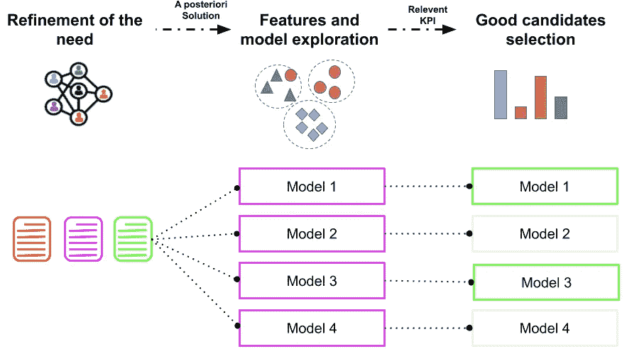
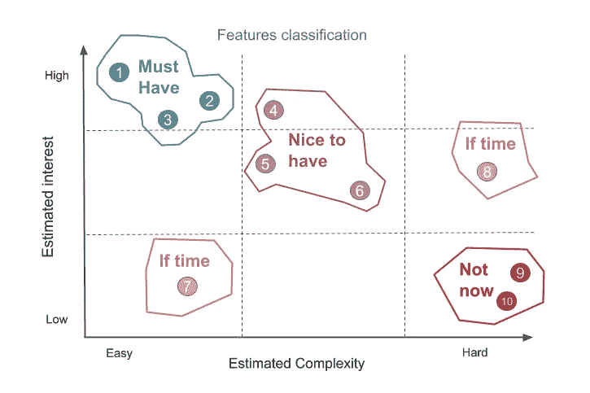
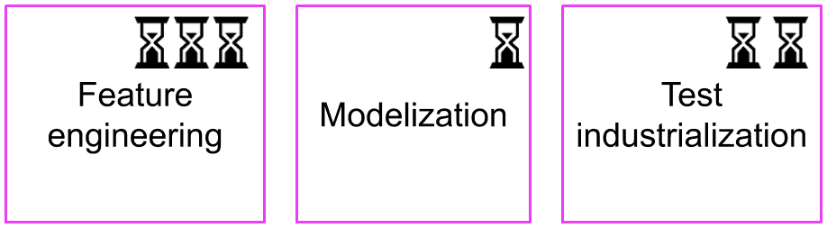
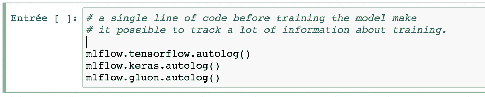
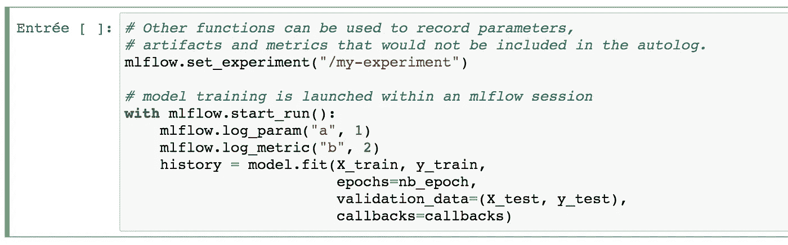
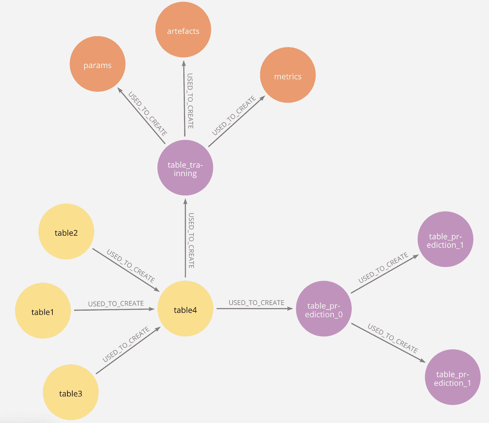
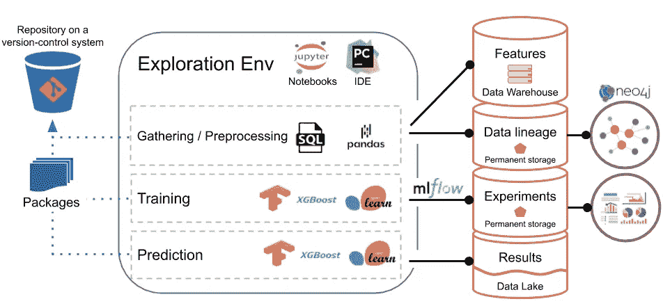

# 数据科学探索:至关重要、充满风险却被忽视？

> 原文：<https://medium.com/analytics-vidhya/exploration-in-data-science-vital-risky-and-yet-neglected-6597c54abda3?source=collection_archive---------19----------------------->

# 为什么我们需要探索？

无论是在推出新产品之前的 PoC 期间，还是在寻求现有产品的改进时，探索都是数据科学项目中必不可少的一步。特别是，它应该有助于发现投入时间和金钱来解决一个新问题是否合理。它还旨在对要完成的工作进行优先排序，以实现有价值的产品。

# **为什么有风险？**

在勘探阶段之后，人们应该有足够的洞察力来决定是否投资该项目，并对风险有所了解。但是为了获得这些洞见，有时需要经历耗时的、甚至可能是无限的任务(总有一些东西需要探索或测试)。然而，探索时间越长，交付就越推迟，其他产品推出的机会就越少。

因此似乎有必要建立一个探索战略。

如何着手呢？

# **让我们从一个例子开始**

在入门之前，先来为你考虑一下**眼镜吧！**，一家虚构的公司，通过其网站和手机 app 销售太阳镜。

在 **Glasses for you** 刚开始的时候，业务团队想知道在营销活动中首先瞄准哪些客户。该要求的原始措辞大致如下:

> “我们希望数据团队开发一个模型，可以预测每个客户转化的可能性。”

负责该项目的数据团队是自愿的，是机器学习、深度学习和统计方面的专家。然而，这是一次失败，勘探阶段很长，结果不足以验证概念验证，项目被放弃，公司浪费了时间和金钱。

使用这个虚构的例子，我将提出一些想法，使探索数据科学解决方案变得更容易，同时降低灾难风险。我将谈到的许多工具都是从博客帖子和文章(见下面的参考资料)以及我自己作为数据科学家顾问的经历中得到启发的。

# 寻找合适的东西

需求的措辞至关重要。在某些情况下(比如给你的**眼镜**)，它的表述方式已经暗示了要探索的解决方案。然后，数据科学家冒着将自己锁定在验证所提出的解决方案上的风险，而不是找到真正问题的解决方案。

在其他情况下，需求表达得过于模糊，以至于数据团队最终构建的解决方案不能回答业务的真正问题。

为了避免这种情况， **Glasses for you** now 在一个新用例的精化阶段很早就建立了精化车间。这些研讨会的明确目标是定义**是什么**而不是**如何。**一些数据团队成员(例如首席技术人员)参加会议，以帮助制定最终对开发人员和工程师有意义的需求。

对于前面介绍的用例，需求重新表述如下:

> “将网站访问者划分到广告活动的优先类别中，以适应所实施的手段，使他们转变”

然后，数据团队提出了一个无监督的模型，允许建立具有不同特征的群体。对不同的模型进行评估，看它们是否有能力创建转化率差异很大的群体。最后，在细化需求之后，学习任务被证明是更容易完成的，并且定义了一个相关的 KPI 来评估性能。

从需求制定到模型选择的探索流程图

为确保产品激活，将进行 A/B 测试，以确定在广告活动中哪个群体最适合作为优先目标。

# 有没有好的搜索方式？

虽然 **Glasses for you** 的数据科学家都很优秀，但他们直接去了复杂的深度学习型解决方案和异构数据转换。因此，他们面临着一系列新问题。另外，同型号同参数的几次训练同时展开，浪费了团队的时间。

最后，很多时间都花在了零值上。

## 对要素进行分类以提高效率

为了提高对数据科学解决方案的探索，团队决定花时间对要素进行分类。第一次研讨会由数据科学家和数据工程师以及一些业务专家参加，列出了所有可以想象的有用功能。最后，参与者估计了每个功能的预期兴趣和构建它所需的努力。最后，团队有四组按优先级排序的特性，只有最重要的特性在探索期间被构建和测试。

## 时间盒探索

此外，该小组为勘探的每一步确定了最大工作时间。这个**时间盒**在整个探索过程中提供了良好的可视性，并鼓励工程师们直奔主题。

## 跟踪实验

为了不丢失模型训练课程的任何痕迹，一个简单而有效的解决方案是系统地记录关于实验的信息:

*   参数:模型类型、模型参数、数据分割的种子、日期、训练数据表的名称等。
*   培训指标:损失、评估指标、调试学习指标等。
*   人工制品:模型二进制文件本身、数据缩放器等。

选择 mlFlow 来进行实验的跟踪。python API 使您能够创建一个存储大量信息的文件夹。一些模块允许进行自动记录(例如 tensorflow、keras 或 gluon 模块)，这极大地方便和缩短了跟踪的实施。

训练模型之前的一行代码，使得跟踪大量关于训练的信息成为可能。

但是也可以使用其他功能来记录自动日志中不包含的参数、工件和度量。要做到这一点，你只需要建立一种体验，并在其中开始模型训练。

无论是在测试过程中手动启动还是通过工作流管理平台(如 AirFlow)自动启动，这都是一个方便的跟踪实验的解决方案。

# 让探索变得有用，不管探索的结果如何

## 中央特征存储器

特征工程部分很耗时，但通常可以从一个项目重用到另一个项目。这就是为什么在 **Glasses for you** 中，创建的功能现在被集中在云中一个独特的数据仓库中。

## 数据谱系

除了存储开发的所有功能外，还执行数据沿袭以跟踪原始数据、其转换和其目的地。这种血统只包括储蓄。每个数据转换步骤包含一行的 csv 文件。

然后，这些文件被转换为面向 graph neo4j 的数据库，以便人们可以使用高效的查询和可视化工具来展示项目中使用的数据信息。下面是一个简化的例子。

## 打包代码

最后，数据转换通常需要在其他项目中有用的函数。这就是为什么从探索阶段开始，在【T2 眼镜】为你制作的中，代码被编写成脚本，以便最终可以打包。如果已经创建或丰富了包，它们会在创新冲刺期间被审查并存储在私有回购中。

## 减去

以下是**眼镜为您实施的**降低探险固有风险的做法:

*   **在没有解决方案先验知识的情况下，与数据团队阐明需求**
*   建立**相关 KPI**以决定产品激活
*   **时间拳**探索任务
*   **优先考虑**要开发的功能
*   **跟踪**实验
*   利用通过创建**功能中心**开发的功能
*   **包装**可重复使用功能

# 参考

[https://engineering . shopify . com/blogs/engineering/solving-data-discovery-challenges-shopify](https://engineering.shopify.com/blogs/engineering/solving-data-discovery-challenges-shopify)

[https://cloud . Google . com/solutions/machine-learning/mlops-continuous-delivery-and-automation-pipeline-in-machine-learning](https://cloud.google.com/solutions/machine-learning/mlops-continuous-delivery-and-automation-pipelines-in-machine-learning)

[https://eugeneyan . com/writing/what-I-love-about-scrum-for-data-science/](https://eugeneyan.com/writing/what-i-love-about-scrum-for-data-science/)