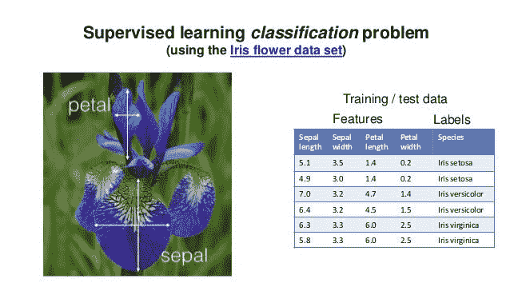

# 使用 scikit 学习探索虹膜数据集第 1 部分

> 原文：<https://medium.com/analytics-vidhya/exploration-of-iris-dataset-using-scikit-learn-part-1-8ac5604937f8?source=collection_archive---------1----------------------->

加载和探索 Iris 数据集的分步教程！

## 你将会学到什么:

1.  如何从 scikit 学习模块加载内置数据集？
2.  如何获取特征和目标数据？
3.  探索数据集洞察力的一些基本有用函数