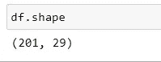
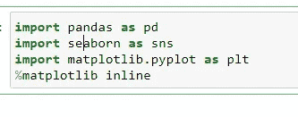
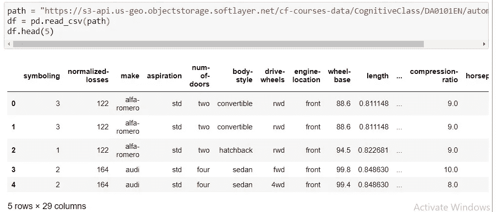
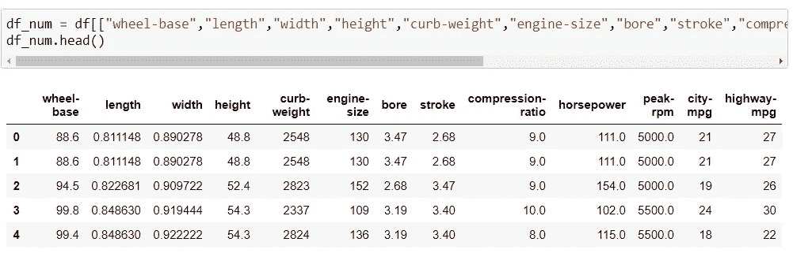
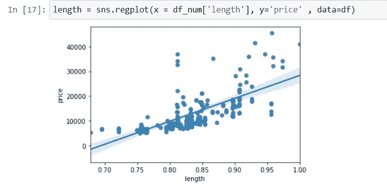
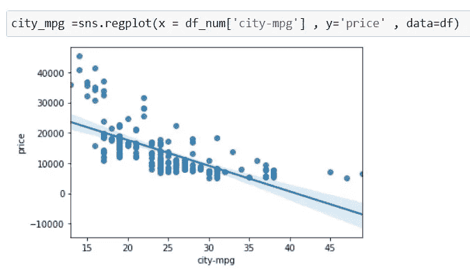
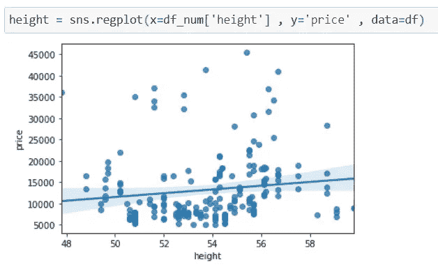
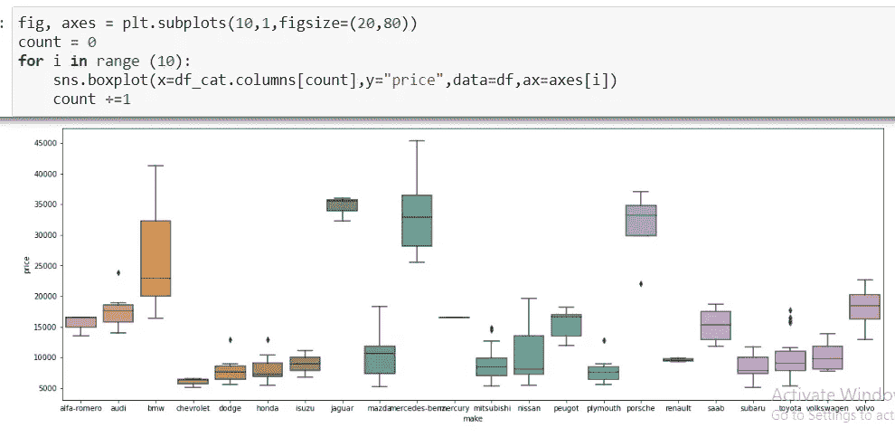
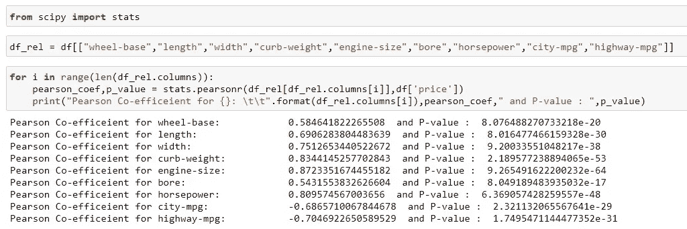
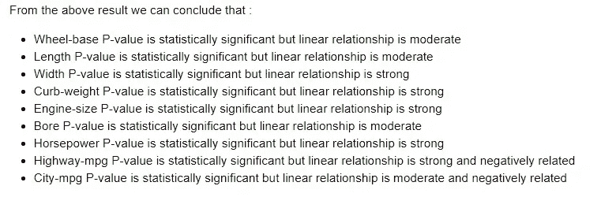

# 探索性分析

> 原文：<https://medium.com/analytics-vidhya/exploratory-analysis-d3b00fafc314?source=collection_archive---------16----------------------->

## 线性回归和相关

这些数据包括车辆的多种特征，从长度到马力到车身风格等等。它由分类特征和数字特征组成。数据的使用有两种方式

1.  分析
2.  预言；预测；预告

在分析中，我们可以借助统计数据从数据集中找到相关的见解，但是在预测中，我们可以将价格列用作 Y，将另一列用作 X['影响价格的因素']，以根据其特征生成价格预测

线性回归是分析数据最常用的方法之一，它涉及最佳拟合线即 ***y=mx+b*** 讲述因变量和自变量之间的关系。

线性回归模型用于定性数据(数值)

大多数机器学习算法基于线性回归模型，用于预测数据

在这里，我将分享我在汽车数据集上的一段代码。

文件的格式是 csv(逗号分隔文件)

该文件由(201，29)组成，即 201 行和 29 列

这个 ipynb 文件中使用的库是**熊猫**、 **Matplotlib** 和 **Seaborn**

1.  使用熊猫在 Jupyter 笔记本上导入数据

该文件有 29 列，其中一些是数字，另一些是分类。

2.分离分类和数字列

13 列实际上是数字

3.使用 seaborn 库，散点图的所有定性数据。这有助于我们快速了解汽车价格的趋势和影响因素

相关性说明了因变量和自变量之间的关系，线性回归是相关散点图上估计因变量和自变量的最佳拟合线

主要有三种**类型的关联**

*   **正相关**显示两个变量之间的强相关关系

价格随着长度的增加而增加

*   **负相关**显示两个变量之间的弱关系

价格随着城市英里数的减少而降低

*   **无相关性**表示变量之间无关系

价格不会随着高度的增加而增加

这些值的范围从-1 到+1。从+1(显示强正相关)到-1(显示强负相关)的值。然而，接近或接近 0 的值表示没有关系

4.对于分类栏，我使用了箱线图，并得出结论，驱动轮和发动机位置是价格的良好预测

对于所有的数字列，我使用了皮尔逊相关技术

皮尔逊相关性衡量两个变量之间线性关系的强度和方向。皮尔逊相关检验也称为参数相关检验，因为它依赖于数据的分布。

要解释基于上述计算的结果:

像这样，你还可以做出更有创造性的见解，比如绘制热图，根据数据的计数、标准差等来描述数据。

去吧，在上面做点创意:)

 [## amnanazim 97/汽车 _ 分析 _ 练习

### 在 GitHub 上创建一个帐户，为 amnanazim 97/Automobile _ Analysis _ practice 开发做贡献。

github.com](https://github.com/AmnaNazim97/Automobile_Analysis_Practise)