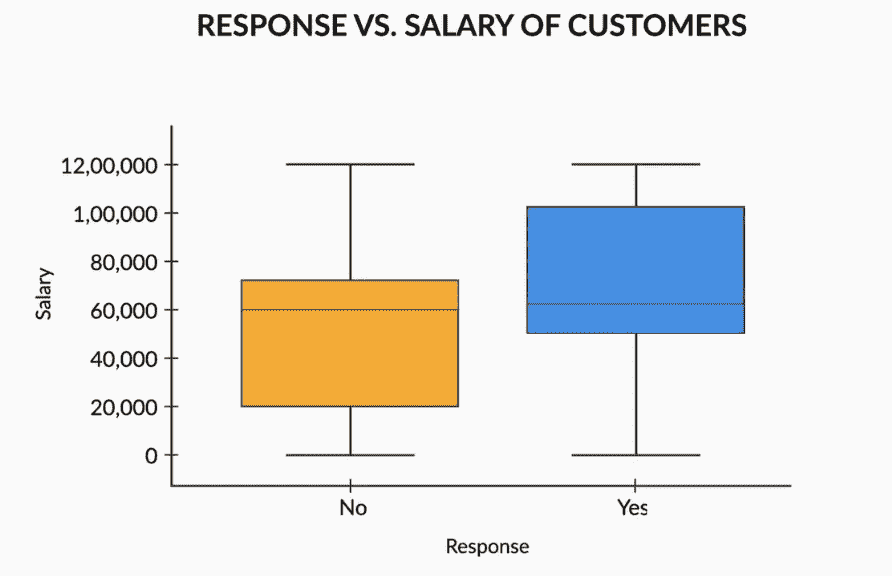

# 探索性数据分析

> 原文：<https://medium.com/analytics-vidhya/exploratory-data-analysis-461f62beb381?source=collection_archive---------28----------------------->

*欢迎来到 EDA*

> *“对正确的问题给出一个大致的答案，这往往是模糊的，远胜于对错误的问题给出一个确切的答案，这总是可以变得精确的。”*
> 
> *―* ***约翰·图基***

*快速傅立叶变换(FFT)算法和盒图是被誉为 EDA 之父的约翰·图基的两部杰出作品。*

*在这篇博客中，我将讨论探索性数据分析的各个步骤及其与行业的相关性。*

*我将向您展示如何以最少的努力从数据中获取最大的洞察力，以及如何从中做出有用的商业决策。*

*在任何类型的数据分析中，EDA 都是一个有力的步骤，它都是关于揭示数据中有趣的模式，包括以下步骤:*

*   *数据源*
*   *数据清洗*
*   *单变量分析*
*   *双变量和多变量分析*

在这个阶段，你可能会怀疑我们为什么需要 EDA？

为了回答这个问题，EDA 有助于处理机器学习算法。在你进入机器学习或数据建模之前，你的首要任务应该是完成这些小步骤，这些步骤将使你的数据更有洞察力，并与做出任何重要决策相关。

*在任何数据科学活动中，EDA 都是关键的一步，从 EDA 中得出的结论可以完全指导我们稍后进行的 ML/非 ML 活动。*

***加分*** *:我们可以通过绘制检测异常值和异常值的箱线图来区分主要的数据块。*

**箱线图清楚地表明，更多的积极回答来自于高收入人群，因为 50%回答“是”的数据位于高收入区域。尽管事实上积极和消极反应的人有几乎相同的中间值。**

在接下来的几天里，我会添加一系列与 EDA 中的每个步骤相关的帖子，然后解释它将如何帮助您的数据建模，包括机器学习算法，保持联系，以便我们可以从数据中获得乐趣。

*支持我的 work❤️*

*继续编码！*

马尼什·库马尔

*数据科学爱好者*