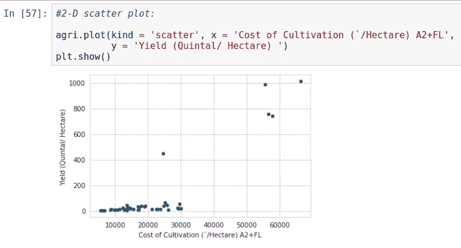

# 探索性数据分析

> 原文：<https://medium.com/analytics-vidhya/exploratory-data-analysis-b90b4c5f1b6a?source=collection_archive---------17----------------------->

探索性数据分析是指在建模之前，通过绘图工具、线性代数、统计学和一些大型库对数据进行探索，以了解数据实际上是什么。

我用的是印度农业的数据。印度的农业由多种作物组成，其中水稻和小麦占绝大部分。印度农民种植豆类、土豆、甘蔗、油籽，以及棉花、茶叶、咖啡、橡胶和黄麻等非食品。尽管印度有很大一部分人口从事农业，但其每公顷产量普遍低于国际标准。水资源管理不当、该部门缺乏现代技术的应用、气候变化的影响以及这背后的许多原因。此外，由于在这一领域缺乏创新，传统的农业方法通常没有更新。

所以在这里，我正在探索一个由[https://www . ka ggle . com/srinivas 1/agriculture-crops-production-in-India](https://www.kaggle.com/srinivas1/agricuture-crops-production-in-india)提供的印度农业数据集。

数据集共有 6 个要素(要素/变量/输入变量/因变量/基本上是一列)，分别命名为'**作物**'、**州**'、**种植成本(`/公顷)A2+f1**'、**种植成本(`/公顷)**'、**生产成本(`/公担)**'、**产量(公担/公顷)**。所有这些数据都被印度用来计算最低支持价格。

根据维基百科, **MSP** 是印度政府制定的直接从农民手中购买的农产品价格。如果市场价格低于发生的成本，这一比率是为了保护农民在收获时的最低利润。

在某些作物播种季节开始时，印度政府根据农业成本和价格委员会(CACP) 的建议，宣布了最低支持价格。最低支持价格是印度政府确定的价格，以保护生产者——农民在丰收年份价格不会过度下跌。最低支持价格是政府对其产品的保证价格。主要目标是帮助农民摆脱亏本销售，并采购粮食用于公共分配。如果由于产量大增和市场供过于求，商品的市场价格低于公布的最低价格，政府机构将以公布的最低价格收购农民提供的全部数量。

为了开始我们对数据的探索，我导入了 **Pandas** 、 **Numpy** 、 **Seaborn** 和 **Matplotlib** 。(去这个链接看看怎么做:[https://github . com/dzorlu/GADS/wiki/Guide-to-installing-machine-learning-libraries-in-python](https://github.com/dzorlu/GADS/wiki/Guide-to-installing-machine-learning-libraries-in-python))。在这里，我通过 read_csv()方法创建 pandas 对象来探索我们的 CSV 数据文件。

现在，我正在对现有数据使用 Matplotlib 对象来尝试 2D 散点图。它绘制了一个简单的 2D 图，显示“种植成本(`/公顷)A2+FL”与“产量(五分之一/公顷)”的关系。在印度,“种植成本(`/公顷)A2+f1”对计算 MSP 的贡献更大，所以我很想知道 A2+f1 成本与产量之间的关系。

为了获得更精确的信息，我们可以使用 Seaborn。

但是如果更多的特性参与到产出中呢？！所以在这里**对阴谋**来拯救我！这里，我们有可能影响最终产量的 4 个主要特征。我们可以有总共 4C2 个可能的图，因为我们有 4 个特征，每个图取 2 个特征。

这里的输出如下图所示。

在垂直方向上，我们从下到上显示“种植成本(`/公顷)A2+f1”、“种植成本(`/公顷)C2”、“生产成本(`/昆塔尔)C2”、“产量(昆塔尔/公顷)”等特征。在水平方向上，我们从左到右分别显示“种植成本(`/公顷)A2+f1”、“种植成本(`/公顷)C2”、“生产成本(`/昆塔尔)C2”、“产量(昆塔尔/公顷)”等特征。

让我把它一片片地呈现给你。这是左上角的图表，显示的是“耕作成本(`/公顷)A2+f1”对“耕作成本(`/公顷)A2+f1”。它代表“种植成本(`/公顷)A2+f1”的概率密度函数或平滑直方图。

在整个图表的左侧，是不同作物的颜色表示。

下面是从左上角向右数的第二个图形。即“耕作成本(`/公顷)C2”对“耕作成本(`/公顷)A2+f1”。

下面一个是从左上角向右数第三个图形。它代表“生产成本(`/昆塔尔)C2”与“种植成本(`/公顷)A2+FL”。

从顶行开始的最后一行是代表“产量(五分之一/公顷)”对“栽培成本(`/公顷)A2+f1”的图表。

所以从整个图表的所有这些片段中，我们可以得出一些结论，比如:

对于除甘蔗以外的几乎所有作物，

1.  种植成本(`/公顷)A2+f1 '从 5k 到 30k 不等。
2.  生产成本(`/五分之一 C2 '从 0k 到 4k 不等。
3.  种植成本(每公顷 C2)从 0k 到 50k 不等。
4.  产量(公担/公顷)从 0 克到 100 克不等。

对于甘蔗来说，

1.  种植成本(`/公顷)A2+f1 '超过 50k。
2.  生产成本(`/昆塔尔 C2 '几乎是零。
3.  种植成本(每公顷 C2)超过 8 万英镑。
4.  产量(公担/公顷)从大约 250 克到大约 1250 克不等。

现在，在 **1D 标绘**中，我们只标绘了一个特征，但是这个标绘并没有给出关于特征扩散的信息。

1D 图更好的可视化是一个平滑的直方图，避免了点的重叠，即甘蔗的种植成本分布在 50k 到 70k 之间。给定培养成本 A2 FL 10k 到 20k，我发现差不多 0.0001 点。在这里，图表仅将甘蔗与其他作物分开，对于其他作物，我们需要一些更先进的技术。

平滑直方图是 **PDF 的表示:概率密度函数。**PDF 上的每个点代表数据中特定值的计数。

现在， **CDF:累积分布函数。**是 PDF 的累积和。CDF 曲线上的每一点都代表了 PDF 在该点之前的积分。下面是收益率的直方图。CDF 上的每个点代表该点以下的点占总点数的百分比。

Numpy 提供了一些数据的统计观点，如**平均值**、**标准偏差**、**中位数绝对偏差**、**分位数**和**第 90 个百分位数**。

其输出如下所示。

**等值线图**是 **2D 概率密度图**。这张图显示了很多 C2(种植)成本在 20k 左右而 A2FL 成本低于 20k 的地方。我们可以看到，c2 成本的密度和少量点约为 80k 到 1L，a2fl 约为 50k 到 60k，代表甘蔗。 **Seaborn** 为等高线提供了 jointplot()方法。名称是“jointplot ”,因为它代表边缘上的**轮廓和 pdf**。

