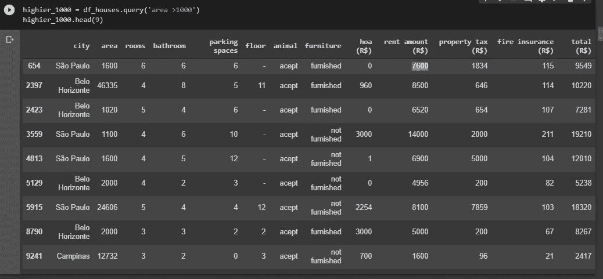
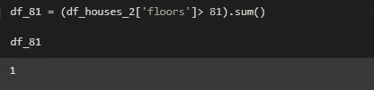

# 探索性数据分析(EDA):巴西房屋出租

> 原文：<https://medium.com/analytics-vidhya/exploratory-data-analysis-eda-brazilian-houses-to-rent-587d78fd1ec9?source=collection_archive---------4----------------------->

## 数据集: [Kaggle](https://www.kaggle.com/rubenssjr/brasilian-houses-to-rent)

在这篇文章中，我将探索巴西房屋出租数据集，以回答一些假设:

## 假设

*   一些城市的房价更高；
*   动物对价格的影响；
*   公寓费用较高的房屋，租金价值较高；
*   带家具的房屋租金价值较高；
*   停车位数量对租金价值的影响。

本分析中使用的数据集来自 [Kaggle](https://www.kaggle.com)

Kaggle 是谷歌的子公司，其功能是为数据科学家和开发人员提供一个社区。那些对机器学习或其他类型的现代开发感兴趣的人可以加入这个社区。

在那里，你可以参加机器学习竞赛，你可以用你的代码写笔记本。总之，你可以创建一个在线文件夹，因为许多公司希望看到你在 Kaggle 上的个人资料。

对于这个分析，我将使用 [Google collaboratory](http://colab.research.google.com) 也称为 Colab，这是一个基于 Google 云的服务，在云中复制 Jupyter Notebook。你不需要在你的系统上安装任何东西来使用它。您可以像在桌面上安装 Jupyter 笔记本一样使用协作室。

## 了解数据集

该数据集包含 10692 个具有 13 种不同功能的租赁物业

城市:房产所在的城市

面积:物业面积

房间:房间数量

浴室:浴室数量

停车位:停车位数量

地板:地板

动物:接受动物？

家具:家具？

hoa (R$):业主协会税

租金金额(R$)排序:租金金额

财产税:市政财产税

火险(雷亚尔):火险价值

total (R$):所有值的总和

# 数据清理:

首先，我将导入我将在这个分析中使用的所有库。基本上，我将使用 Pandas 将数据作为数据框打开，并使用其方法和 Matplotilib 来创建一些图形和%matplotilib 与此后端内联，绘图命令的输出在前端内联显示，如 Jupyter notebook，直接位于生成它的代码单元下方。生成的图也将存储在笔记本文档中。在某些时候，将需要使用一些数学函数，所以我也要导入 Numpy。

现在，我将使用 read_csv()方法打开数据集，该数据集将被命名为 df_houses。

打开数据后，我可以用 head()方法看到前五行。这个方法可以很好地查看行和列是否正常

现在，我将使用方法`info()`查看数据的一些信息。该方法显示了数据点的数量，在本例中为 10692，从 0 到 10691，从 0 到 12 共有 13 列，每列的类型有些是 type object，表示“单词”,有些是 int64，表示“数字”,最后，我们可以看到每列都有 10692 个非空值，这意味着数据中没有缺失值。

现在我已经了解了数据的基本知识，我们需要更深入地了解数据。这并不是因为我们没有丢失的值，我们没有错误的数据值，任何错误的值都可能影响我们的分析。

**在这篇文章中，我将简单介绍一下。更深入的分析可以在我的** [**Github**](https://github.com/bezerraluis/Exploratory-Data-Analysis-Medium-) 中看到

unique()方法显示系列中的每个值。这有助于发现任何差异值。我们正在处理该区域，因此考虑到我们在数据库中有房子和公寓，我们希望值为 10，我们不能有负值，并且值低于 10 是不常见的。

我们可以看到，有些价值超过 20.000 平方米，这些价值引起了我们的注意。

让我们使用 boxplot()来查看面积的分布，我们可以看到这些高于 10.000 的值正在扭曲我们的数据。

我们可以使用描述()的方法来查看关于该区域的一些基本统计数据。首先，我们可以注意到我们的标准差非常高，这表明我们的数据太分散了，因为最大值是 46.335，最小值是 11。我们的大部分数据在 56 和 182 分位数之间。

让我们一起看看其他列，以便比较面积值是否有意义。为此，我们可以使用方法 query()并过滤> 1000 的值

这样，当面积大于 1000 时，我们可以与其他数据进行比较，例如:

我们来看看圣保罗一线面积 1600，租金金额 7600。圣保罗是首都，所以价格很高，这种规模的房子肯定是豪宅，在我看来，这个地区是错误的。这是一个比较数据是否正确的好方法，使用所有的数据和你自己的知识。

让我们看看有多少数据点高于区域 1000。为此，我们将使用方法 shape()。

我们可以看到只有 9 个数据点，因此我们将选择删除它们

有很多方法可以消除这些值，我们要告诉大家我们的 df_house 等于我们的 query()。但是，我们将在数据集上包含值 1000。

首先，我们有 10692 个值，现在我们有 10683 个值，相差 9 个值

现在我们去掉 1000 以上的值，我们可以看到更好的分布

让我们再看一个特性。特征楼层有两个值引起了我的注意，这个符号'-'和值 301。

首先是符号'-'我在关于数据库的讨论中读到，这应该是房屋，因为它们不像公寓那样有楼层，好的，我们将在分析中把它改为 0。

最后，值 301 是一个异常值，因为我做了一些搜索，我发现巴西最高的住宅建筑位于圣卡塔林纳的 balneáRio camború，有 81 层( [font](https://economia.ig.com.br/empresas/2019-10-16/maior-predio-da-america-latina-construido-no-brasil-tera-neymar-na-cobertura.html) )。

我们需要更改 column floor 的名称，因为它是 python 中的保留字。

我们将把楼层改为楼层

我们将把符号'-'替换为 0，因为根据数据集的作者，这些值是房屋。

我们已经没有符号'-'了。

此特征是一种对象类型。但是，我们处理的是整数，所以我们需要转换成整数类型，为此我们将使用方法 astype()

让我们检查一下

我们可以看到最大值是 301，最小值是 1。我们可能有一个问题，我们的大多数值分布在 1 到 8 之间。

值 301 扭曲了我们的数据

正如我之前所说，巴西最高的建筑有 81 层，所以这将是我们的最高值。看看我们有多少 81 以上的值。

我们只有 1 个高于 81 的值，然后我们将删除它。为此，我们将使用命令查询来选择低于 81 的值。

现在我们的分布更好，我们的大部分值都在 0 到 20 之间。然而，我将保留上面的那些值，因为它们可以向我们展示一些重要的见解。

# 探索性数据分析

## 现在我们可以试着证实这些假设

1.  一些城市的房价更高；

2.动物对价格的影响；

3.公寓费用较高的房屋，租金价值较高；

4.带家具的房屋租金价值较高；

5.停车位数量对租金价值的影响。

**刚刚才想起完整的探索性数据分析是在我的** [**Github**](https://github.com/bezerraluis/Exploratory-Data-Analysis-Medium-) 上

## 1.一些城市的房价更高

是的，有些城市价格更高，圣保罗、里约热内卢和贝洛奥里藏特

## 2.让动物影响价格

是的，接受动物的酒店要贵 500 雷亚尔。

按城市分析，我们可以注意到，并不是所有的城市都像里约热内卢和阿雷格里港一样对动物主人有更高的价格。

## 3.公寓费用高的房子租金也高

第一个分析比较了城市的共管公寓费用。我们可以看到里约热内卢的费用最高，其次是圣保罗

现在，我们可以看到各个城市的租金，并与公寓费用进行比较，圣保罗的租金最高，其次是贝洛奥里藏特。

不，公寓费用较高的房子并没有更高的租金价值，因为里约热内卢的费用最高，圣保罗的租金最高。

## 4.带家具的房子租金较高

是的，带家具的房子租金更高，平均要贵 1200 雷亚尔。

## 5.停车位数量对租金价值的影响。

我们可以注意到，从 0 到 8，停车位的数量对价格的影响越大，停车位越多的物业越贵，只有当我们有 10 个停车位时，我们没有这种模式。

我们可以在这张图上看到这个图案

是的，停车位的数量影响租金价值。

# 考虑

现在，我希望你已经设法理解了探索性数据分析是如何完成的，并从现在开始设法做出自己的分析。你可以在我的 [GitHub](https://github.com/bezerraluis/Exploratory-Data-Analysis-Medium-) 上看到完整的分析，其他任何澄清都可以留言。