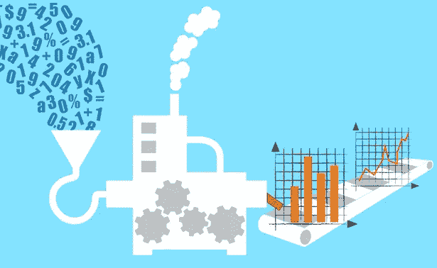
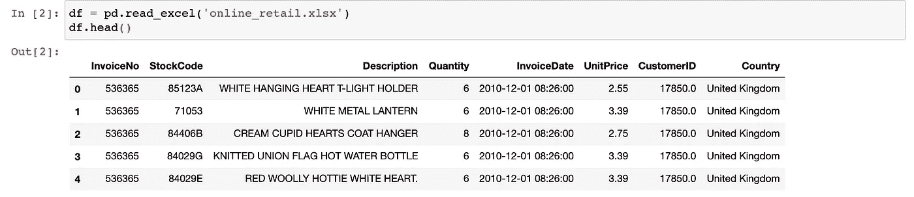
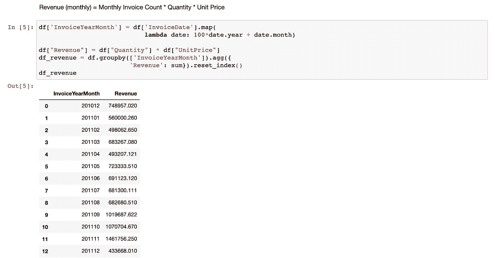
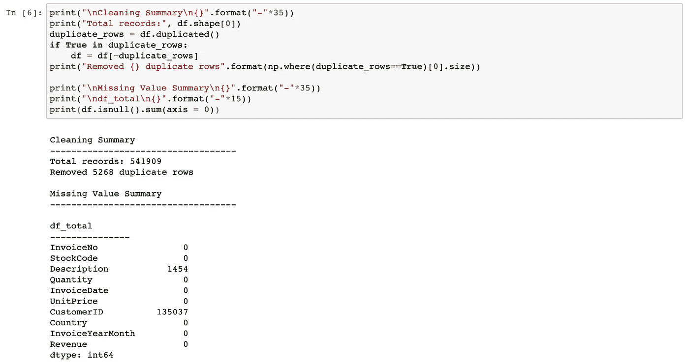
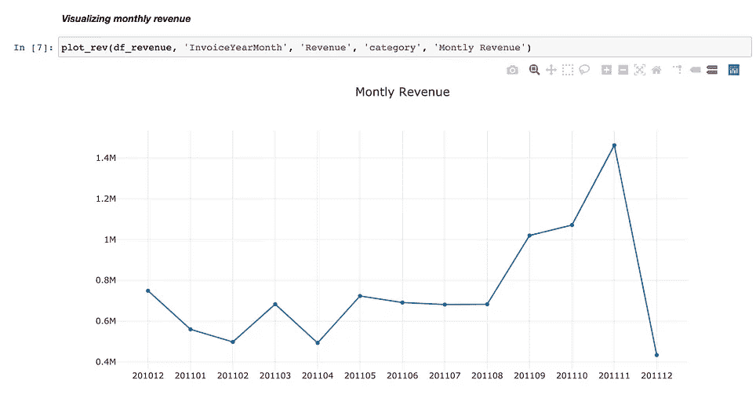
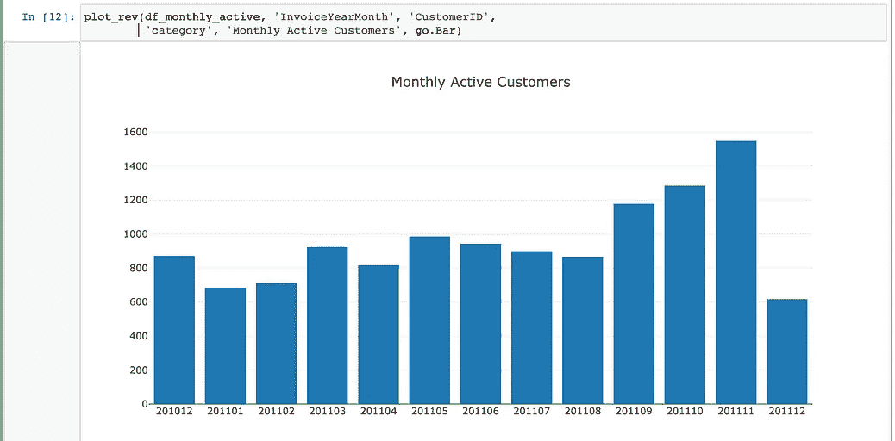

# 探索性数据分析:数据科学项目

> 原文：<https://medium.com/analytics-vidhya/exploratory-data-analysis-eda-data-science-project-829f00c5716f?source=collection_archive---------5----------------------->

EDA 的目标是利用可视化工具、汇总表和假设检验来:

1.  提供对数据集的汇总级洞察。
2.  揭示数据中的潜在模式和结构。
3.  识别异常值、缺失数据、类别平衡和其他与数据相关的问题。
4.  将可用数据与业务机会联系起来。

让我们来看一个案例研究，它来自于[在线零售数据集](https://archive.ics.uci.edu/ml/datasets/online+retail)，并且可以通过 [UCI 机器学习库](https://archive.ics.uci.edu/ml/index.html)获得。这是一个跨国数据集，包含 2010 年 1 月 12 日和 2011 年 9 月 12 日之间发生的英国注册无店铺在线零售的所有交易。该公司主要销售独特的适合各种场合的礼品。这家公司的许多客户都是批发商。

这里的业务场景是，管理团队希望在预测模型上花费更少的时间，并在预测收入方面获得更高的准确性。预计良好的预测数字将有助于稳定员工和预算预测，这将在整个公司产生有益的连锁反应。

业务指标可以定义为通过更准确的预测获得的收入的函数。

# EDA 流程的步骤:

1.  将数据加载到 pandas、NumPy 或其他类似的工具中，然后**汇总数据**

将数据加载到 pandas

2.使用表格、文本和可视化工具**讲述将商机与数据联系起来的故事**

月收入计算

这里，数据被用来计算在线零售店的月收入。由于本案例研究的目标之一是预测收入，因此使用这样的公式来量化收入是很重要的，这些公式随后可以用于监督学习或假设检验。

3.确定策略**处理缺失值:**

在探索性数据分析(EDA)过程中，有时会发现数据完整性问题。提取数据后，即使是在项目工作流程的第一次通过时，也要进行质量保证检查，这一点很重要。质量保证步骤必须对重复和缺失值进行检查。缺失值通常根据缺失的类别进行处理，即 MCAR(完全随机缺失)、MAR(随机缺失)和 MNAR(非随机缺失)。如果缺失数据不是 MCAR，那么输入值会导致偏差增加，因此训练/测试分割非常重要。

数据清理摘要

4.**通过可视化和假设测试调查**数据和底层业务场景

Jupyter notebook 主要用于研究可视化数据。然而，作为一名数据科学家，最佳实践通常要求将最大数量的代码保存为文本文件，或者保存在[简单脚本](https://docs.python.org/3/using/cmdline.html)、[模块](https://docs.python.org/3/tutorial/modules.html)或 [Python 包](https://www.pythoncentral.io/how-to-create-a-python-package)中。这确保了可重用性，允许单元测试并自然地与版本控制一起工作。

例如，plot_rev()函数是从 python 脚本 [data_visualization.py](https://github.com/biharicoder/medium_blogs/blob/master/notebooks/part2_EDA/data_visualization.py) 中调用的，而不是在 Jupyter 笔记本中编写用于重复绘图的脚本。

带有 plot_rev()函数的 EDA 图表

Jupyter notebook 应该作为一个具有最少代码的可展示组件。它可以作为数据科学家的 powerpoint 来展示您对数据的初步发现。

5.**传达你的发现**

没有单一的正确的方式来交流 EDA，但最低限度的酒吧是，数据总结，关键发现，调查过程，结论是明确的。交付物应该简洁明了。

一个重要的可交付成果可能是调查相关数据、目标和业务度量之间关系的结果。例如，步骤 2 中计算的收入可以是与业务指标直接相关的目标变量，监督学习和/或预测模型的提案可以用 EDA 交付成果来证实。

[点击此链接访问 EDA 笔记本](https://github.com/biharicoder/medium_blogs/blob/master/notebooks/part2_EDA/eda.ipynb)

还有什么要补充的吗？把它放在下面的评论里。

感谢阅读！