# 使用机器学习预测酒店预订取消的探索性数据分析(EDA)

> 原文：<https://medium.com/analytics-vidhya/exploratory-data-analysis-eda-for-predicting-hotel-booking-cancellations-using-machine-learning-3990be4af2ff?source=collection_archive---------5----------------------->

预订取消对酒店行业的需求管理决策有重大影响。

每年，超过 1 . 4 亿的预订是通过互联网完成的，许多酒店预订是通过热门旅游网站完成的，如 Booking.com、Expedia.com、Hotels.com 等。

# 酒店预订取消，一个日益严重的问题…

在分析过去 5 年的数据时，D-Edge Hospitality Solutions 发现全球平均预订取消率已达到**近 40%** ，这一趋势对酒店收入和分销管理战略产生了非常负面的影响。

为了克服预订取消带来的问题，酒店实施了**严格的取消政策、库存管理、**和**超额预订策略、**，这也会对收入和声誉产生负面影响。

一旦预订被取消，几乎没有什么可做的，这给许多酒店和酒店技术公司带来了不适。**因此，预测可能被取消的预订并防止这些取消将为酒店和酒店技术公司创造额外收入。**

# **动机**

**你有没有想过，如果有一种方法可以预测哪些客人可能会取消预订，并相应地调整超额预订率，会怎么样？那太好了，对吗？**

幸运的是，通过使用**机器学习**和 **Python** ，我们可以预测哪些客人可能会取消预订，这可以帮助产生更好的**预测**和**减少商业决策中的不确定性**。

在本文中，我将应用**探索性数据分析(EDA)** 从[数据集](https://www.kaggle.com/jessemostipak/hotel-booking-demand)中获得洞察力，通过使用 Matplotlib & Seaborn 执行**数据可视化来了解哪些功能在预测取消方面贡献更大。首先理解数据，并试图从中收集尽可能多的见解，这总是一个好习惯。**

**带有数据可视化的探索性数据分析(EDA)**

为了更好地理解[数据集](https://www.kaggle.com/jessemostipak/hotel-booking-demand)，我们必须提出一系列问题。

1.  **酒店游客(客人)的十大来源国是哪些国家**

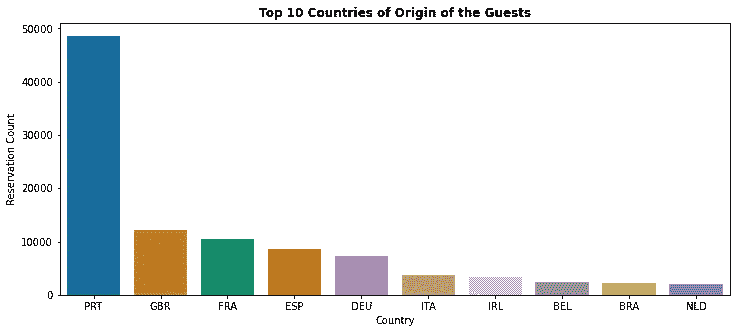

*   大约 40%的预订来自 T2，其次是英国(10%)，法国(8%)。

**2。酒店预订最多的月份是哪个月？**

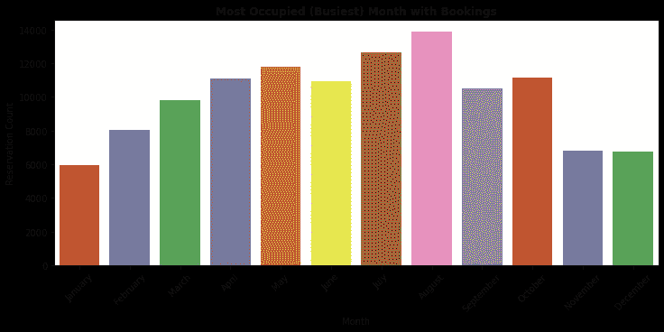

*   根据图表显示，**八月**是最**被占用**(最繁忙)的月份，预订量为**11.62%**；而**一月**是最**未被占用**的月份，预订量为 **4.96%** 。

**3。酒店取消了多少预订？**

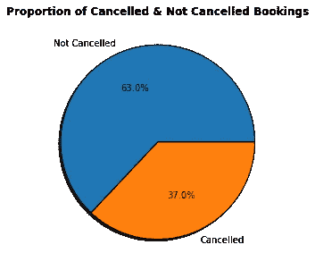

*   根据饼图，酒店 63%的**预订未被取消，37%的**预订被取消。****

******4。按酒店类型划分，哪个月取消预订的数量最多？******

****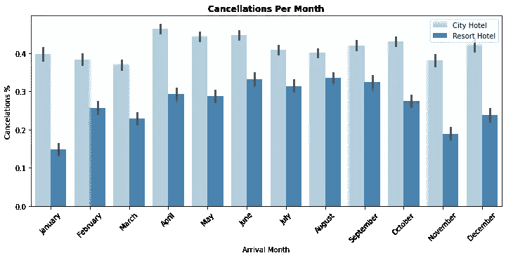****

*   ****对于**城市**酒店，全年每月的取消数量约为 **40 %** 对于**度假村**酒店，取消数量在六月、七月&八月最高，在十一月、十二月&一月最低。****

******5。根据酒店类型，取消了多少预订？******

****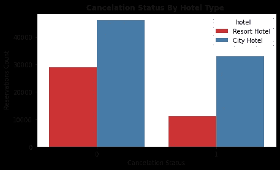****

*   ****度假酒店共取消 **25.14%** 预订，城市酒店共取消 **74.85%** 预订。****

******6。按预订取消状态划分的平均每日房价(ADR)和到达月份之间的关系******

****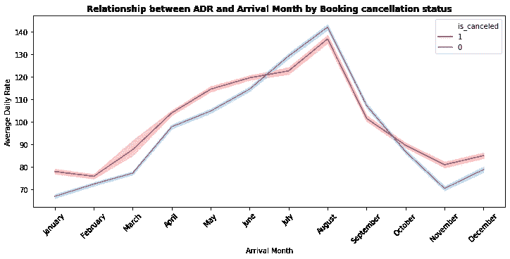****

*   ****最高日平均房价(ADR)发生在**8 月**，由于 8 月的最高 ADR，这可能是 8 月取消更多的原因之一。****

******7。按细分市场划分的预订总数******

****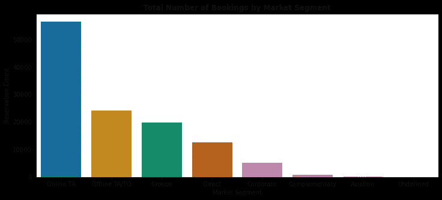****

*   ****大约 47%的预订是通过在线旅行社预订的，几乎 20%的预订是通过线下旅行社预订的，不到 20%的预订是直接预订，没有其他代理。****

******8。按预订取消状态列出的到达日期年份与交付时间******

****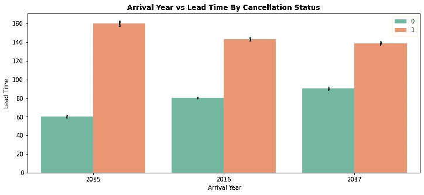****

*   ****在所有的 3 年中，提前期**少于 100 天**的预订被取消的几率较小，提前期超过 100 天的预订被取消的几率较大。****

******9。特殊请求和取消之间的关系******

****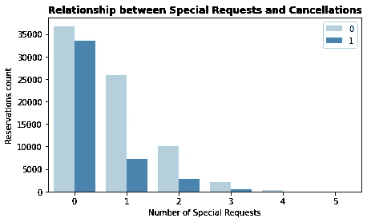****

*   ****大约 **28%** 的预订因**没有**客人的特殊要求而被取消，随后 **6%** 的预订因**一个**客人的特殊要求而被取消。****

****10。酒店类型的 ADR 在一年中有何变化****

****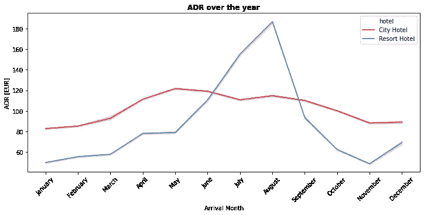****

*   ****对于度假酒店，7 月、8 月和 9 月的平均房价较贵，对于城市酒店，3 月、4 月和 5 月的平均房价略高。****

******11。存款类型对取消有什么影响******

****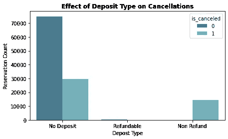****

*   ****大约有 **28%** 的预订被**无押金**的客人取消，其次是 **22%** 的预订被取消**可退款。******
*   ****所以很明显，预订时不付任何押金的客人很可能会取消更多的预订。****

## ****商业摘要****

****根据我们的 EDA，我们观察到数据集中有助于预测客人取消预订的前 5 个最重要的特征是:****

1.  ****研制周期****
2.  ****纠纷调解****
3.  ****存款类型****
4.  ****每月的到达日****
5.  ****特殊请求的总数****

## ****应对酒店高取消率的策略****

*   ****设置不可退款的价格，收取押金，并执行更严格的取消政策。****
*   ****使用提前期窗口可变的高级采购率****
*   ****通过提供特别折扣鼓励直接预订****
*   ****酒店应考虑客人特殊要求的总数，通过改善客户服务来降低取消的可能性。****
*   ****监控取消来自哪里，如细分市场、分销渠道等。****

****一如既往，我欢迎反馈和建设性的批评。用于数据可视化的 Python 代码可在 [GitHub](https://github.com/ChaithanyaVamshi/HotelCancellationPredictor/blob/master/EDA.ipynb) 上找到，我也可以在 [LinkedIn](https://www.linkedin.com/in/chaithanyavamshi/) 上找到。****

## ****参考****

1.  ****[https://www . pegs . com/blog/how-hotels-can-count-high-OTA-cancel-rates/](https://www.pegs.com/blog/how-hotels-can-counter-high-ota-cancellation-rates/)****
2.  ****[https://www . d-edge . com/how-online-hotel-distribution-is-changing-in-Europe/](https://www.d-edge.com/how-online-hotel-distribution-is-changing-in-europe/)****
3.  ****[https://www.kaggle.com/jessemostipak/hotel-booking-demand](https://www.kaggle.com/jessemostipak/hotel-booking-demand)****