# Python 中的探索性数据分析(EDA)

> 原文：<https://medium.com/analytics-vidhya/exploratory-data-analysis-eda-in-python-cf757afa2d2d?source=collection_archive---------7----------------------->

# **简介:**

由[卢克·切瑟](https://unsplash.com/@lukechesser?utm_source=medium&utm_medium=referral)在 [Unsplash](https://unsplash.com?utm_source=medium&utm_medium=referral) 上拍摄的照片

探索性数据分析是当今数据科学中使用的最佳实践之一。基本上，这是统计学家讲故事的一种方式。我们可以说 EDA 是“对数据的第一眼”。探索性数据分析(EDA)是通过总结数据集的主要特征来理解数据集，通常是直观地绘制出来。探索性数据分析的主要目标是获得对数据的信心，从而准备好使用机器学习算法。这一步非常重要，尤其是当我们为了应用机器学习而对数据进行建模时。探索性数据分析不过是数据的完整胶片。当我们看电影中的人物时，我们开始理解他们之间的关系。如何把人物和电影的故事联系起来，使其永远不会偏离轨道，对于一个作家来说，想象是非常重要的。数据工程师探索数据集需要好奇的想象力。在匆忙进入机器学习阶段时，一些数据科学家要么完全跳过探索过程，要么做一个非常敷衍的工作。这是一个具有多种含义的错误，包括生成不准确的模型，生成准确的模型但基于错误的数据，在数据准备中没有创建正确类型的变量，以及由于仅在生成模型后才意识到数据可能有偏差，或有异常值，或有太多缺失值，或发现某些值不一致而导致资源使用效率低下。因此，探索性数据分析(EDA)是任何数据科学实验中最重要的组成部分之一，但却没有得到应有的重视。因此，这是分析实验数据的关键步骤。

# **好处**

1.  它用于理解和总结数据集的内容，以确保我们提供给机器学习算法的特征得到提炼，并获得有效、正确解释的结果。
2.  提供关于数据集的一些见解和对底层结构的一些理解。
3.  帮助我们提取重要的参数和它们之间的关系。
4.  帮助我们测试潜在的假设。

# 数据分析和探索性数据分析的区别

*   探索性数据分析是对推理统计学的补充，推理统计学倾向于使用相当严格的规则和公式。在高级水平上，EDA 涉及从不同角度观察和描述数据集，然后对其进行总结。
*   数据分析是统计和概率，以找出数据集中的趋势。它通过使用一些分析工具来显示历史数据。它有助于挖掘信息，将指标、事实和数字转化为改进计划。

# 数据集

因此，我们将使用 [HuBMAP](https://www.kaggle.com/c/hubmap-kidney-segmentation/data) 数据集，完整代码可在以下链接中找到:

[https://www . ka ggle . com/vine eth 1999/hub map-EDA-py torch-efficient unet-offline-training](https://www.kaggle.com/vineeth1999/hubmap-eda-pytorch-efficientunet-offline-training/notebook)

由于这是一场图像竞赛，我们还将使用一些图像函数和一些编码函数(游程编码)来更多地了解数据集和竞赛。

## 1)导入所需的库

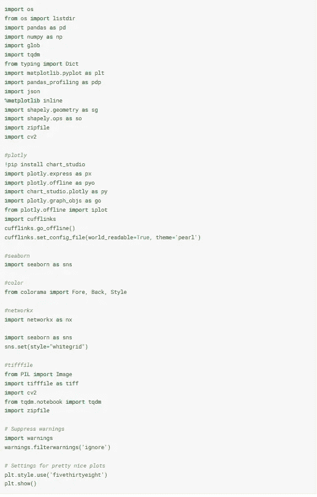

*   熊猫:用来读书。csv 文件并将其存储为数据帧。
*   numpy:用于数学计算
*   matplotlib，seaborn，plotly:用于绘制彩色图形
*   coloroma:印刷时用于彩色文本
*   cv2，PIL:用于加载和处理图像
*   tiff 文件:用于加载 tiff 文件并转换成。jpg 或者。JPEG 文件

## **2)列出数据集中的文件**

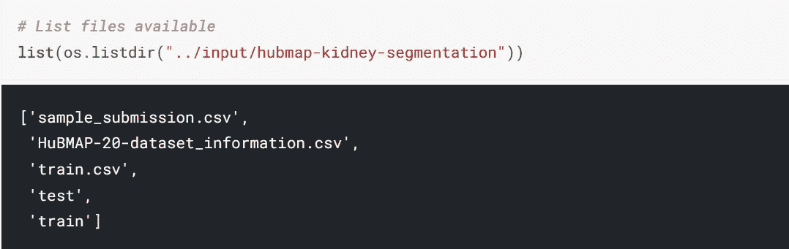

我们可以看到数据集中有 5 个文件。因此，基本上，train.csv 包含每个图像的唯一 id，以及图像中对象的 RLE 编码表示，hub map-20-dataset _ information . CSV 包含关于每个图像的附加信息(包括匿名的患者数据)。

> 游程编码(RLE):
> 
> RLE 是无损数据压缩的一种形式，在这种压缩中，数据运行(相同数据值出现在许多连续数据元素中的序列)存储为单个数据值和计数，而不是原始运行。这对于包含许多此类运行的数据非常有用。例如，考虑简单的图形图像，如图标、线条画、康威的生活游戏和动画。它对运行次数不多的文件没有用，因为它会大大增加文件的大小。

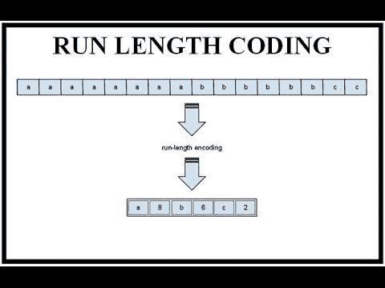

行程编码

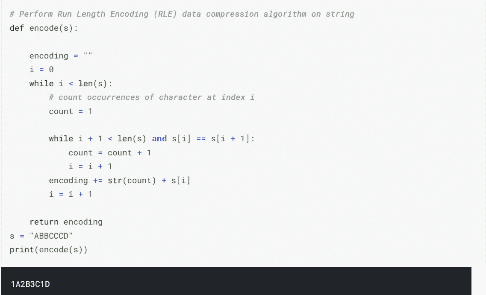

python 中的游程编码

> 这个[算法](https://www.prepressure.com/library/compression-algorithm/rle)非常容易实现，不需要太多 CPU 马力。RLE 压缩仅对包含大量重复数据的文件有效。如果包含大量缩进空间，这些文件可以是文本文件，但是包含大量白色或黑色区域的艺术线条图像更适合。计算机生成的彩色图像(例如建筑图纸)也可以给出合理的压缩比。而这个是用来压缩 Tiff 和 Pdf 文件的。

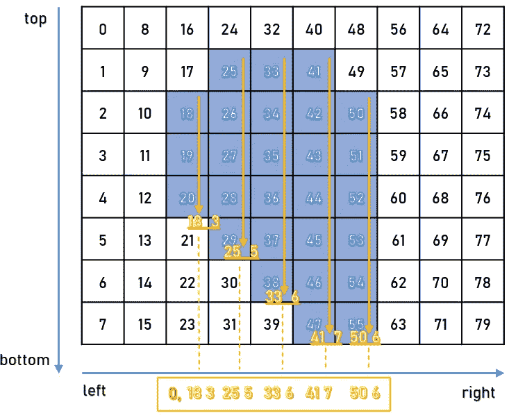

图像的游程长度编码样本

运行中图像的游程编码

## 3)读取 csv 文件

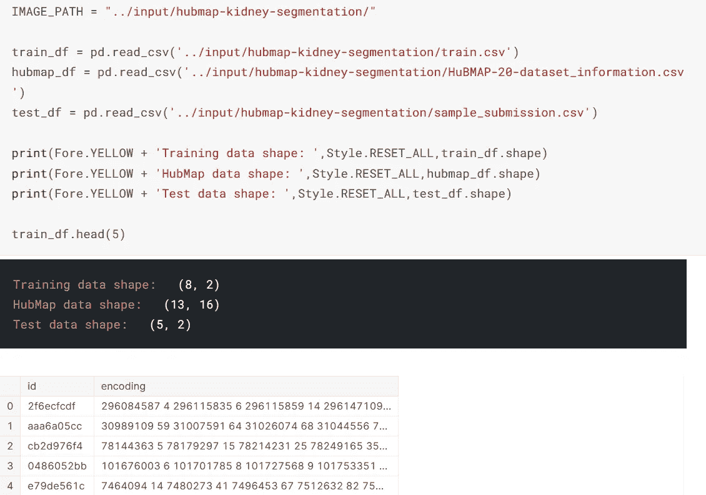

加载 csv 并将列车 csv 文件显示为数据帧

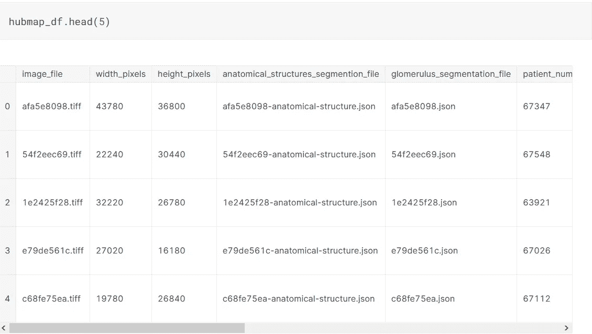

将 hubmapdataset.csv 显示为数据框

。csv 文件可以读取并转换成数据帧使用熊猫图书馆的 read_csv()函数，每个数据由分隔符“，”分隔。

*   。head(n)函数返回数据集中的前“n”个观察值。
*   。tail(n)函数返回数据集中最后的“n”个观察值。
*   。sample(n)函数从数据集中返回随机的“n”个观察值。
*   。shape 函数返回数据集中的行数*列数。
*   。columns 返回给定数据集的列名列表。
*   。value_counts()返回给定列中每个值的计数

## 4)基础数据探索

来查找它包含的所有列、它们的类型以及它们是否包含任何值。info()函数。

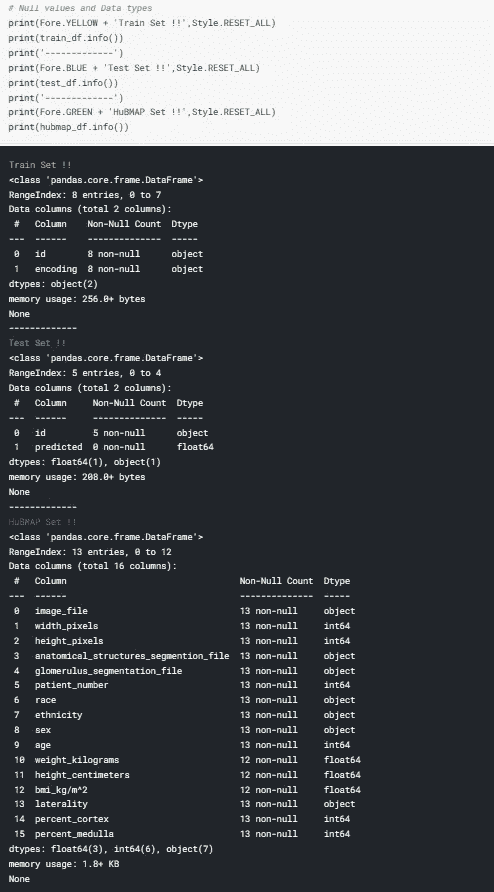

总说明

> 通过观察上述数据，我们可以得出结论，train.csv 包含 2 个 object co 8 非空列，hubmap20dataset.csv 包含 7 个 object 列、6 个 int64 列和 2 个 float64 列，其中有 13 个非空列。(非 null 表示没有缺失值)。

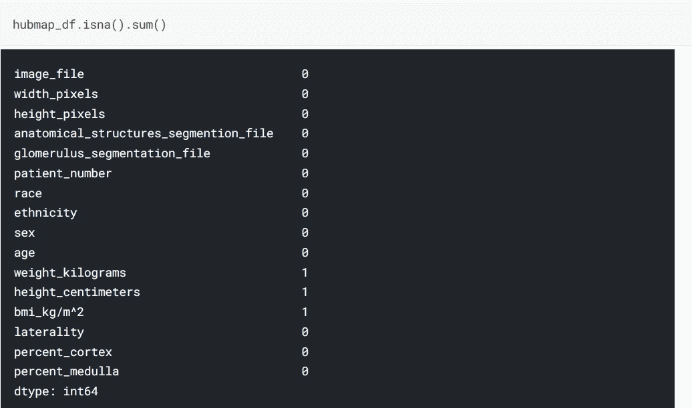

缺失值计数

> 从上面的图片中我们可以看到 hubmap 20 数据集中有 3 个缺失值。函数“isna()。sum()”用于返回数据帧中每一列的缺失值计数

## 5)详细的数据探索

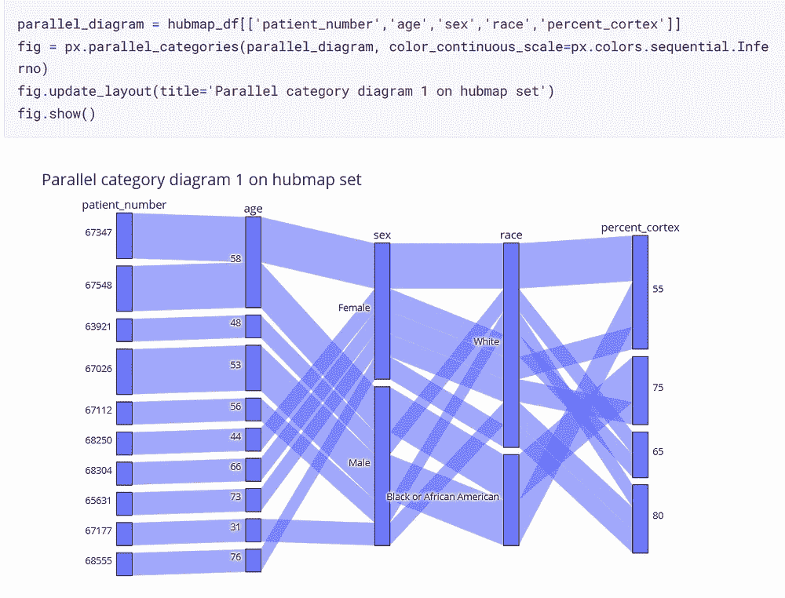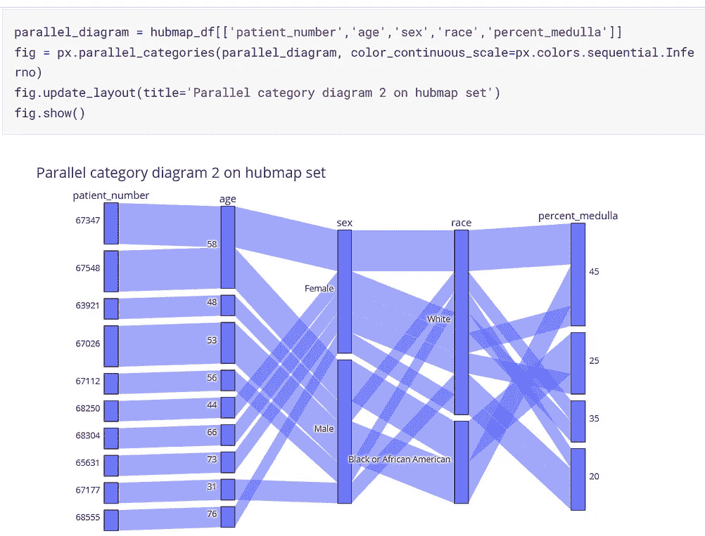

HuBMAP 数据框架上的平行类别图

> 上面的图实际上是平行的类别图。平行类别图(也称为平行集或冲积图)是多维分类数据集的可视化。数据集中的每个变量由一列矩形表示，其中每个矩形对应于该变量所取的一个离散值。矩形的相对高度反映了相应值出现的相对频率。跨维度的类别矩形组合由条带连接，其中条带的高度对应于数据集中类别组合出现的相对频率。上图显示了患者编号、年龄、性别、种族、皮质百分比和髓质百分比。

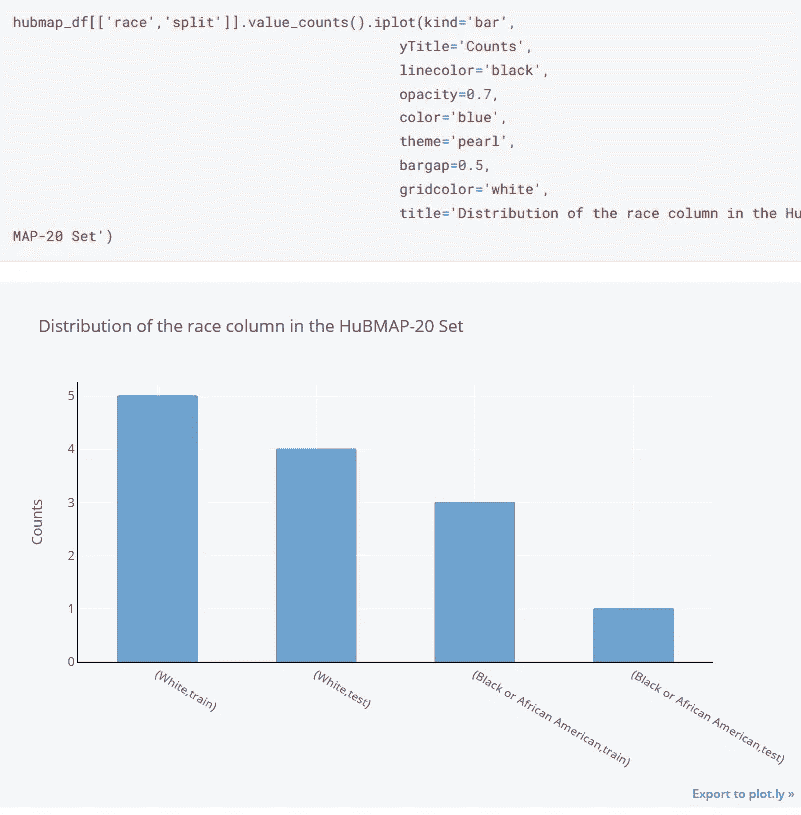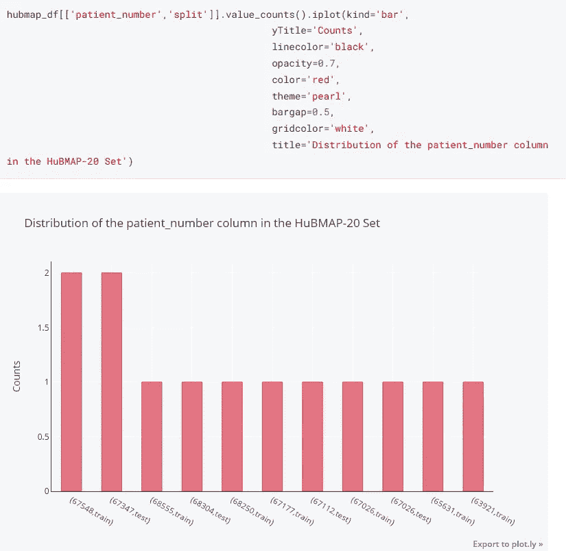

数据集的分布图。

> 上面的图是给定数据集的样本分布图，可以通过。iplot()函数。这个 iplot()表示交互式绘图，这意味着您可以对这些绘图的外观进行大量控制，还可以缩放、显示悬停信息以及切换图表上要查看的数据。

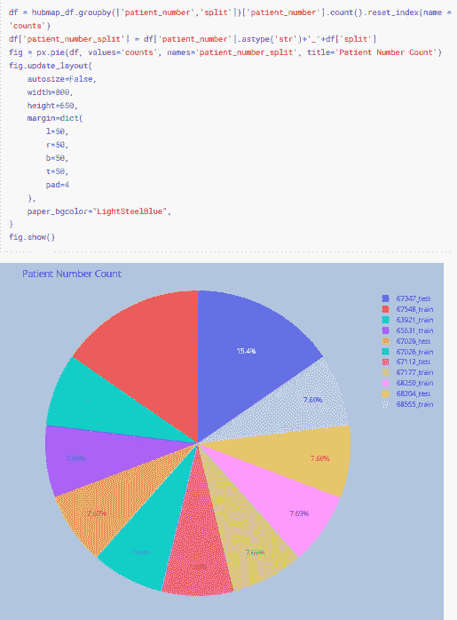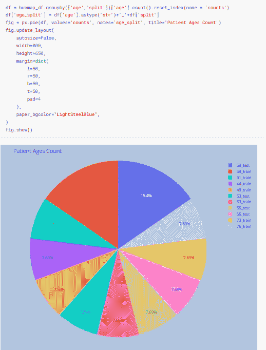

数据集的饼图

> 上面这些饼图是使用。pie()函数 plotly.express .我们可以看到数据是如何被划分成一个圆圈的。宽度和高度参数用于确定饼图的大小。

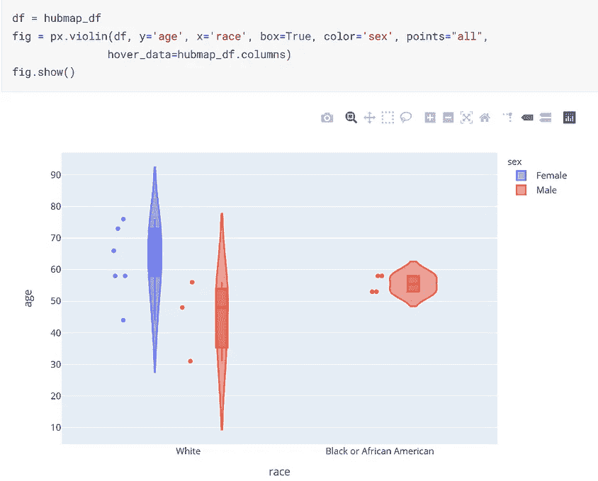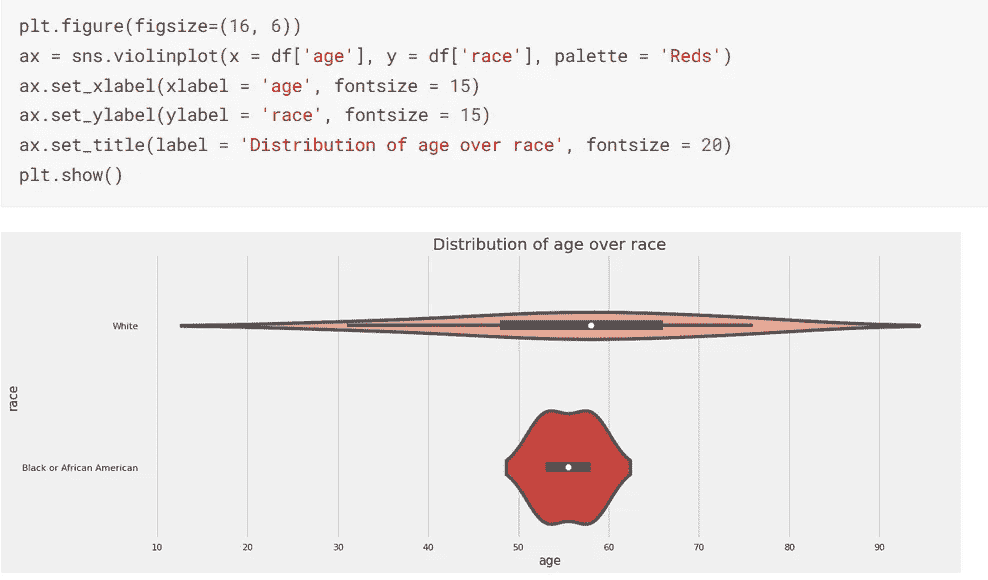

数据集的小提琴图

> 上面的图是数据集的小提琴图，可以使用。plotly.express 或 using 的 violin()函数。seaborn 的 violinplot()函数。小提琴图是数字数据的统计表示。它类似于箱形图，只是每边增加了一个旋转的核密度图。如果 px.violin()没有给我们预期的结果，这可以使用 go.violin()来扩展。

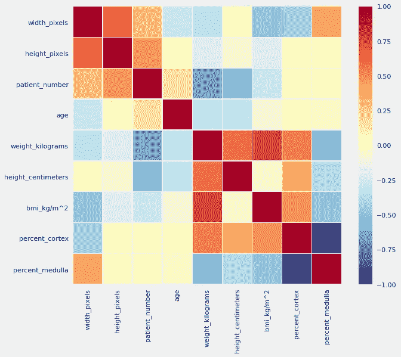

数据集的热图。

> 上图是给定 hub map 20 数据集的热图，它告诉我们数据集中每一列的相关性。这可以用。seaborn 库的 heatmap()函数。热图是数据的二维图形表示，矩阵中包含的各个值用颜色表示。

因此，上述步骤是探索性数据分析中涉及的一些步骤，希望您对 EDA 以及如何处理数据有一些基本的了解。

要了解更多信息，你可以完整地看一下我的笔记本[这里](https://www.kaggle.com/vineeth1999/hubmap-eda-pytorch-efficientunet-offline-training/notebook)

感谢您的阅读。