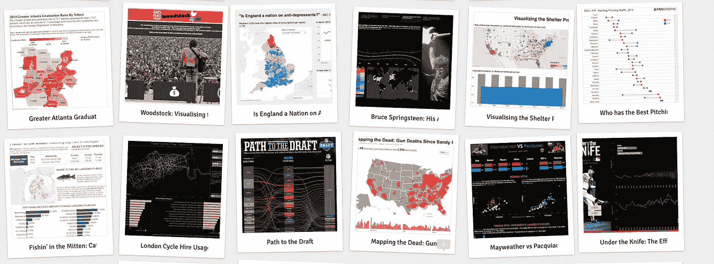

# Python 初学者的探索性数据分析

> 原文：<https://medium.com/analytics-vidhya/exploratory-data-analysis-for-beginner-7488d587f1ec?source=collection_archive---------5----------------------->

## 带代码的完整指南

图片来自 D [ata Viz 右](http://www.datavizdoneright.com/?view=snapshot)。

D 在你理解数据并最有效地将其可视化之前，数据什么都不是，这就是我们所说的探索性数据分析(EDA)

> 听起来像中级？
> 好吧，让我们从初学者的方式开始？

你正在上数据挖掘课，你的教授说你从…中找到一个数据集