# 探索性数据分析:哈伯曼癌症生存数据集

> 原文：<https://medium.com/analytics-vidhya/exploratory-data-analysis-habermans-cancer-survival-dataset-b76179b310bb?source=collection_archive---------13----------------------->


# 什么是探索性数据分析？

在[统计](https://en.wikipedia.org/wiki/Statistics)、**探索性数据分析** ( **EDA** )是一种对 [数据集](https://en.wikipedia.org/wiki/Data_set)进行[分析以总结其主要特征的方法，通常采用可视化方法。一个](https://en.wikipedia.org/wiki/Data_analysis)[统计模型](https://en.wikipedia.org/wiki/Statistical_model)可以使用也可以不使用，但是 EDA 主要是为了看看数据能告诉我们什么，而不仅仅是正式的建模或假设检验任务。

用多种探索技术探索一个数据集总是一个好主意，特别是当它们可以一起进行比较时。探索性数据分析的目标是获得对数据的信心，从而准备好使用机器学习算法。EDA 的另一个附带好处是细化您对特征变量的选择，这些变量稍后将用于**机器学习**。

# 为什么是埃达？

探索性数据分析的意义( **EDA** )数据科学对于高级统计和机器学习技术来说是无处不在的。只要有数据可以分析，探索的必要性是显而易见的。然而，对于任何数据科学任务来说，一个经常被低估的重要关键组成部分是探索性数据分析( **EDA** )。

在高层次上，EDA 是通过统计和可视化技术来描述数据的实践，以将数据的重要方面集中到进一步的分析中。这包括从多个角度看待你的数据集，描述它，总结它，而不对它的内容做任何假设。在进入机器学习或统计建模之前，这是重要的一步，以确保数据确实是他们声称的那样，并且没有明显的问题。EDA 应该是数据科学在您的组织中运作的一部分。

在这篇博客中，我们采用了哈伯曼的癌症生存数据集，并使用 python 执行了各种 EDA 技术。你可以很容易地从 Kaggle 下载数据集。

[](https://www.kaggle.com/gilsousa/habermans-survival-data-set/version/1) [## 哈伯曼生存数据集

### 下载数千个项目的开放数据集+在一个平台上共享项目。探索热门话题，如政府…

www.kaggle.com](https://www.kaggle.com/gilsousa/habermans-survival-data-set/version/1) 

# 哈伯曼癌症生存数据集上的 EDA

目的:根据给定的患者数据('年龄'，'年份'，'节点')，我们估计他的生存状态(五年以上，五年以下)。属性信息:
患者手术时的年龄(数值)
患者手术年份(年份— 1900，数值)
检测到的阳性腋窝淋巴结数(数值)
存活状态(类别属性):
1 =患者存活 5 年或更长时间
2 =患者在 5 年内死亡

## 数据准备:

```
#i*mporting the required libraries and loading the dataset:* import pandas as pd 
import seaborn as sns 
import matplotlib.pyplot as plt 
import numpy as np #load csv file that we downloaded from kaggle into pandas dataFrame
hm=pd.read_csv("haberman.csv")
```

## 理解数据:

```
*#prints the number of rows and number of columns* print(hm.shape)

*#printing the columns* print(hm.columns)
```

**输出:**

`Index([‘age’, ‘year’, ‘nodes’, ‘status’], dtype=’object’)`

## 观察结果:

1.  CSV 文件包含 306 行和 4 列。

```
hm['status'].value_counts()
```

**输出:**

```
1 225
2 81
Name: status, dtype: int64
```

## 观察结果:

1.  类别标签:状态 1 =幸存，2 =死亡
2.  数据集是不平衡的，因为存活的患者数量(这里是 225)多于死亡的患者数量(这里是 81)

```
print(haber.info())
*#brief info about the dataset*
```

**输出:**

```
<class 'pandas.core.frame.DataFrame'>
RangeIndex: 306 entries, 0 to 305
Data columns (total 4 columns):
age       306 non-null int64
year      306 non-null int64
nodes     306 non-null int64
status    306 non-null int64
dtypes: int64(4)
memory usage: 9.6 KB
```

## 观察结果:

1.  该数据集中没有缺失值。
2.  所有列都是整数数据类型。
3.  状态的数据类型是整数，必须将其转换为分类数据类型。

## ***二维散点图:***

```
hm.plot(kind='scatter',x='year',y='age'); sns.set_style('whitegrid');
sns.FacetGrid(hm,hue='status',size=4)\
  .map(plt.scatter,'year','age')\
  .add_legend();
 plt.show()
```

**输出:**

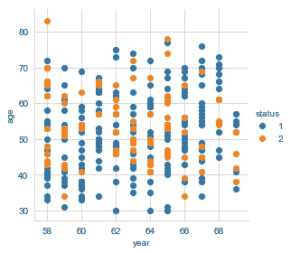

**年龄与年份**

```
sns.set_style('whitegrid');
sns.FacetGrid(hm,hue='status',size=4) \
  .map(plt.scatter,'nodes','age') \
  .add_legend();
 plt.show();
```

**输出:**

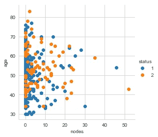

**年龄对节点**

## 观察结果:

*   观察到大量重叠。所有的点都互相重叠，所以我们不能识别任何东西。

## 配对图:

```
plt.close();
sns.set_style('whitegrid');
sns.pairplot(hm,hue='status', vars=['age','year','nodes'], size=4); plt.show();
```

**输出:**

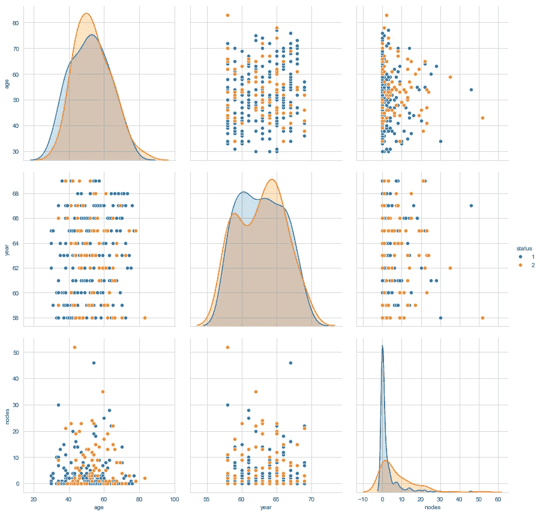

**配对图**

## 观察结果:

*   在这些图中，我们观察到节点有助于识别患者的状态。

# 概率密度函数(PDF):

概率密度函数(PDF)是变量取值 x 的概率(直方图的平滑版本)。

```
sns.FacetGrid(hm,hue='status',size=4)\
   .map(sns.distplot,'age')\
   .add_legend();
plt.title('histogram of age')
plt.show();
```

**输出:**

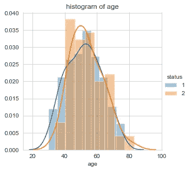

**年龄 Pdf**

## 观察结果:

*   观察到大量重叠，这告诉我们生存机会与人的年龄无关。
*   虽然在这些图中，我们确定年龄在 30 至 35 岁之间患者在手术后存活超过 5 年，但这是 12%。
*   年龄在 78 岁至 82 岁之间的患者术后存活时间不超过 5 年者占 4%。
*   大于 35 分小于 78 分的年龄重叠，因此无法识别。
*   然而，这不是我们的最终结论。我们不能仅仅通过考虑年龄参数来决定病人的生存机会。

```
sns.FacetGrid(hm,hue='status',size=4)\
   .map(sns.distplot,'year')\
   .add_legend();
plt.title('histogram of year')
plt.show();
```

**输出:**

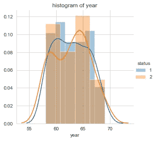

**年度 Pdf**

## 观察结果:

*   观察到大量重叠。所有的点都互相重叠，所以我们不能识别任何东西。
*   然而，可以看出，在 1960 年和 1965 年有更多的不成功的行动。

```
sns.FacetGrid(hm,hue='status',size=4)\
   .map(sns.distplot,'nodes')\
   .add_legend();
plt.title('histograms of nodes')
plt.show();
```

**输出:**

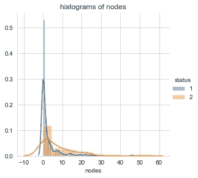

**节点的 Pdf**

## 观察结果:

*   无淋巴结或有 1 个淋巴结的患者更有可能存活。
*   如果有 25 个或更多的节点，存活的机会很小。

# **累积分布函数(CDF):**

累积分布函数(CDF)是变量取值小于或等于 x 的概率。

```
plt.title(' pdf and cdf of year')

counts,bin_edges=np.histogram(hm['year'],bins=10,density=**True**)
pdf=counts/(sum(counts))
print(pdf)
print(bin_edges);
cdf=(np.cumsum(pdf))
plt.plot(bin_edges[1:],pdf);
plt.plot(bin_edges[1:],cdf);

counts,bin_edges=np.histogram(hm['year'],bins=20,density=**True**)

pdf=counts/sum(counts)
plt.plot(bin_edges[1:],pdf);
plt.xlabel('year')
plt.legend('pc')
plt.ylabel('probability')

plt.show();
```

**输出:**

```
[0.20588235 0.09150327 0.08496732 0.0751634 0.09803922 0.10130719
 0.09150327 0.09150327 0.08169935 0.07843137]
[58\. 59.1 60.2 61.3 62.4 63.5 64.6 65.7 66.8 67.9 69\. ]
```

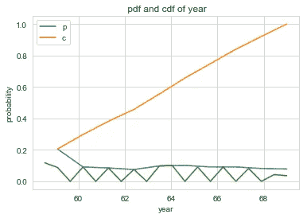

```
plt.title('pdf and cdf of age')

counts,bin_edges=np.histogram(hm['age'],bins=10,density=**True**)
pdf=counts/sum(counts)
print(pdf)
print(bin_edges);
cdf=np.cumsum(pdf)
plt.plot(bin_edges[1:],pdf);
plt.plot(bin_edges[1:],cdf);
counts,bin_edges=np.histogram(hm['age'],bins=20,density=**True**)
pdf=counts/sum(counts)
plt.plot(bin_edges[1:],pdf)
plt.xlabel('age')
plt.ylabel('probability')
plt.legend('pc')
plt.show()
```

**输出:**

```
[0.05228758 0.08823529 0.1503268 0.17320261 0.17973856 0.13398693
 0.13398693 0.05882353 0.02287582 0.00653595]
[30\. 35.3 40.6 45.9 51.2 56.5 61.8 67.1 72.4 77.7 83\. ]
```

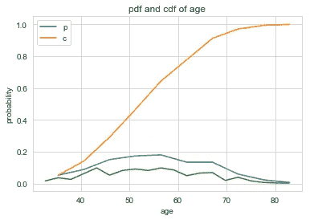

## 观察结果:

*   年龄在 50 到 60 岁之间的人存活超过五年的占 20%

```
plt.title( 'cdf of nodes') 

counts,bin_edges=np.histogram(hm['nodes'],bins=10,density=**True**)
pdf=counts/sum(counts)
print(pdf)
print(bin_edges)
cdf=np.cumsum(pdf)
plt.plot(bin_edges[1:],pdf);
plt.plot(bin_edges[1:],cdf)
counts,bin_edges=np.histogram(hm['nodes'],bins=10,density=**True**)
pdf=counts/sum(counts)
plt.plot(bin_edges[1:],pdf);
plt.xlabel('nodes')
plt.legend('pc')
plt.ylabel('probability')
plt.show();
```

**输出:**

```
[0.77124183 0.09803922 0.05882353 0.02614379 0.02941176 0.00653595
 0.00326797 0\. 0.00326797 0.00326797]
[ 0\. 5.2 10.4 15.6 20.8 26\. 31.2 36.4 41.6 46.8 52\. ]
```

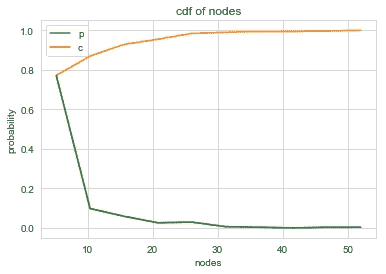

## 观察结果:

*   少于 10 个的淋巴结存活超过 5 年的有 83%。

## 方框图和触须:

直方图和 PDF 非常善于确定存在的点的密度。但是它仍然不能告诉我们第 25、50 和 75 百分位的值。于是，方框图就出现了。
箱线图用于根据中位数、百分位数和四分位数表示数据。视觉上，它表示一个框中数据点的五个数摘要。
异常值显示为框外的点。
1。Q1-1.5 * IQR
2。Q1(第 25 百分位)
3。Q2(第 50 百分位或中位数)
4。Q3(第 75 百分位)
5。Q3 + 1.5*IQR
四分位数间距= Q3-Q1
方框不同部分之间的间距表示数据的方差(扩散)。
触须显示数据的范围。
超过胡须末端的点显示异常值。

```
sns.boxplot(x='status',y='age',data=hm)
plt.show()
sns.boxplot(x='status',y='year',data=hm)
plt.show()
sns.boxplot(x='status',y='nodes',data=hm)
plt.show()
```

**输出:**

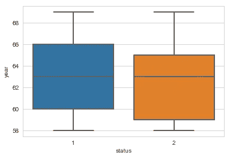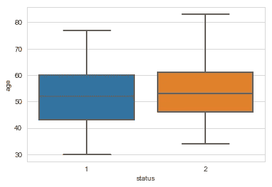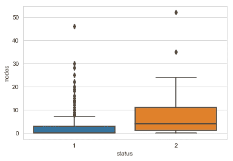

**箱线图**

## 观察结果:

*   年龄大于 43 岁小于 50 岁的人存活五年以上的占 30%。
*   年龄大于 50 岁小于 60 岁的人存活五年以上的占 20%
*   我们发现大多数存活下来的人都有 0 到 3 个以下的淋巴结。

## 小提琴情节:

小提琴图是盒子图和 PDF 的结合。violin 图优于普通盒图，因为盒图仅显示统计汇总，如中位数和分位数，而 violin 图显示数据的完整分布。在 violin plot 中，数据的密集区域较厚，稀疏区域较薄。

```
sns.violinplot(x='status',y='age',data=hm)
plt.show()
sns.violinplot(x='status',y='year',data=hm)
plt.show()
sns.violinplot(x='status',y='nodes',data=hm)
plt.show()
```

**输出:**

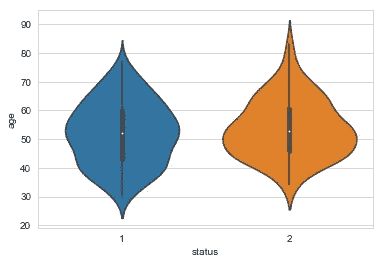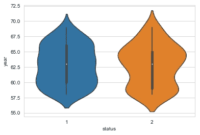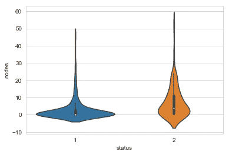

**小提琴剧情**

## 观察结果:

*   那些有 0 到 3 个淋巴结的人存活的时间更长。

# 结论:

*   节点是识别癌症生存状态最有用的特征。
*   那些少于 10 个节点的已经存活了 5 年以上。
*   患者的年龄和手术年份本身并不是决定其生存的因素。
*   因此，节点在癌症存活测试中起着关键作用。