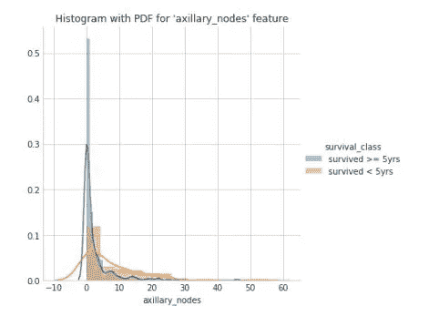

# 探索性数据分析——哈伯曼的生存数据集

> 原文：<https://medium.com/analytics-vidhya/exploratory-data-analysis-habermans-survival-data-set-f402fb9cf910?source=collection_archive---------0----------------------->

Jair Lázaro 在 [Unsplash](https://unsplash.com?utm_source=medium&utm_medium=referral) 上的照片

探索性数据分析是机器学习中最重要的步骤(它是机器学习中的重要步骤，也是基础和起点)。 ***不执行 EDA，解决一个机器学习问题是没有用的。***

在这篇博客中，我们将首先看看为什么 EDA？，EDA 的价值，EDA 的方法，为什么跳过 EDA 是坏主意，然后举个例子，看看我们能从 EDA 中推断出什么。

## 探索性数据分析(EDA)有助于回答所有这些问题，确保项目取得最佳成果。

> 如何确保你准备好在项目中使用机器学习算法？
> 
> 如何为你的数据集选择最合适的算法？
> 
> 如何定义潜在可用于机器学习的特征变量？

EDA 是一种总结、可视化和熟悉数据集重要特征的方法。

# EDA 的价值

探索性数据分析对数据科学项目很有价值，因为它可以更接近于确定未来的结果将是有效的、正确解释的，并且适用于期望的业务环境。只有在对原始数据进行验证和异常检查后，才能达到这种确定性水平，确保收集的数据集没有错误。EDA 还有助于发现对业务利益相关者和数据科学家来说不明显或不值得研究的见解，但对于特定业务来说，这些见解可能非常有用。

执行 EDA 是为了定义和细化将用于机器学习的特征变量的选择。一旦数据科学家熟悉了数据集，他们通常不得不返回到特征工程步骤，因为最初的特征可能不符合他们的预期目的。一旦 EDA 阶段完成，数据科学家就获得了他们进行监督和非监督机器学习所需的坚实的功能集

# 探索性数据分析方法

1.  单变量分析-提供原始数据集中每个字段的汇总统计数据
2.  双变量分析-用于查找数据集中每个变量与感兴趣的目标变量之间的关系。
3.  多元分析-用于了解数据集中不同字段之间的相互作用。
4.  降维—有助于理解数据中导致观察值之间最大差异的字段，并允许处理减少的数据量。

为什么跳过 EDA 是个坏主意？

为了快速进入机器学习阶段或给业务利益相关者留下深刻印象，数据科学家往往要么完全跳过探索过程，要么做非常肤浅的工作。

1.  生成不准确的模型
2.  在错误的数据上生成精确的模型
3.  为模型选择错误的变量
4.  资源的低效使用，包括模型的重建

如果我们不执行 EDA，这些是一些缺点。

It (EDA)一方面用于回答问题、测试业务假设、为进一步分析生成假设。另一方面，也可以用它来为建模准备数据。

# 例如:哈伯曼生存数据集上的 EDA

该数据集在 kaggle 中可用。

# 关于数据集:

该数据集包含 1958 年至 1970 年间在芝加哥大学比林斯医院进行的一项关于乳腺癌手术患者 ***存活率的研究案例。***

**属性信息(关于特性)**:

**特征-1** :手术时患者的年龄

**特征-2** :患者手术年份(1900 年)

**特征-3** :检出阳性腋窝淋巴结数

**功能-4** :生存状态

1 级=患者存活了 5 年或更长时间

第 2 类=患者在 5 年内死亡

由于特征-4 是一个类变量，它是所有其他三个特征的结果，它也可以被认为是一个从属特征，而特征-1，2，3 是独立特征

# 目标:

如果给出一个新的观察值，那么我们需要根据它的独立特征来分类它是属于类别 1 还是类别 2。

# 此数据集上的 EDA:

1.加载数据集，查看数据集中的前 5 个观察值，并找出数据集的形状。

加载数据集，查看数据集中的前 5 个观察值，并找出数据集的形状

2. ***多元分析***

查找类变量(target_variable)(每个类)的计数。从下图可以明显看出，这是一个不平衡的数据集。

关于目标变量的所有特征的分析

配对图(相对于目标变量绘制在所有特征上)

从上图可以明显看出

我们无法根据数据集中的任何两个要素对给定观测值(新观测值)进行分类，因为在每个散点图(三个图中)中，数据点不以任何方式分开(不以线性方式分开)。

**让我们尝试对所有三个独立特征进行单变量分析**

由于有三个独立的特征，我们将对每个特征进行单变量分析，看看我们是否能从中获得任何有用的结果。

***需要了解的重要术语:***

[PDF](https://en.wikipedia.org/wiki/Probability_density_function) (概率密度函数):PDF 用于指定[随机变量](https://en.wikipedia.org/wiki/Random_variable)落在特定值范围内*的概率，而不是取任何一个值。该概率由该变量的 PDF 在该范围内的[积分](https://en.wikipedia.org/wiki/Integral)给出——也就是说，它由密度函数下方、水平轴上方以及该范围的最低值和最大值之间的面积给出*

[CDF](https://en.wikipedia.org/wiki/Cumulative_distribution_function) (累积分布函数):CDF 是 pdf '的累积和。它有助于确定在给定的点上低于或高于等级的百分比。

“年龄”特征的单变量分析图(特征 1)

“运行年份”特征的单变量分析图(特征 2)

**从上面两幅图我们可以推断出**

在特征‘运行年份’和‘年龄’的直方图中，两个图的 PDF 显示，两个类别(‘存活> = 5 年’和‘存活<5yrs’) overlapped (almost they are top on each other). So, we cannot consider both features as useful feature for our ***)目标。***

“腋窝淋巴结”特征的单变量分析图(特征 3)

**而在该直方图中，特征“腋窝节点”被标绘**。尽管在两个 PDF 类别之间有轻微的重叠(存活了>= 5 年和存活了<5 年),但是与其他两个特征相比，有可能基于该特征对结果进行分类。

为了更详细的分析，我们将绘制 ***CDF 和*** 的盒须图，用于特征‘腋窝节点’

# 腋窝淋巴结特征的 CDF 和 PDF(特征-3)

腋窝淋巴结特征的 CDF 和 PDF

在该图中，我们可以观察到两个 pdf 之间有重叠。

即使两者之间有重叠。当我们将阈值固定为“5”(腋窝淋巴结计数为 5)时，如果我们需要根据这一特征对新患者进行分类，那么我们可以预测他是否能“存活 5 年或超过 5 年”，因为从“存活 5 年”类别的 CDF 来看，只有 45%的观察值为该值。

# 盒须图

目标变量的盒须图

从该图可以明显看出,“存活> = 5 年”类别中有 75%的腋淋巴结计数值小于 5。大概不到 4。

这个班幸存了 5 年。从这个类的箱线图中，可以看出它的大部分值(腋淋巴结计数)是' > 6 和<12’ (between 50th percentile and 75th percentile) of this class.

# Conclusion

Out of three features (‘age’,’no.of.operations’ and ‘count of axillary_nodes’) . ‘axillary_nodes’ is the best and most important feature among three to classify the survival_class (target_variable).

Even though ‘axillary_nodes’ feature has some overlappings among survival_class. but based on above observations we can classify that if the ‘count of axillary nodes’ is less than 5 , then it can be classified as ‘survived>= 5 年'否则它更有可能落入'幸存<5yrs’ class.

So, by doing EDA in this problem , we came to know about the important feature (in this case ‘count of axillary nodes’) and we have seen that given dataset is imbalanced dataset. We can make it balanced by using sampling (oversampling and undersampling techniques).

This is toy-example on EDA. EDA is the most powerful tool which is so much useful in solving a machine Learning problem (which helps in getting good understanding of data before we proceed onto further modelling steps).

*感谢您阅读到目前为止。如果你有什么建议或者有什么想分享的，欢迎随时评论或者通过 LinkedIn* [*这里*](https://www.linkedin.com/in/chamanth-mvs-9a59a4131/) *联系我。*