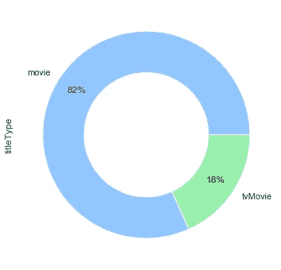
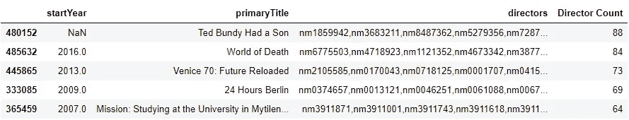
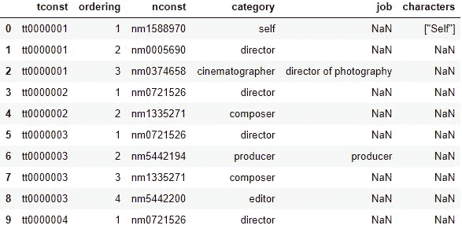

# 探索性数据分析:IMDb 数据集

> 原文：<https://medium.com/analytics-vidhya/exploratory-data-analysis-imdb-dataset-cff0c3991ad5?source=collection_archive---------1----------------------->

在这本笔记本中，我们将探索 IMDb 的数据集，该数据集可在线获得，并且每天更新。

https://www.imdb.com/interfaces/

七个 gzipped 文件(制表符分隔值)可以从网站上下载。文件有:

*   title.akas.tsv.gz
*   title.basics.tsv.gz
*   title.crew.tsv.gz
*   title.episode.tsv.gz
*   title.principals.tsv.gz
*   title.ratings.tsv.gz
*   name.basics.tsv.gz

除了“title.episode.tsv.gz”之外，我们将逐一浏览它们，因为我们只对笔记本中的电影感兴趣，对电视剧不感兴趣。

让我们从 Python 库的必要导入开始:

```
**import** **pandas** **as** **pd**
**import** **numpy** **as** **np**
**import** **seaborn** **as** **sns**
**import** **matplotlib.pyplot** **as** **plt**
sns.set(style="darkgrid")
plt.style.use("seaborn-pastel")
```

将 IMDb 数据集中的大型表加载到我们的笔记本需要一些时间；因此，我们将执行一次，并将它们保存在。Python 的 pickle 库所允许的 sav 格式，这将加速数据加载过程

```
import pickle
# import glob# save all tables one by one into separate sav files
# tsv_files = glob.glob("*.tsv")# for file in tsv_files:
#     print(file)
#     pickle.dump(pd.read_table(file,sep="\t",low_memory=False, na_values=["\\N","nan"]),
#                 open(file[:-4]+".sav","wb"))
```

让我们逐个检查表格。我们会不时地在笔记本中加入表格来做额外的分析

# 评级表

title.ratings.tsv.gz—包含标题的 IMDb 评分和投票信息

*   **tconst** (字符串)—标题的字母数字唯一标识符
*   **平均** —所有个人用户评分的加权平均值
*   **numVotes** —标题获得的票数

```
df_ratings = pickle.load(open("title.ratings.sav","rb"))
df_ratings.head()
```


**分级**表包含超过一百万个电影分级条目

```
df_ratings.info()<class 'pandas.core.frame.DataFrame'>
RangeIndex: 1020911 entries, 0 to 1020910
Data columns (total 3 columns):
 #   Column         Non-Null Count    Dtype  
---  ------         --------------    -----  
 0   tconst         1020911 non-null  object 
 1   averageRating  1020911 non-null  float64
 2   numVotes       1020911 non-null  int64  
dtypes: float64(1), int64(1), object(1)
memory usage: 23.4+ MB
```

平均评分为 6.89(平均值)，与中值(7.1)不同，我们将进一步研究这一点。每部电影的平均投票数接近 1000(平均值)，这次的中位数(20)与平均值有很大不同

```
df_ratings.describe()
```


平均评分分布显示了典型的**负偏态**分布，其中中值大于平均值。投票数分布主要集中在小数值上(0-1000 票)。因此，我们需要做一些额外的工作来可视化这个打包的分布

```
ratings = dict(mean=df_ratings.averageRating.mean(),
              median=df_ratings.averageRating.median())
votes = dict(mean=df_ratings.numVotes.mean(),
              median=df_ratings.numVotes.median())plt.figure(figsize=(15,5))plt.subplot(1,2,1)
ax1 = sns.distplot(df_ratings.averageRating,kde_kws=dict(bw=0.2))
ax1.axvline(x=ratings["mean"],c=sns.color_palette("Set2")[1],label=f"mean={ratings['mean'].round(2)}")
ax1.axvline(x=ratings["median"],c=sns.color_palette("Set2")[2],label=f"median={ratings['median'].round(2)}")
plt.legend()plt.subplot(1,2,2)
ax2 = sns.distplot(df_ratings.numVotes,kde_kws=dict(bw=0.2))
ax2.axvline(x=votes["mean"],c=sns.color_palette("Set2")[1],label=f"mean={votes['mean'].round(2)}")
ax2.axvline(x=votes["median"],c=sns.color_palette("Set2")[2],label=f"median={votes['median'].round(2)}")
plt.legend()plt.tight_layout()
plt.show()
```


让我们尝试使用 pandas.qcut 函数，该函数基于秩或基于样本分位数将变量离散化为大小相等的桶。让我们将数据分成 20 个时段，并想象:

*   超过 140，000 个样本(超过 10%)只计算了 5 张选票
*   超过 1095 票的电影在情节中用大约 50K 的单个条形表示(这些是我们最感兴趣的重要/流行电影)

```
buckets = 20
plt.figure(figsize=(15,6))
bins = pd.qcut(df_ratings.numVotes,buckets,duplicates="drop").value_counts()
sns.barplot(x=bins.values,y=bins.index,orient="h")
plt.show()
```


此外，我们可以考虑用对数标度来绘制分布图，这样可以揭示更多信息。因为它是一个计数变量，所以看起来更像泊松分布

```
plt.figure(figsize=(15,6))
ax=sns.distplot(df_ratings.numVotes,kde=False)
ax.set_ylabel("Count")
ax.set_yscale("log")
```


# 标题基础表

title.basics.tsv.gz—包含以下标题信息:

*   **tconst** (字符串)—标题的字母数字唯一标识符
*   **标题类型**(字符串)——标题的类型/格式(如电影、短片、电视连续剧、电视剧集、视频等)
*   **primaryTitle** (字符串)—更受欢迎的标题/电影制作人在发行时在宣传材料上使用的标题
*   **原标题**(字符串)——原标题，原文
*   **isAdult** (boolean) — 0:非成人称谓；1:成人标题
*   **start year**(YYYY)——代表一个标题的发布年份。就电视连续剧而言，这是连续剧开始的年份
*   **岁末**(YYYY)——电视剧岁末。\N '对于所有其他标题类型
*   **运行时间分钟** —标题的主要运行时间，以分钟为单位
*   **流派**(字符串数组)——包括最多三个与标题相关的流派

```
df_title_basics = pickle.load(open("title.basics.sav","rb"))
df_title_basics.head()
```


标题基本信息表比收视率表大得多，有超过**600 万**个条目，每个条目都描述了视频标题的基本信息。我用了“视频”这个词，因为它不仅包括电影，还包括电视剧、短片(短片和音乐剪辑)，甚至视频游戏

```
df_title_basics.info()<class 'pandas.core.frame.DataFrame'>
RangeIndex: 6682995 entries, 0 to 6682994
Data columns (total 9 columns):
 #   Column          Dtype  
---  ------          -----  
 0   tconst          object 
 1   titleType       object 
 2   primaryTitle    object 
 3   originalTitle   object 
 4   isAdult         int64  
 5   startYear       float64
 6   endYear         float64
 7   runtimeMinutes  object 
 8   genres          object 
dtypes: float64(2), int64(1), object(6)
memory usage: 458.9+ MB
```

让我们一个接一个地探索专栏。职称类型分布如下:

*   大多数标题是电视剧集(71%)
*   电影(包括电视电影)只覆盖了数据集的 10%

```
df_title_basics.titleType.value_counts().plot.pie(autopct="%.0f%%",figsize=(6,6),pctdistance=0.8,
                                                 wedgeprops=dict(width=0.4))
plt.show()
```


让我们修剪数据集，因为我们只对电影感兴趣。经过修整后，现在大部分的标题是电影(82%)，剩下的 12 万个标题是电视电影

```
df_title_basics = df_title_basics[df_title_basics.isAdult == 0]
df_title_basics.drop(["isAdult","endYear"],axis=1,inplace=True)
df_title_basics = df_title_basics[(df_title_basics.titleType == "movie") | (df_title_basics.titleType == "tvMovie")]df_title_basics.titleType.value_counts().plot.pie(autopct="%.0f%%",figsize=(6,6),pctdistance=0.8,
                                                 wedgeprops=dict(width=0.4))
plt.show()
```



**流派**分布如何，下面的饼状图看起来不迷人吧？这是因为电影有多种类型，所以我们下面看到的是各种类型的组合，每种类型都代表了馅饼中的一块

```
df_title_basics.genres.value_counts().plot.pie(autopct="%.0f%%",figsize=(6,6),pctdistance=0.8,
                                              wedgeprops=dict(width=0.4))
plt.show()
```


为了克服这一点，我们可以使用 Scikit-Learn 的**计数矢量器**特征提取技术来检测和计数每个独特的流派(例如，戏剧、喜剧等)。我们将为每个独特的类型标题创建一个新的列，它将判断电影是否具有该类型

```
from sklearn.feature_extraction.text import CountVectorizertemp = df_title_basics.genres.dropna()
vec = CountVectorizer(token_pattern='(?u)\\b[\\w-]+\\b', analyzer='word').fit(temp)
bag_of_genres = vec.transform(temp)
unique_genres =  vec.get_feature_names()
np.array(unique_genres)
```

独特的流派:

```
array(['action', 'adult', 'adventure', 'animation', 'biography', 'comedy', 'crime', 'documentary', 'drama', 'family', 'fantasy', 'film-noir', 'game-show', 'history', 'horror', 'music', 'musical', 'mystery', 'news', 'reality-tv', 'romance', 'sci-fi', 'sport', 'talk-show', 'thriller', 'war', 'western'], dtype='<U11')
```

它通过发现独特的流派并对其进行计数，表现非常出色。请注意，在下面的条形图中，由于一部电影可能同时有多个流派，因此它们的数量不会是 100%

```
genres = pd.DataFrame(bag_of_genres.todense(),columns=unique_genres,index=temp.index)
sorted_genres_perc = 100*pd.Series(genres.sum()).sort_values(ascending=False)/genres.shape[0]plt.figure(figsize=(15,8))
sns.barplot(x=sorted_genres_perc.values,y=sorted_genres_perc.index,orient="h")
plt.xlabel("Percentage of Films (%)")
plt.show()
```


每年的**投票人数和每年/每部电影**的**投票人数的趋势如何？**

下图包含两条副曲线，前者给出了每年制作的电影总数，后者给出了相应年份制作的电影的投票总数，该数字在 2013 年**达到峰值**(2013 年上映的电影的投票总数为 3700 万)，随后该数字急剧下降。这就是事情变得有趣的地方。在 2017 年**之前，每年制作的电影数量都在增加，但为什么人们不再投票给最近的电影呢？是因为电影质量越来越差吗？还是 IMDb 网站失去了人气？然而，显而易见的是，IMDb 仍然主导着在线电影评级行业，其令人兴奋的月访问量达到了 2.5 亿。**

【*阅读更多:*[*https://www . business wire . com/news/home/20180222005150/en/IMDb-launchs-First-Ever-Skill-Amazon-Alexa*](https://www.businesswire.com/news/home/20180222005150/en/IMDb-Launches-First-Ever-Skill-Amazon-Alexa)】

```
merged_temp = pd.merge(df_ratings,df_title_basics,on="tconst",how="left")
merged_temp = merged_temp[(merged_temp.startYear.notnull())&(merged_temp.startYear<2020)]
counts_yearly = merged_temp.groupby("startYear").agg({"averageRating":[np.median],
                                                     "numVotes":[np.sum,np.size,lambda x: np.sum(x)/np.size(x)]})max_count_year = counts_yearly[("numVotes","sum")].idxmax().astype(int)
max_year = counts_yearly[("numVotes","size")].idxmax().astype(int)plt.figure(figsize=(15,5))plt.subplot(1,2,1)
ax =counts_yearly[("numVotes","size")].plot()
ax.annotate(max_year,xy=(max_year,counts_yearly[("numVotes","size")].max()),
            xytext=(1980,10000), arrowprops=dict(color="sandybrown",shrink=0.05,width=1))
ax.annotate("WW I",xy=(1914,counts_yearly[("numVotes","size")].loc[1914]), xytext=(1900,2000), 
            arrowprops=dict(color="sandybrown",shrink=0.05,width=1))
ax.annotate("WW II",xy=(1939,counts_yearly[("numVotes","size")].loc[1939]), xytext=(1950,4000), 
            arrowprops=dict(color="sandybrown",shrink=0.05,width=1))
plt.title("Total Number Films per Year",fontweight="bold")plt.subplot(1,2,2)
ax =counts_yearly[("numVotes","sum")].plot()
ax.annotate(max_count_year,xy=(max_count_year,counts_yearly[("numVotes","sum")].max()),
            xytext=(1960,3e7),arrowprops=dict(shrink=0.05,color="sandybrown",width=2))
plt.title("Total Number of Voters per Year",fontweight="bold")plt.show()
```


这可能是另一个研究点，让我们继续在数据中寻找更多有趣的点。

下图又有两个支线剧情。前者给出每年电影的平均评分，而后者显示每年每部电影的平均投票人数。自 20 世纪 20 年代以来，电影的平均收视率趋于波动，但并没有显示出单调的上升/下降趋势。

后一个图表在 20 世纪 90 年代和 21 世纪初达到顶峰，从那以后急剧下降。回想一下，每年的选民总数在 2013 年达到峰值，而不是 90 年代。这意味着**90 年代的电影最受用户关注**。这可能与 IMDb 选民年龄组的优势有关。由于我们没有这方面的信息，我们可以猜测主要年龄组肯定在 30 至 50 岁之间。90 年代的电影都是他们童年或少年时代的电影，你印象最深的一部电影是吧？可能还有其他因素，比如 90 年代的电影更好等等。

```
max_count_year_per_film = counts_yearly[("numVotes","<lambda_0>")].idxmax().astype(int)plt.figure(figsize=(15,5))plt.subplot(1,2,1)
ax =counts_yearly[("averageRating","median")].plot()
plt.title("Average Rating per Year",fontweight="bold")plt.subplot(1,2,2)
ax = counts_yearly[("numVotes","<lambda_0>")].plot()
ax.annotate(max_count_year_per_film,xy=(max_count_year_per_film,counts_yearly[("numVotes","<lambda_0>")].max()),
            xytext=(1960,5200),arrowprops=dict(shrink=0.05,color="sandybrown",width=2))
plt.title("Average Number of Voters per Year per Film",fontweight="bold")plt.show()
```


现在让我们以分钟为单位来可视化电影**运行时间**的分布。下面的单个条形表示有一些运行时间超过 50000 分钟的**异常影片**

```
sns.distplot(df_title_basics.runtimeMinutes.dropna().astype(int),bins=50)
plt.gca().annotate("857\nhours of\nruntime?",xy=(51000,0.00005),xytext=(40000,0.0004),
                   fontsize=20, ha="center",
                   arrowprops=dict(color="sandybrown",width=1))
plt.show()
```


35 天( **857 小时**)长片？让我们找出是哪部电影

```
import warnings
warnings.filterwarnings("ignore")use = df_title_basics[df_title_basics.runtimeMinutes.notnull()]
use["runtimeMinutes"] = use.runtimeMinutes.astype(int)
use[use.runtimeMinutes>50000]
```


这是**物流(2012)** ，有史以来最长的纪录片。在下面的 YouTube 链接中可以看到一段 72 分钟长的剪辑:

[https://www.youtube.com/watch?v=QYFG0xP12yE](https://www.youtube.com/watch?v=QYFG0xP12yE)

许多人可能不认为这是一种艺术形式，而是一架放置在集装箱船顶部并连续拍摄 35 天的相机。同样，《北京 2003》和《摩登时代》也是出于同样的目的拍摄的

```
use.sort_values(by**=**"runtimeMinutes",ascending**=False**).head()
```


为了看到“电影”的清晰分布，我们需要从数据中剔除这些异常值，并绘制出其余部分。我们将只关注运行时间不超过 300 分钟的电影:

*   现在它看起来像一个以 90 分钟为中心的正态分布

```
rt = use.runtimeMinutes[use.runtimeMinutes<300]
mean_rt,median_rt,mode_rt = rt.mean(),rt.median(),rt.mode()[0]plt.figure(figsize=(15,5))
sns.distplot(rt,kde_kws=dict(bw=10))
plt.gca().axvline(mean_rt,label="mean",color=sns.color_palette("Set2")[1],ymax=0.1)
plt.gca().axvline(median_rt,label="median",color=sns.color_palette("Set2")[2],ymax=0.2)
plt.gca().axvline(mode_rt,label="mode",color=sns.color_palette("Set2")[3],ymax=0.3)
plt.text(mean_rt+2,0.0025,f"Mean: {int(mean_rt)}")
plt.text(median_rt+2,0.006,f"Median: {int(median_rt)}")
plt.text(mode_rt+2,0.0085,f"Mode: {int(mode_rt)}")
plt.legend()
plt.show()
```


现在列出投票数最高的**前 20 部电影**，首先我们需要合并 df_ratings 和 df_title_basics 表，并根据投票数对表进行排序:

*   《搏击俱乐部》、《黑客帝国》、《指环王》三部曲等热门电影如预期一样榜上有名
*   除了《教父》,前 20 部投票电影都是从 90 年代到现在的

```
merged = pd.merge(df_ratings,df_title_basics,on="tconst",how="right").sort_values(by="numVotes",ascending=False)
merged[["numVotes","primaryTitle","startYear"]].iloc[:20,:]
```


让我们找出**收视率最高的 20 部电影**，我们将再次使用合并后的表格，只需对其进行平均化排序。像 IMDb 网站的 Top250 顶级电影一样，我们将设置一个前提条件，以避免列出“未知”的高评级电影。因此，我们将只考虑至少有 **25000 名用户**评分的电影:

*   这和 IMDb 网站的前 250 名还是不一样，因为一部名为《哈巴姆·西尼菲》的土耳其电影以 9.4 的平均评分高居榜首
*   这是因为他们的前 250 名名单是按照一个公式排列的，这个公式包括每部电影从用户那里得到的评分数，以及从普通用户那里得到的评分值
*   因为我们没有常规的用户信息，所以我们不能过滤他们

```
merged[merged.numVotes**>**25000].sort_values(by**=**"averageRating",ascending**=False**).head(20)
```


现在让我们列出最差的 20 部电影:

*   又有三部土耳其电影高居榜首，土耳其用户很活跃吧？
*   看过的烂片有**灾难片**、**超级英雄**、**史诗片**、**遇见斯巴达人、**等。

```
merged[merged.numVotes**>**25000].sort_values(by**=**"averageRating",ascending**=True**).head(20)
```


让我们来看看电影类型的平均评分(中位数)。我们将使用与上面相同的计数器:

*   纪录片和新闻类(都是政治类)平均收视率最高
*   恐怖片和科幻片排在名单的最后(可能是因为这两部电影都有太多无聊的例子)

```
merged_temp = merged[merged.genres.notnull()]
vec = CountVectorizer(token_pattern='(?u)\\b[\\w-]+\\b', analyzer='word').fit(merged_temp.genres)
bag_of_genres = pd.DataFrame(vec.transform(merged_temp.genres).todense(),
                             columns=vec.get_feature_names(),index=merged_temp.index)
merged_temp = pd.concat([merged_temp,bag_of_genres],axis=1)rating_counts_means = pd.DataFrame([[merged_temp.averageRating[merged_temp[i]==1].median(),merged_temp[i].sum()] 
 for i in vec.get_feature_names()],columns=["median","count"],index=vec.get_feature_names()).sort_values("median",ascending=False)plt.figure(figsize=(7,8))
sns.barplot(y=rating_counts_means.index,x=rating_counts_means["median"],orient="h")
for i,counts in enumerate(rating_counts_means["count"]):
    plt.text(0.5,i+0.25,f"{counts:>5} films")
    plt.text(rating_counts_means["median"][i],i+0.25,rating_counts_means["median"][i])
plt.show()
```


用户是否倾向于对播放时间较长的电影给予更高的评价？让我们来看看:

*   使用 pandas 的 qcut 对电影的运行时间进行分组(qcut 会自动选择箱，以便为每个组分配相同数量的样本)
*   异常值薄膜在箱线图中不可见
*   箱线图中值(每个箱中的垂直线)显示，当电影运行时间增加时**平均评级趋于增加**
*   84m 及以下的电影例外的原因可能是这个群体包含了很多高收视率的**动画电影**

```
use = merged_temp[merged_temp.numVotes>1000]
use["runtimeMinutes"] = pd.to_numeric(use.runtimeMinutes)
[groups,edges] = pd.qcut(use.runtimeMinutes,10,precision=0,retbins=True)
ratings_avg = use.groupby(groups).agg({"averageRating":np.median})
sns.boxplot(y=groups,x="averageRating",data=use,orient="h",showfliers=False)
for i,rate in enumerate(ratings_avg["averageRating"]):
    plt.text(rate+0.1,i+0.2,rate)
plt.show()
```


# 名称基本信息表

name.basics.tsv.gz—包含以下名称信息:

*   **nconst** (字符串)—姓名/人员的字母数字唯一标识符
*   **primaryName** (字符串)–人们最常使用的名字
*   **出生年份**—YYYY 格式
*   **死亡年份** —如果适用，以 YYYY 格式，否则' \N '
*   **主要职业**(字符串数组)——一个人的前三大职业
*   **known titles**(t consts 数组)——此人的知名头衔

```
df_name_basics = pickle.load(open("name.basics.sav","rb"))
df_name_basics.head()
```


这份名单有将近 1000 万个名字，来自不同的职业，如男演员、女演员、导演、作家等。它包含了他们的出生和死亡年份信息以及他们最著名的艺术作品

```
df_name_basics.info()<class 'pandas.core.frame.DataFrame'>
RangeIndex: 9991422 entries, 0 to 9991421
Data columns (total 6 columns):
 #   Column             Dtype  
---  ------             -----  
 0   nconst             object 
 1   primaryName        object 
 2   birthYear          float64
 3   deathYear          float64
 4   primaryProfession  object 
 5   knownForTitles     object 
dtypes: float64(2), object(4)
memory usage: 457.4+ MB
```

数据集中人员的出生年份分布如下所示。该数据集甚至包含了公元 4 年的古代作家

```
sns.distplot(df_name_basics.birthYear.dropna(),kde=False)
plt.show()
```


数据集中**排名前 10 位的古人**:

*   卢西奥·阿诺·塞内卡出生于公元 4 年，是数据集中最古老的人
*   一些条目有错误的出生/死亡年份信息，如负寿命或极端寿命(如乔治桑格出生 23 日，死亡 1911 年)

```
df_name_basics.sort_values("birthYear").head(10)
```


数据集中人的寿命分布:

*   显示了一个负偏态，其中众数>中位数>平均值，这是显示死亡年龄的分布的预期值

```
use = df_name_basics[["birthYear","deathYear","primaryName"]].dropna()
use["lifespan"] = use.deathYear - use.birthYear
use["lifespan"][(use.lifespan>200)|(use.lifespan<0)]=use.lifespan.median()plt.figure(figsize=(12,5))
ax = sns.distplot(use.lifespan)
ax.axvline(use.lifespan.mode()[0],label=f"mode age: {int(use.lifespan.mode()[0])}",color="forestgreen")
ax.axvline(use.lifespan.median(),label=f"median age: {int(use.lifespan.median())}",color="sandybrown")
ax.axvline(use.lifespan.mean(),label=f"mean age: {int(use.lifespan.mean())}",color="fuchsia")
plt.legend()
plt.show()
```


让我们在数据集中找出**寿命最长的前 10 个人**:

*   https://en.wikipedia.org/wiki/Jeanne_Calment 去世，享年 122 岁，是历史上被证实寿命最长的人
*   尽管她没有参与任何电影，但她出现在了一部关于她的纪录片中，这就是为什么她在我们的数据集中

```
use.sort_values("lifespan",ascending**=False**).head(10)
```


# 标题船员表

title.crew.tsv.gz—包含 IMDb 所有电影的导演和编剧信息。字段包括:

*   **tconst** (字符串)—标题的字母数字唯一标识符
*   **导演**(nconst 数组)—给定标题的导演
*   作家(nconst 数组)——给定标题的作家

```
df_title_crew = pickle.load(open("title.crew.sav","rb"))
df_title_crew.head()
```


该表包含 660 万个条目

```
df_title_crew.info()<class 'pandas.core.frame.DataFrame'>
RangeIndex: 6682995 entries, 0 to 6682994
Data columns (total 3 columns):
 #   Column     Dtype 
---  ------     ----- 
 0   tconst     object
 1   directors  object
 2   writers    object
dtypes: object(3)
memory usage: 153.0+ MB
```

有些电影有大量的编剧和导演。为了分析它，我们需要结合三个表(标题评级，标题船员，标题基础)

```
merged = pd.merge(pd.merge(df_title_basics,df_title_crew,on="tconst",how="left"),df_ratings,on="tconst",how="left")
merged.head(10)
```


我们将能够为他们的导演分析 591K 部电影，为他们的编剧分析 492K 部电影，因为合并的表具有那些非空的行数

```
merged.info()<class 'pandas.core.frame.DataFrame'>
Int64Index: 658608 entries, 0 to 658607
Data columns (total 11 columns):
 #   Column          Non-Null Count   Dtype  
---  ------          --------------   -----  
 0   tconst          658608 non-null  object 
 1   titleType       658608 non-null  object 
 2   primaryTitle    658608 non-null  object 
 3   originalTitle   658608 non-null  object 
 4   startYear       592644 non-null  float64
 5   runtimeMinutes  419983 non-null  object 
 6   genres          251408 non-null  object 
 7   directors       591101 non-null  object 
 8   writers         492270 non-null  object 
 9   averageRating   285470 non-null  float64
 10  numVotes        285470 non-null  float64
dtypes: float64(3), object(8)
memory usage: 60.3+ MB
```

*   下面的饼状图显示，一部电影有多个导演(8%)的情况不如有多个编剧(44%)的情况普遍
*   绝大多数电影(92%)只有一个导演，几乎 1/3 的电影有两个编剧

```
writer_counts = merged.writers.dropna().apply(lambda x: len(x.split(",")))
writer_counts[writer_counts>4] = "5+"
director_counts = merged.directors.dropna().apply(lambda x: len(x.split(",")))
director_counts[director_counts>2] = "3+"plt.figure(figsize=(12,6))
plt.subplot(1,2,1)
writer_counts.value_counts().plot.pie(autopct="%.0f%%",pctdistance=0.8,
                                     wedgeprops=dict(width=0.4))
plt.title("Number of Writers",fontweight="bold")
plt.ylabel(None)plt.subplot(1,2,2)
director_counts.value_counts().plot.pie(autopct="%.0f%%",pctdistance=0.8,
                                     wedgeprops=dict(width=0.4))
plt.title("Number of Directors",fontweight="bold")
plt.ylabel(None)plt.show()
```


一部电影的编剧数量有些极端:

*   泰德·邦迪有了儿子有了 **62 作家**
*   《50 个吻》制片人用下面的口号来宣传这部电影:“50 个作家。50 个电影制作人。一张图。”

```
writer_counts = merged.writers.dropna().apply(lambda x: len(x.split(",")))
temp = merged[["startYear","primaryTitle","writers"]].loc[writer_counts.nlargest(5).index]
temp["Writer Count"] = writer_counts.nlargest(5)
temp
```


也是拥有众多导演的顶级电影:

*   **泰德·邦迪有个儿子**凭借惊人的 **88 位导演**再次成为现在的顶级电影

```
director_counts = merged.directors.dropna().apply(lambda x: len(x.split(",")))
temp = merged[["startYear","primaryTitle","directors"]].loc[director_counts.nlargest(5).index]
temp["Director Count"] = director_counts.nlargest(5)
del merged, merged_temp
temp
```



现在我们来分析一下导演的成功。我们首先需要制定自己的成功标准。我想到的第一个标准是导演的平均评分。同样，我们需要设置一些门槛来排除不知名的本地董事。阈值:

*   只有 25000 票及以上的电影才被接受
*   只接受导演有 3 部或更多电影的作品
*   仅接受投票人数中位数为 10 万的董事

我们正在寻找具有国际影响力的成功导演。要做到这一点，我们需要将我们到目前为止检查过的所有四个表结合起来。

```
director_temp = df_title_crew.drop("writers",axis=1)
director_temp.columns = ["tconst","nconst"]
director_temp.nconst = director_temp.nconst.dropna().apply(lambda x: x.split(",")[0])directors = pd.merge(pd.merge(pd.merge(df_title_basics,df_ratings,on="tconst"),
                          director_temp,on="tconst"),
                 df_name_basics[["nconst","primaryName"]],on="nconst")
del director_temp
directors.head()
```


表被连接起来(内部),新表的样本大小变成了 280K 行。它包含了 28 万部电影及其导演信息

```
directors.info()<class 'pandas.core.frame.DataFrame'>
Int64Index: 280191 entries, 0 to 280190
Data columns (total 11 columns):
 #   Column          Non-Null Count   Dtype  
---  ------          --------------   -----  
 0   tconst          280191 non-null  object 
 1   titleType       280191 non-null  object 
 2   primaryTitle    280191 non-null  object 
 3   originalTitle   280191 non-null  object 
 4   startYear       280182 non-null  float64
 5   runtimeMinutes  248302 non-null  object 
 6   genres          116922 non-null  object 
 7   averageRating   280191 non-null  float64
 8   numVotes        280191 non-null  int64  
 9   nconst          280191 non-null  object 
 10  primaryName     280191 non-null  object 
dtypes: float64(2), int64(1), object(8)
memory usage: 25.7+ MB
```

现在，让我们将他们分组，并应用我们的阈值来揭示最成功的 10 位导演:

*   该表列出了前 10 名导演，按照他们的电影评分中位数排序。此外，每部电影的平均投票数以及导演的电影数都在最后一栏中给出
*   克里斯托弗·诺兰当之无愧地名列榜首，也是我一直以来最喜欢的导演
*   名单上全是知名的成功导演，没有本地人:)

```
director_success = directors[directors.numVotes>25000].groupby("primaryName").\
agg({"averageRating":[np.median],"numVotes":[np.median],"nconst":[np.size]}).\
sort_values(("averageRating","median"),ascending=False)director_success[(director_success[("numVotes","median")]>100000)&(director_success[("nconst","size")]>3)].\
sort_values(("averageRating","median"),ascending=False).head(10)
```


让我们在散点图中用我们的标准来想象导演:

*   导演的字体和颜色与他们的平均评分成正比
*   导演的圆直径与他们的电影总数成正比
*   x 轴以对数刻度显示，以避免密集的点
*   位于 y 轴顶端的导演拥有更高的平均评分，而位于图表右侧的导演拥有更受欢迎的电影
*   克里斯托弗·诺兰坐在图表的右上方，可以说他的电影既受欢迎又高质量
*   查理·卓别林坐在左上方。这是因为他的电影平均收视率最高，但不受欢迎。我想这又是由于选民年龄组的优势

```
directors_successful = director_success[(director_success[("numVotes","median")]>150000)&\
                (director_success[("nconst","size")]>4)].sort_values(("averageRating","median"),ascending=False)plt.figure(figsize=(17,15))
sns.scatterplot(y=directors_successful[("averageRating","median")],x=directors_successful[("numVotes","median")],
               s=directors_successful[("nconst","size")]*25,hue=directors_successful.index, legend=False,
               )
plt.xlabel("Average Number of Votes of Director's Films")
plt.ylabel("Average Rating of Director's Films")
plt.gca().set_xscale("log")for names in directors_successful.T:
    plt.text(directors_successful.T[names][("numVotes","median")],
            directors_successful.T[names][("averageRating","median")],
             names,rotation=np.random.randint(0,45), rotation_mode="anchor",
             fontsize=directors_successful.T[names][("averageRating","median")]**1.3)
```


作家怎么样？让我们对他们做同样的分析:

*   现在，克里斯托弗·诺兰的弟弟乔纳森·诺兰担任主角，因为他是他哥哥的许多电影的联合编剧
*   克里斯托弗·马库斯写了许多最近的超级英雄电影，这就是为什么他发现自己的位置更受欢迎(右)
*   安德鲁·斯坦顿还创作了许多成功的动画系列，如海底总动员，瓦力，玩具总动员系列

```
writer_temp = df_title_crew.drop("directors",axis=1)
writer_temp.columns = ["tconst","nconst"]
writer_temp.nconst = writer_temp.nconst.dropna().apply(lambda x: x.split(",")[0])writers = pd.merge(pd.merge(pd.merge(df_title_basics,df_ratings,on="tconst"),
                          writer_temp,on="tconst"),
                 df_name_basics[["nconst","primaryName"]],on="nconst")writer_success = writers[writers.numVotes>25000].groupby("primaryName").\
agg({"averageRating":[np.median],"numVotes":[np.median],"nconst":[np.size]}).\
sort_values(("averageRating","median"),ascending=False)writers_successful = writer_success[(writer_success[("numVotes","median")]>150000)&\
                (writer_success[("nconst","size")]>=4)].sort_values(("averageRating","median"),ascending=False)plt.figure(figsize=(17,15))
sns.scatterplot(y=writers_successful[("averageRating","median")],x=writers_successful[("numVotes","median")],
               s=writers_successful[("nconst","size")]*25,hue=writers_successful.index, legend=False,
               )
plt.xlabel("Average Number of Votes of Writer's Films")
plt.ylabel("Average Rating of Writer's Films")
plt.gca().set_xscale("log")for names in writers_successful.T:
    plt.text(writers_successful.T[names][("numVotes","median")],
            writers_successful.T[names][("averageRating","median")],
             names,rotation=np.random.randint(0,45), rotation_mode="anchor",
             fontsize=writers_successful.T[names][("averageRating","median")]**1.3)del writer_temp
```


# 标题主体表

title.principals.tsv.gz—包含片头的主要演员/工作人员

*   **tconst** (字符串)—标题的字母数字唯一标识符
*   **排序**(整数)—唯一标识给定 titleId 的行的数字
*   **nconst** (字符串)—姓名/人员的字母数字唯一标识符
*   **类别**(字符串)—该人员的工作类别
*   **职务(字符串)** —具体的职务名称(如果适用)，否则' \N '
*   **字符**(字符串)—如果适用，游戏角色的名称，否则' \N '

```
df_title_principals = pickle.load(open("title.principals.sav","rb"))
df_title_principals.head(10)
```



这是其他 IMDb 表中最大的一张，大小接近 2GB。它包含超过 3800 万**主要演员/工作人员，如演员、作家、导演、制片人、编辑等。其与每部电影相关联。**

```
df_title_principals.category.value_counts().plot.pie(autopct="%.0f%%", pctdistance=0.8, figsize=(7,7),
                                                          wedgeprops=dict(width=0.4))
```


```
df_title_principals.info()<class 'pandas.core.frame.DataFrame'>
RangeIndex: 38588696 entries, 0 to 38588695
Data columns (total 6 columns):
 #   Column      Dtype 
---  ------      ----- 
 0   tconst      object
 1   ordering    int64 
 2   nconst      object
 3   category    object
 4   job         object
 5   characters  object
dtypes: int64(1), object(5)
memory usage: 1.7+ GB
```

让我们来看看谁是电影界最忙的人:

*   Ilaiyaraaja 和**威廉·莎士比亚**是人数最多的贡献者
*   作为一名演员，婆罗门·安达姆参演了一千多部电影
*   除了莎士比亚，那里没什么名人

```
inxs = df_title_principals.tconst.isin(df_title_basics.tconst)
use = df_title_principals[inxs]top_names = use.nconst.value_counts().head(20)
top_names = pd.DataFrame(list(zip(top_names.index,top_names.values)),columns=["nconst","count"])
top_names = pd.merge(top_names,df_name_basics[["nconst","primaryName"]],on="nconst")top_names["job_type"] = [use[use["nconst"] == i].category.value_counts().index[0] for i in top_names.nconst]
top_names
```


# 标题 Akas 表

title.akas.tsv.gz—包含以下标题信息:

*   **titleId** (字符串)tconst，标题的字母数字唯一标识符
*   **排序**(整数)—唯一标识给定 titleId 的行的数字
*   **标题**(字符串)—本地化的标题
*   **region**(string)——本版本标题的区域
*   **语言**(字符串)——标题的语言
*   **类型**(数组)—该备选标题的枚举属性集。以下一项或多项:“替代”、“dvd”、“节日”、“电视”、“视频”、“工作”、“原创”、“imdbDisplay”。将来可能会在没有警告的情况下添加新值
*   **属性**(数组)——描述此备选标题的附加术语，未列举
*   **is original title**(boolean)—0:非原标题；1:原标题

```
df_title_akas = pickle.load(open("title.akas.sav","rb"))
df_title_akas.columns = ['tconst', 'ordering', 'title', 'region', 'language', 'types',
       'attributes', 'isOriginalTitle']
df_title_akas.head()
```


该表包括标题的也被称为(AKA)的信息，如标题在不同国家的变化。表中有**2100 万**行。

```
df_title_akas.info()<class 'pandas.core.frame.DataFrame'>
RangeIndex: 21116454 entries, 0 to 21116453
Data columns (total 8 columns):
 #   Column           Dtype  
---  ------           -----  
 0   tconst           object 
 1   ordering         int64  
 2   title            object 
 3   region           object 
 4   language         object 
 5   types            object 
 6   attributes       object 
 7   isOriginalTitle  float64
dtypes: float64(1), int64(1), object(6)
memory usage: 1.3+ GB
```

我们只对电影感兴趣，因此 AKAs 表与**标题基础知识**表内部连接

```
df_title_akas = pd.merge(df_title_akas,df_title_basics,on="tconst")
df_title_akas.info()<class 'pandas.core.frame.DataFrame'>
Int64Index: 1971524 entries, 0 to 1971523
Data columns (total 14 columns):
 #   Column           Dtype  
---  ------           -----  
 0   tconst           object 
 1   ordering         int64  
 2   title            object 
 3   region           object 
 4   language         object 
 5   types            object 
 6   attributes       object 
 7   isOriginalTitle  float64
 8   titleType        object 
 9   primaryTitle     object 
 10  originalTitle    object 
 11  startYear        float64
 12  runtimeMinutes   object 
 13  genres           object 
dtypes: float64(2), int64(1), object(11)
memory usage: 225.6+ MB
```

现在让我们先将地区代码转换成国家名称。然后数一数，想象出前 20 名:

*   这一统计并没有给出电影院或电影票的总数，而是给出了该国电影院放映了多少部不同的电影(数字越大，放映的电影种类越多)
*   美国显然赢得了这场竞争
*   有趣的是，希腊和匈牙利发现自己处于中间位置，比我想象的要好

```
import pycountry
country_counts = df_title_akas.region.value_counts()
country_names = [pycountry.countries.get(alpha_2=coun).name for coun in country_counts.drop(["XWW","XWG"]).index[:20]]
counts = country_counts.drop(["XWW","XWG"]).values[:20]plt.figure(figsize=(12,5.5))
sns.barplot(x=counts,y=country_names,orient="h")
plt.xlabel("Total Number of Different Films Shown in Cinemas")for i,count in enumerate(counts):
    plt.text(100,i,count,va="center")
```


# 合并所有表格(仅适用于电影)

现在让我们通过只选择电影标题来合并所有表格。通过这种方式，我们将减少数据集的大小，并保存它以供将来使用。加载和玩决赛桌会快得多:

```
df_movies = pd.merge(pd.merge(pd.merge(pd.merge(df_title_basics,df_ratings,on="tconst"),
                          df_title_crew,on="tconst"),
                     df_title_principals,on="tconst"),
                 df_name_basics,on="nconst")
df_movies.head()
```


创建一个名为“df_movies.csv”的文件，并将最终表格保存在。逗号分隔值（csv）文件格式

```
df_movies.to_csv("df_movies.csv")
```

最终的表格有 250 万行，21 列

```
df_movies.info()<class 'pandas.core.frame.DataFrame'>
Int64Index: 2549460 entries, 0 to 2549459
Data columns (total 21 columns):
 #   Column             Dtype  
---  ------             -----  
 0   tconst             object 
 1   titleType          object 
 2   primaryTitle       object 
 3   originalTitle      object 
 4   startYear          float64
 5   runtimeMinutes     object 
 6   genres             object 
 7   averageRating      float64
 8   numVotes           int64  
 9   directors          object 
 10  writers            object 
 11  ordering           int64  
 12  nconst             object 
 13  category           object 
 14  job                object 
 15  characters         object 
 16  primaryName        object 
 17  birthYear          float64
 18  deathYear          float64
 19  primaryProfession  object 
 20  knownForTitles     object 
dtypes: float64(4), int64(2), object(15)
memory usage: 427.9+ MB
```

我在 WeTransfer 上上传了数据文件(560MB)，可以从下面的链接下载(WeTransfer 在 7 天内删除上传，您可以在 2020 年 4 月 14 日之前下载数据):

[https://we.tl/t-cQJVvEjZgv](https://we.tl/t-cQJVvEjZgv)

你可以用这些数据做上面所有的分析，也可以实现你自己的想法。

干杯！