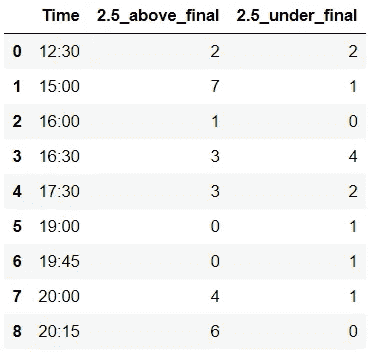
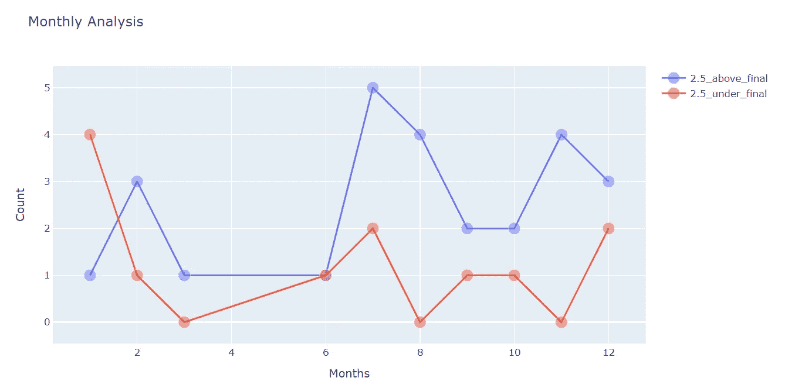

# 体育分析中的探索性数据分析(下)

> 原文：<https://medium.com/analytics-vidhya/exploratory-data-analysis-in-sports-analytics-part-2-5ba6aa50cd5?source=collection_archive---------27----------------------->

## 做出更明智、“更好”的决策

[游牧民](https://unsplash.com/@travelnomades?utm_source=unsplash&utm_medium=referral&utm_content=creditCopyText)在 [Unsplash](https://unsplash.com/s/photos/soccer?utm_source=unsplash&utm_medium=referral&utm_content=creditCopyText) 拍摄的照片

在 [第一部分](/analytics-vidhya/sports-analytics-in-python-part-1-12e4907da227)中，我们做了足球数据集的预处理。在这一部分，我们进行探索性的数据分析。该数据集包含 79 个解释变量，其中包括大量 bet 属性。下面是数据集 gif。

现有数据集(1)

我们将分析 2019 年至 2020 年英超联赛冠军利物浦。我将对数据集进行一些汇总，以汇总的形式呈现出来。这里有一些；

*   时间聚合/时隙聚合
*   日聚合
*   月聚合
*   星期/周末和周末合计

**1-绘图部分**

地块代码(2)

我正在使用 Python 与 Plotly。上面的代码演示了如何绘制线图。我将比较所有聚合的 2.5 低于/高于目标策略。

样本聚合函数(3)

**2-时间/时隙聚合**

第一个聚合是“时间/时间段”特性。显而易见，早上或晚上的表演会影响足球比赛。第一个图显示了 15:00 和 20:15 哪个开球时间更有可能比最终结果高 2.5。我把时间分为早上、下午和晚上。第二个情节被赋予了更多关于开球时间如何影响比赛目标的直觉。

时间聚合结果(4)

时间图(5)

时隙图(6)

**3 天累计**

第二个聚合是“日”属性。从图表中可以清楚地看出，月底可能会比目标高出 2.5 倍。总的来说，其他日子是镜像对称的。

日积月累(7)

**5 个月累计**

第三个聚合是“月”列。该图显示了冬季学期更有可能在期末考下 2.5 的线形图。与其他投注类型的数字相比，夏季比赛的目标更多。

月图(8)

**每周 6 天/周末&周末汇总**

最后的汇总是“星期几/周末&周末”功能。本周第一天的数据表明，周三和周六更有可能超过 2.5 个进球。其他日子，模式几乎是相似的。

星期图(9)

工作日/周末图(10)

**总结**

最后，我们对足球数据集进行了一些探索性的数据分析，以发现特定下注特征的模式和趋势。我的 [Github](https://github.com/yssefunc/sport_analytics) 账户里的所有代码。感谢您的阅读。如果您有任何反馈，请告诉我。**第一部分:点击下面的链接。**

 [## Python 中的体育分析(第 1 部分)

### 一个数据驱动的框架来进行更明智的押注

medium.com](/analytics-vidhya/sports-analytics-in-python-part-1-12e4907da227) 

**G .附录**

**G.1 引用**

 [## 一周 2 场足球比赛对身体表现和受伤率的影响

### 两场比赛之间的恢复时间，72 到 96 小时，似乎足以维持体能水平…

pubmed.ncbi.nlm.nih.gov](https://pubmed.ncbi.nlm.nih.gov/20400751/)  [## 时间对突尼斯男孩足球专项场地测试的影响

### 本研究的目的是探讨在野外训练中某些特定技能表现的日变化

www.scirp.org](https://www.scirp.org/journal/PaperInformation.aspx?PaperID=31128)  [## 欧洲联赛会影响联赛形式吗？

### 在一个新的系列中，我们正在分析流行的足球神话，以找出它们是基于事实还是虚构的。做…

www.bbc.co.uk](https://www.bbc.co.uk/sport/football/35146716)