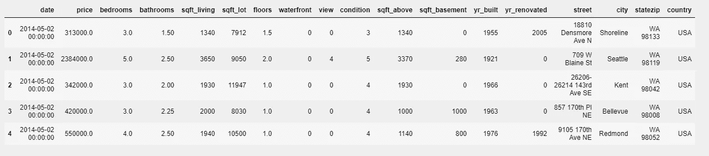
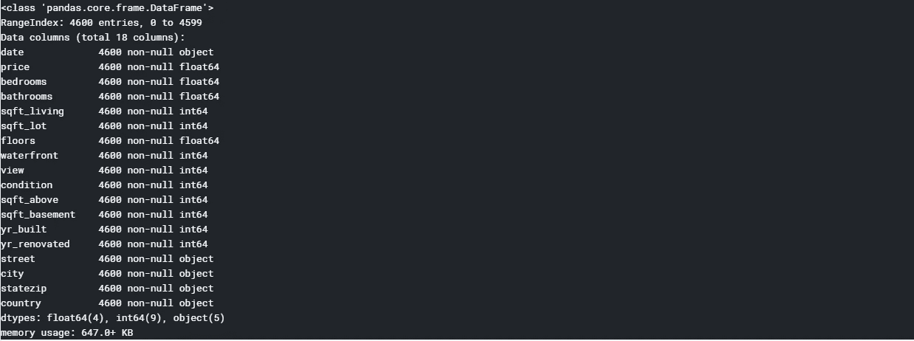
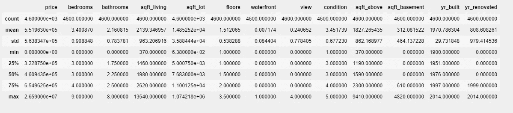
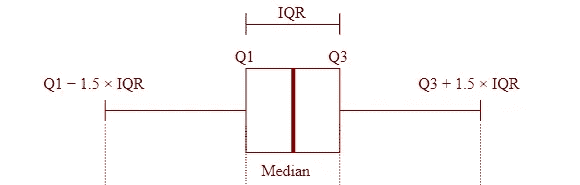
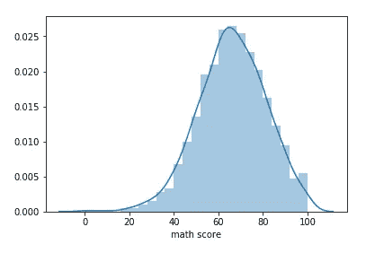
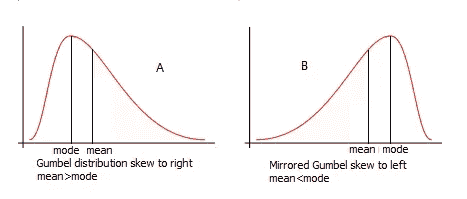
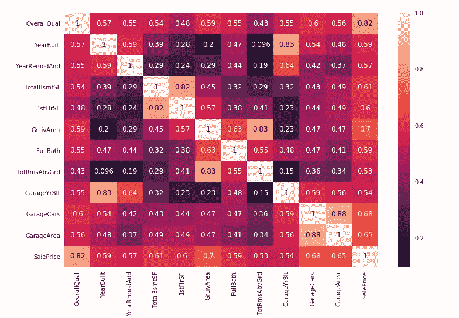
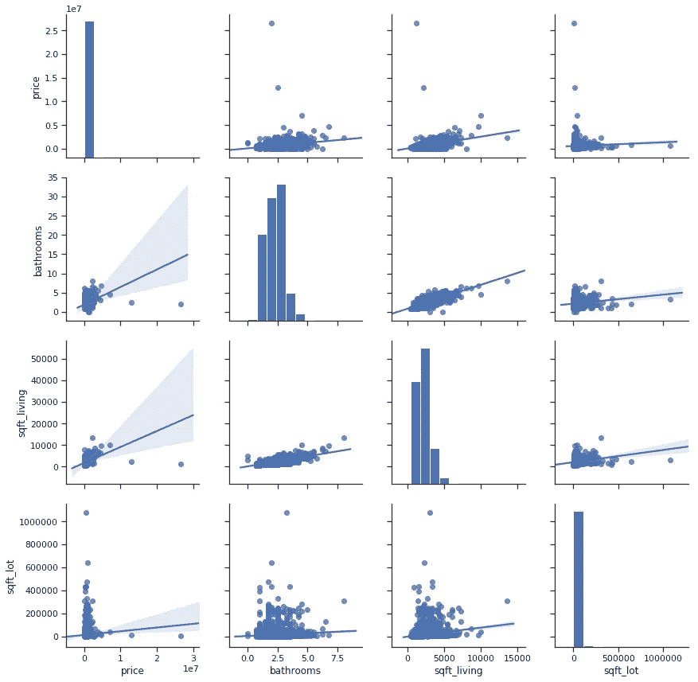

# 探索性数据分析|数据调查

> 原文：<https://medium.com/analytics-vidhya/exploratory-data-analysis-investigation-of-data-8fed5529a3d5?source=collection_archive---------4----------------------->


卢克·切瑟在 [Unsplash](https://unsplash.com?utm_source=medium&utm_medium=referral) 上的照片

在数据科学中，你会多次听到探索性数据分析(简称 EDA)这个术语。但是你知道它是用来做什么的吗？

以下是 EDA 的含义和用途。

**维基百科上说:**

> *中的* [*统计*](https://en.wikipedia.org/wiki/Statistics) *，* ***探索性数据分析****(****EDA****)是一种分析数据集以总结其主要特征的方法，常采用可视化方法。可以使用或不使用统计模型，但 EDA 主要是为了查看数据可以告诉我们什么，而不仅仅是正式的建模或假设测试任务。*

## 使用 **EDA** 的目的

这些是分析师使用 EDA 的许多目的中的一部分。

*   数据的鸟瞰图
*   异常检测
*   数据列之间的相关性
*   极端值
*   平均值、中间值、众数
*   空值
*   概率分布

最重要的是找到哪种机器学习技术最适合用于这些数据，以便为未来做出更好的决策。

现在是时候动手使用 Python 中的 EDA 了。请记住，这些 EDA 用于我们在接下来的故事中构建的回归模型。

# 我们开始吧

首先导入必要的库和包。

```
#loading need libraries
import numpy as np # Scientific Computation 
import seaborn as sns # statistical Visualization of Data
import pandas as pd # relational and Labeled Data manipulation
import matplotlib.pyplot as plt # Plotting library
from scipy import stats # Linear Algebra, signal and image processing and much more%matplotlib inline
```

获取数据为。逗号分隔值（csv）文件格式

```
data= pd.read_csv(‘data.csv’)
```

你可以在 *`read_csv* `方法中使用很多参数，但是我忽略了它们。你可以在 [***这个链接上找到***](https://pandas.pydata.org/pandas-docs/stable/reference/api/pandas.read_csv.html)

查看前 5 行数据:

```
data.head()
```



前 5 行

现在我们需要检查数据列、它们的类型、空约束、填充中的总行数。所以我们使用 info()方法。

```
data.info()
```



行数、列类型、空约束、对象类型

得到数据的信息我们可以看到，我们不应该担心空值。我们也只有 float64，int64 和 object 类型。它们总共有 4600 排。

现在用于分布的最重要的方法是' *train.describe()* '，它解释了许多关于数据的重要事实。

```
data.describe()
```



数据描述

我想在这个方法上花点时间解释一下这有多有用。该方法展示了该数据的一些统计测量值，它们是

1.  数数
2.  平均
3.  标准偏差
4.  最低限度
5.  最高的
6.  25%百分位
7.  50%百分位
8.  75%百分位

我们需要知道这些统计术语，以便从这种方法中获得更多。

**平均值 vs 中值 vs 众数**

平均值是所有数据点的总和，然后除以数据点的总数，而中位数是中间数据点。模式是最高的数据点。

**标准差**

它表明数据偏离平均值的程度。标准差的低值表示数据非常接近平均值，这对建模非常有利，标准差的较高值表示数据偏离平均值。

**百分位数**

> **百分位数**(或百分位数)是统计学中使用的一种度量，表示一组观察值中给定百分比的观察值低于该值。例如，第 20 个**百分位数**是一个值(或分数),在该值以下可以找到 20%的观察值。

为什么需要百分点？

百分位数是除高斯分布方法之外发现数据中异常值的另一种方法。**四分位距** ( **IQR** )是统计学中用于发现数据中异常值的术语。它是通过从 75%瓦片中减去 25%瓦片计算出的值，从而得到中间的 50%，即 **Q3 - Q1**

在使用 describe()方法之后，您应该知道这个方法对于从数据中获得洞察力有多么重要。

**箱线图**

如果您想要直观地表示第 25 个百分位数、第 50 个百分位数和第 75 个百分位数，则使用箱线图，该图绘制所有四分位数并显示位于从**Q1-(1.5 * IQR)到 Q3+(1.5*IQR)** 范围之外的异常值。



箱线图

超出此范围的数据点(即**Q1-(1.5 * IQR)到 Q3+(1.5*IQR)** )将被视为异常值。

**距离图**

通过 distplot，您可以直观地看到数据是如何分布在平均值周围的。如果它生成一个钟形曲线，这意味着数据是正态分布的，这可能是一个回归问题。让我们更加了解它。

以下代码行可以在 python 中生成 distplot。

```
plt.figure(figsize=(30,5))
sns.distplot(data[‘price’],fit=stats.norm)
plt.show()
```



散点图有时右偏，有时左偏。右偏意味着众数以上的点数多于众数以下的点数。也就是**模式<的意思。右侧分布的尾部较长。右斜的反义词是左斜，即**表示>模式**。**



如果**均值=众数=中位数**，则数据呈正态分布。这是一个很好的迹象，表明您可以使用回归模型来获得未来的预测。但是，如果您的数据不是正态分布的，那么您可以应用转换来将不太正态分布的数据转换得更接近正态分布。之后你可以使用回归模型。

**热图**

热图是用不同颜色表示数据值的非常漂亮和有用的方式。

```
cor = data.corr()
plt.subplots(figsize=(12, 8))
sns.heatmap(cols, annot=True)
plt.show()
```



它绘制了所有数据列之间的相关性。相关性是指一对变量彼此线性相关的程度。相关值越大，意味着变量对之间的关系越强。

**成对图**

它直观地将每一个可能的配对表示成图形。这种图形的目的是检查变量对的相关性。或者用另一种方式来表示变量对的相关性。

```
col = ['date', 'price', 'bedrooms', 'bathrooms', 'sqft_living',         'sqft_lot','floors', 'waterfront', 'view','condition','sqft_above',
'sqft_basement', 'yr_built', 'yr_renovated', 'street', 'city',
'statezip', 'country']
sns.set(style='ticks')
sns.pairplot(train[col], size=3, kind='reg')
```



通过使用 pairplot，您可以很容易地找出相互关联的变量，并排除哪些目标变量不依赖于它。这里我排除了 14 个独立变量，因为它们在 pairplot 上非常分散。

让我们总结一下到目前为止我们所做的工作:

我们做了一些探索性的数据分析，从数据中获得初步的见解，并找出影响目标变量的列。

在下一个故事中，我将讨论不同类型的数据转换(对数、倒数、平方)，以使数据更适合/兼容用于构建模型。