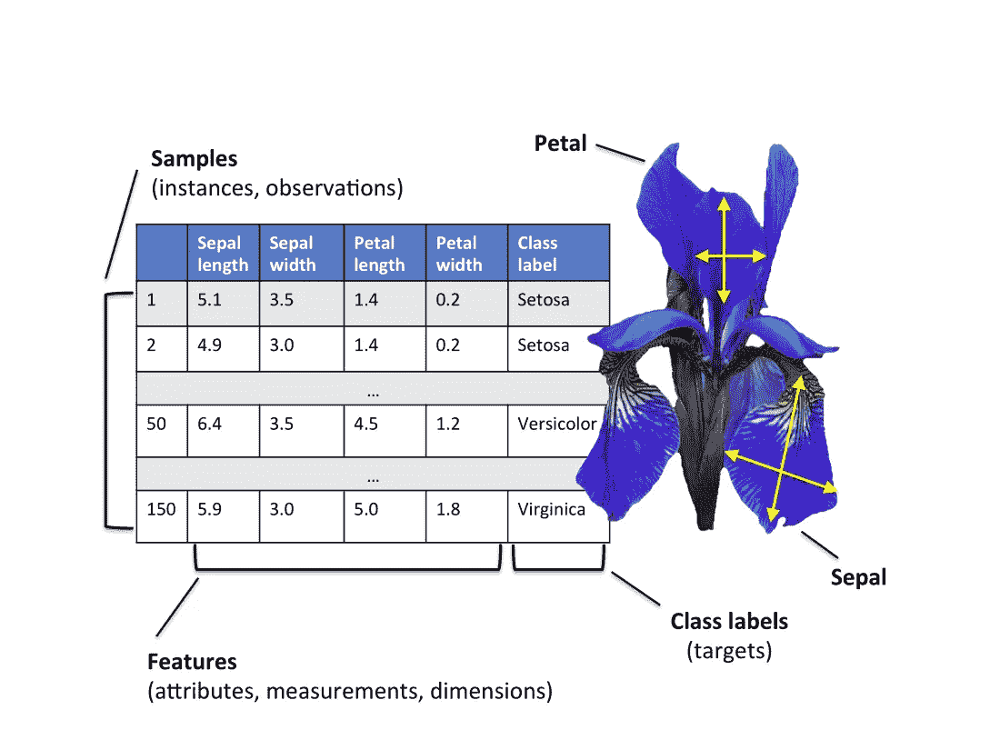
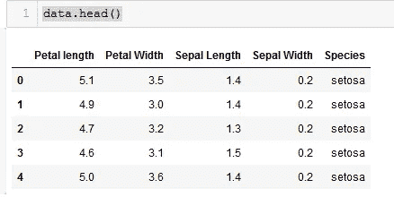
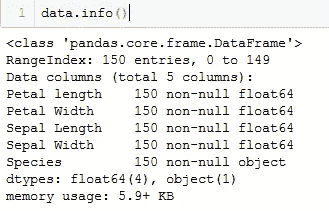
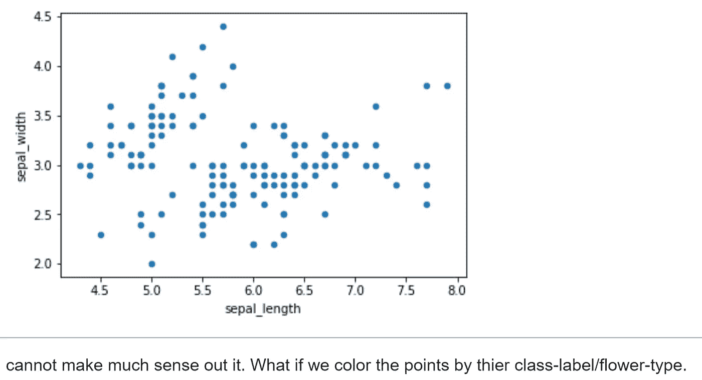
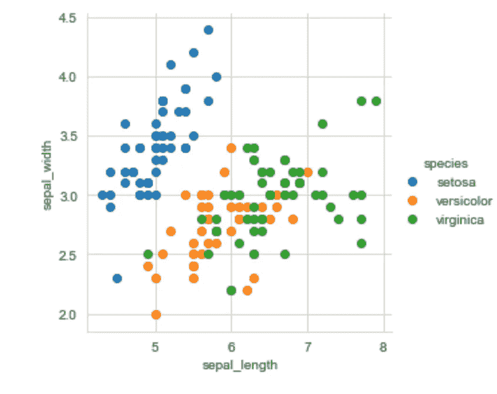
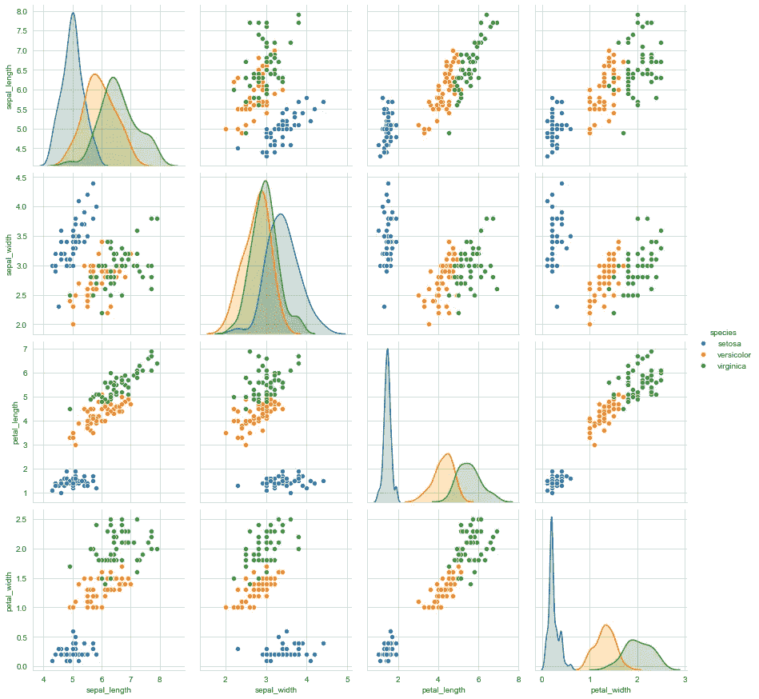
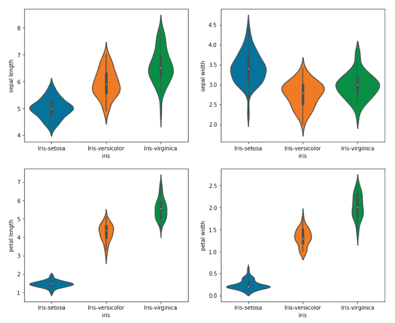

# 探索性数据分析:Iris 数据集

> 原文：<https://medium.com/analytics-vidhya/exploratory-data-analysis-iris-dataset-32d09a52f322?source=collection_archive---------5----------------------->


你好，未来数据科学家，

我们知道 Iris 上的探索性数据分析(EDA)是一件非常常见的事情。这就像一个数据科学的 hello 世界。在著名的 ***Iris 数据集*** 上，有成吨的存储库可用于探索性数据分析。

用 iris 数据集来解释 EDA 的过程非常容易，这就是为什么我把它写进了我的博客。

因此，把它作为我在 iris 数据集上的探索性数据分析(EDA)版本。

所以让我们开始探索



如图所示，该数据集具有五个特征，如花瓣长度、花瓣宽度、萼片长度、萼片宽度和物种类型。

所以这里的目标是用数据来说明数据在告诉我们什么(开玩笑)😂。意味着**从我们的 iris **数据集中包含的信息中提取**可操作的**见解**。**

从导入重要的库开始

> 将熊猫作为 pd 导入
> 将 matplotlib.pyplot 作为 plt 导入
> 将 numpy 作为 np 导入
> 将 seaborn 作为 sns 导入

在这里，我们从虹膜数据集创建一个数据框

> iris = pd.read_csv("iris.csv ")

我们使用 pandas 库中的 DataFrame 函数将数据数组转换为 Pandas Dataframe，其中包含列“花瓣长度”、“花瓣宽度”、“萼片长度”、“萼片宽度”，并创建一个新列“物种”，其中包含来自数据集中的目标值。

要查看特性和前 5 行，我们可以使用 head()函数

> iris.head()
> 
> iris.info



我们可以检查一些简单的细节，比如形状、柱子。

> iris . shape
> iris . columns
> iris【物种】。值计数()

现在，我们将绘制/可视化我们的数据，以了解数字特征之间的关系。我已经使用 seaborn 库进行绘图，我们也可以使用 python matplotlib 库来可视化数据。

为了更好的理解，让我们画一些图。

2D 和三维散点图:

> iris.plot(kind='scatter '，x='sepal_length '，y='sepal_width')
> plt.show()



这里所有的数据点颜色都不一样，所以我们无法区分哪种花的萼片长度和萼片宽度。

> SNS . set _ style(" white grid ")；
> sns。FacetGrid(iris，hue="species "，size=4) \
> 。map(plt.scatter，"萼片长度"，"萼片宽度")\
> 。add _ legend()；
> PLT . show()；



观察:

```
1\. Using sepal_length and sepal_width features, we can distinguish setosa from other.
2\. separating versicolor from virginica is much harder as they have considerabl overlap.
```

有许多不同类型的图，如条形图、箱线图、散点图等。当我们分析 x 轴和 y 轴上两个特征之间的关系时，散点图非常有用。

还有一个叫做成对图的图，它对于一次散点绘制所有要素非常有用，而不是单独绘制它们。

> PLT . close()
> SNS . set _ style(" white grid ")；
> sns.pairplot(iris，hue="species "，size = 3)；
> plt.show()



对角线元素是每个特征的 pdf。pdf 解释如下。

**观察结果**

1.  花瓣长度和花瓣宽度是识别各种花类型的最有用的特征。
2.  虽然 Setosa 很容易识别(线性可分)，但 Virnica 和 Versicolor 有一些重叠(几乎线性可分)。
3.  我们可以找到“线条”和“if-else”条件来建立一个简单的模型来对花的类型进行分类。

现在让我们用所有输入变量相对于输出变量物种的小提琴图来可视化数据。小提琴图显示了物种的长度和宽度的密度。较薄的部分表示密度较小，而较厚的部分表示密度较高

> *plt.figure(figsize=(12，10))
> plt.subplot(2，2，1)
> SNS . violinplot(x = " Species "，y="Sepal Length "，data=data)
> plt.subplot(2，2，2)
> SNS . violinplot(x = " Species "，y="Sepal Width "，data=data)
> plt.subplot(2，2，3)
> sns.violinplot(x*



好了，有了这个图，我就在这里结束我的博客。我们可以在虹膜数据集中使用更多的数学运算(如 PDF、CDF、mean、median)来从数据中获得更多的洞察力。记住笔记本文档是非常重要的，这意味着用一种非技术人员也能理解的方式写代码和文档。我将从那里提供我的 python 笔记本，你可以参考。

链接:[https://github . com/Sambhunath-sa hoo/explorative-data-analysis-EDA-/blob/master/exploratorydata analysis _ IRIS _ practices . ipynb](https://github.com/Sambhunath-Sahoo/Exploratory-data-analysis-EDA-/blob/master/ExploratoryDataAnalysis_IRIS_Practics.ipynb)

非常感谢你阅读我的博客！
#住宿之家#住宿安全