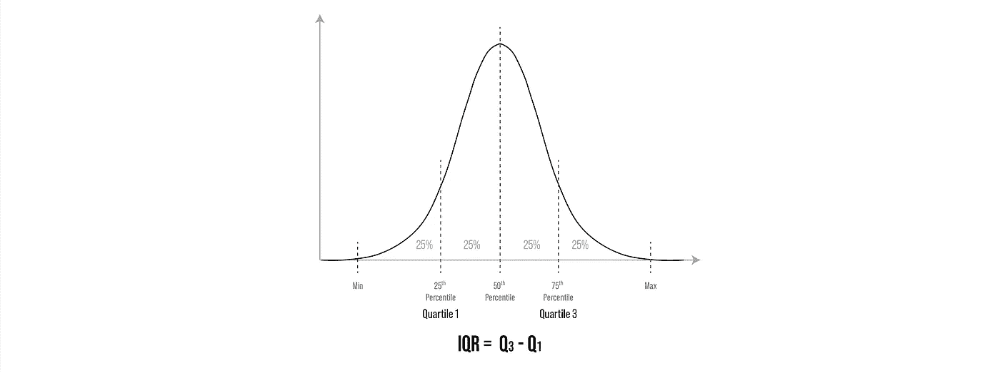

# 探索性数据分析:最大限度地扩大女性在科技领域的受众范围

> 原文：<https://medium.com/analytics-vidhya/exploratory-data-analysis-maximizing-audience-reach-for-women-in-tech-398099e89d0?source=collection_archive---------41----------------------->

与[达里安·米切尔·通塔尔](https://medium.com/u/e523889b0e9b?source=post_page-----398099e89d0--------------------------------)和[艾尔·柳](https://medium.com/u/319cb9cc7414?source=post_page-----398099e89d0--------------------------------)

W omen Tech Women Yes (WTWY)是一个虚构的组织，正在寻求在纽约市举办一场夏季晚会，以“增加女性在技术领域的参与，同时建立意识和影响力”

# **主要目标**

作为一个数据科学团队，我们被要求就向何处派遣调查团队提出建议，以便**最大限度地提高活动效果(参与者数量&捐赠)。**

# 数据

为了实现这一目标，我们将查看*的两个*数据集:

1.  [纽约市大都会运输署(MTA)地铁十字转门数据(2017 年至 2019 年 3 月至 6 月)](http://web.mta.info/developers/turnstile.html)。
    用于衡量一个地点的繁忙程度，以便接触最多的潜在与会者。
2.  美国社区调查(ACS) 2015 [人口特征](https://data.census.gov/cedsci/table?d=ACS%205-Year%20Estimates%20Data%20Profiles&table=DP05&tid=ACSDP5Y2015.DP05&g=0400000US36)和[经济特征](https://data.census.gov/cedsci/table?d=ACS%205-Year%20Estimates%20Data%20Profiles&table=DP03&tid=ACSDP5Y2015.DP03&g=0400000US36)。
    寻找最有可能参加晚会并为慈善事业捐款的特定观众群体。

而我们将在*三个*步骤中得出结论:

# 步骤 1:数据清理

一般来说，我们总是希望*格式化列*，*删除重复条目*，并且*识别异常值*。如果你想了解更多细节，这里有一篇很棒的文章供你参考。

以 MTA 十字转门数据集为例，我们将首先*格式化列*以确保没有隐藏的空白。

清除列标题中的空白。

然后，我们想找到每个十字转门处的*总客流量*，但是我们注意到数据集中的“入口”和“出口”列是客流量的累计计数。因此，为了清理这部分数据，我们需要计算“Entries”列和“Exits”列中各行之间的差异，然后将它们相加，得到总的客流量:

我们用来计算总客流量的代码。

说明如何计算和创建“增量”列的图示。

“DELTA”列计算两次审计之间的总客流量，在这种情况下，它每 4 小时测量一次十字转门的总客流量。

我们还注意到，对于这些十字转门，累计计数会在计数达到某个阈值后重置。这表明复位前后的计数之间的数字差异可能相当大，有时高达数十亿。

为了去除重置产生的异常值，我们将使用[四分位间距](https://en.wikipedia.org/wiki/Interquartile_range) (IQR)的概念。我的队友[达连·米切尔-通塔尔](https://medium.com/u/e523889b0e9b?source=post_page-----398099e89d0--------------------------------)想出了这个主意:

我们在分析中是如何定义 IQR 的。

展示 IQR 一般概念的插图。

# 第二步:数据分析

虽然有许多方法来分析数据，但过程是相同的，这里我将分享一个例子，说明我们如何对数据进行分组，以找到在纽约每个区作为"*专业人员*"工作的女性。

我们是如何发现女性在纽约的每个区都是作为职业女性工作的。

结果将如下所示。

# 步骤 3:数据可视化

在这里我将分享从[这里](/@junyoung_lee/analysis-of-new-york-mta-turnstile-data-95251e212206)整理出来的定义和我们做的一些图表:

> *“C/A =控制区域*
> 
> *单元=站的远程单元*
> 
> *SCP =子单元通道位置代表设备的特定地址*
> 
> *站=表示设备所在的站名*
> 
> *LINENAME =表示在*站可以登上的所有列车线路
> 
> *DIVISION =代表车站原来属于 BMT、IRT 或 IND* 的线路
> 
> *日期=代表日期(MM-DD-YY)*
> 
> *TIME =表示预定审计事件的时间(hh:mm:ss)*
> 
> *DESc =代表“定期”计划审核事件(通常每 4 小时发生一次)*
> 
> *条目=设备的累积条目寄存器值*
> 
> *退出=设备的累计退出寄存器值*

每日平均最繁忙的 10 个车站。

按工作日划分的最繁忙的 4 个车站的平均客流量。

最繁忙的 4 个车站。

纽约市所有 5 个区的女性人均收入。

我们假设，在人口普查数据中担任“*”(包括*管理、商业、科学、&艺术*)职业的女性是最有可能出席并向该事业捐赠的**，因为这是一个主要关注科技行业的盛会。***

**

*普查数据中的“专业”被定义为“管理、商业、科学和艺术”*

# *结论*

*根据我们到目前为止所做的所有分析，我们得出的结论是，我们应该把主要精力放在曼哈顿区，以获得最好的人力结果。*

*这里我们总结了在 **2 个最繁忙的时间段**派遣调查团队的**前 3 个地点**。第一选择的*澄清*是该位置包含第三繁忙的车站:Penn 车站，第二繁忙的车站:Herald SQ 车站，都在 1 个街区的步行距离内。这就是为什么你会看到 3 个位置，但 4 个不同的车站。*

**

*一幅插图，突出显示了前往潜在客流量最高的 4 个车站的最佳时间范围。*

# *未来改进*

*在我们迄今所做的工作基础上，我们还有许多地方可以改进。首先，我们获得了每个十字转门的流量:*

**

*C/A + Unit + SCP 识别一个独特的十字转门，就像一个序列号*

*如果我们能够获得每个车站的最新*建筑平面图*(特别是“A 表”)，我们就可以找到**那些**前 10 名**十字转门在地图**上的确切位置，并将它们推荐给调查小组，以便根据**最佳人均功率**进一步优化操作。*

**

*如何做进一步工作的说明。[背景图来源](http://www.projectsubwaynyc.com/gallery)。*

*感谢您的阅读，我希望这将为您的工作带来有益的见解。*