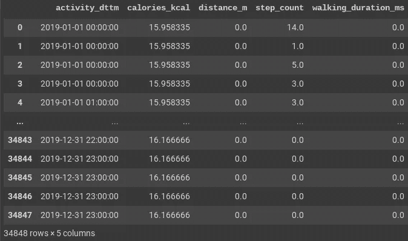
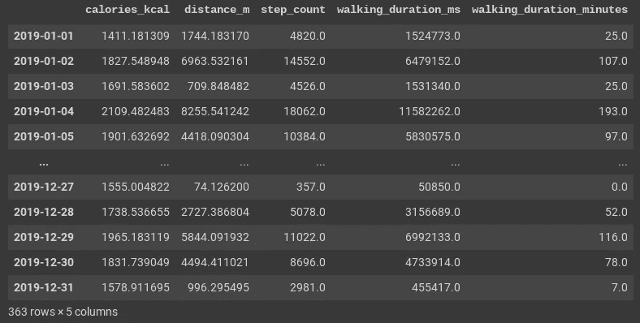
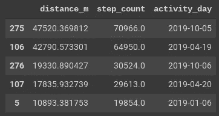
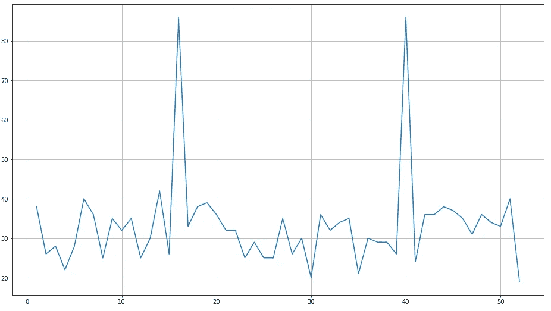
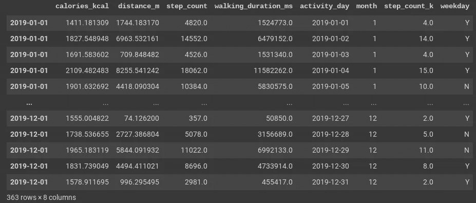
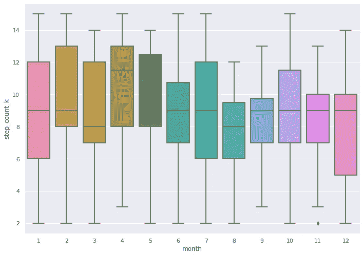
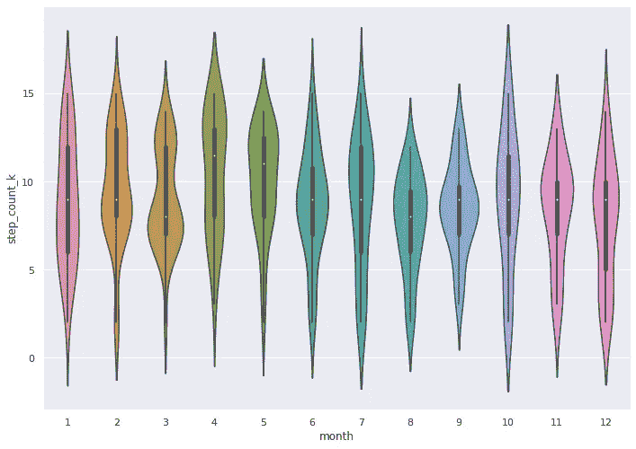
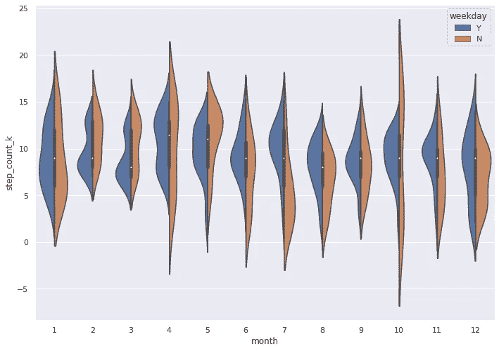
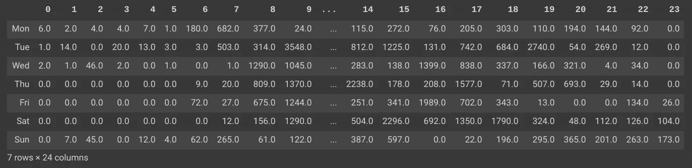
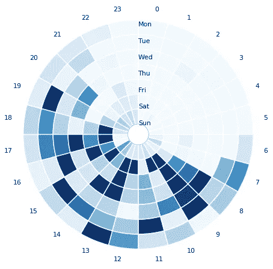

# 探索性数据分析 Google Fit 数据与熊猫和海牛

> 原文：<https://medium.com/analytics-vidhya/exploratory-data-analysis-of-google-fit-data-with-pandas-and-seaborn-a4369366c543?source=collection_archive---------10----------------------->


安迪·比厄斯在 [Unsplash](/s/photos/running-technology?utm_source=unsplash&utm_medium=referral&utm_content=creditCopyText) 上的照片

在这篇文章中，我想用熊猫来说明谷歌健身数据的探索性数据分析，通过对个人健身活动进行一些可视化来进行一些观察。

## 动机

大多数个人健身跟踪设备都有一个应用程序支持，显示一系列分析，让用户有动力实现他们的健身目标。如果你对这种分析的兴趣与应用程序自带的不同，那该怎么办？如果你手里有数据，你更喜欢自己的定制洞察怎么办？

我有这个设备 [Fossil Q Marshal](https://www.tomsguide.com/us/fossil-q-marshal-smartwatch,review-4417.html) ，运行 Google Wear 操作系统，并将我的活动数据同步到 Google Fit。尽管该手表提供了良好的健身体验，但提供的健身见解却相当枯燥。我的数据分析师思路带我走了不同的路，想知道如何更好地了解我的日常活动。然后我偶然发现了 Goolge 外卖。

## 谷歌外卖——适合

通过[外卖](https://takeout.google.com)，谷歌提供了一个导出我们通过不同应用程序获取的个人数据的工具。Google Fit 就是其中之一，它提供了一种探索我们所有活动数据历史的方法。拿到这些数据增加了我分析自己一年来活动模式的好奇心。*这种方法不仅限于 Google Fit，如果你有不同设备或应用程序的数据，只需稍加调整就可以扩展。*

## 数据提取和设置

1.  前往 takeout.google.com
2.  选择 Google Fit 并创建导出
3.  收到数据存档可用的通知后，下载并解压缩存档

## 档案里有什么？

该档案由两个文件夹组成，其中包含不同格式的数据。活动文件夹包含 TCX(培训中心 XML)格式的数据，这是一种封装了活动、时间和地理坐标的数据交换格式。另一个文件夹“每日聚合”包含一组 csv 文件，模式为 yyyy-mm-dd.csv，每天一个文件。每个文件都记录了卡路里、距离、纬度和经度、行走持续时间以及 15 分钟间隔内的步数。

作为第一步，我们需要解析这些 csv 文件，加载到 pandas 数据框架中，并执行一些分析，以获得一些我们渴望知道的见解。

解析 2019 年的每日聚合

上面的代码片段

1.  使用 pdf.read_csv 将每个每日聚合文件(自 2019 年)解析为数据帧
2.  通过在文件名中添加日期前缀，将时间字段转换为日期时间字段
3.  将所有数据帧连接成一个带有所需列子集的数据帧
4.  应用索引

结果看起来像这样



activity_dttm(活动时间)、消耗的卡路里、移动的距离、步数和时间

这种间隔为 15 分钟的原始数据需要汇总并汇总到每日。



每天的聚合活动数据

这给出了日常活动的图像，适合于进一步的分析。

## 问:2019 年我最活跃的 5 天是哪几天？

对 step_count 应用熊猫 nlargest

```
df_daily_group.nlargest(5,"step_count")[["distance_m","step_count","activity_day"]]
```



等等！，一天 47 公里！！！。我没在手表上做手脚。4 月 19 日至 20 日和 10 月 5 日至 6 日，我参加了为期两天的徒步活动，全程 65 公里。

## 问:我通常一周走多远？

按周分组，并将米转换为公里



2019 年的每一周都有公里行走

我平均一周走 25-35 公里。在悉尼一年中较温暖的时候(第 0-20 周和第 40-52 周)，平均温度更高，约为 35 度。在一年中较冷的时候，我有点懒，只有 35 公里，在 25-30 公里之间波动。

由于我的 65 公里行走中的两个异常值，所有的星期在图表中都显得矮小了。让我们尝试使用箱线图来分析一个月内的步数分布，箱线图提供了一个更好的视图，显示了度量值如何分布在中位数周围。

为了实现这一点和更多的图形，让我们添加更多的列，并以千片为单位归一化步进数，并将它们限制在 2K 到 15K 的范围内。

按月和日分组，标准化步骤并为工作日设置标志



导出月份、工作日/周末，并将步长归一化为 2k 到 15k 之间的千位步长

## 问:我的步行距离逐月分布如何？

让我们使用 seaborn 为每个月的每日步数绘制一个方框图。

```
sns.boxplot(x=df_monthly_group_2019["month"],y=df_monthly_group_2019["step_count_k"])
```

方框代表中间 50%的测量值除以粗线代表的中值。其余线条描绘了较低的 25%和较高的 25%分布。



步骤的方框图

解读剧情，

*   1 月和 7 月我走过了相似的距离，6-12K，中间值为 9K
*   在二月和三月，我增加了 8-9K 和 7-8K 步的频率，然后减少了 9-13K 和 8-12K 步的频率
*   在 4 月和 5 月，这一趋势发生了逆转。我跑 8-10 公里的频率减少了，走 11-13 公里的频率增加了。我在四月和五月一直比前两个月更活跃

这种解读不是很直观。尽管箱线图显示了测量值的分布，但它并没有描绘出测量值在四分位数中的频率。

小提琴情节填补了这一空白。Violin plot 通过显示测量值被观察到的频率来说明频率分布，同时在中间嵌入一个方框图，用一个点来表示中值。

要绘制小提琴图，只需用 violin plot 替换 boxplot。

```
sns.violinplot(x=df_monthly_group_2019["month"],y=df_monthly_group_2019["step_count_k"])
```



小提琴情节

解读剧情，

*   一月和七月看起来不再和盒子图中的一样。在一月份，我跑了 6K 多的天数，在七月份，我跑了 11K 多。这在一月和六月完全相同的箱形图中并不明显。总的来说，我在七月比一月更活跃。
*   二月和三月的较低回合表明我走 8-9K 和 7-8K 更频繁
*   4 月和 5 月的上一回合表明我走了 11-13K 更频繁

这种解读比箱线图更直观。

小提琴情节伴随着许多华而不实的东西。其中之一是在同一个图中用相同的度量表示两个类别。

让我们来看看我在工作日和周末的步行情况。色调参数可以达到这个目的。提供工作日标志作为色调。

```
sns.violinplot(x=df_monthly_group_2019["month"],y=df_monthly_group_2019["step_count_k"],hue=df_monthly_group["weekday"],split=True)
```



解读分裂的小提琴曲，

*   在一月，我在工作日和周末的活动几乎是一样的。但在 7 月，我在周末并不活跃。在 4K 附近，工作日的交易高于中位数，周末的交易远低于中位数
*   在二月和三月，周末和周末的活动几乎相同。在五月，我在周末比平日更活跃
*   总的来说，我的周末没有工作日活跃

## 问:我一周内有多活跃，一天中的哪些时段是活跃的？

为了表现这一点，我需要用一个热图来讲述这个涉及 168 个小时的故事，以时间轮的形式。

下面的代码片段为每小时创建了一个每周活动的枢纽。

结果呢



每小时走的步数

下面是我在 [stackoverflow](https://stackoverflow.com/questions/40352607/time-wheel-in-python3-pandas) 上找到的一段代码，用来绘制时间轮。这个代码片段将这个数据帧转换成一个圆形热图，每个小时一个圆圈，每天一个圆圈。



从剧情解读，

*   我一天中最活跃的时间是早上 8 点到晚上 7 点
*   我的大部分活动都集中在这一周的 8，9，16，17 小时之间，通常是我的通勤时间
*   在 13-14 小时之间活动频繁，这包括我午餐后的散步
*   我周日的活动量很低

来自这一分析的所有代码都可以在[这里](https://github.com/vmnamburu/pyfit/blob/master/PyFit_with_Pandas_and_Seaborn.ipynb)作为 python 笔记本获得。这种分析可以通过关联我所在郊区的天气数据来进一步扩展，并分析模式如何随天气条件而变化。