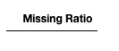

# 爱荷华房价预测问题的探索性数据分析

> 原文：<https://medium.com/analytics-vidhya/exploratory-data-analysis-of-iowa-housing-price-prediction-problem-3d50a016797a?source=collection_archive---------2----------------------->

## 第二部分—分析、清洁和可视化

在这篇文章中，我们使用 79 个解释变量来解释房子的几乎每个方面，解决了预测位于爱荷华州埃姆斯的房子的销售价格的问题。这是我的数据科学入门系列的第二部分。它涵盖了来自 Kaggle 竞赛的爱荷华州房价数据 EDA—[房价:高级回归技术。](https://www.kaggle.com/c/house-prices-advanced-regression-techniques/overview)

*   [第一部——关于泰坦尼克号生存问题的 EDA](https://vrevathi.medium.com/exploratory-data-analysis-of-titanic-survival-problem-e3af0fb1f276)
*   第二部分——爱荷华州房价预测 EDA
*   [第三部分——模型构建、评估和组装](https://vrevathi.medium.com/modeling-evaluation-and-ensembling-f00fe1de6470)

关于综合 EDA 的详细笔记可以在[reys code/start-data science](https://github.com/reyscode/start-datascience)找到。

# 目录

1.  [变量研究](#89bb)
2.  [目标变量分析](#04ea)
3.  [空值和缺失值研究](#6035)
4.  [数据清理](#1d0d)
5.  [相关性研究](#bd07)
6.  [双变量分析](#2f3f)
7.  [多元分析](#5b7b)

# 变量研究

首先，让我们导入笔记本中使用的必要库。

```
import numpy as np
import pandas as pd%matplotlib inline
import matplotlib.pyplot as pltimport seaborn as sns
color = sns.color_palette()
sns.set_style('darkgrid')import warnings
def ignore_warn(*args, **kwargs):
    pass
warnings.warn = ignore_warn #ignore annoying warning (from sklearn and seaborn)#statistics
from scipy import stats
from scipy.stats import norm, skew
```

我们来读一下训练和测试数据。

```
train = pd.read_csv('../data/train.csv')
test = pd.read_csv('../data/test.csv')train.head()
```


```
test.head()
```


数据集中有 81 列。让我们看看有多少数据点可用。

```
train.shape, test.shape
```


因此在训练数据集中有 1460 个项目，在测试数据集中有 1459 个项目。显然，火车数据中还有一列是目标变量‘sale price’。

让我们从训练和测试数据中删除“Id”列，因为我们不会将它输入到我们的模型中。

```
train_ID = train['Id']
test_ID = test['Id']train.drop("Id", axis = 1, inplace = True)
test.drop("Id", axis = 1, inplace = True)
```

现在，让我们检查表格中的列，以便对我们手头的内容有一个大致的了解。

```
train.columns.values
```


这是一个很大的列表。让我们从最后一个开始——“销售价格”。

# 目标变量分析

我们买房时首先要考虑的是居住面积。所以我们来分析一下居住面积和目标变量‘销售价格’的关系。

```
fig, ax = plt.subplots()
ax.scatter(x = train['GrLivArea'], y = train['SalePrice'])
plt.ylabel('SalePrice', fontsize=15)
plt.xlabel('GrLivArea', fontsize=15)
plt.show()
```


从上面的地块来看，居住面积和出售价格大致呈线性关系。上面的两个点表示价格突然上涨。可能是因为房子位于热点区域。

另外，请注意右下方的两个点，那里的种植面积较大，销售价格较小。可能是城市附近的农业用地。这两点并不遵从清晰可见的一般模式。他们不遵守规则。这些被称为*异常值*。将这两个数据点输入到我们的模型中可能会影响模型的性能。因此我们应该在建模之前删除这些异常值。

```
sns.distplot(train['SalePrice'] , fit=norm);(mu, sigma) = norm.fit(train['SalePrice'])
plt.legend(['Normal dist. ($\mu=$ {:.2f} and $\sigma=$ {:.2f} )'.format(mu, sigma)],
            loc='best')
plt.ylabel('Frequency')
plt.title('SalePrice distribution')fig = plt.figure()
res = stats.probplot(train['SalePrice'], plot=plt)
plt.show()
```


正如我们在图表中看到的，数据不是正态分布的。线性模型期望数据是正态分布的。因此，我们需要将变量转换成正态分布——钟形曲线。

```
train["SalePrice"] = np.log1p(train["SalePrice"])

sns.distplot(train['SalePrice'] , fit=norm);(mu, sigma) = norm.fit(train['SalePrice'])
plt.legend(['Normal dist. ($\mu=$ {:.2f} and $\sigma=$ {:.2f} )'.format(mu, sigma)],
            loc='best')
plt.ylabel('Frequency')
plt.title('SalePrice distribution')fig = plt.figure()
res = stats.probplot(train['SalePrice'], plot=plt)
plt.show()
```


我们刚刚对“销售价格”变量进行了对数转换，减少了变量的偏差，并产生了或多或少呈正态分布的变量。

在进一步进行数据清理和建模之前，让我们合并测试和训练数据，这样我们就不需要清理数据两次。

```
ntrain = train.shape[0]
ntest = test.shape[0]
y_train = train.SalePrice.values
all_data = pd.concat((train, test)).reset_index(drop=True)
all_data.drop(['SalePrice'], axis=1, inplace=True)
print("all_data size is : {}".format(all_data.shape))
```


# 空值和缺失值研究

首先，让我们找到数据集中缺失的值。

```
all_data_na = (all_data.isnull().sum() / len(all_data)) * 100
all_data_na = all_data_na.drop(all_data_na[all_data_na == 0].index).sort_values(ascending=False)[:30]
missing_data = pd.DataFrame({'Missing Ratio' :all_data_na})
missing_data.head(15)
```


让我们看看丢失值较多的前五行数据。游泳池、恶作剧、小巷、栅栏和壁炉。这些变量对于预测销售价格似乎并不十分重要。但是我们先不要放弃它们。让我们用 0 或无来填充缺失的值，然后继续建模。

现在，让我们画出缺失值。

```
f, ax = plt.subplots(figsize=(10, 8))
plt.xticks(rotation='90')
sns.barplot(x=all_data_na.index, y=all_data_na)
plt.xlabel('Features', fontsize=15)
plt.ylabel('Percent of missing values', fontsize=15)
plt.title('Percent missing data by feature', fontsize=15)
```


# 数据清理

如果输入的类型是整数，我们用 0 填充缺少的值，如果是分类的，我们填充“无”。稍后，我们将使用标签编码器将这些分类变量转换成数字形式，我将在下一篇关于模型构建和评估的文章中解释这一点。

```
for col in ('GarageYrBlt', 'GarageArea', 'GarageCars', 'BsmtFinSF1', 'BsmtFinSF2', 'BsmtUnfSF','TotalBsmtSF', 'BsmtFullBath', 'BsmtHalfBath', 'MasVnrArea'):
    all_data[col] = all_data[col].fillna(0)for col in ('GarageType', 'GarageFinish', 'GarageQual', 'GarageCond', 'BsmtQual', 'BsmtCond', 'BsmtExposure', 'BsmtFinType1', 'BsmtFinType2'. 'MasVnrType', 'MSSubClass', 'PoolQC', 'MiscFeature', 'Alley', 'Fence', 'FireplaceQu' ):
    all_data[col] = all_data[col].fillna('None')
```

对于下面的输入变量，我们用最常见的值填充缺失的值。请注意，变量 LotFrontage 的类型是“float”。一般来说，一所房子的临街面积与邻近的房子大致相等。因此，我们按“邻居”对数据进行分组，并用邻居房屋的中值来填充缺失值。

```
all_data["LotFrontage"] = all_data.groupby("Neighborhood")["LotFrontage"].transform(lambda x: x.fillna(x.median()))all_data['MSZoning'] = all_data['MSZoning'].fillna(all_data['MSZoning'].mode()[0])all_data['Electrical'] = all_data['Electrical'].fillna(all_data['Electrical'].mode()[0])
all_data['KitchenQual'] = all_data['KitchenQual'].fillna(all_data['KitchenQual'].mode()[0])
all_data['Exterior1st'] = all_data['Exterior1st'].fillna(all_data['Exterior1st'].mode()[0])
all_data['Exterior2nd'] = all_data['Exterior2nd'].fillna(all_data['Exterior2nd'].mode()[0])
all_data['SaleType'] = all_data['SaleType'].fillna(all_data['SaleType'].mode()[0])
```

如果我们查看“Utilities”列，几乎所有的列都有相同的值“AllPub ”,这意味着这个变量对预测没有帮助。因此，我们删除了这一列。

```
all_data = all_data.drop(['Utilities'], axis=1)
```

让我们将“Functional”列的“NA”值替换为 Typical—“Typ”。

```
all_data["Functional"] = all_data["Functional"].fillna("Typ")
```

现在让我们检查数据中是否还隐藏着更多的缺失值。

```
all_data_na = (all_data.isnull().sum() / len(all_data)) * 100
all_data_na = all_data_na.drop(all_data_na[all_data_na == 0].index).sort_values(ascending=False)
missing_data = pd.DataFrame({'Missing Ratio' :all_data_na})
missing_data.head()
```



太好了！数据集中不存在缺失值。

现在我们将某些列的数据类型从“object”更改为“str”。

```
all_data['MSSubClass'] = all_data['MSSubClass'].apply(str)all_data['OverallCond'] = all_data['OverallCond'].astype(str)all_data['YrSold'] = all_data['YrSold'].astype(str)
all_data['MoSold'] = all_data['MoSold'].astype(str)
```

由于“面积”在预测价格中起着重要的作用，让我们创建一个新的列，包含房子的总面积，包括地下室、一楼和二楼。

```
all_data['TotalSF'] = all_data['TotalBsmtSF'] + all_data['1stFlrSF'] + all_data['2ndFlrSF']
```

现在，我们从所有数据中分离干净的数据，并将其与 SalePrice 一起存储在一个新的数据框中。

```
df = all_data[:ntrain]
df['SalePrice'] = y_train
df.to_csv('../data/clean_train-hpp.csv', index=False)
y_train = pd.read_csv('../data/train-hpp.csv')['SalePrice']
y_train.to_csv('../data/clean_y_train-hpp.csv', index=False)
df.head()
```


我们完成了数据清理。我将在下一篇关于建模和评估的文章中解释更多关于处理异常值的内容。

# 相关研究

我们的数据集中有 80 列。可视化所有数据需要很多时间。我们将考虑与我们的目标变量“销售价格”高度相关(正相关和负相关)的变量。

```
corrmat = train.corr()def get_correlated_features(corrdata, threshold):
    feature = []
    value = []
    for i , index in enumerate(corrdata.index):
        if abs(corrdata[index]) > threshold:
            feature.append(index)
            value.append(corrdata[index])
    df2 = pd.DataFrame(data = value, index=feature, columns=['corr value'] )
    return df2corr_df = get_correlated_features(corrmat['SalePrice'], 0.5)
corr_df
```


我们得到了所有与目标变量高度相关的变量。现在让我们看看相关数据的值。

```
correlated_data = df[corr_df.index]
correlated_data.head()
```


让我们看看相关数据的热图，以引发我们的视觉思考。

```
fig, ax = plt.subplots(figsize=(11, 11))
sns.heatmap(correlated_data.corr(), annot = True, annot_kws={'size': 12}, square=True, linecolor='w', linewidths=0.1)
```


从上面的热图来看，车库空间、一般居住面积和整体质量指标与我们的目标变量高度相关。

# 双变量分析

由于 GarageArea 与目标变量高度相关，所以我们先关注它。

```
sns.boxplot(y='SalePrice', x = 'GarageArea', data=df)
```


我们可以从数据中看到一个趋势。上面的图清楚地显示了“销售价格”和“车库面积”之间的线性关系。“销售价格”随着“车库面积”的增加而增加。

现在，让我们分析下一个变量“总体平等”，因为它与我们的目标变量高度相关。

```
sns.regplot(x='OverallQual', y='SalePrice', data=df, robust=True)
```


显然，总体质量和销售价格之间存在线性关系。

现在我们考虑 YearBuilt 和 SalePrice 之间的关系。

```
sns.jointplot(x='SalePrice', y='YearBuilt', data=df, kind='hexx')
```


联合网格图向我们展示了变量的单变量和双变量图。“YearBuilt”的单变量图显示分布偏向 2000 年，并且具有延伸到 1900 年的长尾。在最近建造的房屋中，变量之间的线性关系更加明显。

接下来我们分析 TotalBsmtSF。

```
sns.jointplot(x='SalePrice', y='TotalBsmtSF', data=df, kind='reg')
```


TotalBsmtSF 与我们的目标变量 SalePrice 高度相关，并且遵循强线性趋势。

接下来，我们分析 GarageYrBlt。

```
sns.relplot(x='SalePrice', y='GarageYrBlt', data=df)
```


正如你在上面的图中看到的，GarageYrBlt 也与目标变量高度负相关，因此我们在数据中看不到任何趋势。

接下来我们用 SalePrice 分析 GrLivArea。

```
g = sns.jointplot(x='SalePrice', y='GrLivArea', data=df, kind='kde', color='m')
g.plot_joint(plt.scatter, color='b', s=40, linewidth=1, marker='+' )
g.ax_joint.collections[0].set_alpha(0.3)
```


“销售价格”和“GrLivArea”之间的高度相关性反映在上图中，尽管有一些异常值。

** **TODO** **:删除下面所有的二元图

## TotRmsAbvGrd 与 SalePrice

```
g = sns.jointplot(x='SalePrice', y='TotRmsAbvGrd', data=df, kind='kde', color='m')
g.plot_joint(plt.scatter, color='b', s=40, linewidth=1, marker='*' )
g.ax_joint.collections[0].set_alpha(0.3)
```


从上面的图中，我们可以看到一个轻微的线性趋势。

接下来，我们分析下一个变量“YearRemodAdd”。

```
sns.relplot(x='SalePrice', y='YearRemodAdd', data=df)
```


如果看到上面的图，YearRemodAdd 也和 SalePrice 成线性关系。

现在我们分析下一个变量“全浴”。

```
sns.jointplot(x='SalePrice', y='FullBath', data=df)
```


如果你看到这里，数据没有趋势。与我们的目标变量高度负相关。但这有助于模型更好地预测。

# 多变量分析

我们已经用“销售价格”分析了“总体质量”。现在让我们加入第三个变量“GarageCars ”,它代表了车库的停车容量，看看数据趋势是否有变化。

```
sns.lmplot(x='OverallQual', y='SalePrice', data=df, hue= 'GarageCars')
```


上图显示了基于不同颜色代表的“GarageCars”的不同值分组的数据拟合的线性回归模型。我承认这个情节有点晦涩。让我们把这些组分成一个网格图。

```
sns.lmplot(x='OverallQual', y='SalePrice', data=df, col= 'GarageCars')
```


请注意，当我们沿着网格移动时，一簇点向图的右侧移动。随着车库容量的增加，房屋的整体质量明显提高。这种见解是个例外。另外，请注意最后一个图中不确定性的增加。这是因为缺少数据点(5)来产生线性回归模型的可靠拟合。

— — — — — — — — — — — — — — — — — — — — — — — — — —

我对爱荷华州房价数据的分析到此结束。我希望这是对你有深刻见解的阅读。包含我的综合分析的完整笔记本可在[reys code/start-data science](https://github.com/reyscode/start-datascience)获得。

请看看本系列中关于数据科学的其他博客:

*   第一部分— [关于泰坦尼克号生存问题的 EDA](https://vrevathi.medium.com/exploratory-data-analysis-of-titanic-survival-problem-e3af0fb1f276)
*   [第三部分——模型构建、评估和组装](https://vrevathi.medium.com/modeling-evaluation-and-ensembling-f00fe1de6470)

你有问题或意见吗？请在下面留下评论。我很乐意回应你。