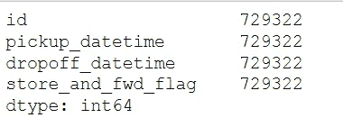

# 基于 Python 的纽约出租车出行时长数据集探索性数据分析

> 原文：<https://medium.com/analytics-vidhya/exploratory-data-analysis-of-nyc-taxi-trip-duration-dataset-using-python-257fdef2749e?source=collection_archive---------0----------------------->

*Anuradha 参加了* [*应用机器学习*](https://courses.analyticsvidhya.com/courses/applied-machine-learning-beginner-to-professional) *课程，并在受欢迎的纽约市出租车旅行持续时间数据集上展示了她的项目。*

数据分析是模型构建过程中最关键的步骤之一。在本文中，我将对纽约市出租车出行持续时间数据集进行数据分析。这个数据集和问题陈述摘自 Analytics Vidhya 的[应用机器学习课程，该课程提供了许多这样的现实生活项目。](https://courses.analyticsvidhya.com/courses/applied-machine-learning-beginner-to-professional)

现在让我们讨论项目的问题陈述。

**问题背景**:


一家典型的出租车公司面临着一个共同的问题，即如何有效地将出租车分配给乘客，以使服务顺畅且没有麻烦。其中一个主要问题是确定当前行程的持续时间，以便它可以预测下一次行程出租车何时空闲。

数据集包含关于纽约市的几次出租车旅行及其持续时间的数据。我现在将尝试并应用不同的数据分析技术来获得关于数据的见解，并确定不同变量如何依赖于目标变量**行程持续时间。**

我们开始吧！

## 导入所需的库

首先，我们将导入分析和可视化所需的所有必要的库。

```
import numpy as np
import pandas as pd
import matplotlib.pyplot as plt
import seaborn as sns
import datetime
sns.set()
```

现在我们有了所有必要的库，让我们加载数据集。我们将把它载入熊猫数据帧 **df。**

```
df=pd.read_csv('nyc_taxi_trip_duration.csv')
```

我们将数据集读入数据帧 **df** 中，并将查看**形状**、**列**、**列数据类型**和**数据的前 5 行**。这将给出手头数据的简要概述。

```
df.shape
```


这将返回行数和列数

```
df.columns
```


这将返回列名

以下是我们对这些柱子的了解:

## **客户&供应商**的人口统计信息

**id** :每次行程的唯一标识符

**vendor_id** :表示与行程记录关联的供应商的代码

**乘客计数**:车内乘客数量(驾驶员输入值)

## **关于行程的信息**

**拾取 _ 经度**:启用血糖仪的日期和时间

**pickup_latitude** :仪表脱离的日期和时间

**dropoff_longitude** :仪表脱离的经度

**dropoff_latitude** :仪表脱离的纬度

**store_and_fwd_flag** :该标志表示在发送给供应商之前，行程记录是否保存在车辆存储器中，因为车辆没有连接到服务器(Y = store and forwardn =不是存储和转发行程)

**trip_duration** :(目标)以秒为单位的行程持续时间

因此，我们有一个 729322 行 11 列的数据集。有 10 个特征和 1 个目标变量，即**行程持续时间**

```
df.dtypes
```


这将返回列的数据类型

```
df.head()
```


这将返回数据集的前 5 行

因此，通过查看 df.head()返回的前 5 行，我们可以对数据集有所了解。或者，我们可以通过将行数作为参数发送给 head()函数来指定要返回的行数。

**关于数据的一些观察:**

*   列 **id** 和 **vendor_id** 是名义上的。
*   列 **pickup_datetime** 和 **dropoff_datetime** 存储为对象，必须将其转换为 datetime 以便更好地分析。
*   列**存储转发标志**是分类的

让我们看看数字列，

```
df.describe()
```


这将返回数字列的统计摘要

**返回的表格给出了某些见解:**

*   没有缺少数据的数字列
*   乘客数量在 1 到 9 之间变化，大多数人的数量为 1 或 2
*   行程持续时间从 1 秒到 1939 秒~538 小时不等。肯定存在一些必须处理的异常值。

让我们快速看一下非数字列，

```
non_num_cols=['id','pickup_datetime','dropoff_datetime','store_and_fwd_flag']
print(df[non_num_cols].count())
```



返回指定列的计数

非数字列也没有缺失值。

两列 **pickup_datetime** 和 **dropoff_datetime** 现在被转换为 datetime 格式，这使得日期和时间数据的分析更加容易。

```
df['pickup_datetime']=pd.to_datetime(df['pickup_datetime'])
df['dropoff_datetime']=pd.to_datetime(df['dropoff_datetime'])
```

# 单变量分析

让我们看看数据集中各种变量的分布。

**乘客数量**

```
sns.distplot(df['passenger_count'],kde=False)
plt.title('Distribution of Passenger Count')
plt.show()
```


每次行程中乘客数量的直方图

在这里，我们看到大多数 1 或 2 名乘客利用出租车。大群人一起旅行的情况很少见。

**每周接送日的分布**

```
df['pickup_datetime'].nunique()
df['dropoff_datetime'].nunique()
```

返回值是 709359 和 709308。这表明在这两列中有许多不同的接送日期。

因此，最好将这些日期转换成一周中的几天，这样就可以找到一种模式。

```
df['pickup_day']=df['pickup_datetime'].dt.day_name()
df['dropoff_day']=df['dropoff_datetime'].dt.day_name()
```

现在让我们看看一周中不同日子的分布

```
df['pickup_day'].value_counts()
```


不同提货日的频率分布。

```
df['dropoff_day'].value_counts()
```


不同卸货日期的频率分布。

因此，我们看到大多数旅行是在周五和周一进行的，最少。旅行持续时间在一周中的分布也是一个值得研究的问题。

一周中各天的分布也可以用图形显示出来。

```
figure,ax=plt.subplots(nrows=2,ncols=1,figsize=(10,10))
sns.countplot(x='pickup_day',data=df,ax=ax[0])ax[0].set_title('Number of Pickups done on each day of the week')
sns.countplot(x='dropoff_day',data=df,ax=ax[1])ax[1].set_title('Number of dropoffs done on each day of the week')
plt.tight_layout()
```


一周中每天完成的接送数量的分布

**当日接送时间分布**

时间部分由时、分、秒表示，分析起来比较困难，因此我们将时间分为 4 个时区:**早晨** (4 小时至 10 小时)**中午** (10 小时至 16 小时)**晚上** (16 小时至 22 小时)**深夜** (22 小时至 4 小时)

```
def timezone(x):
    if x>=datetime.time(4, 0, 1) and x <=datetime.time(10, 0, 0):
        return 'morning'
    elif x>=datetime.time(10, 0, 1) and x <=datetime.time(16, 0, 0):
        return 'midday'
    elif x>=datetime.time(16, 0, 1) and x <=datetime.time(22, 0, 0):
        return 'evening'
    elif x>=datetime.time(22, 0, 1) or x <=datetime.time(4, 0, 0):
        return 'late night'

df['pickup_timezone']=df['pickup_datetime'].apply(lambda x :timezone(datetime.datetime.strptime(str(x), "%Y-%m-%d %H:%M:%S").time()) )df['dropoff_timezone']=df['dropoff_datetime'].apply(lambda x :timezone(datetime.datetime.strptime(str(x), "%Y-%m-%d %H:%M:%S").time()) )
```

让我们看看时区的分布

```
figure,ax=plt.subplots(nrows=1,ncols=2,figsize=(10,5))sns.countplot(x='pickup_timezone',data=df,ax=ax[0])
ax[0].set_title('The distribution of number of pickups on each part of the day')sns.countplot(x='dropoff_timezone',data=df,ax=ax[1])
ax[1].set_title('The distribution of number of dropoffs on each part of the day')plt.tight_layout()
```


一天中每个时段完成的接送数量的分布

因此，我们观察到大多数接送发生在晚上。而最少的接送发生在早晨。

让我们用另一个列来描述一天中完成取件的时间。

```
figure,ax=plt.subplots(nrows=1,ncols=2,figsize=(10,5))
df['pickup_hour']=df['pickup_datetime'].dt.hour
df.pickup_hour.hist(bins=24,ax=ax[0])
ax[0].set_title('Distribution of pickup hours')df['dropoff_hour']=df['dropoff_datetime'].dt.hour
df.dropoff_hour.hist(bins=24,ax=ax[1])
ax[1].set_title('Distribution of dropoff hours')
```


一天中每小时完成的接送数量的分布

这两种分布几乎是相似的，并且也与将一天中的时间分成 4 个部分以及之前完成的它们的分布相一致。

**存储转发标志的分配**

```
df['store_and_fwd_flag'].value_counts()
```


是/否标志的返回频率分布

N 旗的数量要大得多。我们稍后可以看到它们是否与旅行的持续时间有任何关系。

**行程持续时间分布**

```
sns.distplot(df['trip_duration'],kde=False)
plt.title('The distribution of of the Pick Up  Duration distribution')
```


以秒为单位的行程持续时间的分布

该直方图显示了极端的右偏，因此存在异常值。让我们看看这个变量的箱线图。

```
ns.boxplot(df['trip_duration'], orient='horizontal')
plt.title('A boxplot depicting the pickup duration distribution')
```


行程持续时间的箱线图

因此，我们看到只有接近 2000000 的值，而所有其他值都在 0 到 100000 之间。接近 2000000 的绝对是一个必须处理的异常值。

让我们看看 **trip_duration** 的 10 个最大值。

```
print( df['trip_duration'].nlargest(10))
```


列中返回的 10 个最大值

最大值远大于第二和第三大行程持续时间值。这可能是因为在数据收集过程中通常会出现一些错误，或者这可能是合法的数据。因为不太可能出现如此大的值，所以最好在进一步分析之前删除这一行。

该值也可以由出行持续时间的众数或中位数代替。

```
df=df[df.trip_duration!=df.trip_duration.max()]
```

在剔除异常值后，让我们来看看 trip_duration 的分布。

```
sns.distplot(df['trip_duration'])
plt.title('Distribution of the pickup ditribution after the treatment of outliers')
```


移除异常值后行程持续时间的分布(秒)

仍然存在极端的右倾。因此，我们将把 trip_duration 列分成一些区间。

时间间隔决定如下:

*   不到 5 小时
*   5-10 小时
*   10-15 小时
*   15-20 小时
*   20 多个小时

```
bins=np.array([0,1800,3600,5400,7200,90000])
df['duration_time']=pd.cut(df.trip_duration,bins,labels=["< 5", "5-10", "10-15","15-20",">20"])
```

**取货经度分布**

```
sns.distplot(df['pickup_longitude'])
plt.title('The distribution of Pick up Longitude')
```


拾取经度的分布

**下降经度分布**

```
sns.distplot(df[‘dropoff_longitude’])
plt.title(‘The distribution of Drop off Longitude’)
```


下降经度的分布

**衰减纬度分布**

```
sns.distplot(df['dropoff_latitude'])
plt.title('The distribution of drop off Latitude')
```


下降纬度的分布

**拾音器纬度分布**

```
sns.distplot(df['pickup_latitude'])
plt.title('The distribution of pick up Latitude')
```


拾音纬度的分布

我们看到，拾取经度和衰减经度具有几乎相同类型的分布，而拾取纬度和衰减纬度具有略微不同的分布。

**供应商 id 的分配**

```
df['vendor_id'].hist(bins=2)
```


2 个供应商 id 的分布

供应商 id 的分布与预期的差别不大。

# 双变量分析

现在让我们看看每个变量与目标变量 trip_duration 之间的关系。

**旅行持续时间与一周中的某一天的关系**

```
sns.catplot(x="pickup_day",y="trip_duration",kind="bar",data=df,height=6,aspect=1)
plt.title('The Average Trip Duration per PickUp Day of the week')sns.catplot(x="dropoff_day",y="trip_duration",kind="bar",data=df,height=6,aspect=1)
plt.title('The Average Trip Duration per Dropoff Day of the week')
```


> 图表显示了一周中每天旅行的平均估计值。误差线提供了该估计的不确定性的一些指示

因此，完成一次旅行的最高平均时间是在周四，而周一、周六和周日花费的时间最少。

但这还不够。我们还必须考虑每天进行的短程、中程和远程旅行的百分比。

```
ax1=df.groupby('pickup_day')['duration_time'].value_counts(normalize=True).unstack()
ax1.plot(kind='bar', stacked='True')
plt.title('The Distribution of percentage of different duration of trips')
```


> 该图显示了一周中每天不同持续时间的旅行的百分比分布。

这并不能提供太多的信息，因为每天 0-5 小时范围内的出行次数要多得多，

让我们来看看长途旅行(持续时间大于 5 小时)的百分比

```
figure,ax=plt.subplots(nrows=1,ncols=3,figsize=(15,5))
ax1=df[(df.duration_time !="< 5")].groupby('pickup_day')['duration_time'].count()
ax1.plot(kind='bar',ax=ax[0])
ax[0].set_title('Distribution of trips > 5 hours')
ax2=df[(df.duration_time !="< 5")].groupby('pickup_day')['duration_time'].value_counts(normalize=True).unstack()
ax2.plot(kind='bar', stacked='True',ax=ax[1])
ax[1].set_title('Percentage distribution of trips > 5 hours')
ax3=df[(df.duration_time !="< 5")].groupby('pickup_day')['duration_time'].value_counts().unstack()
ax3.plot(kind='bar',ax=ax[2])
ax[2].set_title('A compared distribution of trips > 5 hours')
```


> 这三张图显示了三种类型的信息:
> 
> 最左边的图表显示了一周中每天出行次数(> 5 小时)的频率分布
> 
> 中间一个显示了一周内每天不同持续时间(> 5 小时)的出行的百分比分布。
> 
> 右图显示了一周内每天不同持续时间(> 5 小时)的出行频率分布。

**一些要点:**

*   持续时间超过 5 小时的旅行次数最多的是在周四，其次是周五和周三。(左图)
*   持续时间为 5-10、10-15 的旅行次数最多的是在星期四。(右图)
*   但是超过 20 小时的旅行百分比最高的是在周日和周六。(中图)

**行程持续时间与当天时间的关系**

```
figure,(ax1,ax2)=plt.subplots(ncols=2,figsize=(20,5))ax1.set_title('Distribution of pickup hours')
ax=sns.catplot(x="pickup_hour", y="trip_duration",kind="bar",data=df,ax=ax1)ax2.set_title('Distribution of dropoff hours')
ax=sns.catplot(x="dropoff_hour", y="trip_duration",kind="bar",data=df,ax=ax2)
plt.show()
```


完成一次旅行的平均时间最长的是在中午开始的旅行(14-17 小时)，最短的是在清晨开始的旅行(6-7 小时)

**乘客数量与持续时间的关系**

```
sns.relplot(x="passenger_count", y="trip_duration", data=df, kind="scatter")
```


这里我们看到，乘客数量与行程持续时间没有这样的关系。但值得注意的是，没有像 7 或 9 这样的高乘客计数的长途旅行。而仅对于乘客计数 1，行程持续时间或多或少是均匀分布的。

**供应商 id 和持续时间的关系**

```
sns.catplot(x="vendor_id", y="trip_duration",kind="strip",data=df)
```


在这里，我们看到供应商 1 主要提供短途旅行出租车，而供应商 2 提供短途和长途旅行出租车

**店铺转发标志与持续时间的关系**

```
sns.catplot(x="store_and_fwd_flag", y="trip_duration",kind="strip",data=df)
```


因此，我们看到该标志仅在短时间旅行中存储，而在长时间旅行中，该标志从不存储。

**地理位置与持续时间的关系**

```
sns.relplot(x="pickup_latitude", y="dropoff_latitude",hue='pickup_timezone',row='duration_time',data=df);
```


这是我们看到的

*   对于短途旅行(<5 hours), the pickup and dropoff latitude is more or less evenly distributed between 30 ° and 40 °
*   for longer trips(> 5 小时)，接送纬度都集中在 40 到 42 度之间。

```
sns.relplot(x="pickup_longitude", y="dropoff_longitude",hue='pickup_timezone',row='duration_time',data=df);
```


这是我们看到的

*   对于短途旅行(<5), the pickup and dropoff longitude is more or less evenly distributed between -80 ° and -65 ° with one outlier near -120 ° .
*   for longer trips(> 5)，接送经度都集中在-75°附近

## 关于行程持续时间和数据集的结论:

*   旅行持续时间变化很大，从几秒钟到 20 多个小时不等
*   大多数旅行在星期五、星期六和星期四进行
*   一次旅行的平均持续时间在周四和周五最多，因为超过 5 小时的旅行大多在这些天进行
*   在 14 小时到 17 小时之间开始的旅行的平均持续时间最长。
*   供应商 2 主要提供更长的行程
*   长时间出行(> 5 小时)主要集中在(40，75)到(42，75)附近

这个系列的下一部分可以在[这里](/analytics-vidhya/building-a-linear-regression-model-on-the-new-york-taxi-trip-duration-dataset-using-python-2857027c54f3)找到