# 堆栈溢出开发者调查的探索性数据分析-2020 年

> 原文：<https://medium.com/analytics-vidhya/exploratory-data-analysis-of-stack-overflow-developer-survey-2020-d8867ff28ece?source=collection_archive---------10----------------------->

当我踏上成为一名数据科学家的旅程时，这是通向 2020 年堆栈溢出开发者调查的探索性数据分析的踏脚石

# 关于数据:

所用数据集来自 2020 年 [*栈溢出*](https://en.wikipedia.org/wiki/Stack_Overflow) 开发者调查。点击 [*链接*](https://insights.stackoverflow.com/survey) 获取原始 CSV 数据。

# 探索中使用的库/工具:

使用 *python* 和 *python 库*如 *NumPy* 和 *pandas* 进行分析，通过对数据进行修改和操作来获得所需的数据，并将数据可视化。我使用了可视化工具如 *seaborn、matplotlib、*和 *plotly* 。

# 理解数据:

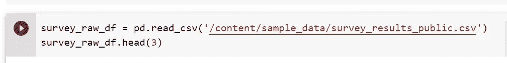

从 CSV 读取数据并存储

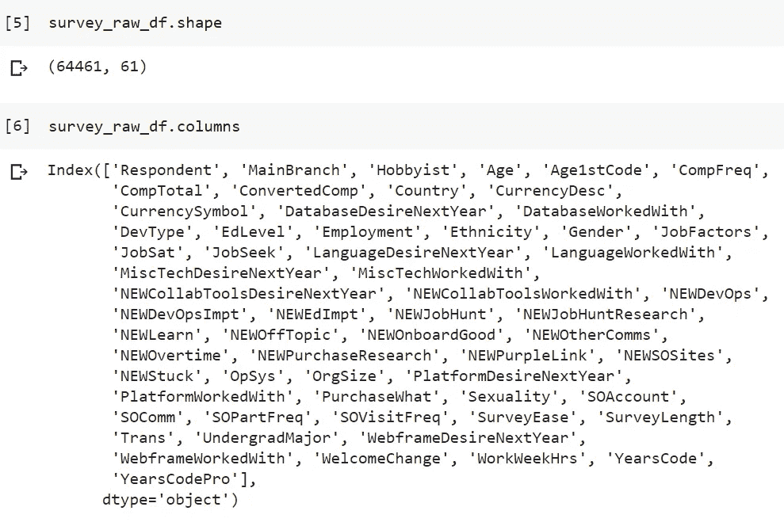

形状揭示了数据集中的列数和行数

通过执行上述操作，我们获得了关于数据集大小的信息，它包含大约 64461 行和 61 列，这是一个巨大的数据量。

# 数据准备和清理:

我们目前拥有的数据包含 61 列，这是大量的信息，但对于这种数据探索，我们将把我们的分析限制在以下问题。

*   受访者的人口统计数据以及不同地理位置的编程社区的分布情况
*   什么样的编程技能、经验和偏好分布在全球各地
*   与就业相关的趋势、信息、观点和偏好。

因此，我将考虑与回答上述问题相关的实际数据列的子集

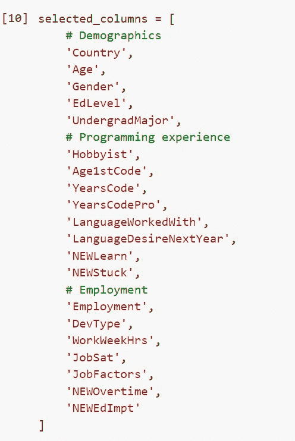

为此分析选择的列列表

现在我们已经完成了列，让我们通过对数据执行 info()调用来快速了解数据。

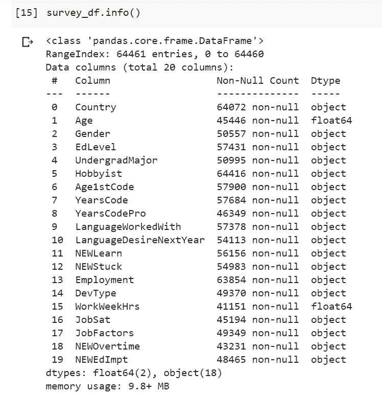

大多数列的数据类型为 *Object* ，因为它们包含不同类型的值，或者包含空值，这些值用 *NaN* 表示。似乎每一列都包含一些空值，因为每一列的非空计数都低于总行数(64461)。我们需要处理空值，并根据具体情况手动调整每一列的数据类型。

只有两列被检测为数字列(`Age`和`WorkWeekHrs`)，尽管还有其他几列主要是数字值。为了使我们的分析更容易，让我们将其他一些列转换成数字数据类型，同时忽略任何非数字值(它们将被转换成 NaNs)

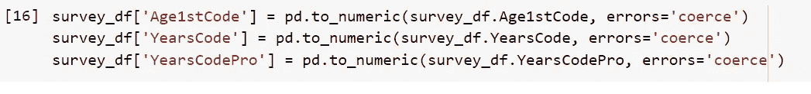

转换为数值并用 NaN 替换空值。

现在列`Age1stCode`、`YearsCode`、`YearsCodePro`已经被转换为数字，如果该值不存在，它将被替换为`Nan`。让我们看看数字列的基本静态特性。

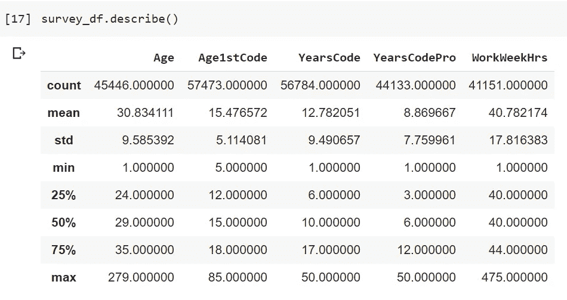

Describe 方法揭示了数字列的基本静态特性

年龄列似乎有问题，因为最小值是 1，最大值是 279。这是调查的一个常见问题:由于回答时的意外或故意错误，回答可能包含无效值。一个简单的解决方法是忽略年龄列中的值大于 100 岁或小于 10 岁的行，作为无效的调查响应。

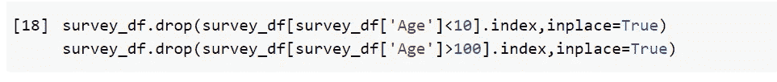

使用 drop 方法删除不相关的条目

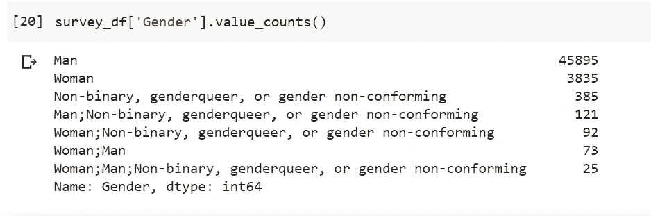

性别列有多个选项，但是为了简化我们的分析，我们将删除包含多个选项的值。

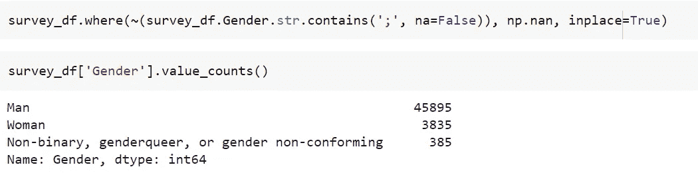

放弃有多种选择的性别

我们现在已经清理并准备好了用于分析的数据集

# 探索性分析和可视化:

在我们就调查回答提出有趣的问题之前，了解人口统计数据(即国家、年龄、性别、教育水平、就业水平等)会有所帮助。回答者的样子。探究这些变量对于理解调查在全球编程社区中的代表性非常重要，因为这种规模的调查通常会有一些选择偏差。

## 国家

让我们看看在调查中有多少个国家作出了答复，并标出答复数量最多的 15 个国家

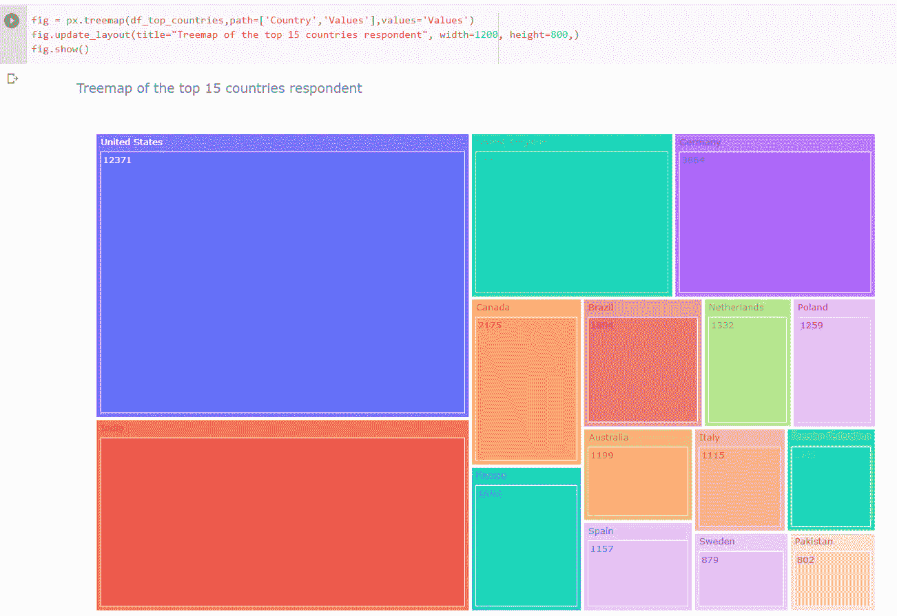

使用前 15 个国家回应 Plotly 的树状图

来自美国和印度的受访者似乎比例过高，这是意料之中的，因为这些国家的人口最多(除了中国)，而且调查是用英语进行的，英语是美国、印度和英国专业人士使用的通用语言。我们已经看到，调查可能并不能代表整个编程社区——尤其是来自非英语国家的编程社区。

## 英语与非英语

让我们使用不同国家使用的[语言列表](https://github.com/JovianML/opendatasets/blob/master/data/countries-languages-spoken/countries-languages.csv)中的数据，并将其添加到现有数据中，找出讲英语和不讲英语的受访者的百分比。

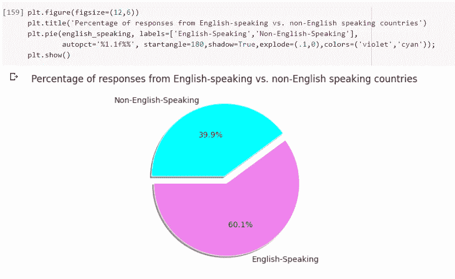

大多数，即 60.1%的受访者来自英语国家，39.9%来自其他语言国家，因此我们可以得出结论，调查受访者主要来自英语国家或英语被用作专业语言。

## 年龄

受访者的年龄分布是另一个需要考虑的重要因素，我们可以用直方图来形象化。

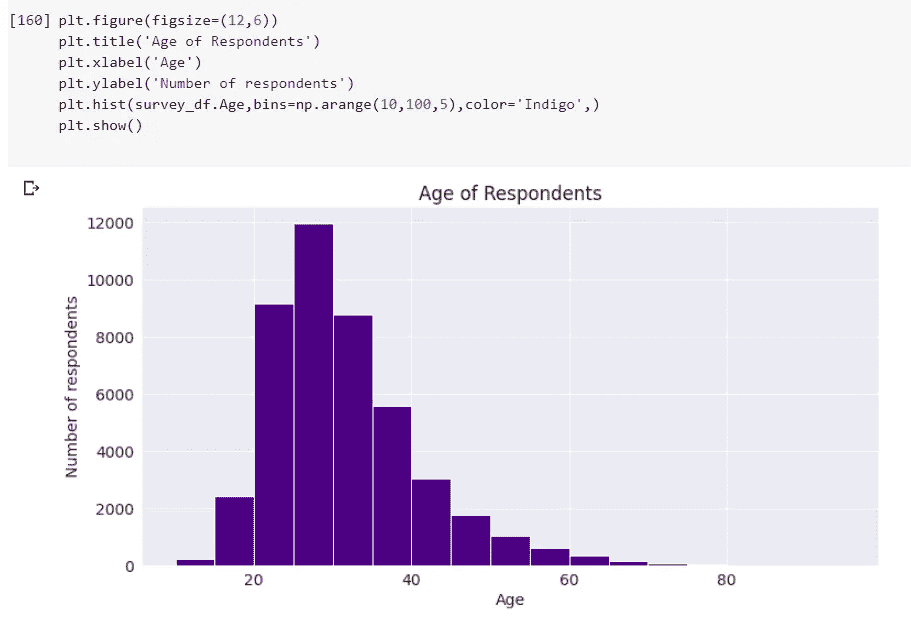

年龄分布直方图

很大一部分受访者的年龄在 20-45 岁之间，这在一定程度上代表了整个编程社区，因为在过去的 20 年中，许多年轻人已经将计算机作为他们的研究或职业领域。

为了了解大多数受访者属于哪个年龄组，让我们将他们分为不同的年龄组，并绘制一个饼图，以便更好地了解年龄分布。

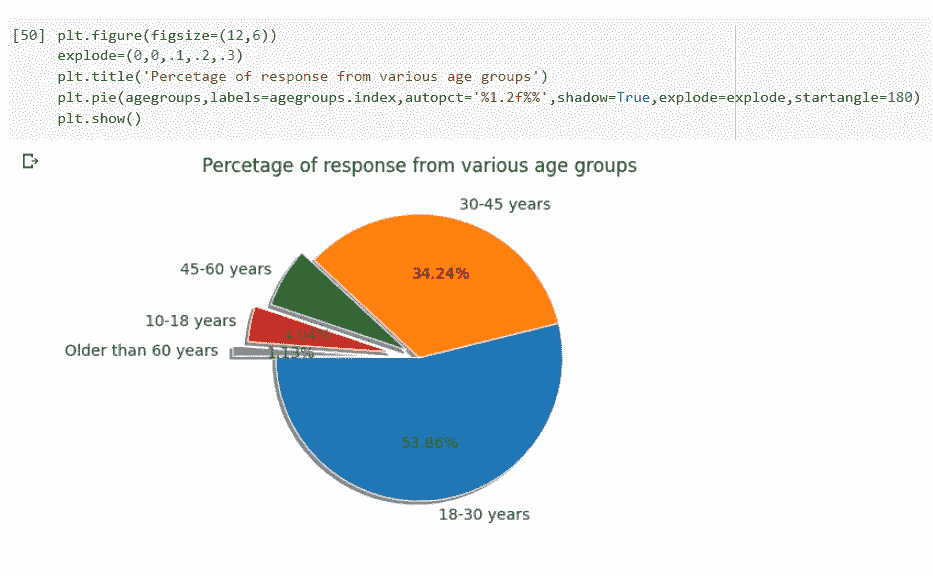

年龄组分布饼图

这清楚地表明，绝大多数人(53.86%)在 18-30 岁年龄段，其次是 30-45 岁年龄段，占 34.34%。

## 性别

让我们来看看不同性别的回答分布。众所周知，女性和非二进制性别在编程社区中的代表性不足，因此我们可能会看到这种不均衡的分布。

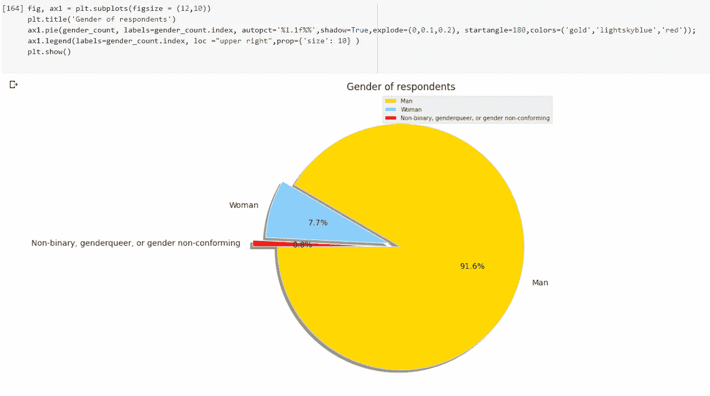

性别分布饼图。

只有大约 8%回答了这个问题的调查对象认为自己是女性或者是非二元的。这个数字低于编程社区中女性和非二元性别的总百分比，估计约为 12%。

## 教育水平

计算机科学的正规教育通常被认为是成为程序员的一个重要要求。让我们看看事实是否如此，尤其是因为网上有很多免费的资源和教程可以用来学习编程。我们将使用一个水平条形图来比较受访者的教育水平。

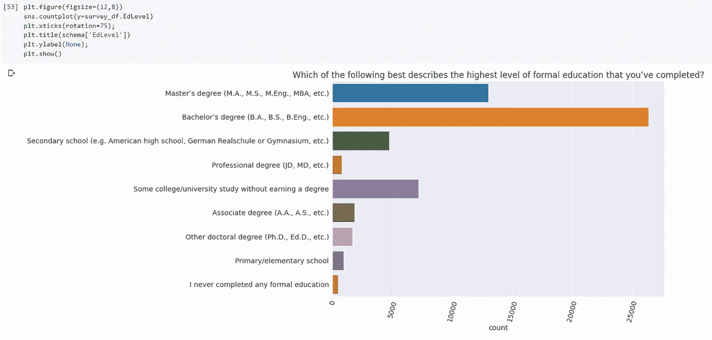

描述教育水平的水平条形图

看起来超过一半的受访者拥有学士或硕士学位，因此大多数程序员肯定受过一些大学教育，尽管从这张图中不能清楚地看出他们是否拥有计算机科学学位。

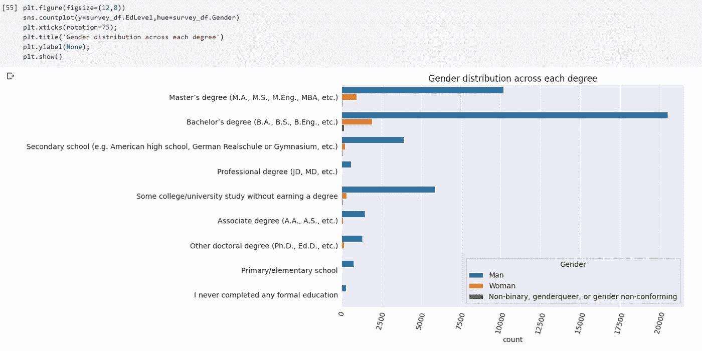

描述不同性别教育水平的水平条形图

让我们分析一下受访者的主要学习领域是什么

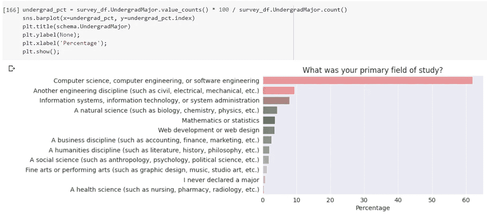

主要研究领域的水平条形图表示。

事实证明，40%拥有大学学位的程序员拥有计算机科学以外的研究领域——这非常令人鼓舞。这似乎表明，虽然大学教育总体上是有帮助的，但要成为一名成功的程序员，你并不需要追求计算机科学的专业。

## 学位对职业的重要性

现在让我们来看看大学学位等正规教育对职业生涯有多重要。

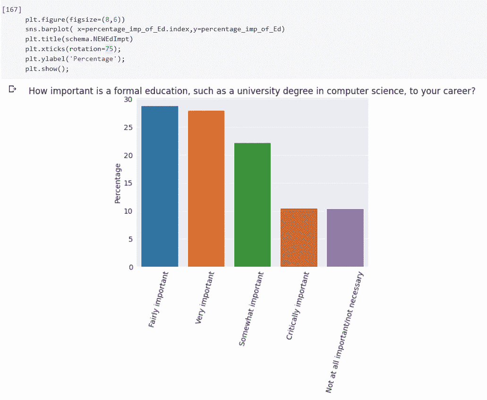

显示学位对职业重要性的条形图

虽然上面的图表给出了这个问题的一个更一般的观点，但是让我们试着从教育水平的角度来看这个问题。

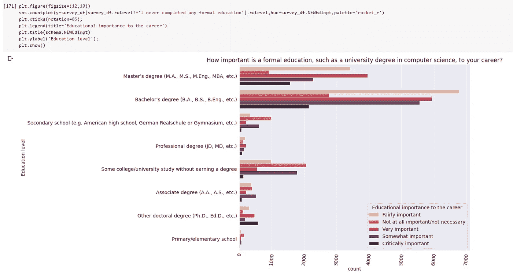

水平条形图显示学位对不同教育水平的职业生涯的重要性

从上图中，我们可以得出结论，拥有学士和硕士学位的人认为学位对职业的重要性。

## 雇用

自由职业者或合同工是程序员的常见选择，所以比较全职、兼职和自由职业者的细分会很有趣。让我们将`Employment`列中的数据可视化。

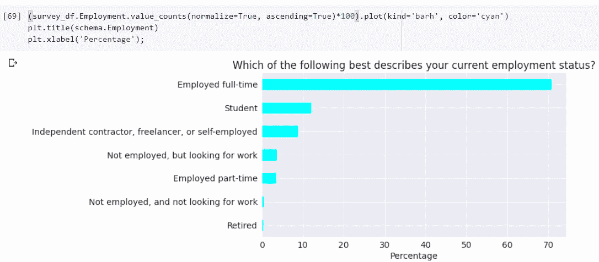

显示雇佣状态的水平条形图

近 10%的受访者似乎是兼职或自由职业者。

现在让我们来分析一下教育水平是如何影响就业类型的。为了达到这个目的，我将就业状况分为三类，即专业人士、爱好者和其他。

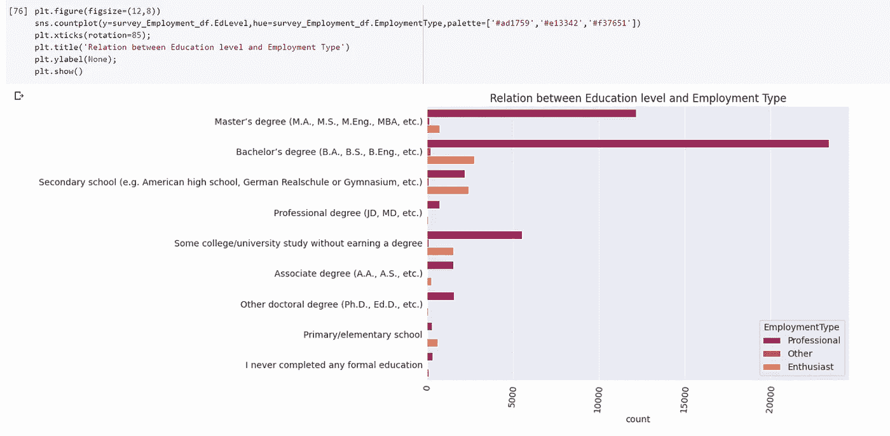

显示教育水平和就业类型之间关系的水平条形图

这表明大多数专业人员拥有学士和硕士学位，这与学位对职业分析的重要性是一致的。

## 热门工作角色

让我们借助条形图来分析一下受访者中最受欢迎的工作角色是什么

显示工作角色的水平条形图

正如所料，最常见的角色名称中包含“开发人员”,分析证明了这一点。

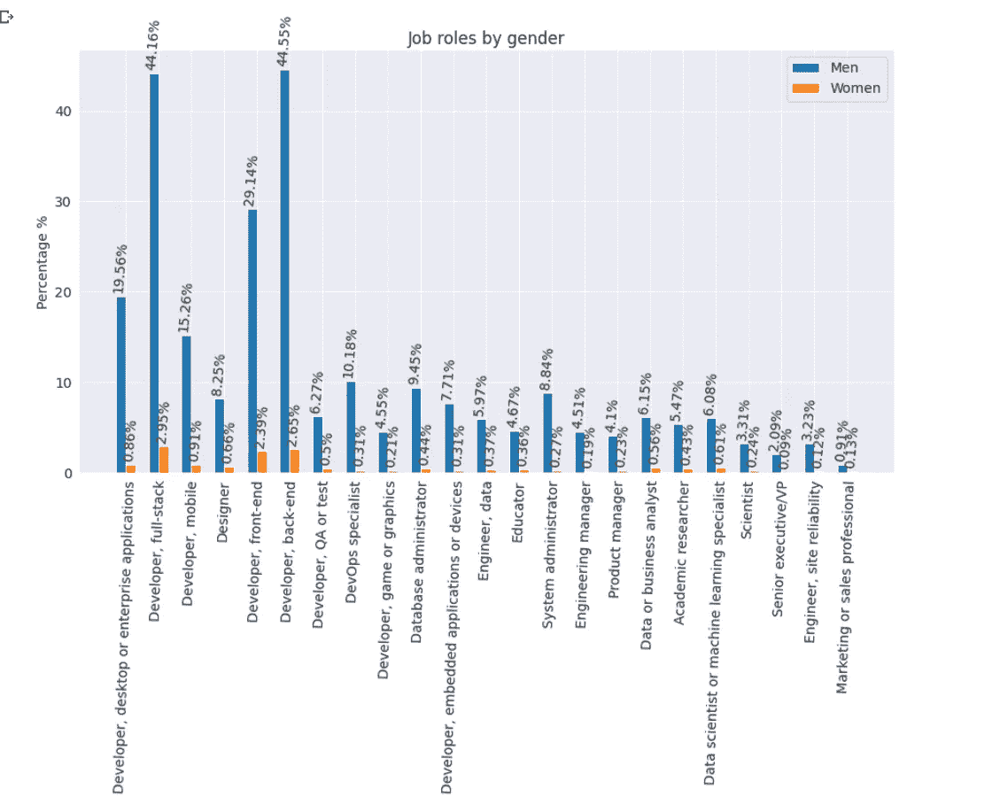

显示男性和女性工作角色的条形图

上图显示了各种工作角色中男性和女性之间的压力。

# 回答问题:

## 问:2020 年最流行的编程语言是什么？

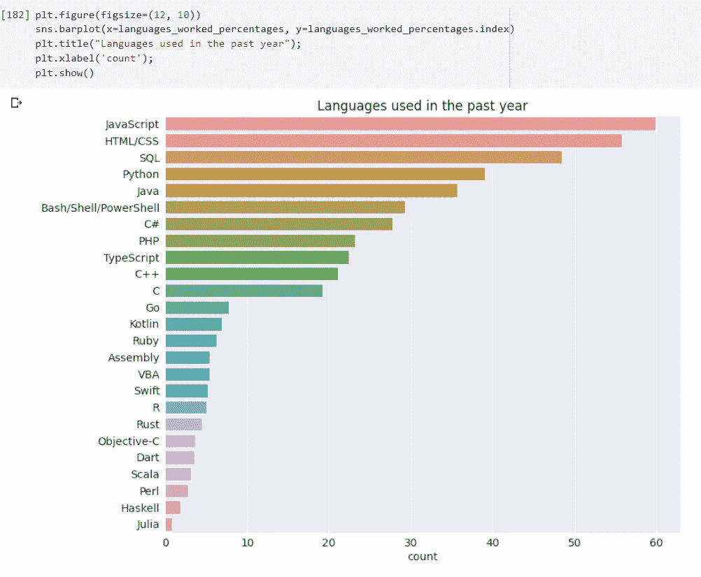

显示受访者使用的语言的水平条形图

也许毫不奇怪，Javascript & HTML/CSS 名列榜首，因为 web 开发是当今最热门的技能之一，也是最容易入门的技能之一。SQL 是使用关系数据库所必需的，所以大多数程序员经常使用 SQL 也就不足为奇了。对于其他形式的开发，Python 似乎是最受欢迎的选择，击败了 Java，后者是 20 多年来服务器和应用程序开发的行业标准。

## 问:在接下来的一年里，人们最有兴趣学习哪种语言？

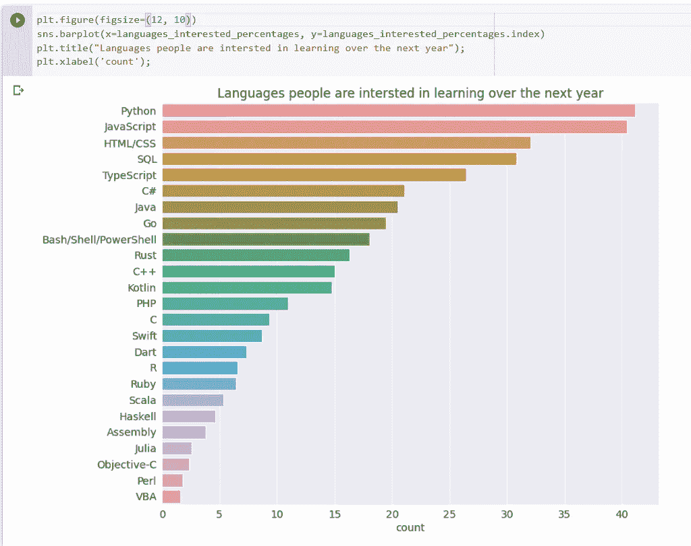

显示人们有兴趣学习的语言的水平条形图。

同样，Python 是大多数人有兴趣学习的语言并不奇怪——因为它是一种简单易学的通用编程语言，非常适合各种领域:应用程序开发、数值计算、数据分析、机器学习、大数据、云自动化、web 抓取、脚本编写等。

## 问:哪些是最受欢迎的语言，也就是说，使用过这种语言的人中有很高比例的人希望在下一年继续学习和使用这种语言，哪些是人们不再有兴趣学习的语言？

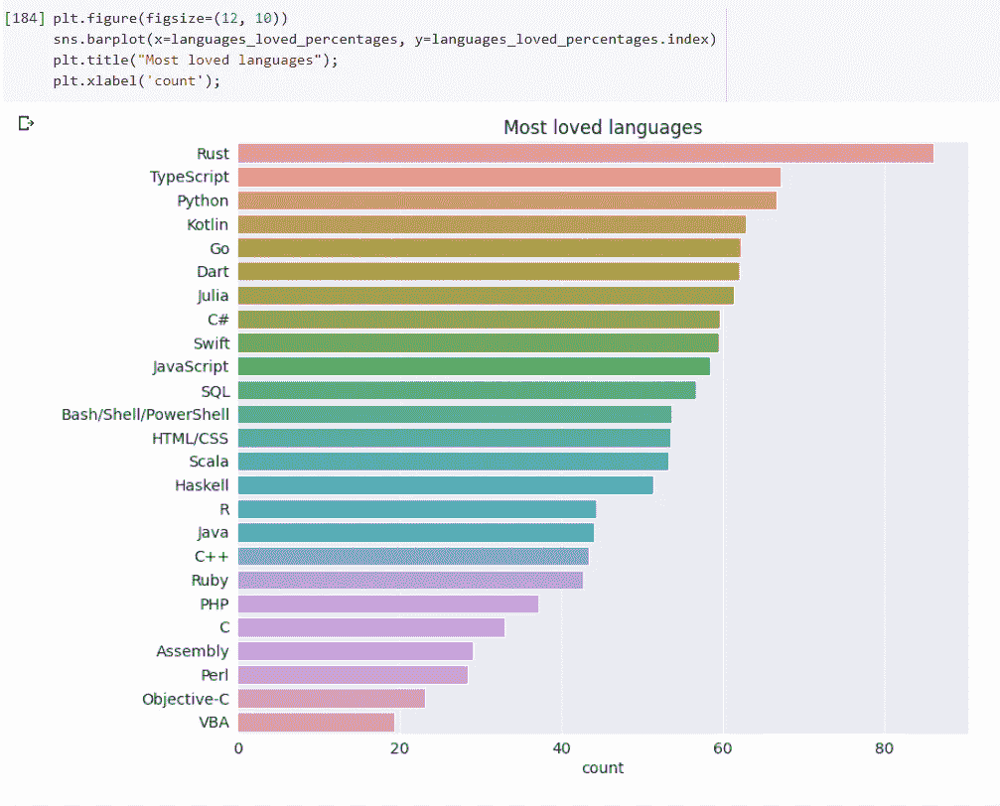

显示最受欢迎语言的水平条形图

Rust 已经连续四年成为 StackOverflow 最受欢迎的语言，其次是 TypeScript，在过去几年中，TypeScript 作为 JavaScript 在 web 开发中的一个很好的替代品，受到了广泛的欢迎。

尽管 Python 已经是世界上使用最广泛的语言之一，但它的功能排名第三。这证明了这样一个事实，即这种语言有坚实的基础，非常容易学习和使用，有一个强大的图书馆生态系统供各种各样的人使用，并且有大量的世界范围的开发人员喜欢使用它。

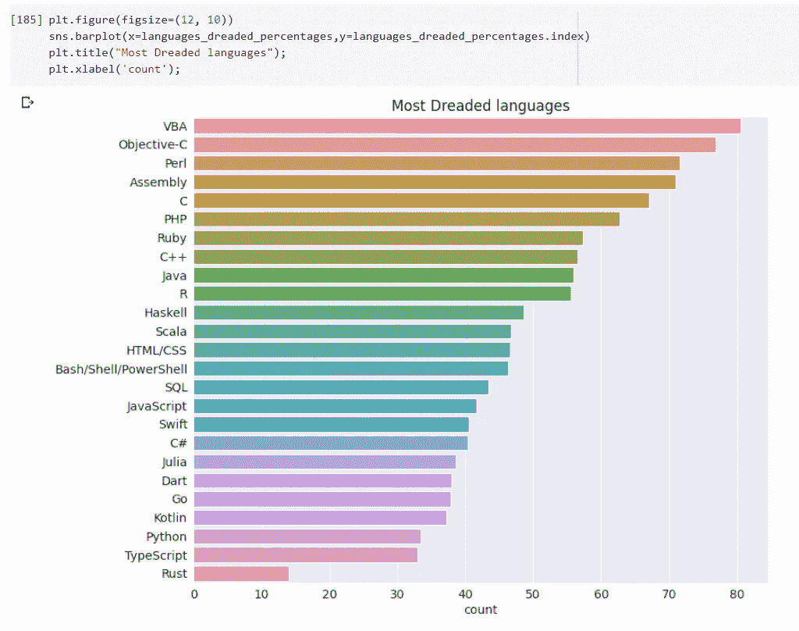

显示最可怕语言的水平条形图

像 VBA 语、客观-C 语、珀尔语这样的语言是人们过去使用过的三大语言之一，不想再继续下去了。

## 问:数据科学家和机器学习使用什么语言？

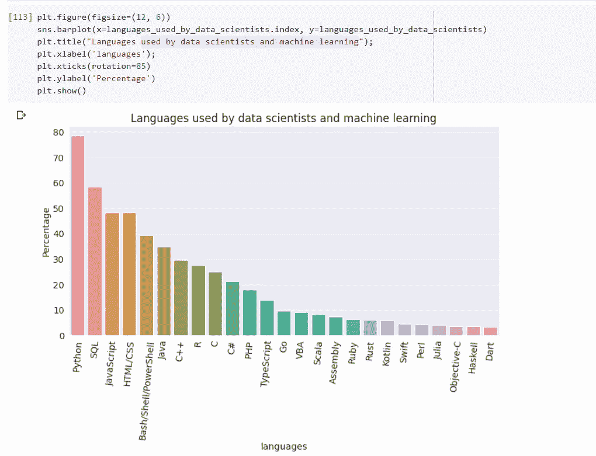

显示数据科学家和机器学习中使用的语言的条形图

毫不奇怪，他们中的大多数人使用 python，其次是 SQL 来处理数据，最近 javascript 在数据科学中也变得越来越重要。

## 问:在哪些国家，开发人员每周的工作时间最多？仅考虑回复超过 250 份的国家。

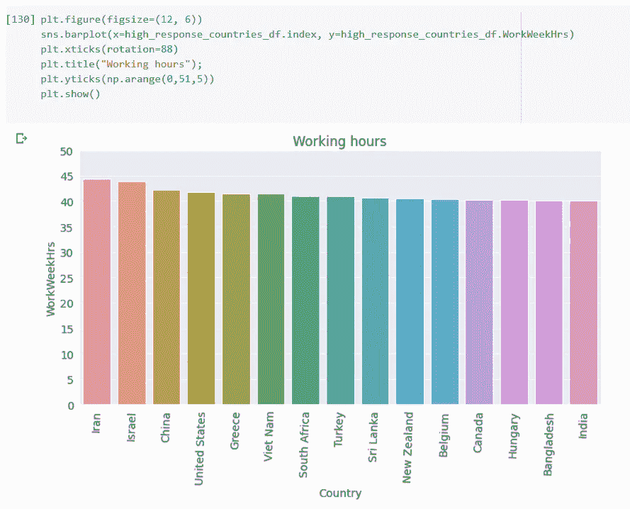

显示国家工作时间的条形图

我们可以从图表中推断出，伊朗、以色列和中国位居榜首，平均每周工作 45 小时，而其他国家平均每周工作 40 小时。

## 问:哪个角色的每周工作时间最多？哪个角色最低？

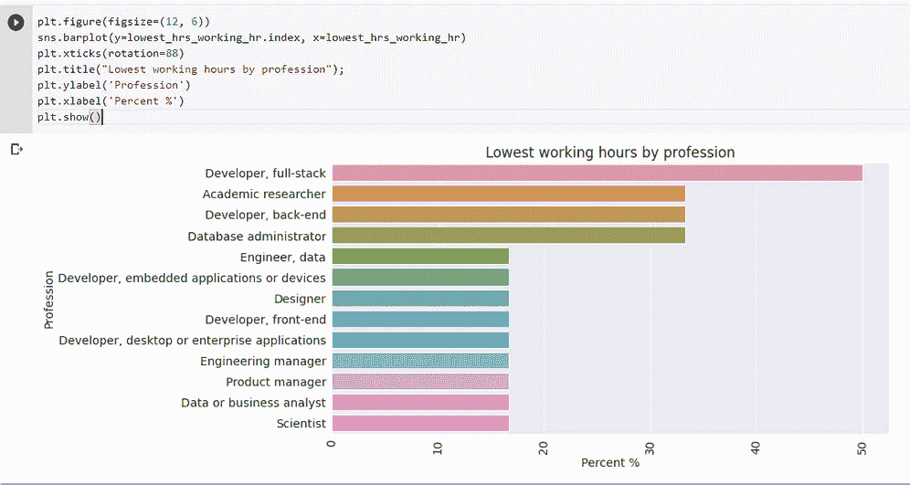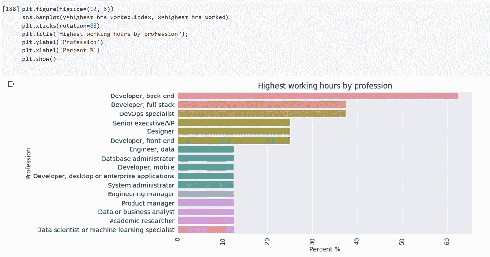

显示不同工作角色每周最高和最低工作时间的水平条形图

## 问:你多长时间加班一次，或者超过工作的正式预期时间？

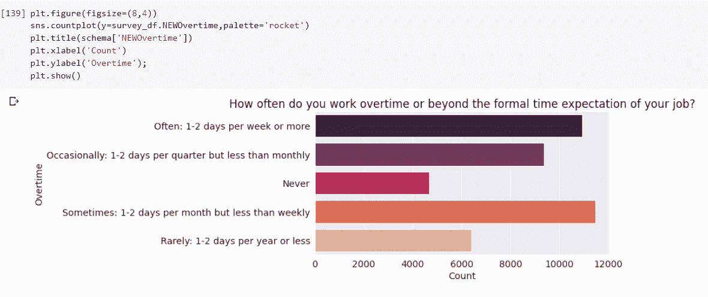

显示加班工时的水平条形图

## 问:你对目前的工作满意程度如何？

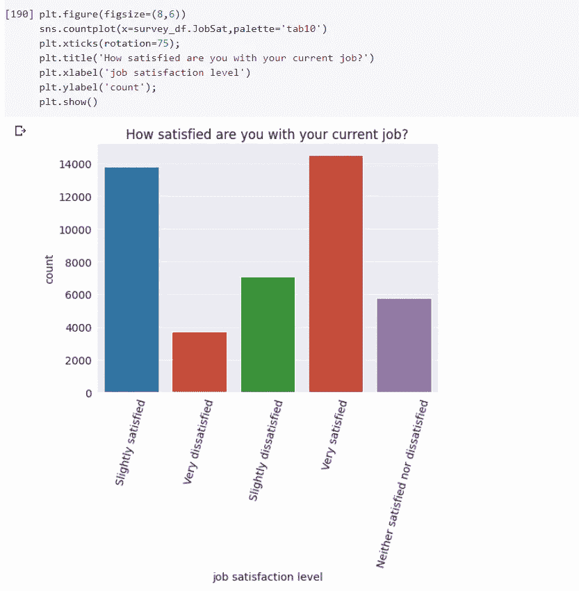

显示工作满意度的条形图

## 问:在选择工作时，对潜在员工来说什么是重要的？

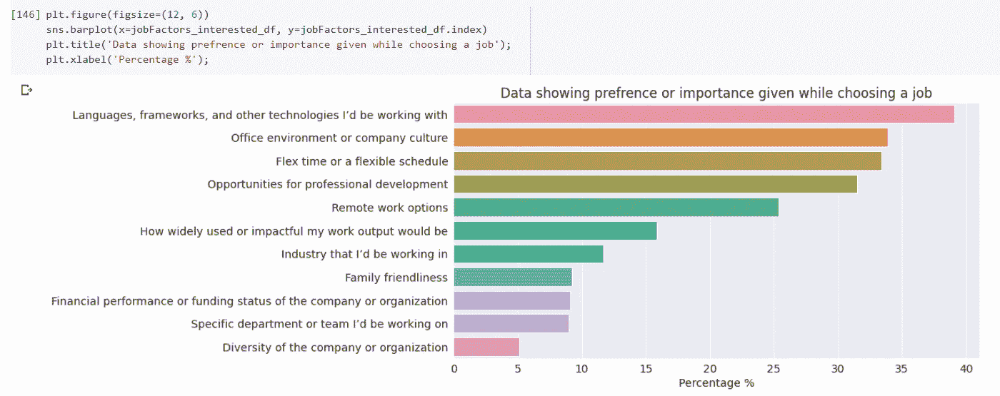

水平条形图，显示员工在选择工作时的偏好/重视程度

从图表中可以看出，绝大多数受访者都很重视技术和堆栈。而办公室环境或公司文化在吸引员工方面也起着重要作用。

## 问:从年轻开始建立编程生涯有多重要？

让我们创建一个“年龄”与“YearsCodePro”(即多年的编码经验)的散点图来回答这个问题。

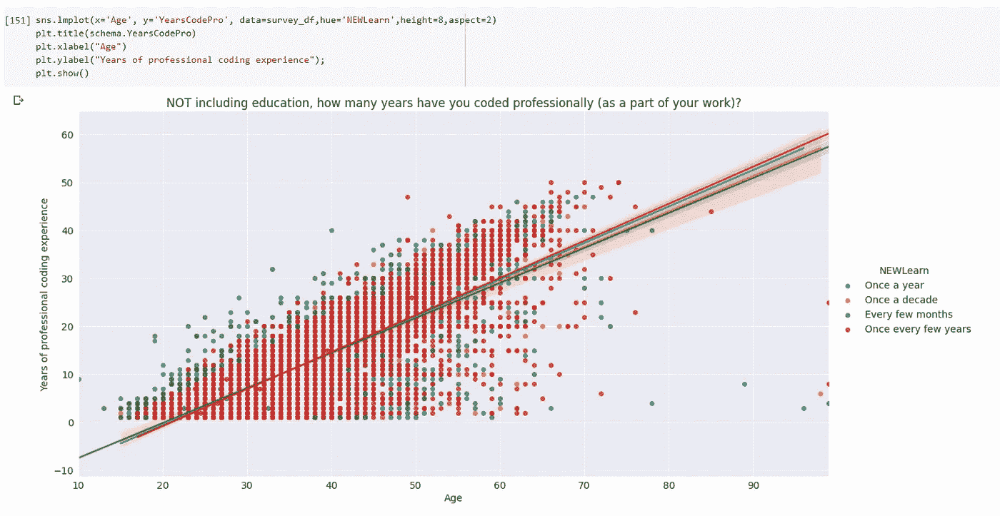

内爆与回归拟合线显示跨年龄的专业编码经验

你可以在图表上看到所有的点，这似乎表明你可以在任何年龄** 开始专业编程。此外，许多从事编码工作几十年的人似乎也把它作为一种爱好。

## 你什么时候开始编码的？

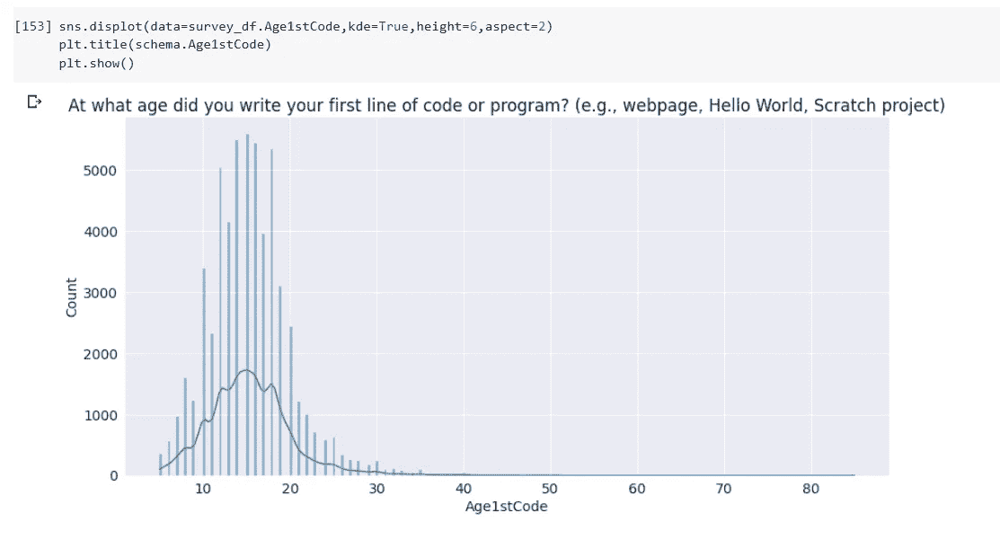

他们第一次编码是什么年龄的分布图

正如您所料，大多数人在 40 岁之前似乎都接触过编程，但也有各种年龄和各行各业的人在学习编程。

# 推论和结论:

我们从调查中得出了许多有趣的推论，以下是其中几个的总结:

*   根据调查受访者的人口统计数据，我们可以推断该调查在一定程度上代表了整个编程社区，尽管来自非英语国家和女性&非二元性别的程序员的回答肯定较少。
*   编程社区没有尽可能地多样化，尽管情况在改善，但我们应该做出更多努力来支持和鼓励代表性不足的社区成员——无论是在年龄、国家、种族、性别还是其他方面。
*   大多数程序员拥有大学学位，尽管相当大比例的人在大学里没有计算机科学作为他们的专业，所以计算机科学学位对于学习编码或在编程方面建立职业生涯不是强制性的。
*   很大一部分程序员要么做兼职，要么做自由职业者，这可能是进入这个领域的一个很好的方式，尤其是当你刚刚起步的时候。
*   Javascript 和 HTML/CSS 是 2020 年使用最多的编程语言，紧随其后的是 SQL 和 Python
*   Python 是大多数人有兴趣学习的语言——因为它是一种简单易学的通用编程语言，非常适合各种领域。
*   Rust 和 TypeScript 是 2020 年最“受喜爱”的语言，这两种语言都有小但快速增长的社区。Python 紧随其后，尽管它已经是一种广泛使用的语言。
*   世界各地的程序员似乎平均每周工作 40 小时左右，各国略有不同。
*   你可以在任何年龄学习并开始专业编程，如果你也把编程作为一种爱好，你可能会有一个漫长而充实的职业生涯。