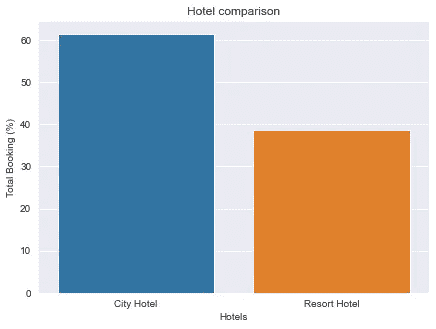
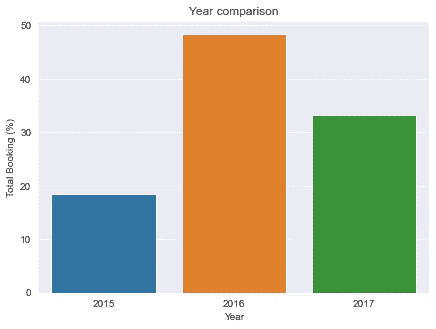

# 基于 Python 的酒店预订需求探索性数据分析

> 原文：<https://medium.com/analytics-vidhya/exploratory-data-analysis-of-the-hotel-booking-demand-with-python-200925230106?source=collection_archive---------0----------------------->

在 [Unsplash](https://unsplash.com?utm_source=medium&utm_medium=referral) 上由 [Carlos Muza](https://unsplash.com/@kmuza?utm_source=medium&utm_medium=referral) 拍摄的照片

# 数据集:

> 我们将使用来自 Kaggle 的**酒店预订需求**数据集。你可以从这里下载:
> [https://www.kaggle.com/jessemostipak/hotel-booking-demand](https://www.kaggle.com/jessemostipak/hotel-booking-demand)

该数据集包含城市酒店和度假酒店的预订信息，并且包括诸如预订时间、停留时间、成人、儿童和/或婴儿的数量以及可用停车位数量等信息。所有个人识别信息都来自数据。

我们将使用 python 执行探索性数据分析，以从数据中获得洞察力。

# 我们将尝试回答以下问题

1.  有多少预订被取消了？
2.  度假酒店和城市酒店的预订比例是多少？
3.  每年预订的百分比是多少？
4.  酒店哪个月最忙？
5.  大多数客人来自哪个国家？
6.  人们在酒店呆多长时间？
7.  预订最多的住宿类型是哪一种(单人、双人、家庭)？

之后，我们将制作预测模型，以预测未来是否会取消预订

**我们将:**

*   执行特征工程以制造新特征
*   执行特征选择以仅选择相关特征
*   转换数据(类别到数字)
*   分割数据(训练测试分割)
*   对数据建模(拟合数据)
*   最后，评估我们的模型

让我们开始:

# 导入包

首先导入必要的包并导入数据集

现在导入并显示数据集

我们数据集的视图

# 数据预处理

首先复制数据集，这样我们的原始数据集保持不变

## 1.处理缺失值

检查我们的数据是否包含任何缺失值

缺少值

我们有 4 个缺失值的特征。

在“代理和公司”列中，我们有每个代理或公司的 id_number，所以对于所有缺少的值，我们将用 0 替换它。

Children 列包含孩子的数量，因此我们将用四舍五入的平均值替换所有缺失的值。

我们的国家列包含代表不同国家的国家代码。这是一个分类特征，所以我也将它替换为模式值。众数值是出现次数比任何其他值都多的值。所以，在这种情况下，我用最常出现的国家来代替它。

有许多行没有客人，包括成人、儿童和婴儿。这些类型的行不构成

我们有 180 个这样的行。我们将删除这些行。

## 2.转换数据类型

让我们检查数据集中每一列的数据类型。

我们特征的数据类型

我们可以看到不同列的不同数据类型。

有一些列，如 children、company 和 agent，是 float 类型的，但它们的值只是整数。

所以我们将把它们转换成整数类型。

# 探索性数据分析

现在让我们做有趣的部分，从我们的数据中提取信息，并尝试回答我们的问题。

## 1.有多少预订被取消了？

让我们编写函数来获得不同值的百分比。

此函数接受一个系列或数据框列，并返回这两个数组

x 是我们的唯一值
y 是每个唯一值的百分比值

现在让我们在**被取消的**特征上使用这个函数，看看结果

X 和 Y 数组中的值

> is_canceled 有两个唯一的值:如果预订被取消，则为 1，否则为 0。

现在我们来绘制这个结果。我将编写另一个函数来绘制图表。编写函数的好处是我们可以一次又一次地重用代码。

该函数接受两个数组 x 和 y，并显示所需的图表。默认的绘图类型是条形图，但它也可以绘制线图。可以给出可选参数来显示标题和标签。

现在让我们调用函数

取消与未取消比率

> 37%的预订被取消。预订的客人有 63%的时间办理了入住手续(没有取消预订)。

为了进一步分析，我们将只选择那些没有被取消的预订

## 2.度假酒店和城市酒店的预订比例是多少？

让我们回答另一个问题，每种类型的酒店预订了多少。

我们现在可以重用之前创建的函数。我们要做的就是将 dataframe 列传递给 get_count()函数，并将其结果(x 和 y 数组)传递给 plot 函数。

城市酒店 Vs 度假酒店

> 超过 60%的人预订了城市酒店

## 3.每年预订的百分比是多少？

逐年比较

> 与前一年相比，2016 年的预订量增加了一倍多。但是第二年预订量下降了近 15%。

让我们按酒店来划分，然后绘制图表。我们将更改代码来显示计数图。

年度和酒店比较(并排)

## 4.酒店哪个月最忙？

为了回答这个问题，我们将选择 arrival_date_month 特性并获取它的值计数。现在产生的数据将不会按照月份排序，所以我们必须对它进行排序。我们将制作一个包含月份名称的新列表，以便根据该列表对数据进行排序。

我们将显示线图来显示趋势。

显示每月酒店预订趋势的折线图

> 正如我们所看到的，大多数预订是在 7 月至 8 月间完成的。年初和年末的预订量最少。

让我们将每种酒店类型的数据分开，然后看看趋势。

显示每月酒店预订趋势的折线图(每种酒店类型单独一条线)

> 我们可以看到这种趋势有点类似，只是有一点点不同。度假村在年初和年末的预订量较高，六月和九月的预订量较低。

## 5.大多数客人来自哪个国家？

要查看国家比较图，请查看**国家**列。在国家一栏中，我们有每个国家的代码，比如 PRT 代表葡萄牙。

> 为了获得国家名称，我们将使用 **pycountry** 。pycountry 是一个非常有用的 python 包。
> [GitHub](https://github.com/flyingcircusio/pycountry)|[PyPi](https://pypi.org/project/pycountry/)

我们将使用这个包从国家代码中获取国家名称

国家预订百分比

> 葡萄牙、英国和法国、西班牙和德国是来自最多客人的国家，超过 80%来自这 5 个国家。

## 6.人们在酒店呆多长时间？

人们住宿的天数

> 大多数人会停留一、二或三天。超过 60%的客人属于这三种情况。

让我们看看每种酒店类型的停留时间趋势。

人们住宿的夜数(针对每种酒店类型)

> 对于度假酒店，最受欢迎的停留时间分别是三天、两天、一天和四天。
> 对于城市酒店，最受欢迎的住宿时长分别为一、二、七(周)和三

## 7.`Which was the most booked accommodation type (Single, Couple, Family)?`

我们将入住酒店的人分为三类。

单人:仅 1 名成人

夫妇:两个成年人我们不能肯定地说这两个人是不是一对真正的夫妇，数据没有告诉我们这方面的任何事情，但我们会假设他们是夫妇:P

家人或朋友:2 人以上，包括成人、儿童和婴儿。(或者，我们可以称之为团体)

住宿类型(单人、双人、家庭)

> 情侣(或 2 名成人)是最受欢迎的住宿类型。所以酒店可以据此制定计划

# 特征选择和特征工程

在我们开始制作预测模型之前。让我们进行特征选择和特征工程。我们将创建更多相关的功能，删除不相关或不太重要的功能。

首先，制作 dataframe 的副本。

特征工程是非常重要的一部分，也是非常困难的一部分。花些时间，试着想想我们可以从现有的功能中创造出什么类型的新功能？

现在让我们创建一些新的功能。

*   我们的数据集中有两个要素是 reserved_room_type，另一个是 assigned_room_type。我们将创建一个新功能，让我们称之为房间，如果客人被分配到预订的同一房间，它将包含 1，否则为 0。如果客人没有得到同样的房间，他可以取消预订。聪明吧？
*   另一个特征将被 net_cancelled。如果当前客户在过去取消的预订比他没有取消的预订多，它将包含 1，否则为 0。

现在删除这些不必要的功能

让我们也删除 **reservation_status** 。尽管这是一个非常重要的功能，但它已经有了取消预订的信息。此外，它只能在预订被取消或客人入住后才显示信息。因此，在我们的预测模型中使用该特征是没有用的。因为对于未来的预测，我们没有关于预订状态的信息。

让我们画出热图，看看相关性

相关矩阵

> 我们可以看到我们的新特性 Room 和 net_cancelled 与 is_cancelled 的相关性比大多数其他列都高。

# 建模

## 1.将分类变量转换为数字变量

让我们将分类值转换成数字形式。

我们将使用 Sklearn 的 LabelEncoder 以有序的方式进行编码。

## 2.列车测试分离

现在，让我们将数据集分为训练和测试两部分。分割比例的默认大小为 3:1

## 3.机器学习模型(决策树)

我们将使用这个决定作为我们的预测模型。让我们来拟合数据。

## 4.模型评估

现在让我们来评估我们的模型。我们将打印培训和测试准确性

> 啊哈！几乎完美的准确性。

让我们随机选取一个样本，尝试进行预测，并与实际值进行比较

预测值和实际值

我们的模型正确地预测了客人不会取消预订。

# 结论:

我们使用了包含酒店预订数据的数据集

我们清理并预处理了数据，然后执行探索性数据分析，从数据中提取信息来回答以下问题。

1.  有多少预订被取消了？
2.  度假酒店和城市酒店的预订比例是多少？
3.  每年预订的百分比是多少？
4.  酒店哪个月最忙？
5.  大多数客人来自哪个国家？
6.  人们在酒店呆多长时间？
7.  预订最多的住宿类型是哪一种(单人、双人、家庭)？

**我们了解到**

1.  将近 35%的预订被取消。
2.  超过 60%的人预订了城市酒店。
3.  与前一年相比，2016 年的预订量增加了一倍多。但明年的预订量下降了近 15%。
4.  大多数预订是在 7 月至 8 月间进行的。年初和年末的预订量最少。
5.  葡萄牙、英国、法国、西班牙和德国是来自最多客人的国家，超过 80%来自这 5 个国家。
6.  大多数人会停留一、二或三天。
    - >对于度假酒店来说，最受欢迎的入住时长分别是三天、两天、一天、四天。
    - >对于城市酒店来说，最受欢迎的停留时间分别是一、二、七(周)和三
7.  情侣(或 2 名成人)是最受欢迎的住宿类型。因此酒店可以相应地制定安排计划

然后，我们执行功能选择和功能工程，然后使用决策树建立预测模型，以预测我们的客户/客人是否会取消预订。我们达到了 99%的准确率。

> 你可以从 Github
> 下载完整的源代码和数据集