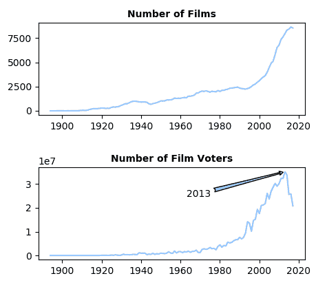
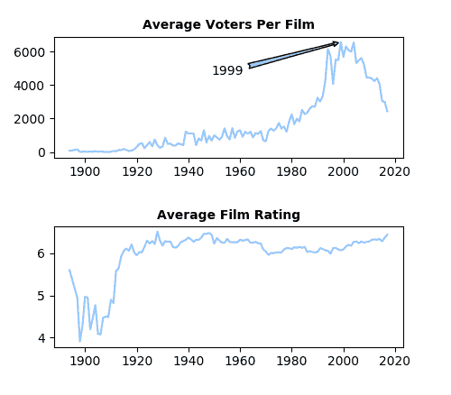
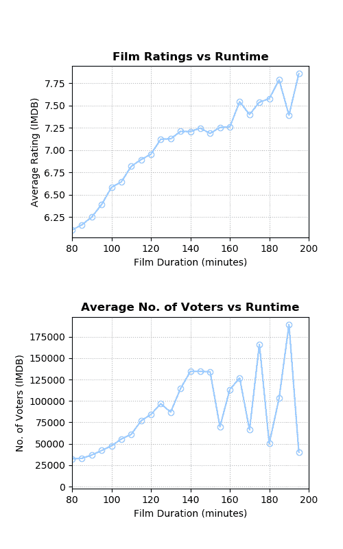

# 从数据科学家的角度对 IMDb 电影数据库的探索性数据分析

> 原文：<https://medium.com/analytics-vidhya/exploratory-data-analysis-of-the-imdbs-movie-database-from-a-data-scientist-perspective-b1dfd7455d1?source=collection_archive---------0----------------------->

我一直热衷于研究数据。这是一个漫长的旅程，超过 10 年。我一直在处理各种各样的数据；从工程数据集，如无人机燃油系统数据或客机机翼结构健康数据，到零售业务或娱乐数据集。

看电影，谈论电影，做评论家是我的另一个爱好。将这两种激情结合在一起非常有趣。最近，我使用最常用的数据科学编程语言之一:Python，对 IMDb 的电影数据库进行了探索性的数据分析。

我一直认为 1994 年是最好的电影诞生的一年(《阿甘正传》、《低俗小说》、《肖申克的救赎》等)。).这就是这个研究想法的来源。

下图包含两条支线，前者给出了每年制作的电影总数，后者给出了相应年份制作的电影的投票总数，该数字在 2013 年达到峰值，随后急剧下降。这就是乐趣的开始！每年制作的电影数量不断增加。为什么最近的电影里人们不再投票了？是因为电影变差了吗？还是 IMDb 网站失去了人气？然而，很明显，IMDb 仍然主导着在线电影评级行业，其令人兴奋的月访问量达到 2.5 亿[【阅读更多】](https://www.businesswire.com/news/home/20180222005150/en/IMDb-Launches-First-Ever-Skill-Amazon-Alexa)。

这可能是另一项研究，我们将继续寻找我最初问题的答案:

> 1994 年是最佳电影之年吗？

下图给出了平均值。前者每年再次显示每部电影的平均投票人数，而后者每年给出平均电影评分。自 20 世纪 20 年代以来，平均电影评级往往在 6/10 左右波动。自 80 年代后期以来，这种略微上升的趋势是显而易见的，但是这种差异在统计学上并不显著，不能说电影得到了更好的评价。平均电影评级图仍然没有回答原来的问题。

如果我们用每部电影的平均投票人数来考察上面的图表，它在 90 年代和 21 世纪初达到顶峰，并一直在急剧下降。电影收视率在上升，但每部电影的投票数却在下降？你怎么解释呢？对我来说，这意味着当人们喜欢一部电影时，他们会投更多的票。他们不会费心去评价一部普通或无聊的电影。但这似乎只适用于最近的电影，而不是 90 年代或 2000 年代的电影。我们能把这和人口统计学联系起来吗，特别是占主导地位的选民的年龄？这是另一个研究点。

总的来说，这个分析满足了我最初的假设，即 1994 年是“那一年”吗？是的，不知何故。显然，90 年代和 21 世纪初的电影获得了最多的投票和吸引力，其中 1999 年最高；1994 年是第三年。

另一个有趣的分析结果是电影时长和电影评分之间的相关性。如下图所示，电影评级与电影时长高度正相关。电影越长，获得更高评级的可能性就越大:)然而，对于放映时间超过 3 小时或更长的电影，评级开始波动得更大。

我期待着继续研究这些数据，以满足我对电影数据的数据科学愿望。进一步的分析将主要集中在使用机器学习算法的预测分析上。欢迎任何意见和建议。

您可以从我的 GitHub 页面访问代码和数据集:

[https://github.com/omerfarukeker/imdb_work](https://github.com/omerfarukeker/imdb_work)

干杯！