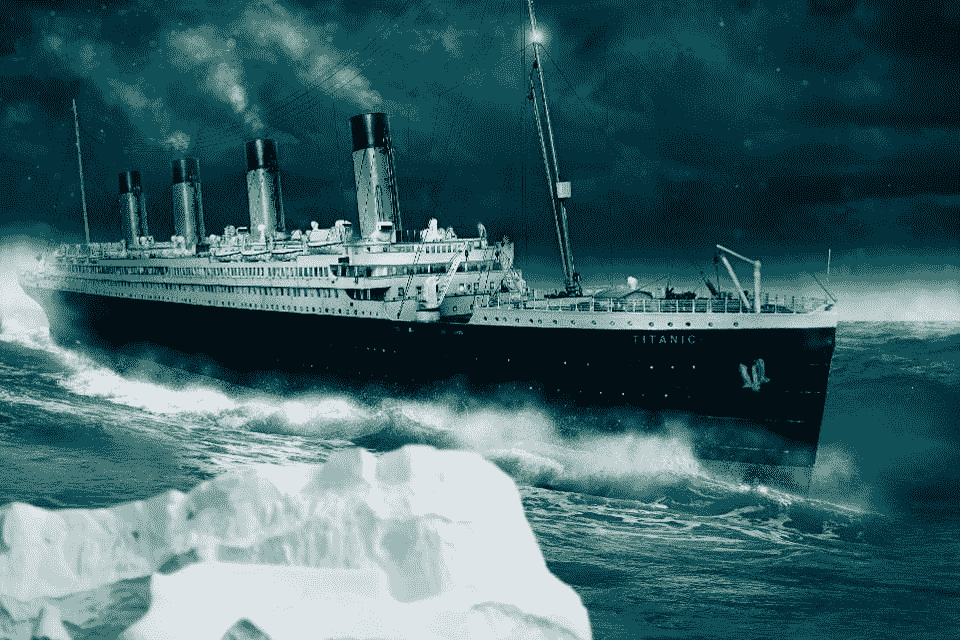
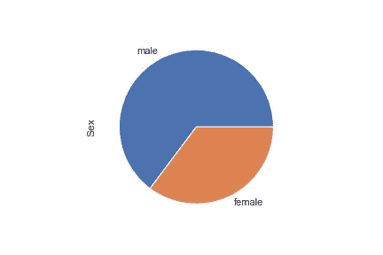
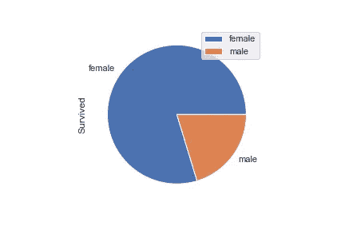
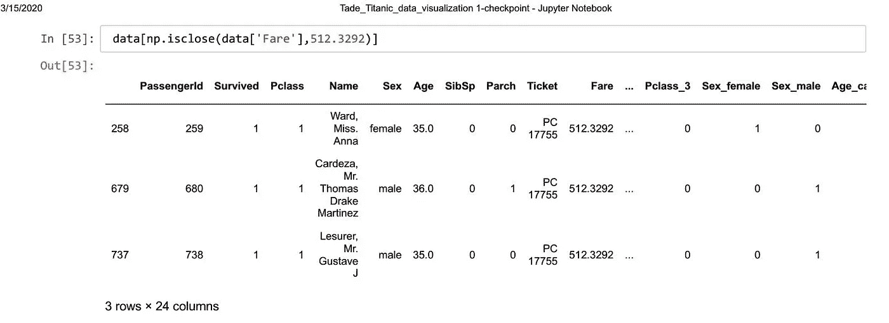
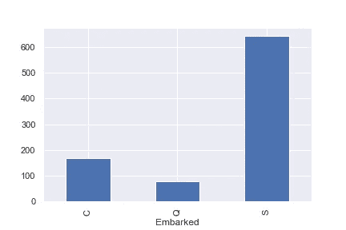
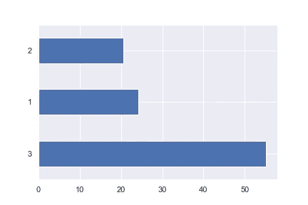
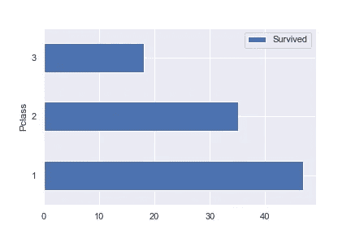

# 泰坦尼克号数据集的探索性数据分析:为什么泰坦尼克号的故事不仅仅是一个爱情故事。

> 原文：<https://medium.com/analytics-vidhya/exploratory-data-analysis-of-the-titanic-data-set-why-the-titanic-story-is-more-than-just-a-love-13ca52deb9ba?source=collection_archive---------16----------------------->

图片来自 Forbes.com

当你想到泰坦尼克号时，杰克和罗斯无疑会出现在你的脑海中，然而这个臭名昭著的事件并不像你看到的那样简单。在这篇文章中，我将揭示我对骑士精神、奢侈和生存机会的发现。我将使用 pandas、numpy、matplotlib 和 seaborn 库来这样做。这是一个激动人心的故事，数字讲述了泰坦尼克号沉船的故事。

请注意，我使用的数据是训练数据集。训练数据集对于分析来说足够健壮。

所以导入必要的库。我们开始吧。

导入库并加载数据。

对数据的探索。

1.  杰克是一个象征。

你还记得在电影中杰克确保罗斯有更大的生存机会吗？事实证明不只是杰克这么做。数据显示，尽管男性的比例高于女性。女性的存活率高于男性。结果是男人放弃了他们本可以抓住的机会，让女人和孩子先走。杰克是骑士精神的象征。

得到男性和女性的百分比。

男性占 64.76%，女性占 35.24%

男性和女性的存活率。

雄性存活率为 20.29%，雌性存活率为 79.71%。

2.**富人买了他们的生存。**

金钱使世界运转，大多数时候你会发现它决定着生死。一些为头等舱、豪华服务以及毫无疑问的坐在船长桌旁支付高额费用的局外人，无论其性别如何，都幸免于难。

支付最高票价的总人数全部幸存。

3.**悲伤对南安普敦打击最大。**

大多数人是在南安普敦上船的，比例高达 86%，所以你可以看出南安普敦遭受了家庭、朋友、工人以及其他人的损失，其中人数最多的是在那里上船的大量民众。

观察港口的登船情况。

168 人在瑟堡上车，77 人在皇后镇上车，644 人在南安普敦上车。

4.第三阶层的人口数量最多。

观察每个班级的人数

每类人口百分比。

三等舱有 55.106622 %，二等舱有 20.650954%，而一等舱有 24.242424%。

但是

谈到生存，第三类人的比率最低。

观察每班的存活率

第一班的存活率最高，而第三班的存活率最低

使用 python 及其包的这类信息的发现为更多的问题铺平了道路，例如幸存者，他们的故事，每个人都有不同的描述，但都有类似的恐惧、愤怒、悲伤、不确定和悲伤的反应。

这些是数据科学给我提供的发现，一个通过数字阅读和揭示故事的机会。
感谢您的阅读。
保持联系，我用有趣的方式讲述数据科学的故事！如需更多类似信息，请保持联系并点击关注按钮

谢谢大家！