# 泰坦尼克号生存问题的探索性数据分析

> 原文：<https://medium.com/analytics-vidhya/exploratory-data-analysis-of-titanic-survival-problem-e3af0fb1f276?source=collection_archive---------1----------------------->

## 第一部分—分析、清洁和可视化

EDA 是一种统计方法，用于在建立假设或建模之前可视化和分析数据。

这是我的数据科学入门系列的第一部分。

*   第一部分——埃达论泰坦尼克号的生存问题
*   [第二部分——爱荷华州房价预测 EDA](https://vrevathi.medium.com/exploratory-data-analysis-of-iowa-housing-price-prediction-problem-3d50a016797a)
*   [第三部分——模型构建、评估和组装](https://vrevathi.medium.com/modeling-evaluation-and-ensembling-f00fe1de6470)

在这篇文章中，我们将探索来自 Kaggle 的[泰坦尼克号——灾难中的机器学习](https://www.kaggle.com/c/titanic)竞赛。我在这篇博客中总结了我的分析和见解。github 上有一个详细的笔记本，包含了对泰坦尼克号数据的全面研究。

# 目录

1.  [变量研究](#616a)
2.  [数据清理](#534e)
3.  [特征工程](#a8da)
4.  [相关性研究](#6b20)
5.  [目标变量分析(单变量分析)](#0d81)
6.  [双变量分析](#50b6)
7.  [多元分析](#bc31)

# 变量研究

首先，我们将导入必要的包并加载数据集。

```
import pandas as pd
import numpy as np
import seaborn as sns
import matplotlib.pyplot as pltdf = pd.read_csv('../data/titanic-train.csv')
df
```

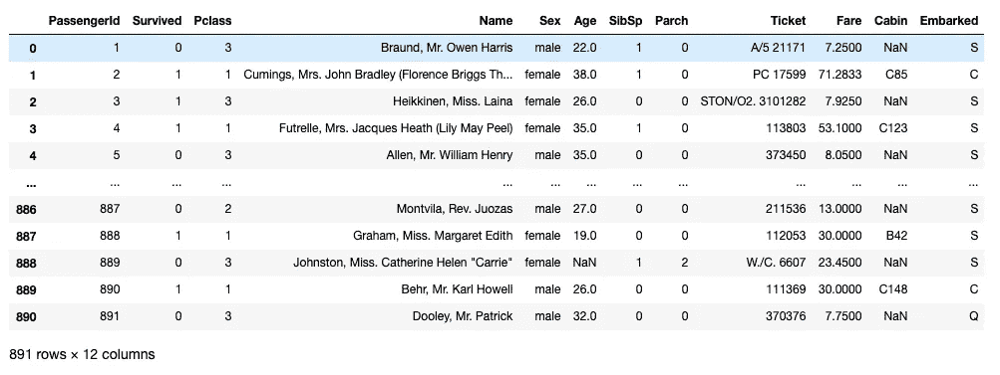

以上是泰坦尼克号生存问题的训练数据集。它有 891 行(乘客数量)，12 列(关于乘客的数据)，包括目标变量“*幸存*”。

让我们首先查看数据的列，然后我们使用 *describe()* 和 *info()* 方法来了解我们手头的基本信息。

```
cols = df.columns
cols
```


```
df.describe()
```

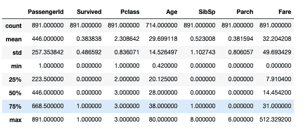

让我们逐行查看数据并尝试理解。

**计数:**第一行“计数”是特定列“PassengerID”中的条目数。它显示 891(等于乘客人数)，这意味着“乘客 ID”适用于所有乘客。除了“年龄”，每个乘客的所有其他数据都可用。我们得做点什么来修复“年龄”栏中缺失的值。

**平均值:**所有数据的平均值。让我们考虑“票价”一栏。乘客的平均“票价”是 32.20 美元

**Std:** 所有数据的标准差。低标准差意味着大多数数字接近平均值，而高标准差意味着数字更加分散。“票价”也有很高的标准差。

**Min:** 列的最小值。例如，最低的“票价”显示为 0 美元，这意味着“票价”不适用于某些乘客。对于某些乘客来说，该模型在 0 的情况下可能表现不佳。因此，在建模之前，我们需要关注“Fare”列。

**Max:** 列的最大值。例如，最高的“票价”显示为 512.33 美元。“票价”一栏的平均值是 32.20 美元。我们看到票价差别很大。这可能是因为他们旅行的“阶级”。

**25%、50%&75%**数据的第一、第二和第三四分位数。统计学中的四分位数是一种分位数，它将有序数据点的数量分成四个相等的组。第一个四分位数是最小数和中位数之间的中间数。第二个四分位数是数据集的中位数。第三个四分位数是中间值和最高值之间的中间值。

```
df.info()
```

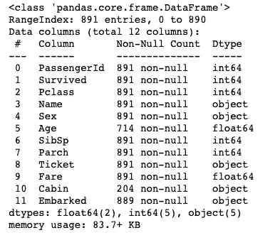

使用 *info()* 方法，我们获得数据集的 dtypes、非空计数和内存使用情况。要获得数据的总空值，我们必须使用 *isnull()* 方法。

```
df.isnull().sum()
```


我们已经知道年龄列中有 177 个缺失值。从上面的结果中，我们看到‘Cabin’中有 687 个缺失值，而‘Embarked’中有 2 个缺失值。在继续建模之前，我们需要修复这些空值。

现在让我们看看空值的热图。

```
sns.heatmap(df.isnull(), cmap = 'viridis', cbar=False)
```

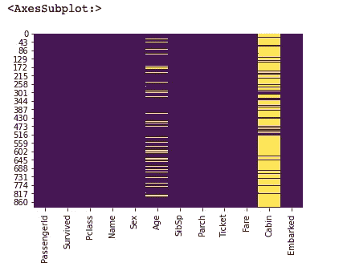

因为‘apollowed’列只有 2 个空值，所以它在热图中不可见。

# 数据清理

因为“小屋”列有更多的 *NaN* 值，所以让我们先修复它。客舱一栏有乘客的客舱号码，没有客舱号码的乘客可填写 *NaN* 。让我们创建一个新列“HasCabin ”,如果有小屋，则该列为 1，对于 *NaN* ，该列为 0。

```
def create_feat_has_cabin(df, colname):
    # if NA => 0 else 1
    def _is_nan(x):
        if isinstance(x, type(np.nan)):
            return 0
        return 1

    return df[colname].apply(_is_nan)

df['HasCabin'] = create_feat_has_cabin(df, 'Cabin')
```

现在，让我们用‘S’(南安普顿)填充已装船列的 NA 值

```
def fill_na_embarked(df, colname):

    return df[colname].fillna('S')

df['Embarked'] = fill_na_embarked(df, 'Embarked')
```

同样，年龄列也有很多缺失值。因此，我们用以平均值为中心的随机值来填充缺失值，并以标准差 *sd* 分布。让我们先得到平均值和标准差。

```
mean = df['Age'].mean()
sd = df['Age'].std()
print(mean,sd)
```


数据集的平均值为 29.48，数据集的标准偏差为 13.53。因此，我们通过选择 16 到 43 之间的一个随机数来填充缺失值。

```
def fill_na_age(df, colname):
    mean = df['Age'].mean()
    sd = df['Age'].std()
    def fill_empty(x):
        if np.isnan(x):
            return np.random.randint(mean-sd, mean+sd, ())
        return x
    return df[colname].apply(fill_empty).astype(int)df['Age'] = fill_na_age(df, 'Age')
```

# 特征工程

我们已经填充了数据中所有缺失的值。在这一部分中，我们戴上我们的创意帽子，想出可以帮助我们尚未构建的模型的性能的新功能。

首先，让我们通过组合“SibSp”(兄弟姐妹和配偶)和“Parch”(父母和子女)来创建一个新列“FamilySize”。

```
def create_feat_familly_size(df):
    return df['SibSp'] + df['Parch'] + 1

df['FamilySize'] = create_feat_familly_size(df)
```

好的完成了！

那些独自旅行的人呢？我们用 0 和 1 创建一个名为“IsAlone”的新列。

```
def create_feat_isalone(df, colname):
    def _is_alone(x):
        if x==1:
            return 1
        return 0

    return df[colname].apply(_is_alone)

df['IsAlone'] = create_feat_isalone(df, 'FamilySize')
```

正如我们前面看到的，Fare 列包含一些乘客的 0 和一些乘客的众所周知的高值。因此，让我们将票价分为四类，并将其存储在新列“CategoricalFare”中

```
def create_feat_categoricalFare(df, colname):
    return pd.qcut(df[colname], 4, labels = [0, 1, 2, 3]).astype(int)df['CategoricalFare'] = create_feat_categoricalFare(df, 'Fare')
```

我们已经填补了年龄的缺失值。现在让我们将年龄分为 5 个类别，并将其存储到一个新列“CategoricalAge”中

```
def create_feat_categoricalAge(df, colname):
    return pd.qcut(df[colname], 5, labels = [0, 1, 2, 3, 4]).astype(int)df['CategoricalAge'] = create_feat_categoricalAge(df, 'Age')
```

搞定了。

现在让我们来看看名称列。我们有许多头衔['先生'，'夫人'，'小姐'，'主人'，'堂'，'牧师'，'博士'，'夫人'，'女士'，'少校'，'夫人'，'先生'，'女士'，'上校'，'上尉'，'伯爵夫人'，'琼基尔']。因此，让我们从每个名字中提取标题，并将标题分为四类，即先生、小姐、夫人和稀有，并将其存储在一个新列“title”中。

```
import redef create_feat_title(df, colname):
    def find_title(x):
        title_search = re.search(' ([A-Za-z]+)\.', x)
        if title_search:
            title = title_search.group(1)
            if title in ['Mlle', 'Ms']:
                return 'Miss'elif title in ['Mme', 'Mrs']:
                return 'Mrs'
            elif title=='Mr':
                return 'Mr'           
            else:
                return 'Rare'
        return ""

    return_title= df[colname].apply(find_title)
    dict_title = {'Miss': 1, 'Mrs':2, 'Mr':3, 'Rare':4}
    return return_title.replace(dict_title)df['Title'] = create_feat_title(df, 'Name')
```

现在，我们将“男性”和“女性”的“性别”列值更改为 1 和 0，并将其存储在新列“性别数值”中。但是为什么呢？机器学习算法在数值域中运行。他们不理解“男性/女性”或“是/否”。但是他们明白 0 和 1 的区别。

出于同样的原因，我们也可以将 apollowed 列的值改为 numerical。

```
def create_feat_sex(df, colname):
    def sex(x):
        if x=='male':
            return 1
        return 0

    return df[colname].apply(sex)

df['SexNumerical'] = create_feat_sex(df, 'Sex')df['Embarked'] = df.Embarked.replace({'S': 0, 'C' : 1, 'Q' : 2})
```

好了，我们完成了数据清理和特征工程。让我们检查一下数据框中是否还有空值。

```
df.isna().sum()
```

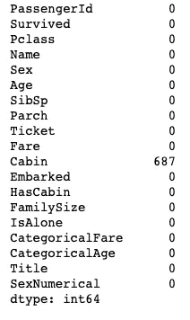

我们可以忽略 Cabin 中缺少的值，因为我们已经创建了一个新列“HasCabin”。是时候删除无用的列了。

```
drop_list = ['PassengerId', 'Cabin', 'Ticket', 'SibSp', 'Name']
titanic = df.drop(drop_list, axis=1)
```

# 相关研究

我们已经完成了数据清理和预处理。

在可视化数据之前，让我们看看变量之间的相关性。

```
corrmat = titanic.corr()
corrmat
```


正值和负值表示正相关和负相关。数据的第一行显示了每个变量与目标变量“存活”的相关性。

为了建立一个好的预测模型，我们对影响目标变量“存活”的变量感兴趣。积极或消极。我们需要考虑过高和过低的值。

让我们来看看使用惊人而简洁的 [seaborn](https://seaborn.pydata.org/) 渲染的漂亮的关联热图。

```
colormap = plt.cm.Blues
plt.figure(figsize=(14,10))
sns.heatmap(titanic.corr(), cmap=colormap, annot=True, linewidths=0.2)
```

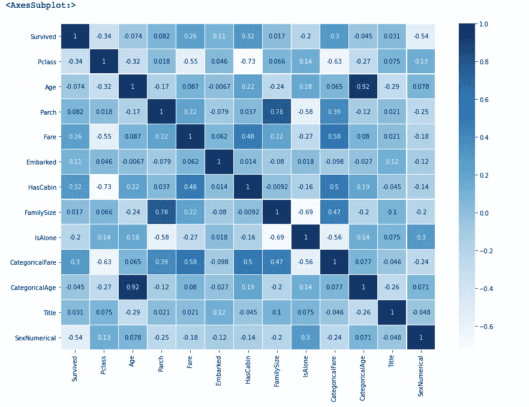

第一行包含代表每个变量与目标变量的相关性的值。“HasCabin”和“CategoricalFare”与目标变量高度(正)相关，而“Sex Numerical”与目标变量负相关。

# 目标变量分析(单变量分析)

目标变量的研究是揭示变量的性质和分布的数据分析中的一个重要步骤。让我们分析一下我们的目标变量“幸存”。

```
titanic['Survived'].value_counts()
```


根据上述结果，训练数据中的 891 名乘客中有 342 人幸存。让我们用计数图来绘制它。

```
sns.countplot('Survived', data=titanic)
plt.title("Titanic Survived")
plt.show()
```

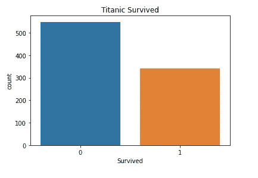

从上面的情节来看，活下来的人比死了的人少。现在让我们用饼图来看看幸存乘客的百分比。

```
explode = [0, 0.05]
titanic['Survived'].value_counts().plot.pie(autopct = '%1.2f%%', explode=explode)
```


从上面的图表可以看出，根据这一训练数据，只有 38%的乘客幸免于难。显然，各阶级之间不平衡。

# 双变量分析

让我们分析“Pclass”列，因为它与目标变量高度相关。

```
titanic['Pclass'].value_counts()
```


```
titanic.groupby(['Pclass', 'Survived'])['Survived'].count()
```

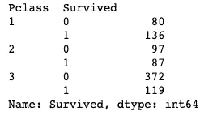

以上结果显示了基于 Pclass 的乘客分手并幸存。但是，我们仍然看不到这个数据的存活率。因此，让我们将 Pclass 与 Survived 一起绘制，以便更好地了解数据。

```
sns.catplot(x='Pclass', y='Survived', data=titanic, kind='point')
```

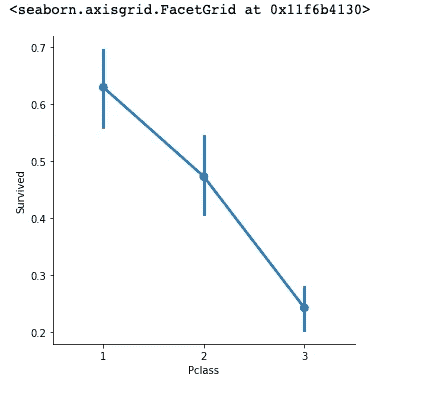

你在上面看到的叫做点状图。它显示点估计和置信区间。点估计表示变量的集中趋势，而置信区间表示该估计的不确定性。从上面的图中可以清楚地看出，与其他级别的乘客相比，头等舱乘客的存活率最高。

让我们再来看一个比较性别和费用的双变量分析的例子。

```
sns.catplot(x='Sex', y='Fare', data=titanic, kind='boxen')
```


上面显示的增强方框图表明“女性”乘客的票价平均高于男性乘客。这可能是因为向女性乘客提供了额外的服务。

# 多变量分析

与双变量分析相比，多变量分析有助于我们更深入地了解变量之间的关系。后者假设变量 X 和目标变量 Y 之间的关系独立于其余变量，(即 f(X，Y)不依赖于第三个变量 z。这种限制性假设可能是危险的。例如，“妇女和儿童优先”是自 1852 年以来遵循的一项海军行为守则，其中规定在生命受到威胁的情况下，首先拯救妇女和儿童的生命。我们已经知道，“生存”与“性”高度相关。但是第三个变量“年龄”(孩子)影响着“生存”和“性”之间的关系。

首先，让我们看看用三个变量分析数据，然后我们将学习对四个变量之间的关系进行建模。让我们比较一下“性别”和“年龄”。

```
sns.catplot(x='Sex', y='Age', data=titanic)
```

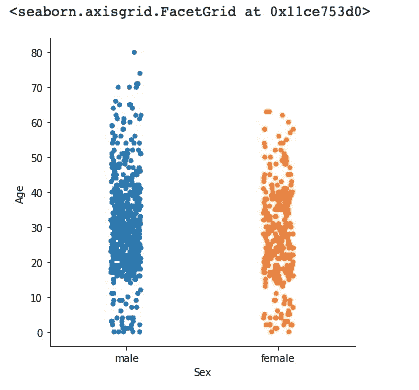

从上面的图表中，我们可以看到一些非常老的人在旅行。但是我们不能通过比较年龄和性别来获得更多的信息。

所以让我们把第三个参数“Pclass”包含进来，试着更好地理解它。

```
sns.catplot(x='Sex', y='Age', data=titanic, kind='box', hue='Pclass')
```

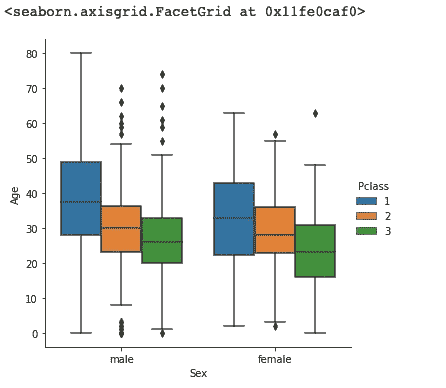

从上面的情节中，我们推断出大多数老年人都是坐头等舱旅行。这可能是因为他们很富有。年龄在 25 至 35 岁之间的年轻人大多乘坐二等和三等舱。

也许用小提琴的情节我们能看得更清楚。

```
sns.catplot(x='Pclass', y='Age', data=titanic, kind='violin', hue='Sex')
```


现在让我们看看如何比较四个变量。就拿‘年龄’和‘车费’来说吧。注意，两者都是连续变量。

```
sns.jointplot(x='Age', y='Fare', data=titanic, kind='hexx')
```

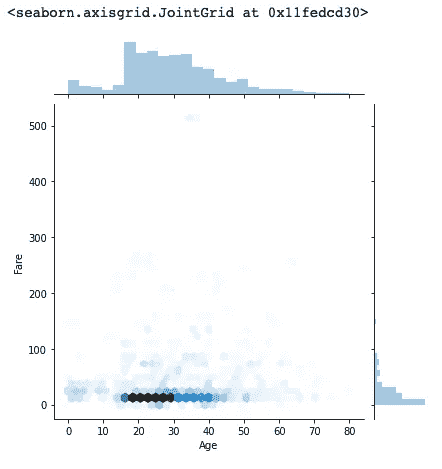

乘客的平均年龄在 20 至 40 岁之间，平均票价约为 20 至 50 美元。从之前的剧情我们看不太懂。我在下面展示了一个更好的数据视图，它包括“性别”和“阶级”以及“年龄”和“费用”。

```
sns.relplot(x='Age', y='Fare', data=titanic, row='Sex', col='Pclass')
```

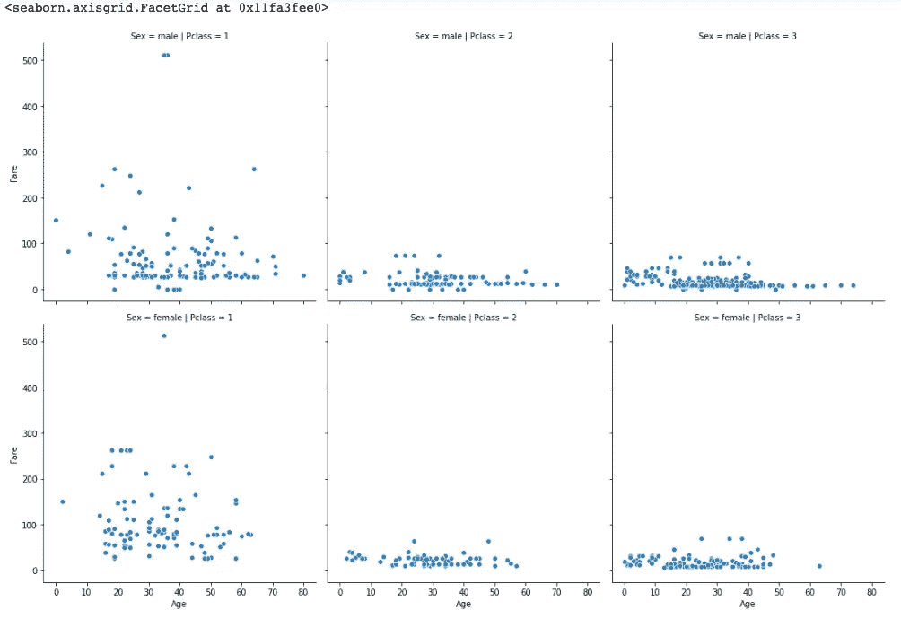

从上面的图中，我们观察到乘坐头等舱的男性乘客比女性乘客多。头等舱女性乘客的票价高于男性乘客。二等舱和三等舱的票价没有太大差别。很少有孩子坐头等舱旅行。第三个班有更多的孩子。大多数二等和三等舱的乘客年龄在 20 岁到 40 岁之间。

— — — — — — — — — — — — — — — — — — — — — — — — — —

这篇报道差不多到此为止了。你在上面看到的是我在过去几周所做的综合分析的总结。完整的笔记本可从[reys code/start-data science](https://github.com/reyscode/start-datascience)获得。在此期间，我在使用统计学和数据可视化来理解数据中变量之间的关系方面取得了很大进步。我很高兴地承认，我对使用统计学来理解数据中的模式感到很舒服。我期待着使用更先进的统计方法(ARIMA，…)从更多具有纠缠变量的[复杂数据](https://www.kaggle.com/muonneutrino/wikipedia-traffic-data-exploration)中获得洞见。

请看看我的后续博客:

*   第二部分— [EDA 对爱荷华州房价的预测](https://vrevathi.medium.com/exploratory-data-analysis-of-iowa-housing-price-prediction-problem-3d50a016797a)
*   [第三部分——模型构建、评估和组装](https://vrevathi.medium.com/modeling-evaluation-and-ensembling-f00fe1de6470)

如果你觉得这个有趣，请在下面留下评论。我很乐意和你交流。