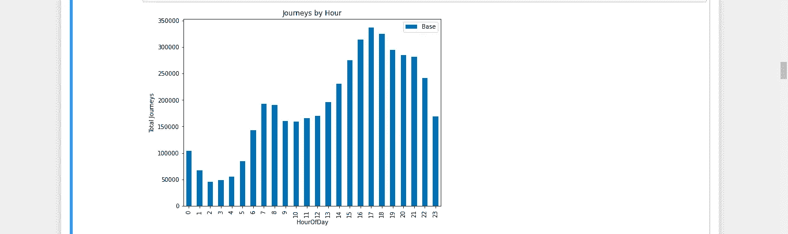

# 2014 年 4 月至 9 月纽约市优步皮卡的探索性分析

> 原文：<https://medium.com/analytics-vidhya/exploratory-data-analysis-of-uber-pickups-in-nyc-from-april-to-september-2014-ec78d5a35f78?source=collection_archive---------4----------------------->

## 使用 Python 中的各种工具探索数据并进行可视化


詹姆斯·巴勒姆/ The Verge 摄影

因为新冠肺炎，我不得不大部分时间呆在家里，这让我有了很多额外的时间，我决定利用这周末的一部分时间进行一个数据探索和可视化的小型项目，并把它写在我的第一个媒体出版物上！

我从 [**Kaggle**](https://www.kaggle.com/fivethirtyeight/uber-pickups-in-new-york-city) 获得数据集。它包括来自纽约市出租车&豪华轿车委员会(TLC)的 2014 年 4 月至 9 月纽约市超过 450 万辆优步皮卡和 2015 年 1 月至 6 月超过 1430 万辆优步皮卡的数据。对于本文，我将使用 2014 年 4 月至 9 月的数据。

> TL；DR——让我们看看如何使用 python 来探索和可视化纽约市的优步皮卡，并在这个过程中学习一些新东西！

# **看大图**

当您想要执行任何与数据科学相关的任务时，首先要执行的任务是提出您想要实现的明确目标，或者明确陈述您希望或期望数据回答的业务问题。

这个数据集可以用来回答很多问题，但是为了让这篇文章简短一点，我们将选择以下内容:

1.  优步在纽约的提货和配送
2.  优步取件定期发生的时间
3.  定期提货的日子
4.  区域内的拾音器分布
5.  在地图上拾取分布，并找出高度聚集/热点区域-我们将使用 BDSCAN 聚类算法在地图上执行此操作。

# 加载数据

从 2014 年 4 月到 9 月，纽约市有六个关于优步皮卡的 csv 文件数据。每个文件都包含特定月份的数据，并且每个文件都有以下各列:

**日期/时间**:优步皮卡的日期和时间
**Lat :** 优步皮卡的纬度
**Lon :** 优步皮卡的经度
**Base:**TLC Base 隶属于优步皮卡的公司代码

数据下载完成后，首先要做的是将六个文件连接成一个数据帧。我们将创建一个简单的函数，它将使用 **glob** 和 **os** 库来读取它们所在目录中的多个 csv 文件，并将它们连接成一个数据帧。

顺便说一下，大多数时候，当我处理像这样的大型数据集时，我通常在云上进行我的工作。这一次我将使用我的 2.2GHz，core i5 笔记本电脑，只有 8GB 内存，看看有多好(或坏！)是的，这比我希望的执行任务的时间要长一点。

如果你有类似的问题，你应该考虑使用 [**Vaex**](https://towardsdatascience.com/vaex-a-dataframe-with-super-strings-789b92e8d861) 库。 [Vaex](https://vaex.readthedocs.io/en/latest/) 是一个开源的 DataFrame 库，可以对几乎和你的硬盘一样大的表格数据集进行可视化、探索、分析和机器学习！为此，Vaex 采用了内存映射、高效核外算法和惰性评估等概念。

虽然我不会在这个迷你项目中使用它，但我可能会在其他拥有更大数据集的项目中使用它。它真的很容易使用，你可以阅读[这篇文章](https://towardsdatascience.com/vaex-a-dataframe-with-super-strings-789b92e8d861)来学习如何在你的下一个项目中实现它。

```
import glob
import osdef read_taxi_data():
    uber_directory = "/home/elvis/Documents/uber-pickups-in-new- york-city/2014" #loading folder containing dataset
    file_type = 'csv'
    seperator =','
    uber_2014 = pd.concat([pd.read_csv(f, sep=seperator,parse_dates=   ["Date/Time"]) for f in glob.glob(uber_directory + "/*."+file_type)],ignore_index=True)return uber_2014
```


请注意，当我执行上面的单元格时，用了 6 分钟，如单元格左下角所示！

在执行该函数之后，让我们使用 *info()* 和 *describe()* 函数来概述我们所拥有的数据。这有助于我们识别要素的数据类型以及哪些要素包含空值。


从 *info()* 我们可以看到每一列中数据的数据类型。*日期/时间*列属于*日期时间*数据类型，因为我们在串联过程中使用 *parse_date* 对其进行了转换。然而，我们必须将它分解成若干单独的列，如日期、时间、日和月，以便我们能够从这些数据中获得更有意义的见解。接下来，让我们看看数据中是否有空值。


我们运行上面的代码行来找出是否有任何特性具有空属性，在我们的例子中，是 none。超过 450 万行，没有一行丢失任何值，我们真幸运！

# 特征工程

现在我们对数据有了更好的了解，我们意识到我们需要添加更多的功能来回答我们的业务问题。

首先，我们将把*日期时间*特性分解成日期、月份、星期、日期和小时特性。

```
# Function for Expanding DateTime to separate columns that can be #used for other datadef expand_date(df):    
    df['date'] = df['Date/Time'].dt.date
    df['month'] = df['Date/Time'].dt.month
    df['week'] = df['Date/Time'].dt.week
    df['MonthDayNum'] = df['Date/Time'].dt.day
    df['HourOfDay'] = df['Date/Time'].dt.hour
    df['DayOfWeekNum'] = df['Date/Time'].dt.dayofweek 
#on 'DayOfWeekNum', Monday=0, Tuesday=1, Wednesday=2,...,Sunday=6     df['DayOfWeek'] = df['Date/Time'].dt.day_name()

    return df
```

然后，我们将在优步数据集上实现该函数。


在运行 info()时，我们意识到现在将有 10 列

# 数据探索

## 1.优步在纽约的提货和配送

首先，让我们探讨一下每月的提货量，看看这 6 个月是增加了还是减少了。


从上面的图中，我们可以看到，每个月的接送量都在稳步增长，从 8 月到 9 月的增幅略大(总行程比率= 1*10⁶)

## 2.按一周中的天数分配提货

让我们找出在这 6 个月中，哪一天的总接送/旅行次数比其他日子多。


有趣的是，周四的骑行次数更多！星期五紧随其后。甚至星期三和星期二的乘车次数都比星期六多，这是我没有预料到的！

让我们进一步分析一下，试着找出每个月工作日的总乘车次数。我们将首先对我们的数据执行一个 *groupby()* 操作。


然后，我们将使用 Seaborn 绘制一个点图来创建我们的可视化。

```
import seaborn as sns
import matplotlib.pyplot as plt
from matplotlib import cm
%matplotlib inline## create figure
fig = plt.figure(figsize=(12,6))
sns.set_style(‘darkgrid’)ax = sns.pointplot(x=”DayOfWeek”, y=”Base”, hue=”month”, data=daily_uber_rides_month)
handles,labels = ax.get_legend_handles_labels()ax.set_xlabel(‘Day of Week’, fontsize = 15)
ax.set_ylabel(‘Total Uber Pickups’, fontsize = 15)
ax.set_title(‘Total Number of Pickups for Each Weekday per Month (April-September 2014)’, fontsize=16)
ax.tick_params(labelsize = 8)
ax.legend(handles,labels,loc=0, title=”Months”, prop={‘size’:10})
ax.get_legend().get_title().set_fontsize(‘8’)
plt.show()
```


创建了点图

从上面的图中，就像在另一个图中一样，我们可以看到优步的皮卡数量每个月都在增加，周四有更多的皮卡。我们还可以查看各个月份每天的总访问量，正如您可以清楚地注意到的那样，在一周内，这些折线图在某种程度上似乎都具有相似的模式。细分数据还显示，只有 7 月和 8 月的周四接客总数最高。

## 3.按一天中的小时分配皮卡

现在是时候找出大多数旅程的时间了。让我们从了解大多数旅行的大致时间开始。

```
#create a pivot table of the data
uber_hour = uber_2014.pivot_table(index=['HourOfDay'],
                                  values='Base',
                                  aggfunc='count')#ploting
uber_hour.plot(kind='bar', figsize=(8,6))
plt.ylabel('Total Journeys')
plt.title('Journeys by Hour');
```



从数据的总体来看，看起来旅行在早上 6-8 点之间达到高峰，然后从下午 3 点开始再次达到高峰，并稳步上升，直到下午 5 点左右达到高峰，然后客流量稳步下降，直到深夜。

现在让我们把这个每小时的乘车数据分解成天，看看趋势是否还是一样。我们将计算几个月中每天每个小时的乘车次数，并保留工作日功能。 *groupby()* 操作将分配一个我们可以重置的层次索引。此外，我们将重命名该列，以表明它是符合标准的乘坐总次数的计数。

```
# groupby operation
hourly_ride_data = uber_2014.groupby(['month','DayOfWeekNum','HourOfDay','DayOfWeek'])['Base'].count()# reset index
hourly_ride_data = hourly_ride_data.reset_index()# rename column
hourly_ride_data = hourly_ride_data.rename(columns = {'Base':'RideCount'})# ocular analysis
hourly_ride_data.head()
```


现在让我们绘制其中一个月的每小时乘车次数，我们选择八月。

```
#first, create dataframe containing august hourly data
aug_hourly_data = hourly_ride_data[hourly_ride_data.month == 4]# create figure
fig = plt.figure(figsize=(12,6))
sns.set_style('darkgrid')ax = sns.pointplot(x="HourOfDay", y="RideCount", hue="DayOfWeek", data=aug_hourly_data)
handles,labels = ax.get_legend_handles_labels()ax.set_xlabel('Hour of Day', fontsize = 15)
ax.set_ylabel('Uber Pickups', fontsize = 15)
ax.set_title('Total Hourly Uber Pickups By Day of the Week in NYC (August 2014)', fontsize=16)
ax.tick_params(labelsize = 8)
ax.legend(handles,labels,loc=0, title="Days", prop={'size':10})
ax.get_legend().get_title().set_fontsize('8')
plt.show()
```


从上面的图中可以看出，在 8 月份，周三有更多的皮卡，高峰在下午 5 点至 7 点之间。不出所料，12 点至凌晨 3 点接客最多的一天是周日！周日下午 3 点到凌晨 2 点的接客量也最少。

## 4.每个工作日每小时的平均取货量

我们将使用每小时的数据来计算每个工作日的每小时平均值。与我们上面所做的使用每小时的总访问量相比，使用每个工作日的每小时平均值会给我们一个更准确的见解。我们将根据之前定义的工作日索引对数据进行排序，以便进行清晰的绘图。

```
## groupby operation
weekday_hourly_avg = hourly_ride_data.groupby(['DayOfWeek','HourOfDay'])['RideCount'].mean()## reset index
weekday_hourly_avg = weekday_hourly_avg.reset_index()## rename column
weekday_hourly_avg = weekday_hourly_avg.rename(columns = {'RideCount':'AverageRides'})## sort by categorical index
weekday_hourly_avg = weekday_hourly_avg.sort_index()## ocular analysis
weekday_hourly_avg.head()
```


看起来我们需要将 *AverageRides* 特性转换成 int。

```
#convert AverageRides column from float to int
weekday_hourly_avg['AverageRides'] = weekday_hourly_avg['AverageRides'].astype('int')
```

在那之后，我们可以画出我们的图形

```
## create figure
fig = plt.figure(figsize=(12,6))
sns.set_style('darkgrid')ax = sns.pointplot(x="HourOfDay", y="AverageRides", hue="DayOfWeek", data=weekday_hourly_avg)
handles,labels = ax.get_legend_handles_labels()#reordering legend content
handles = [handles[1], handles[5], handles[6], handles[4], handles[0], handles[2], handles[3]]
labels = [labels[1], labels[5], labels[6], labels[4], labels[0], labels[2], labels[3]]# ax.yaxis.set_major_formatter(FormatStrFormatter('%.0f'))
ax.set_xlabel('Hour of Day', fontsize = 15)
ax.set_ylabel('Average Uber Pickups', fontsize = 15)
ax.set_title('Hourly Average Uber Pickups By Day of the Week in NYC (April-September 2014)', fontsize=16)
ax.tick_params(labelsize = 8)
ax.legend(handles,labels,loc=0, title="Days", prop={'size':10})
ax.get_legend().get_title().set_fontsize('8')
plt.show()
```


从图中，我们可以观察到，在上午 12 点至 4 点之间，接收量逐渐下降，然后在上午 4 点至 8 点之间急剧上升，然后开始稳定下降，并在上午 9 点至 12 点之间趋于平缓。然后，它稳步上升，达到峰值，大多数日子是在下午 4-8 点，然后，除了周五和周六晚上 8-10 点略有上升外，整个晚上到第二天早上，它又稳步下降，原因很明显！

我们可以看到，优步的接单量在周四下午 4-9 点达到高峰，周五和周六晚上 9-11 点记录了大量的接单量。同样有趣的是，在上午 12 点至 4 点之间，周六的取件量显著上升，周日又略有上升。

另一个意想不到的观察结果是，周一全天的取件量如此之少，周一上午 10 点至下午 3 点之间的取件量最低。

## 5.优步皮卡在各基地的分布

从我收集到的信息来看，我还不确定我的判断是否正确，纽约已经被纽约出租车和豪华轿车委员会划分为几个基地，每次发生接送事件时，发生接送事件的区域的[区号都会被记录下来。](http://www.nyc.gov/html/tlc/html/industry/base_and_business.shtml)


从我们的数据来看，有 5 个碱基，每个碱基都有一个唯一的区域代码，用于识别它。为了便于我们识别碱基，我们将把*碱基*栏中的碱基代码替换为碱基的实际名称。

```
base_names = {"Base": {'B02617':'Weiter', 'B02598':'Hinter','B02682':'Schmecken','B02764':'Danach-NY','B02512':'Unter'}}uber_2014_bases = uber_2014.copy()uber_2014_bases.replace(base_names, inplace=True)uber_2014_bases.head()
```


“碱基”栏中的代码已被实际的碱基名称取代

现在，让我们创建一个图表，找出这几个月来基地中皮卡的分布情况。为此，我们将使用 plotly 库。

```
import plotly.express as px# Here we use a column with categorical data
fig = px.histogram(uber_2014_bases, x="Base",
                  title='Pickups Per Base',
                   labels={'count':'No of Pickups'})
fig.show()
```


皮卡在基地间的分布

从上面的图中，我们可以很容易地看到维特的皮卡数量更多，紧随其后的是辛特和施梅肯。这可能是因为这些地区是人口高度密集的地区。Unter 的访问量最少，不到 20 万次。

接下来，我们将在地图上绘制数据并可视化分布。

## 6.过去 6 个月的总提货量热图

让我们创建一个皮卡热图，尝试并可视化这几个月来纽约市的皮卡分布情况，以查看有大量皮卡的区域，反之亦然。我们将使用我一直想使用的底图包来创建一个非常酷的地图可视化！

```
from mpl_toolkits.basemap import Basemapwest, south, east, north = -74.26, 40.50, -73.70, 40.92fig = plt.figure(figsize=(14,10))
ax = fig.add_subplot(111)
m = Basemap(projection='merc', llcrnrlat=south, urcrnrlat=north,
            llcrnrlon=west, urcrnrlon=east, lat_ts=south, resolution='i')
x, y = m(uber_2014['Lon'].values, uber_2014['Lat'].values)
m.hexbin(x, y, gridsize=1000,
         bins='log', cmap=cm.YlOrRd_r);
```


一个非常好看的地图！

从热图中，我们可以看到曼哈顿中城和市中心(尤其是)有大量优步皮卡，这是合理的，当你向外移动时，在布朗克斯、皇后区和布鲁克林等地区，他们的皮卡数量明显减少。JFK 机场周围地区也有很多优步皮卡。

## 7.找出高度聚集/热点区域

这一节受到了杰夫·波音的文章 的启发，我肯定会就此再写一篇文章。

虽然查看热图上的原始数据集并获得直觉是有用的，但查看快照并不能给我们提供足够的信息来做出好的结论，并且绘制几个小时的单个拾取只会造成混乱。我们希望从这个数据集中得出可操作的结论，因此我们需要能够在城市的不同区域之间进行定量比较。

我们不想使用基数列，因为它们覆盖了很大的区域，那么我们如何定义区域呢？

我们可以手动定义它们，然后相应地将它们分类，但是我们要寻找的信息已经在我们的数据集中了。与其把我们的数据强加到一个建立在我们自己假设之上的框架中，不如让我们观察人们是如何移动的，并寻找特殊情况。

我们将从 [scikit-learn](https://scikit-learn.org/stable/modules/generated/sklearn.cluster.DBSCAN.html) 中实现 [**DBSCAN 聚类方法**](https://towardsdatascience.com/how-dbscan-works-and-why-should-i-use-it-443b4a191c80) ，而不是结构化空间宁滨。这会让我们更好地控制我们提出的问题。

k-means 算法可能是最常见的聚类算法。但是对于空间数据，DBSCAN 算法在这种还使用地理数据的情况下要优越得多。

DBSCAN 算法会将满足指定密度度量的点组合在一起。基本上，我们将定义一个最大距离，以使两个单独的点作为邻居，以及一组点作为聚类的最小邻居数。该算法会将符合标准的点分类成组，并丢弃所有异常值。

一旦 DBSCAN 确定了所有适用的聚类，我们就可以使用 Shapely 的 MultiPoint 类轻松计算质心并绘制结果。

这使我们能够准确识别在特定时间段内出现大量提货的地点。通过使用单个聚类中拾取的总数作为给热点位置着色的度量，我们可以可视化给定热点的强度以及其质心。

首先，我们将编写一个运行聚类算法并返回“热点”的函数我们将得到质心的坐标和每个集群中拾取的数量。

```
#import necessary libraries
from sklearn.cluster import DBSCAN
from geopy.distance import great_circle
from shapely.geometry import MultiPoint#Most of this code is from Geoff Boeing article and GitHub repo. 
#If you get lost, read through it and it will explain way better than I could ever do!
#[https://geoffboeing.com/2014/08/clustering-to-reduce-spatial-data-set-size/](https://geoffboeing.com/2014/08/clustering-to-reduce-spatial-data-set-size/)def get_hot_spots(max_distance,min_cars,ride_data):

    ## get coordinates from ride data
    coords = ride_data[['Lat', 'Lon']].to_numpy()

    ## calculate epsilon parameter using
    ## the user defined distance
    kms_per_radian = 6371.0088
    ##The epsilon parameter is the max distance that points can be from each other to be considered a cluster.
    epsilon = max_distance / kms_per_radian

    ## perform clustering
    db = DBSCAN(eps=epsilon, min_samples=min_cars,
                algorithm='ball_tree', metric='haversine').fit(np.radians(coords))

    ## group the clusters
    cluster_labels = db.labels_
    num_clusters = len(set(cluster_labels))
    clusters = pd.Series([coords[cluster_labels == n] for n in range(num_clusters)])

    ## report
    print('Number of clusters: {}'.format(num_clusters))

    ## initialize lists for hot spots
    lat = []
    lon = []
    num_members = []

    ## loop through clusters and get centroids, number of members
    for ii in range(len(clusters)):## filter empty clusters
        if clusters[ii].any():## get centroid and magnitude of cluster
            lat.append(MultiPoint(clusters[ii]).centroid.x)
            lon.append(MultiPoint(clusters[ii]).centroid.y)
            num_members.append(len(clusters[ii]))

    hot_spots = [lon,lat,num_members]

    return hot_spots
```

**提出问题进行测试**

在 2014 年 8 月 14 日下午 4:00 之后，在 50 米范围内发生 25 起以上皮卡事件的地点在哪里？


从数据来看，纽约市周围有 172 个集群符合标准。让我们把它画出来形象化。

这一次，为了绘图，我们将利用 [**传单库**](https://leafletjs.com/) 的[**mple leaf**](https://github.com/jwass/mplleaflet)——一个非常轻量级的 JavaScript 库，用于移动友好的交互式地图——将一个基本的 matplotlib 绘图叠加到一个传单上。它将自动执行所需的计算，将我们的 GPS 坐标投影到 2D 表示上。它也明显更快。

我们将使用散点图，这样我们就可以使用簇大小作为度量来设置标记颜色。如果我们在彩色地图上使用对数标度，那么在下限附近有更好的视觉区分。如果我们使用线性色标，那么接近下限的值将全部显示为相似的颜色。去吧，两个都试试。

```
import mplleaflet## make the figure
fig = plt.figure(figsize=(14,8))
ax = fig.add_subplot(111)## set the color scale
color_scale = np.log(hot_spots[2])
# color_scale = hot_spots[2]## make the scatter plot
plt.scatter(hot_spots[0], hot_spots[1],s=80,c=color_scale,cmap=cm.cool)## display the Leaflet
# mpl.show()     # opens in a new interactive tab
mplleaflet.display()  # shows interactive map inline in Jupyter but cannot handle large data sets
```


上面的地图显示了 2014 年 8 月 14 日下午 4:00 后，50 米内发生了 25 起以上的皮卡事件。太棒了。

最好的部分是，你可以在地图上放大，以便清楚地查看星团所在的区域，以防它是星团高度集中的区域。真的牛逼！

# **结论**

我得出的第一个结论是，如果我在任何地方使用这么大的数据集，我永远不会使用我的这台笔记本电脑来执行任何与数据科学相关的任务！我很快肯定要再买一台笔记本电脑了。我也建议你们去看看 Vaex 库，不管你的电脑有多强大。这是一个真正强大的库，将大大减少所需的执行时间。

其次，使用包含地理空间数据的数据集使我能够了解更多如何更好地使用它们来收集见解，因为我没有机会探索这类数据。如果你正在处理地理数据，DBSCAN 算法是一个非常强大的聚类算法，我对它印象深刻。

最后，使用传单库和底图库绘制地图对我来说是第一次，它们真的是很棒的库，我将来肯定会使用它们。

*我用来做这个迷你项目的 jupyter 笔记本现在在*[*GitHub*](https://github.com/elvisomondi/Exploratory-Analysis-and-Clustering-of-Uber-Pickups-in-NYC-from-April-to-Sept-2014)*上有了。*