# 世界 GDP 探索性数据分析(2017)

> 原文：<https://medium.com/analytics-vidhya/exploratory-data-analysis-of-world-gdp-2017-8d685785c21e?source=collection_archive---------13----------------------->

最近，GDP 或国内生产总值已成为一个国家经济稳健性的综合记分卡。
在本文中，我们对包含几个国家的 GDP 和其他变量的数据集进行了*探索性数据分析*，并尝试使用 Python 找出任何可观察到的模式。

> 什么是 GDP？在继续之前，重要的是我们要对 GDP 这个术语有一个基本的理解，以便让整个研究有一个目的和推理的感觉。GDP(国内生产总值)是一个国家在固定时间范围内生产的所有成品和服务的全部市场价值。

我们从导入 Python 中的相关库开始 EDA，然后将数据集导入 Pandas 数据帧进行操作。

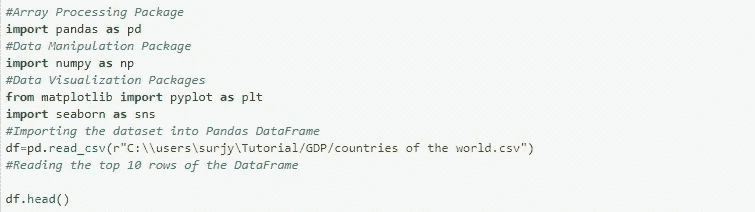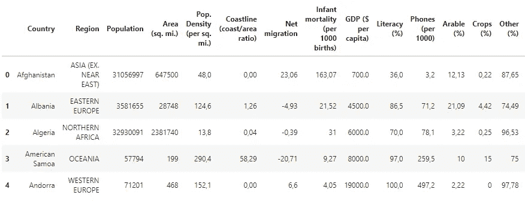

数据框中前 5 行的初始输出-(1)

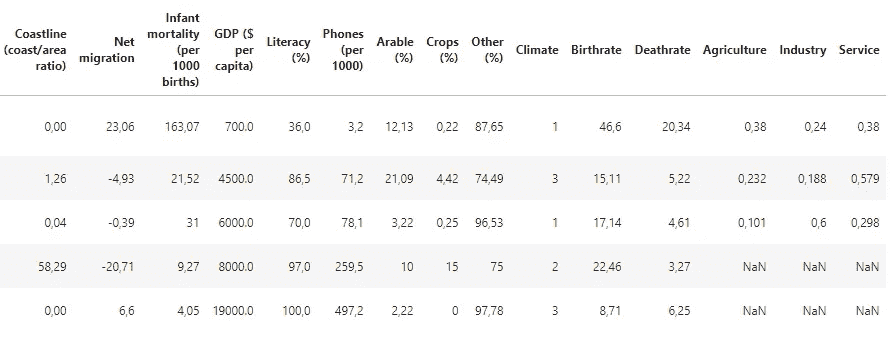

数据框中前 5 行的初始输出-(2)

初始化数据框后，我们运行一些命令来更好地了解我们的数据。

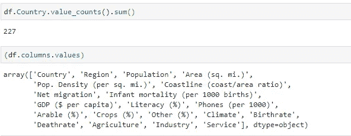

我们可以看到，在我们的数据框中总共有 227 个国家和 20 列。这些列，如国家、地区、人口、面积、人口密度等，是我们数据框的*特征*。

我们进一步深入到数据框架中，以找到关于当前数据类型的更多信息，并查找数据中的任何空值，因为数据集通常包含缺失值。

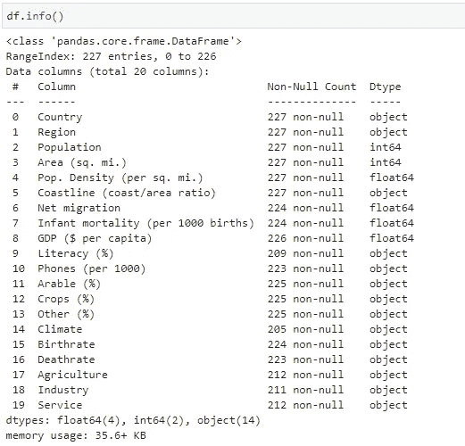

很明显，为了执行基本的数字运算，需要改变几个列的数据类型。

此外，如果我们查看我们的初始数据框，我们可以看到十进制值有一个逗号(，)，而不是句号(。)表示小数点。

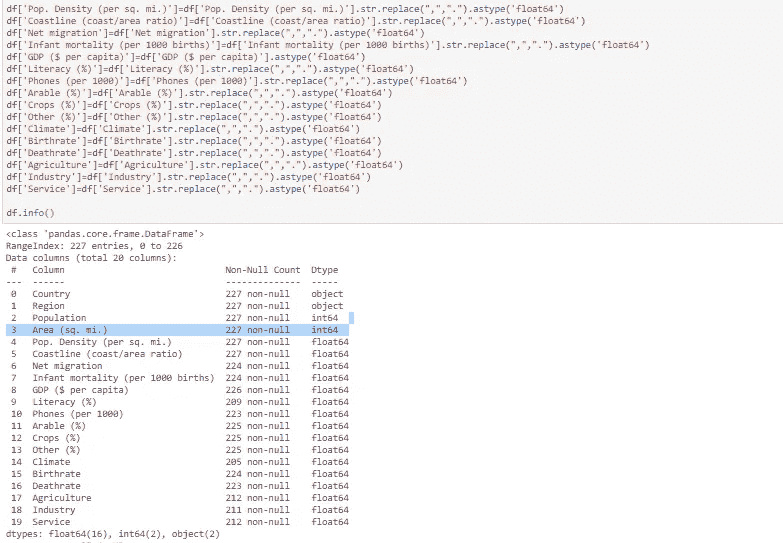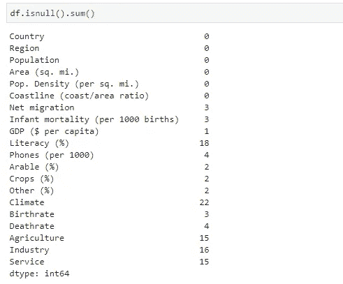

随后，我们用句号(.)并将所有数字特征的数据类型更改为 int 或 float(根据需要)

现在，我们使用 IsNull 函数通过计数来查找每一列中所有空值的总和。正如所料，有相当多的列具有空值，例如，净移民有 3 个空值，识字率有 18 个空值..等等。

在继续之前，我们必须找到一种方法来处理这些空值，以便执行基本的描述性统计分析。最简单的方法是删除具有空值的行，但是，这不是一个很好的选择(对于大多数情况)，因为它会导致信息丢失。另一种简单但有效的方法是用相应列(空值所属的列)的简单平均值(平均值)替换空值。甚至可以对特征的中值或模式进行同样的操作。

为了清理我们数据集中的数据，我们把它提高了一点，并按地区对国家进行分组。然后，我们通过在缺失值所属的国家/地区中查找要素的中值来替换不同要素的缺失值，并用该值替换它。例如，我们假设阿尔巴尼亚的识字率缺失。所以我们能做的是找到阿尔巴尼亚所属的地区，也就是东欧，然后找到这个地区的识字率的中间值。然后我们用东欧的平均识字率来代替阿尔巴尼亚缺失的识字率。

但是，在我们继续填充空值之前，有必要注意一个特殊的列——有 22 个缺失值的气候。如果我们查看原始数据框架，我们会发现数据集中的气候是一个分类数据。

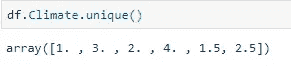

有 6 个独特的值被用来分类区分不同地区的气候。所以对于气候，我们找到平均值，然后四舍五入到最接近的整数。

方法确定后，我们编写一个简单的 FOR 循环来完成数据清理过程。

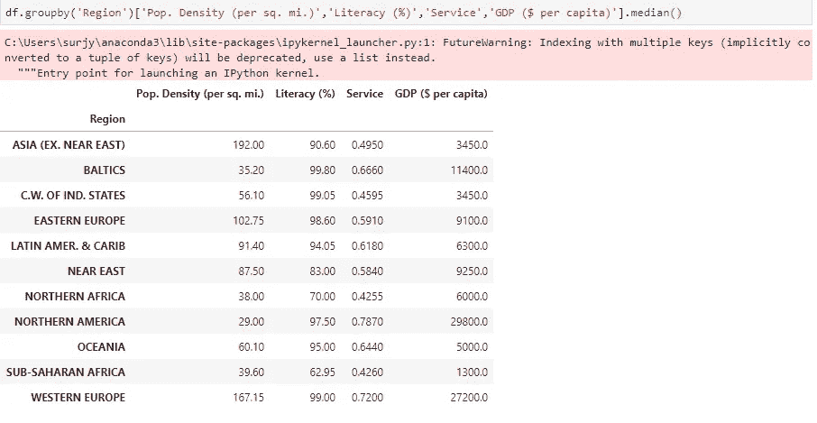

数据集中各地区人口密度、识字率和人均 GDP 的中位数。

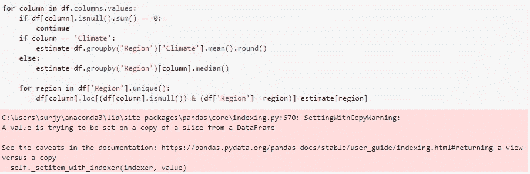

FOR 循环填充空值。

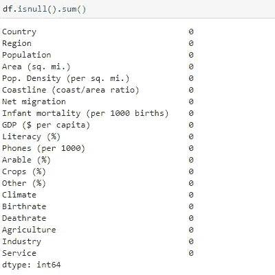

空值计数。

运行最终检查以确保正确的数据清理，我们发现数据框的要素中没有空值，因此，我们现在可以继续进行数据分析。

W 什么是数据分析？简单来说，就是利用分析和逻辑推理来收集和组织数据，并从中得出有益结论的过程。

虽然有多种数学模型可供使用，但我们使用简单的 Pearson 相关系数以及散点图和条形图进行具体分析。
我们将使用的库是 Matplotlib、Seaborn 和 Scipy。

我们首先在我们的数据集中找到人口和人口密度最高的 15 个国家，并绘制它们。

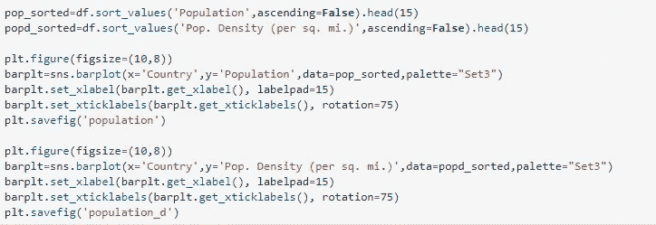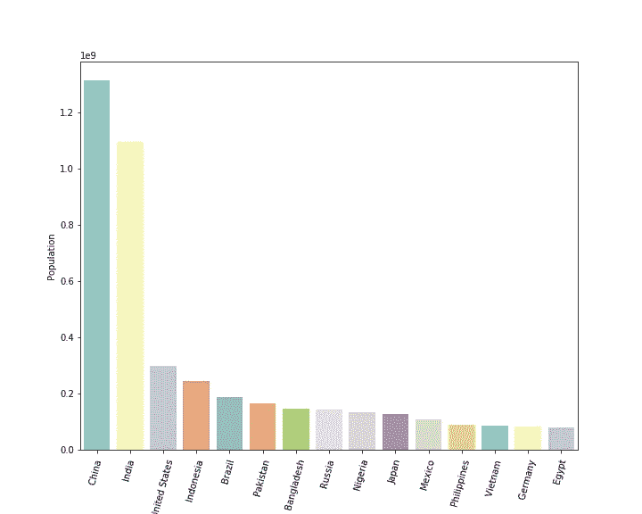

人口最多的 15 个国家

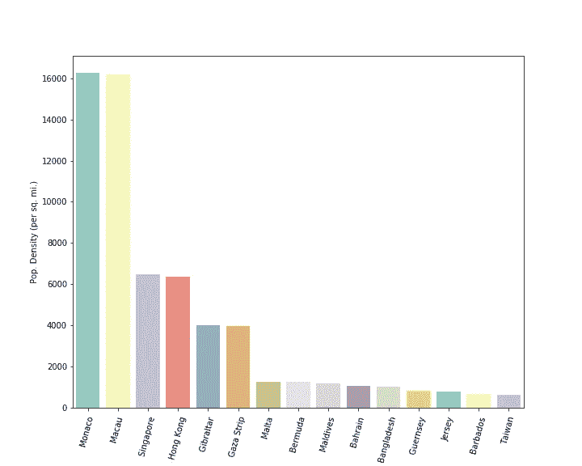

人口密度最高的 15 个国家

现在，我们把人均 GDP 最高的 15 个国家和世界平均水平一起标出来。为此，我们创建了两个独立的数据框架，一个是人均国内生产总值排名前 15 位的国家，另一个是世界平均值，并将两者连接起来。

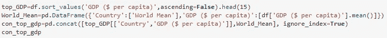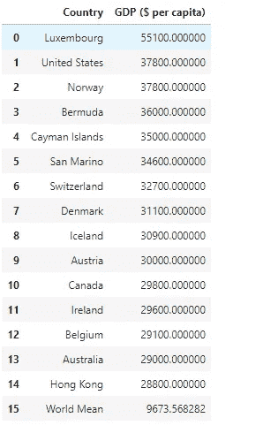

现在有了我们的数据设置，如图所示，我们可以前进并绘制它。

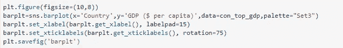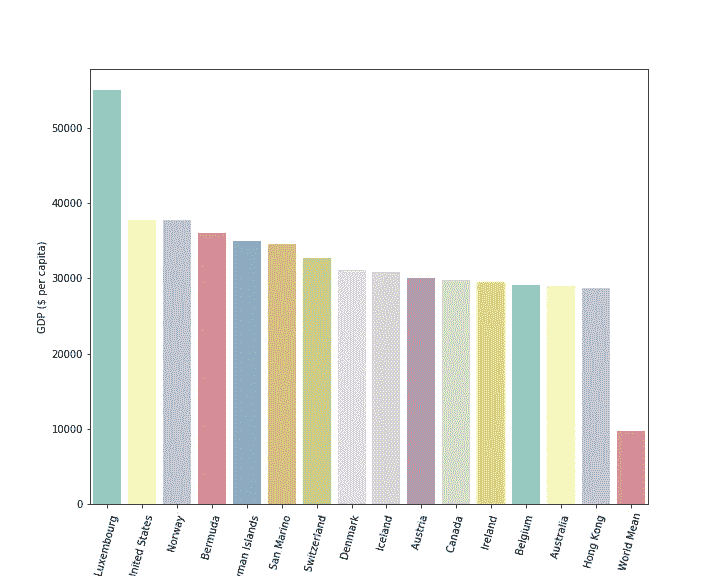

GDP 排名前 15 位的国家和世界平均水平。

现在，在这一点上，我认为，应该理解这样一个事实，即数据可视化是如何通过视觉差异来简化初步分析的。

现在，让我们再深入一点，找出各种特征与各国人均 GDP 之间的统计关系。

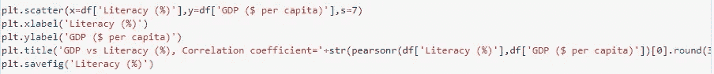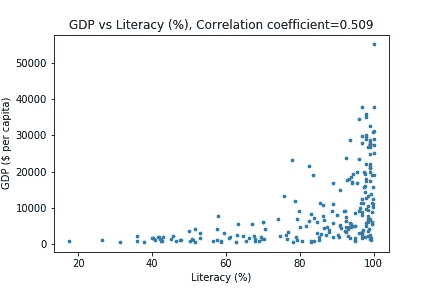

相关系数为 0.509，很容易推断出一个国家的识字率与其人均 GDP 之间存在中度正相关关系。

类似地，找到一些其他特征和 GDP 之间的相关性，我们得到以下结果。

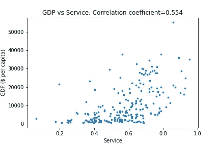

相关系数为 0.554，人均国内生产总值和提供的服务量之间也存在适度的相关性。

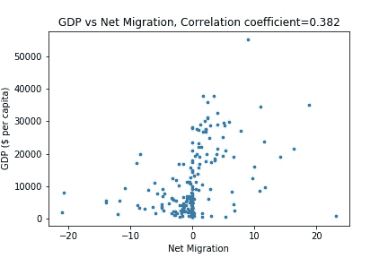

净移民和国内生产总值之间的相关性为 0.382，表明两者之间的相关性较低。

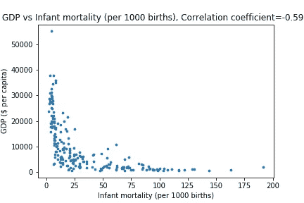

随着婴儿死亡率与国内生产总值之间的相关性接近-0.6，可以观察到中度(略偏高)负相关。这一指标尤其能够表明，在努力实现高人均 GDP 的同时，发达的医疗体系是多么重要。

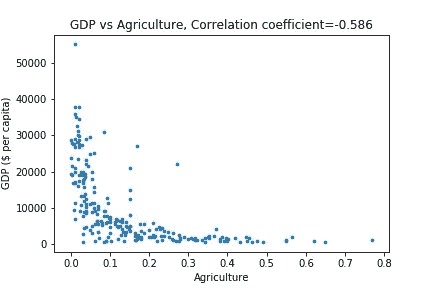

在一个国家的农业和人均国内生产总值之间也可以观察到负相关。现在，可以从这个指标中得出各种推论，特别是，作为发达国家(就国内生产总值而言)，并不特别依赖农业对其国内生产总值的贡献。

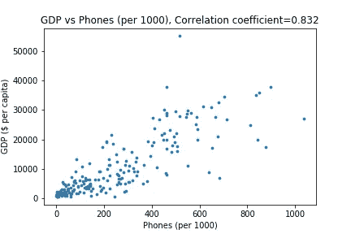

电话(每 1000 人)和 GDP 之间的系数为 0.832，可以观察到高度的相关性，表明蜂窝连接和相应的数据传输如何有助于经济繁荣。

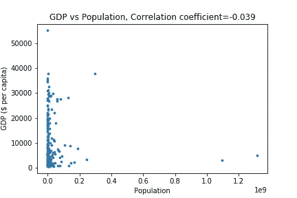

最后，看看人口和 GDP 之间的相关性，我们可以推断出两者之间的一个可以忽略的(不存在的)模式。

虽然我们可以继续研究各种特性之间的关系，但是对于大量的特性，孤立地研究它们是不切实际的。在这种情况下，我们可以得出一个相关矩阵，它可以有效地给出网格格式中所有特征之间的相关性。

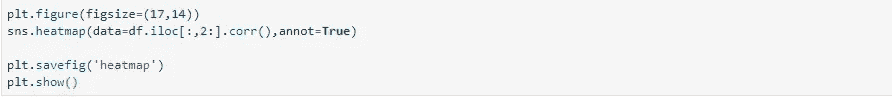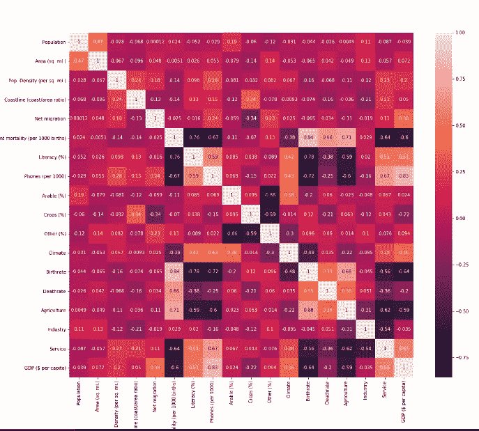

相关矩阵

如上所示，相关矩阵通过在特征之间形成所有可能的对并分别返回它们的系数，给了我们*大图*。

作为一个脚注，我们必须认识到数据分析和可视化的日益增长的重要性，以便随着每天越来越多的数据变得可用，来检测模式。
我们将本文的分析局限于相关矩阵。此外，我们可以分析数据分布中的偏斜，并通过使用适当的转换来相应地处理它。然后，校正分布后，我们可以在训练和测试集中按比例拆分数据，以便训练 GDP 预测模型并同时测试它。

感谢您的阅读。

链接到使用的数据集-

[https://www.kaggle.com/fernandol/countries-of-the-world](https://www.kaggle.com/fernandol/countries-of-the-world)