# 911 紧急呼叫的探索性数据分析

> 原文：<https://medium.com/analytics-vidhya/exploratory-data-analysis-on-911-emergency-calls-ab4aecef5bb8?source=collection_archive---------9----------------------->


来源:-[g 船长](https://www.google.com/search?q=helicopter+rescue+&tbm=isch&ved=2ahUKEwiF-Pz37crsAhWHCCsKHSFmCtgQ2-cCegQIABAA&oq=helicopter+rescue+&gs_lcp=CgNpbWcQAzICCAAyAggAMgIIADICCAAyAggAMgIIADICCAAyAggAMgIIADICCAA6BAgjECc6BwgjEOoCECc6BQgAELEDOgQIABBDOggIABCxAxCDAToHCAAQsQMQQ1DPMlicY2CRaWgBcAB4BIABlgWIAcApkgEKMC4xOC4xLjUtNJgBAKABAaoBC2d3cy13aXotaW1nsAEKwAEB&sclient=img&ei=xd-SX8WBLoeRrAGhzKnADQ&bih=657&biw=1366#imgrc=N-lYNw7DZ2YHeM)

## 概述:

911 是北美紧急求助热线号码。通过对该数据集进行分析，我们将试图了解应急响应团队是否做好了处理紧急事件的准备。我们还将了解由于自然原因(健康问题等)和人为错误(火灾事故、交通事故等)造成的紧急情况的频率。

## 步骤 1:导入库和获取数据集

**答>导入库**

```
import numpy as np
import pandas as pd
import matplotlib.pyplot as plt
import seaborn as sns
%matplotlib inline                 #function for in-notebook display
```

**b. >采集数据集**

这里 **可以得到数据集 [**。**](https://www.kaggle.com/mchirico/montcoalert)**

```
df=pd.read_csv("911.csv")  #reading dataset from local system
df.head()            #reading first five rows
```

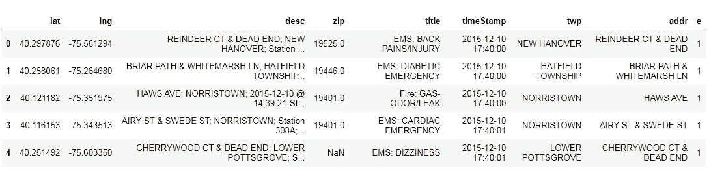

## 步骤 2:对数据的简要理解

**a .检查数据集的形状，即:-给定数据集中存在的行数和列数。**

```
df.shape     #how many rows and columns given dataset consists[out]>> (99492, 9)
```

**b .粗略浏览给定数据集中的每一列**

```
>> df.columns  #getting name of each column present in given dataset[out]>>Index(['lat', 'lng', 'desc', 'zip', 'title', 'timeStamp', 'twp', 'addr', 'e'], dtype='object')>>len(df.columns)    #total number of columns [out]>> 9
```

**c .数值数据的统计描述**

```
df.describe()   #gives the statistical result of all numerical #column present in dataset
```

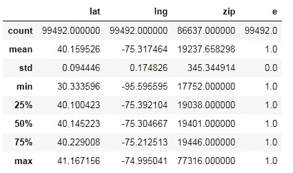

**d .分类数据的统计描述**

```
categorical=df.dtypes[df.dtypes==object].index   #printing index of 
#all categorical data
df[categorical].describe()  #stats description of categorical data
```

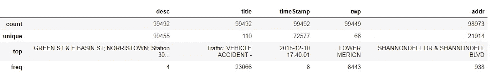

**e .检查给定数据集中是否存在空值**

```
>> df.isnull().values.any()  #is null value present or not?[out]>> True>>df.isnull().sum()   # total number of null value in each column[out]>> lat              0
        lng              0
        desc             0
        zip          12855
        title            0
        timeStamp        0
        twp             43
        addr           519
        e                0
        dtype: int64
```

在上面的块中，我们看到 **zip、twp 和 addr** 有空值，其余的都被填充了足够多的数据。

```
df.dtypes   #dtypes each column consists[out]>>
        lat          float64
        lng          float64
        desc          object
        zip          float64
        title         object
        timeStamp     object
        twp           object
        addr          object
        e              int64
        dtype: object
```

**f .填充空值**

现在我们将通过使用 [**正向填充**](https://www.geeksforgeeks.org/python-pandas-dataframe-ffill/) **来填充所有这些 nan 值。**

```
>>columns=["zip","twp","addr"]
>>df.loc[:,columns]=df.loc[:,columns].ffill() """fill null value 
                                     from last valid observation""">> df.isnull().sum() """crosschecking whether null values have been
                          filled or not"""[out]>>lat          0
       lng          0   
       desc         0
       zip          0
       title        0
       timeStamp    0
       twp          0
       addr         0
       e            0
       dtype: int64
```

**g .理解目标列“e”**

```
>> df.e.unique()    #distinct vatiable present at column "e"[out]>> array([1], dtype=int64)
```

正如我们看到的`df[“e”]`只包含一个数值变量，无法帮助我们更精确地分析数据，因此我们将放弃它。

```
>> df.drop("e",axis=1,inplace=True)   #dropping column "e" from df>>df.columns            #checking df["e"] has been dropped or not[out]>> Index(['lat', 'lng', 'desc', 'zip', 'title', 'timeStamp', 
               'twp', 'addr'], dtype='object')
```

**第三步:数据操作(第一部分)**

数据集中的某些特征可以根据用户的要求进行修改。这里时间戳有**对象**数据类型，但它应该是日期时间格式，所以我们必须手动将**时间戳**转换为**日期时间格式**，并将根据我们的要求修改数据帧。

```
type(df["timeStamp"].loc[0])[out]>> str
```

将**时间戳**转换为日期时间格式。

```
>> df["timeStamp"]=pd.to_datetime(df["timeStamp"])
>>type(df["timeStamp].loc[0])[out]>> pandas._libs.tslibs.timestamps.Timestamp>>df["timeStamp"].head()
```

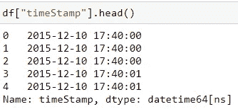

我想从**时间戳**中提取**日、月、年、小时、日期**，然后将它们一起加入原始数据帧中。

1.  **提取一周中的某一天，并映射成一天的名称格式**

```
#Extracting day of week
>>df["Day"]=pd.to_datetime(df["timeStamp"]).dayofweek
>>df["Day"].unique()[out]>> array([3, 4, 5, 6, 0, 1, 2], dtype=int64)#i want to get day of week into sunday,monday,..by mapping>>df["Day"]=df["Day"].map({0:"Sunday",1:"Monday",2:"Tuesday",3:"Wednesday",4:"Thursday",5:"Friday",6:"Saturday"})>>df["Day"].unique()[out]>> array(['Wednesday', 'Thursday', 'Friday', 'Saturday',      
                  'Sunday', 'Monday','Tuesday'], dtype=object)
```

**2。提取小时、月、年和日期**

```
**#Extracting month and mapping according to month's name**
df["Month"]=df["timeStamp"].dt.month
df["Month"].unique()[out]>> array([12,  1,  2,  3,  4,  5,  6,  7,  8], dtype=int64)df["Month"]=df["Month"].map({1:"January",2:"February",3:"March",4:"April",5:"May",6:"June",7:"July",8:"August",12:"December"})**#Extracting hour from timestamp**
df["Hours"]=df["timeStamp"].dt.hour**#Extracting year from timeStamp**
df["Year"]=df["timeStamp"].dt.year**#Extracting date** df["Date"]=df["timeStamp"].dt.datedf.head()    #printing first five rows of dataframe
```

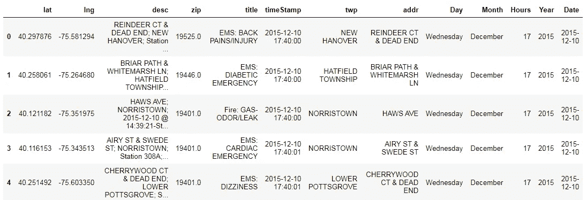

我们可以看到**日、月、小时、年**和**日期**已经添加到原始数据帧中。

**第四步:数据操作(第二部分)**

1.  如我们所见**标题**栏包括:**紧急事件的类别**和**原因**哪一个特定紧急事件已经发生。在本节中，我将把**标题**列拆分成两个不同的列(**类别**和**原因**，并删除标题列。

```
df["Category"]=df["title"].str.split(":",expand=True)[0]
#[0] is 0th idex of list after splitiing
df["Reason"]=df["title"].str.split(":",expand=True)[1]
#dropping title column after extracting category and reason
df.drop("title",axis=1,inplace=True)
df.columns  #Printing columns of dataframe
```

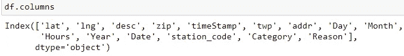

2.如果我们看到 **desc** 栏，它包括**地址、乡镇**和**车站代码**，其中我们只需要车站代码。因此，让我们提取站代码，并消除其余的数据点。

```
df["Station_code"]=df["desc"].str.split("Station",expand=True)[1]
df["Station_code"]=df["Station_code"].str.split(";",expand=True)[0]
df["Station_code"]=df["Station_code"].str.replace(":"," ")
df["Station_code"].head()#Now after extracting station code i will drop "desc' column
df.drop("desc",axis=1,inplace=True)
df.columns    #here station code has been added as a ccolumn in  df[out]>> Index(['lat', 'lng', 'zip', 'timeStamp', 'twp', 'addr', 'Day', 'Month','Hours', 'Year', 'Date', 'Category', 'Reason', 'Station_code'],dtype='object')
```

我已经提取了关于日期、日期、年、月和小时的所有信息，所以我将删除**时间戳**列(因为它没有任何我将来需要的特定数据)。

```
df.drop("timeStamp",axis=1,inplace=True)
```

现在我们已经完成了数据预处理，并修改了数据集，使其更容易被机器理解。

**第五步:探索性数据分析(EDA)**

本节将为您提供有关北美 911 电话的详细知识。EDA 的主要目的是让任何人都可以理解数据，不管一个人是否属于特定领域。让我们开始…

**1。>紧急呼叫次数最高的原因是什么**

```
df["Reason"].value_counts().keys()[0][out]>> 'VEHICLE ACCIDENT-' 
```

***车辆事故负责人的紧急呼叫次数最高。***

**2。>紧急呼叫次数最多的乡镇(twp)**

```
df.twp.value_counts().head().keys()[0][out]>> 'LOWER MERION'
```

**3。下游五大事故>**

```
df[df["twp"]=="LOWER MERION"]["Reason"].value_counts().head()
```

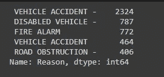

在“下梅里恩”镇，车祸发生的频率最高。在这里，我们可以看到所有因为人为错误而发生的顶级事故。**结论:——较低的 MERION** 有较少的医疗急救病例。

**4。>紧急呼叫次数最多的前 5 个月**

```
df["Month"].value_counts().head()
```

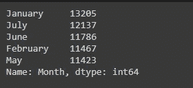

**5。>负责最多呼叫次数的前 5 个站点**

```
top5_station=df["station_code"].value_counts().head()
```

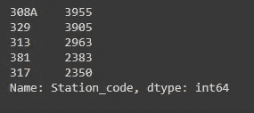

紧急呼叫次数最多的前 5 个站点的图形。

```
plt.figure(figsize=(10,6))
plt.bar(top5_station.index,top5_station.values,width=0.4,color="pink")
plt.xlabel('Index')
plt.ylabel("Values")
plt.title("Station code with calls")
plt.tight_layout()
```

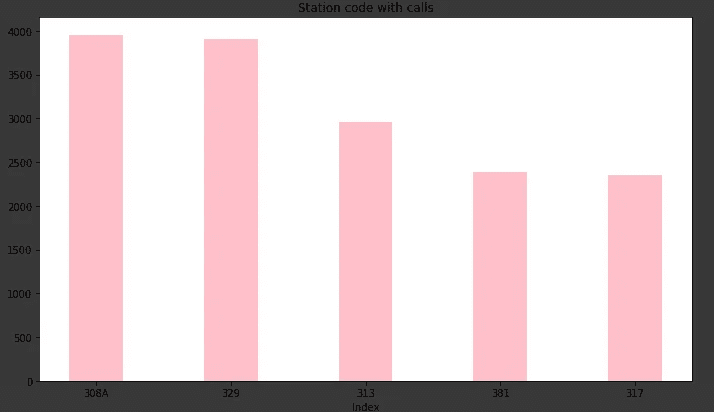

这里属于站代码 308A 的人已经呼叫了最高次数 3955 次。

**6。>一小时内各类突发事件的贡献。**

```
plt.figure(figsize=(8,6))
sns.countplot(df["Hours"],hue=df["Category"],data=df)
plt.xlabel("time in hours")
plt.ylabel("Total number of calls")
plt.title("Time contribution")
plt.tight_layout()
```

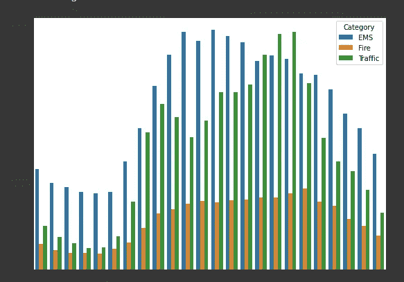

在这里，我们可以很容易地得出结论，医疗急救(EMS)是造成 **11:00 -12:00** 小时之间急救次数最多的原因。

**7。>紧急呼叫的年度变化**

```
plt.figure(figsize=(8,6))
sns.countplot(df["Year"],hue=df["Category"],data=df)
plt.xlabel("Years")
plt.ylabel("Total number of calls")
plt.title("yearly contribution")
plt.tight_layout()
```

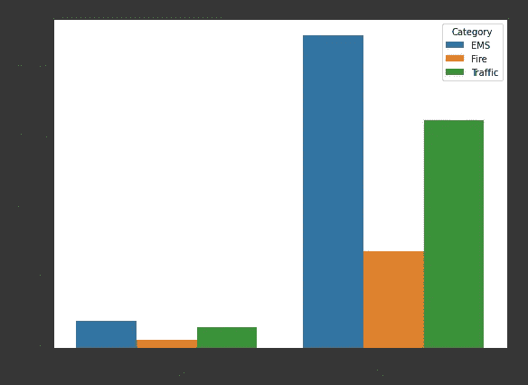

与 2015 年相比，2016 年越来越多的人采用了紧急呼叫服务，EMS 也有了大幅增长。我们最终可以得出结论，2016 年观察到的事故数量出现了巨大的峰值。

**8。>热图日对比时间**

在这里，我们将看到在哪一天和什么时间观察到最大数量的调用。

```
Day_hour=df.groupby([df.Day,df.Hours]).count().Category.unstack() 
"""Here multiindex object has been arranged into dataframe based on column label"""
plt.figure(figsize=(15,8))
sns.heatmap(Day_hour,linewidth=0.3,linecolor="black",cmap="gnuplot")
```


在这里，我们可以看到周一下午 3 点至 5 点之间拨打了大多数电话。

9.>**热图日对比月**

```
plt.figure(figsize=(15,8))
sns.heatmap(Day_month,linewidth=0.3,linecolor="black",cmap='gnuplot'
)
```

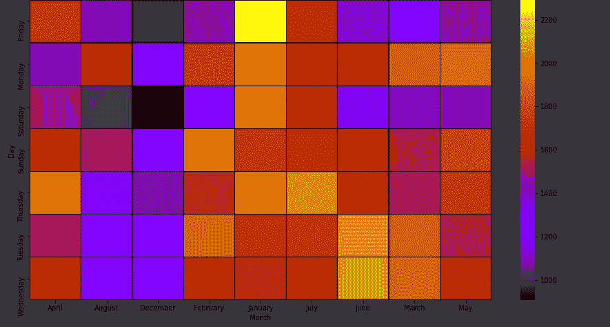

在这里，通过观察热图，我们可以得出结论，在一月份的星期五，拨打了最多的电话。

**10。>根据紧急情况的类别统计每月的电话数量**

```
month=df.groupby("Month").count()["Category"]
month.plot(figsize=(10,8),color="red")
```

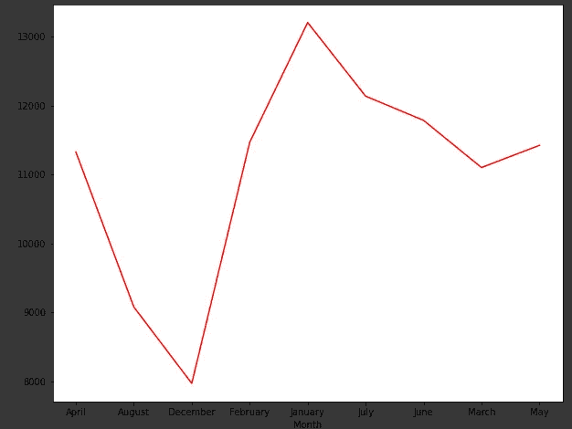

在一月份，已经尝试了最大数量紧急呼叫。

**结论:-**

这都是我这边的。如果你能在读完这篇博客后给我宝贵的建议，我将非常幸运。谢谢你……..