# 伦敦 Airbnb 房产的探索性数据分析

> 原文：<https://medium.com/analytics-vidhya/exploratory-data-analysis-on-airbnb-properties-in-london-39eb80da6d15?source=collection_archive---------6----------------------->

在这篇文章中，我将尝试回答这个问题:在伦敦，我应该在哪里购买新的投资房产？这是我在[伊斯坦堡数据科学院](http://istdatascience.com)的第一个关于探索性数据分析(EDA)的项目。

在我的项目开始，我想解释一下什么是探索性数据分析(EDA)？

# **什么是探索性数据分析**

> **“探索性数据分析**是一项侦探工作。 **EDA** 永远不可能是故事的全部，但其他任何东西都不能作为基石——作为第一步”*–****约翰·w·图基，1970***

探索性数据分析是所有数据科学项目的关键步骤。在现实世界的问题中，数据永远不会直接用于您的数据科学项目。收集数据集、清理、组织和争论数据是开发模型的关键过程。在这个项目中，我花了将近 80%的时间来收集、整理、组织和争论项目中的数据。

探索性数据分析可以帮助你，

*   理解数据的结构，
*   处理缺失值和异常值，
*   认识变量之间的关系，

简而言之，探索性数据分析告诉我们关于数据的几乎一切。

# **项目介绍**

每个数据科学项目都始于一个问题。在我的项目中，我的**业务需求**场景是:

寻找购买新房产的最佳地点，该房产将托管在 Airbnb 上进行投资。*关于这一需求的制约因素如下:*

总预算: **750.000**

首选地点:**伦敦市中心**

我的**解决方案**是:*使用****Airbnb London****数据、* ***房价指数(房价、销量、年增量)*** *数据、* ***议会税*** *数据、* ***GIS 边界*** *数据并加以分析*

我的**目标**关于这个项目:*为每个区回答这些问题；*

*   ***Airbnb****上托管的房产数量*
*   ***平均价格*** *每晚*
*   *估计* ***入住率*** *入住率*
*   *计算* ***年收入、年费用、年回报、初始费用*** *(税、会议费、家具等。)*
*   *计算* ***平均房价*******年增量*******销售量*****
*   ***计算* ***投资回报率和总利润*****

**你可以看到我的工作流程，我在这个项目申请如下；**

****

**探索性数据分析(EDA)工作流程**

# **数据源和工具**

**我获得了两种类型的数据来源。一个是 Airbnb 里面的**数据，为详细的房源数据。我决定使用 2019 年的数据，以避免受到疫情的影响(新冠肺炎)。该数据集还包括城市居民区的 GeoJSON 文件和 airbnb 物业位置(纬度和经度)。所以在我完成分析后，我将创建一些专题地图。****

****其他数据来源来自伦敦市长**。** [**伦敦数据仓库**](https://data.london.gov.uk/topic/) 有数百个数据集按 18 个主题分组。我的焦点数据集是**[**英国房价指数**](https://data.london.gov.uk/dataset/uk-house-price-index)**位于**房产**话题下。********

******我的工具集如下所示；******

******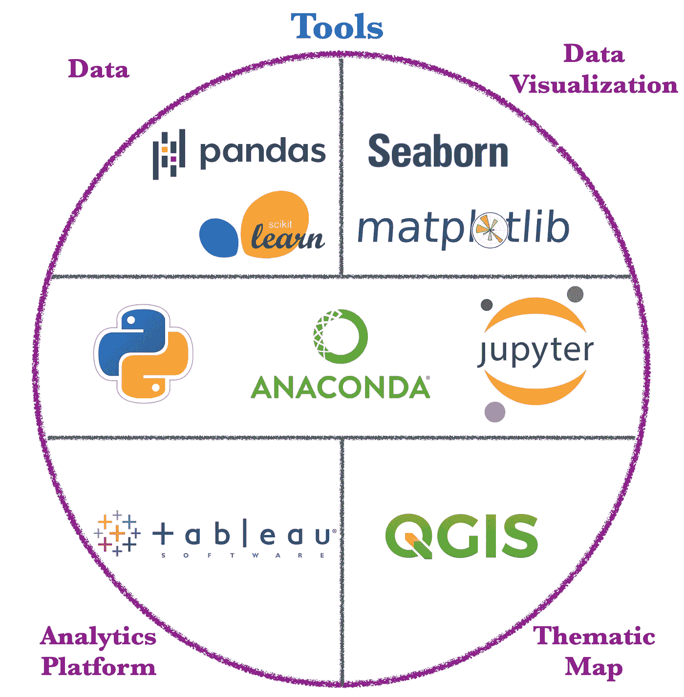******

******探索性数据分析项目中使用的工具******

******我用过；******

*   ********Jupyter 笔记本**上 **Anaconda** 发行版用 **Python** 编程语言。******
*   ********熊猫**和 **Scikit 学习**库进行数据获取、清理和角力，******
*   ******用于数据可视化的 **Seaborn** 和 **Matplotlib** 库。******
*   ********QGIS** 用于创建专题地图和空间分析。******
*   ********Tableau 公共**到分析平台。******

# ******数据争论和分析******

******数据角力是一条从**原始数据**到**洞察**、**报表**、**可视化图形**的道路。******

************

******照片由[UX](https://unsplash.com/@uxindo?utm_source=medium&utm_medium=referral)在 [Unsplas](https://unsplash.com?utm_source=medium&utm_medium=referral) h 上拍摄******

******当您浏览数据时，您可以使用 Python 中需要的几个内置方法，如 info、shape、isnull、unique、count、description、groupby、sort_values、pivot、merge 等。******

********来自数据的简要见解**如下所示:******

******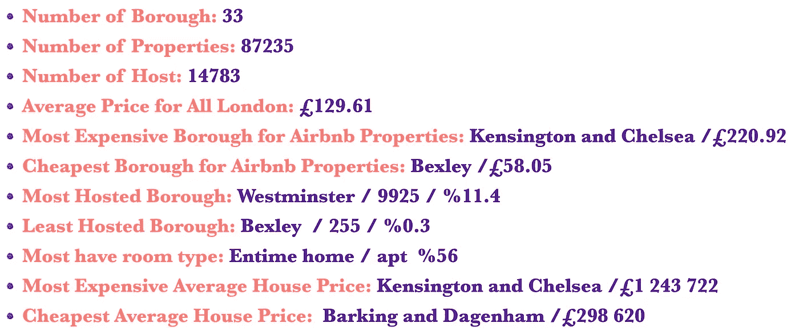******

******来自数据的简要见解******

******以下字段被导出并添加到 airbnb 列表数据集中:******

********平均:**平均房价。从 UK_House_Price_Index 获得的数据和每年每月计算的平均值，基于 1996 年至 2019 年的区数据。******

******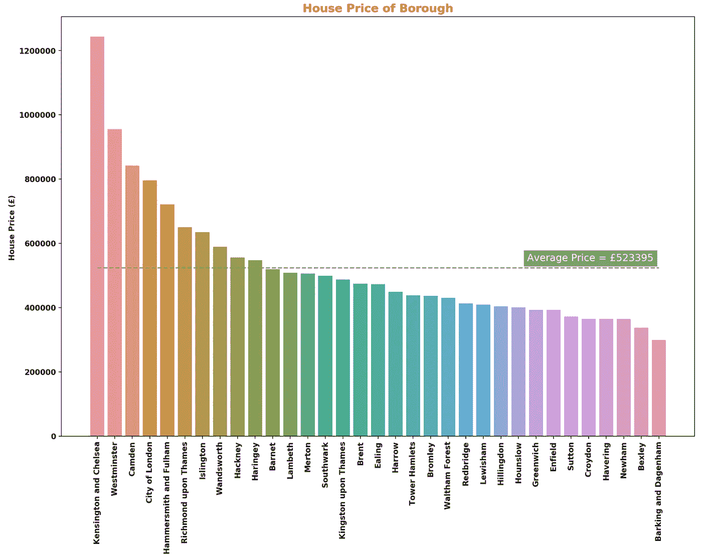******

******伦敦行政区的房价******

********est_night/year:** Airbnb 数据集不包括入住率，因此您需要估算入住率，因为这是计算年收入的一个非常关键的指标。任何在 Airbnb 酒店住宿的人，可能不会在住宿后写评论，所以乘以一个系数是合适的。我假设。*最低 _ 夜*评论 _ 每月* 12 *因子*******

********因子:**当我估算每个区的入住率时，我使用因子(系数)值。对于内伦敦区，系数为 **1.50** ，对于外伦敦区，系数为 **1.25** 。******

********occ_rate:** 每年入住率。est _ 夜/年/ 365******

********年收入:** *价格*预计夜/年*******

********平均增量:**房价年均增量。从 UK_House_Price_Index 获得的数据，并使用 **pct_change()** 方法计算每个月与上个月的对比。******

******内 _ 外:区的位置。这一列是为这些行政区手工设置的['肯辛顿和切尔西'，'威斯敏斯特'，'哈默史密斯和富勒姆'，'旺兹沃斯'，'哈克尼'，'南华克'，'塔哈姆莱特'，'卡姆登'，'兰贝斯'，'格林威治'，'伦敦城'，'伊斯灵顿']到*，其他是 ***外*** 。*******

********avg_council_tax:** 根据 8 个不同级别(级别 A、级别 B、级别 C、级别 D、级别 E、级别 F、级别 G、级别 H)的平均值计算的平均理事会税属于 2020-21 年******

******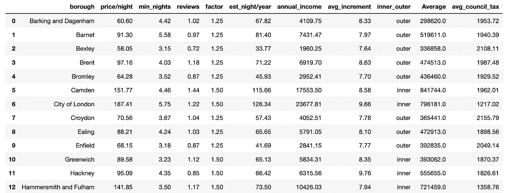******

********montly_fixed_cost:** 此值包括每月费用，如保险、电费、煤气费、水费、互联网费、维修费和其他费用。******

******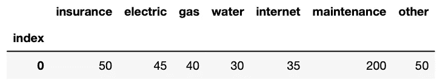******

********年度费用:**您酒店的年度费用。(montly _ fixed _ cost * OCC _ rate * 12)+(avg _ Council _ tax)******

********年度 _ 回报:**年度 _ 收入-年度 _ 费用******

********sd_cost:** 印花税成本。如果你以超过 125，000 英镑的价格购买房产，你必须交税(印花税和土地税)。我根据平均房价计算了每个市镇的税收。印花税土地税的计算如下所示；******

******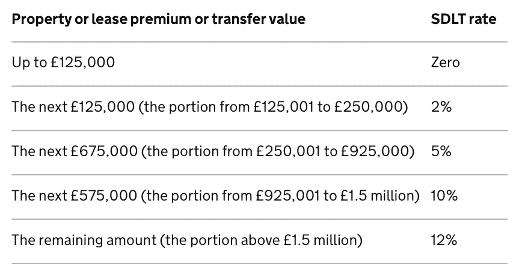******

******印花税土地税的计算******

********other_initial_cost:** 如果你在 airbnb 上购买了一处新房产，你还需要购买家具，并需要支付其他费用，如转让、搬迁等。我假设 10.000 只需要一次初始成本。******

********total _ initial:**SD _ cost+other _ initial _ cost******

********total_budget:** 当你购买新房产时，你需要支付你的房价+总初始款(印花税、土地税和其他初始费用)。比如说；旺兹沃斯的平均房价是 588613 英镑，但由于总初始费用，你需要预算 618043 英镑。******

********年平均销量:**年平均销量。数据来自英国房价指数******

********avg_volume/year_scale:** 在 0 和 1 之间标准化的年平均销售量。******

********avg _ h _ pri _ after 1:**1 年后的平均房价。如果你需要在 1 年后出售你的房子，重要的是估计你的房价。******

******(平均值)+((平均值*平均值 _ 增量*平均值 _ 量/年 _ 规模)/ 100)******

********ROI:** 投资回报。这个指标是这样计算的:******

******(年度回报/预算总额)*100******

******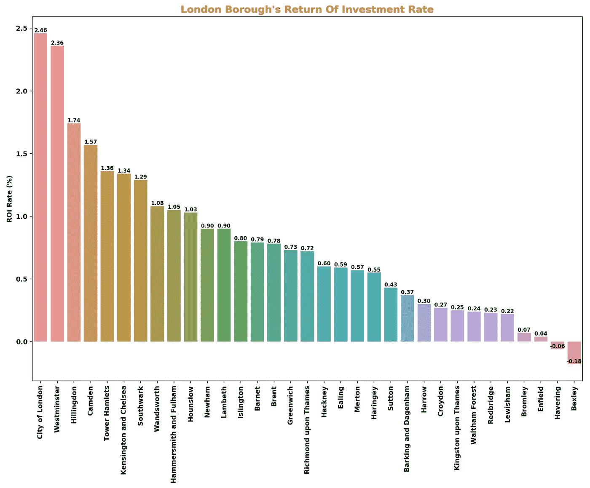******

******各行政区投资回报率柱状图******

******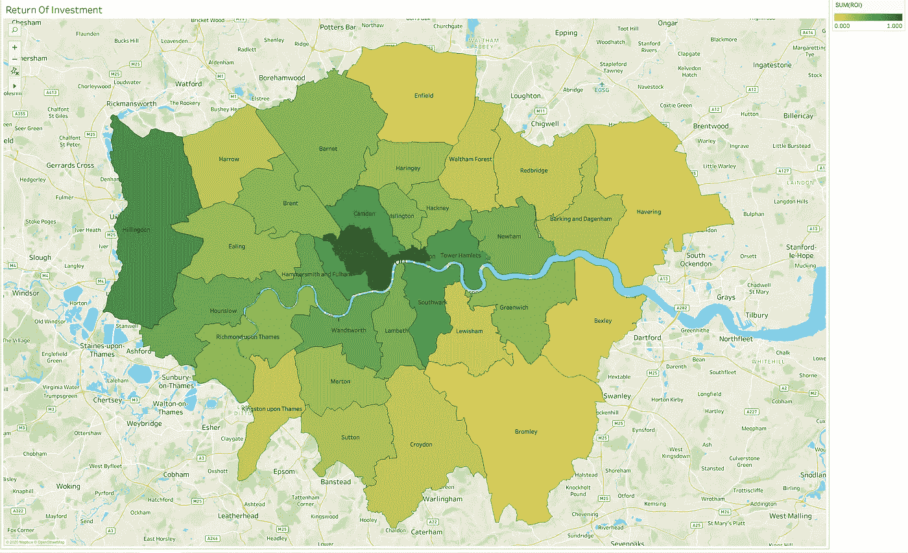******

******投资回报专题图******

********Profit _ af t1:**1 年后的净利润值。如果你需要在 1 年后出售你的房子，你的净利润计算如下图所示；******

******avg_h_pri_after1 +年收入-总预算-年度费用-(avg_h_pri_aft1*1.00/100)******

******我假设当你出售你的财产时，你可以支付大约 1%的销售价格。******

******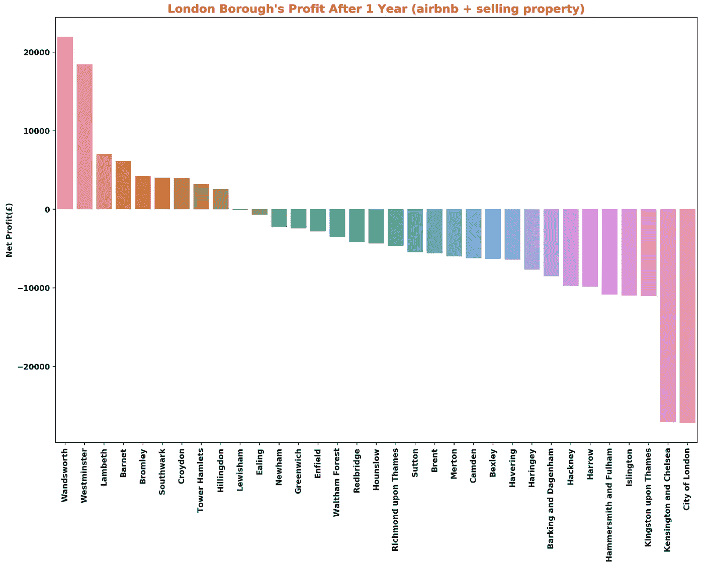******

******每个行政区的纯利润值条形图******

******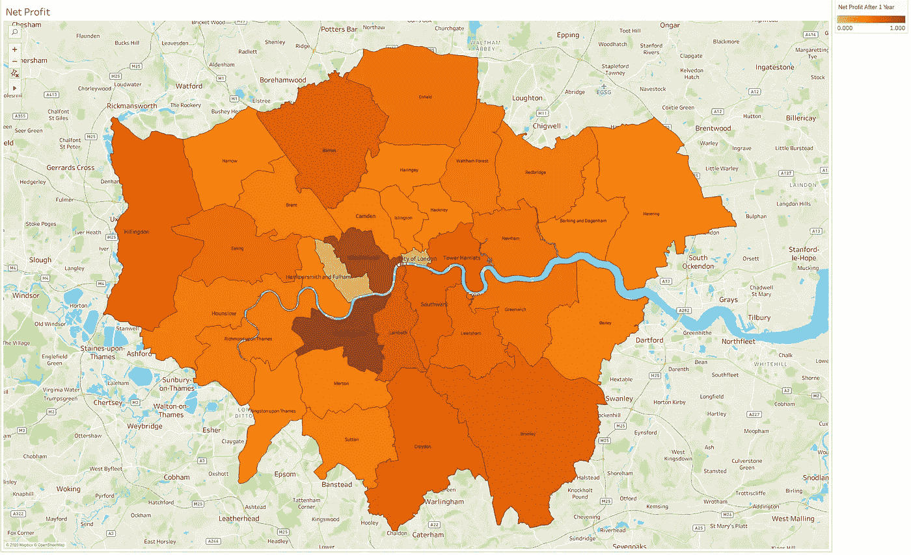******

******净利润值专题图******

********一些图表********

******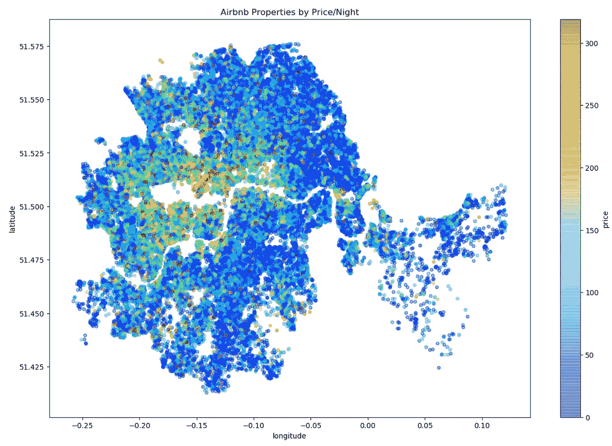******

******Airbnb 酒店价格/住宿专题地图******

# ********结论********

******在分析的最后，我对所有指标使用了标准化值(在 0 和 1 之间)。0 表示对投资者不利(负面)，1 表示对投资者有利(正面)。******

******在分析了所有关于我客户的限制(总预算和首选位置)的数据后，我提出了两个不同的主题。******

********根据投资回报率:********

******Tower Hamlets、Southwark 和 Wandsworth 是最适合购买新房产的行政区。因为指标如下所示:******

*   ******价格/晚******
*   ******占有******
*   ******年度回报(收入—费用)******
*   ******房价(购买)******
*   ******开办费******

********根据净利润(1 年后)********

********旺兹沃斯**、**兰贝斯**和**索特沃克**是最适合购买新房产的行政区。因为指标如下所示:******

*   ******价格/晚******
*   ******占有******
*   ******年度回报(收入—费用)******
*   ******房价(购买)******
*   ******开办费******
*   ******年增量******
*   ******销售量******
*   ******房价(出售)******

******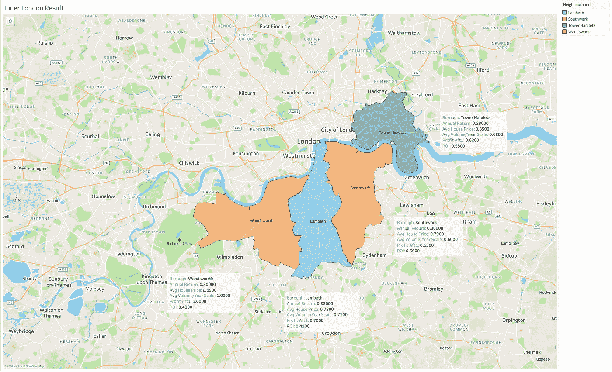******

******我建议的行政区专题地图。******

# ********未来工作********

******该项目可以通过以下方式进一步扩展:******

*   ******分析**英国房价指数**基于**邮政编码**在**旺兹沃斯、塔哈姆莱特、兰贝斯和南华克。********
*   ******使用[**booking.com**](http://booking.com)数据为平均**住宿价格。********
*   ******使用**评论数据** (airbnb，预订)& **社交媒体** (Instagram，Twitter，Foursquare)并获取关于位置的评论。******

******我使用了数据科学家所需的基本技能和工具。这是结束我在伊斯坦布尔数据科学院的第一个项目的好方法！******

******如果你对 Python 笔记本的代码和其他数据感兴趣，可以联系我的 [**GitHub repo。**](https://github.com/yalinyener/EDA-Airbnb-London)******

******如果你想了解我的生活，你可以看看我的 [**公众**](https://public.tableau.com/profile/yalin.yener#!/) 简介。******

******您可以在我的[**slide share**](https://www.slideshare.net/YalnYENER/eda-of-airbnb-london)**访问项目的演示文稿。********

******感谢您阅读我的帖子。如果您有任何问题或想要分享您的意见，请随时联系我。******