# IMDb 会员数据的探索性数据分析

> 原文：<https://medium.com/analytics-vidhya/exploratory-data-analysis-on-an-imdb-member-data-f516f5ff6304?source=collection_archive---------25----------------------->

在这本笔记本中，我们将探索一个 IMDb 用户的数据。你可以在 IMDb 上下载你自己的评分和更多关于你评分的电影的信息(你必须有一个账户才能这样做)。进入您的个人资料页面，点击**“您的评分”**按钮。从那里单击三个垂直点，然后单击“导出”,将您的数据下载到。csv 文件格式。

让我们从必要的导入开始:

```
**import** **pandas** **as** **pd**
**import** **numpy** **as** **np**
**import** **seaborn** **as** **sns**
**import** **matplotlib.pyplot** **as** **plt**
**from** **datetime** **import** date
sns.set(style="darkgrid")
plt.style.use("seaborn-pastel")
```

我从网站上下载了我的数据，让我们首先在这里加载数据:

```
df = pd.read_excel("Omer Eker IMDb Ratings 2020-04-06.xlsx")
df.head()
```

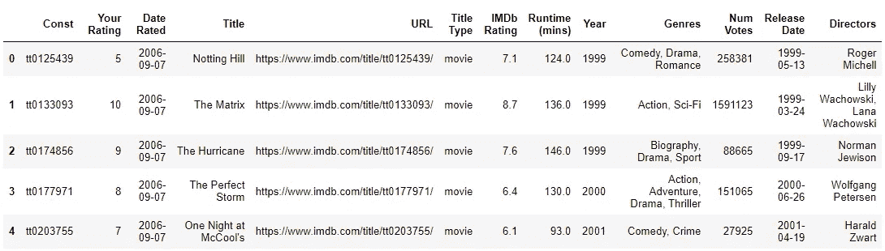

每行代表一部电影或电视剧等。这些列是:

*   **Const** :电影的唯一 ID
*   **你的评分**:用户对影片的评分
*   **评分日期**:用户对影片进行评分的日期
*   **片名**:电影片名
*   **网址**:影片的 IMDb 网址
*   **片头类型**:片头类型(电影、电视剧、短片、视频等。
*   **IMDb 评分**:影片加权平均评分
*   **运行时间(分钟)**:电影运行时间(分钟)
*   **年份**:影片上映年份
*   **流派**:电影的流派(喜剧、戏剧、恐怖等。)
*   **投票数**:影片获得的投票数
*   **发布日期**:YYYY-MM-DD 格式的发布日期(日期时间对象)
*   **导演**:电影的导演(有的有多个导演)

它显示我评价了 1093 本书:

```
df.info()<class 'pandas.core.frame.DataFrame'>
RangeIndex: 1093 entries, 0 to 1092
Data columns (total 13 columns):
 #   Column          Non-Null Count  Dtype         
---  ------          --------------  -----         
 0   Const           1093 non-null   object        
 1   Your Rating     1093 non-null   int64         
 2   Date Rated      1093 non-null   datetime64[ns]
 3   Title           1093 non-null   object        
 4   URL             1093 non-null   object        
 5   Title Type      1093 non-null   object        
 6   IMDb Rating     1093 non-null   float64       
 7   Runtime (mins)  1089 non-null   float64       
 8   Year            1093 non-null   int64         
 9   Genres          1093 non-null   object        
 10  Num Votes       1093 non-null   int64         
 11  Release Date    1080 non-null   datetime64[ns]
 12  Directors       1047 non-null   object        
dtypes: datetime64[ns](2), float64(2), int64(3), object(6)
memory usage: 111.1+ KB
```

# 用户评级的分布

成员评分的分布以条形图(左)和圆环图(右)显示:

*   一半的收视率不是 6 分就是 7 分
*   大多数评分在 5 到 9 分之间

```
rating_counts = df["Your Rating"].value_counts().sort_index()plt.figure(figsize=(12,5))plt.subplot(1,2,1)
sns.countplot(x=df["Your Rating"])**for** i,rate **in** enumerate(rating_counts):
    plt.text(i,rate+2,f"{round(100*rate/df.shape[0])}%",ha="center")

plt.subplot(1,2,2)   
df["Your Rating"].value_counts().plot.pie(autopct="**%.0f%%**",pctdistance=0.8,wedgeprops=dict(width=0.4))plt.tight_layout()
plt.show()
```

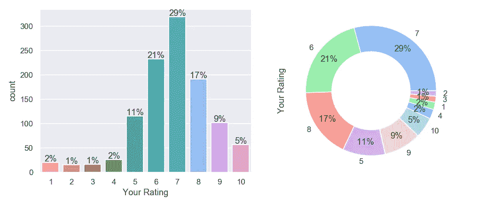

# 年度评级趋势

*   我从 2006 年开始给出评级(右图)
*   2011 年右图中的峰值是我决定更认真地对待评级的时候，开始对我以前看过的所有电影进行评级
*   左边的图表显示，我评价的大多数电影都是在 90 年代及以后发行的
*   在同一张图中，我可以将 2003 年的峰值与我开始获得理学学士学位的时间联系起来，在那里我开始观看电影，绝大多数电影都是在那一年上映的(如果我开始评级，我们也可以在右侧的图中看到 2003 年的峰值)
*   从 2015 年开始，分级电影的数量一直呈线性增长

```
plt.figure(figsize=(12,5))
plt.subplot(1,2,1)
df.groupby(pd.Grouper(key="Release Date",freq="1Y")).count()["Title"].plot()
plt.gca().annotate("BSc starts (2003)",xy=(date(2003,1,1),50),xytext=(date(1960,1,1),80),
                   arrowprops=dict(width=1,color="sandybrown"))
plt.title("Vote counts per film release date",fontweight="bold")
plt.subplot(1,2,2)
df.groupby(pd.Grouper(key="Date Rated",freq="1Q")).count()["Title"].plot()
plt.gca().annotate("Rating Decision Made",xy=(date(2011,1,1),190),xytext=(date(2014,1,1),100),
                  arrowprops=dict(color="sandybrown",width=1))
plt.title("Vote counts per year",fontweight="bold")
plt.tight_layout()
plt.show()
```

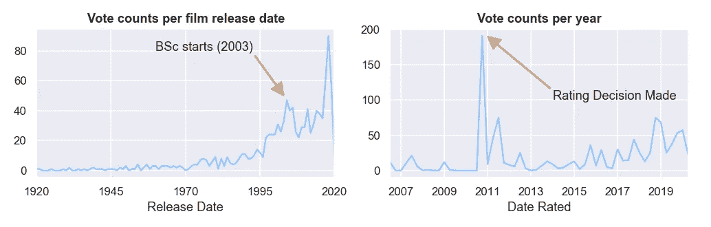

下图结合了上面的两个图表:

*   y=x 线是最拥挤的区域，因为用户更倾向于观看当年的电影
*   从 x=2011 可以看出，几乎所有上一年发行的用户评分电影

```
plt.figure(figsize=(12,7))
sns.scatterplot(y="Release Date",x="Date Rated",data=df,edgecolor="cornflowerblue")
plt.show()
```

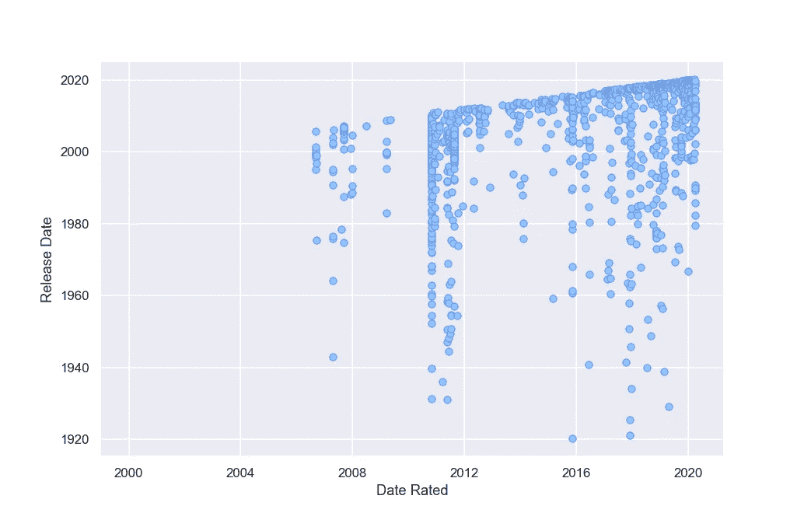

# 用户评分与 IMDb 加权平均评分

让我们将我的评分与 IMDb 的加权平均评分进行比较。下面的箱线图显示，它们似乎与一些例外正相关，主要是在我的低评级中:

```
plt.figure(figsize=(12,7))
sns.boxenplot(x="Your Rating",y="IMDb Rating",data=df)
plt.xlabel("User's Rating")
*# sns.swarmplot(x="Your Rating",y="IMDb Rating",data=df,color="cornflowerblue",alpha=0.4)*
plt.show()
```

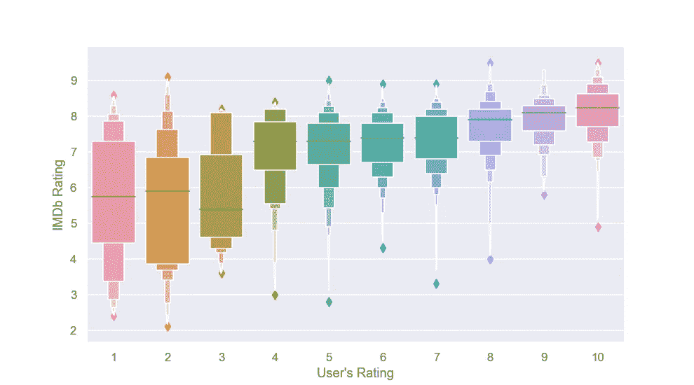

计算用户和 IMDb 平均值之间 45%的相关性:

```
df[["Your Rating","IMDb Rating"]].corr()
```

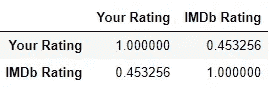

# 不太喜欢连续剧

我的评分几乎都来自于“电影”的评分。我更倾向于看电影而不是连续剧。占我收视率 0.7%的电视迷你剧主要是网飞纪录片或短片，如《黑镜》:

```
title_counts = df["Title Type"].value_counts()plt.figure(figsize=(12,5))
sns.countplot(y="Title Type",data=df,order=title_counts.index)
**for** i,count **in** enumerate(title_counts):
    plt.text(count+35,i,f"{round(100*count/df.shape[0],1)}%",ha="center")
plt.tight_layout()
plt.show()
```

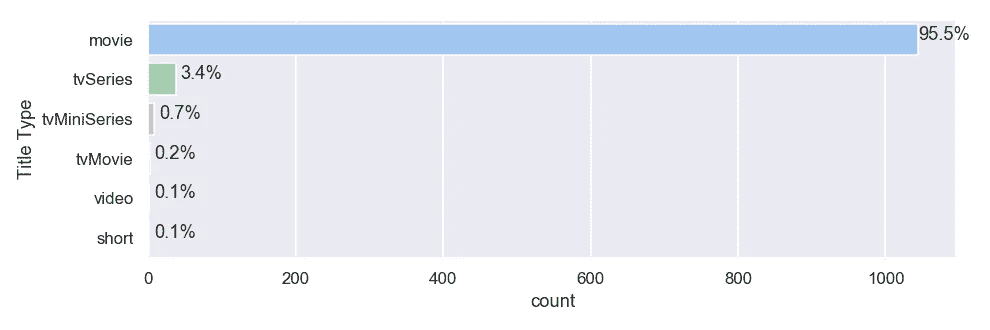

# 我看过最多的 20 位导演的电影

```
dir_counts = df.Directors.value_counts()[:20]plt.figure(figsize=(12,6))
sns.barplot(y=dir_counts.index,x=dir_counts.values)
plt.tight_layout()
plt.show()
```

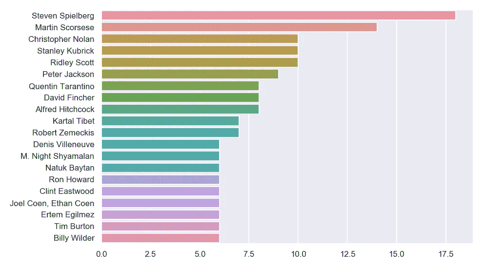

# 电影的放映时间分布

*   标题(电影、连续剧等)的平均运行时间。)差不多是 2 个小时
*   它显示正态分布，正态分布有一个长尾巴，这是由于连续剧或纪录片系列的总运行时间较长。

```
mean_runtime = df["Runtime (mins)"].mean()plt.figure(figsize=(12,6))
sns.distplot(df["Runtime (mins)"].dropna(),label="Runtime distribution")
*# plt.gca().set_yscale("log")*plt.gca().axvline(mean_runtime,color="sandybrown",label=f"Mean Runtime: {int(mean_runtime)}m")
plt.gca().axvspan(200,600,color="slateblue",alpha=0.1,label="Not Films (series, documentaries)")
plt.legend()
plt.show()
```

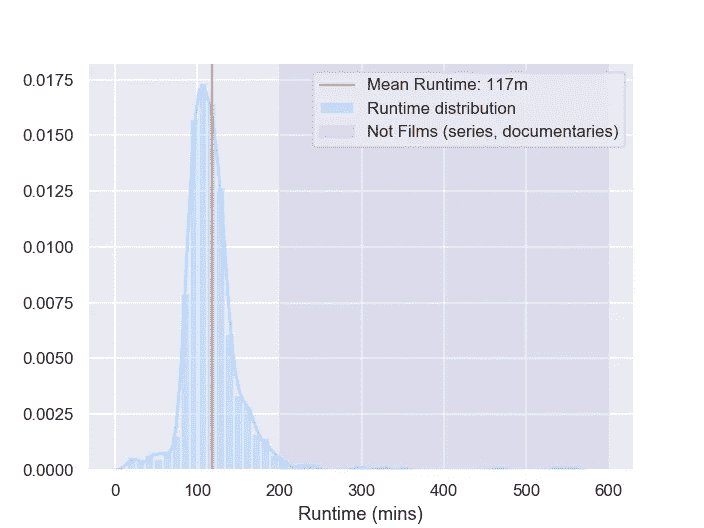

# 流派的分类

由于大多数标题都与多种风格相关联，因此我们可以使用特定的函数对它们进行计数并将其转换为一次性编码变量:**计数矢量器**sci kit-Learn 库中的 NLP 特征提取函数:

```
**from** **sklearn.feature_extraction.text** **import** CountVectorizervec = CountVectorizer(token_pattern='(?u)**\\**b[**\\**w-]+**\\**b').fit(df["Genres"])
bag_of_genres = vec.transform(df["Genres"])genres_dummy = pd.DataFrame(bag_of_genres.todense(),columns=vec.get_feature_names())
df[vec.get_feature_names()] = genres_dummy
df.head()
```

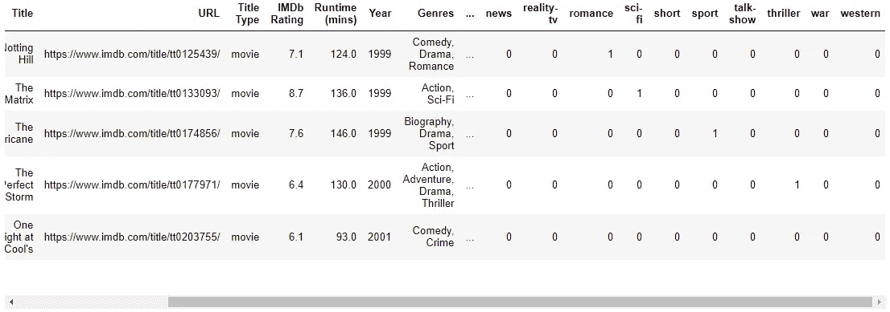

现在，我们为每种类型增加了 26 个独热编码变量，并连接到表的末尾。让我们来计算它们的频率:

*   倾向于看更多的剧情片、悬疑片、惊悚片和科幻片，因为它们的百分比超过了人口平均水平(另一个笔记本，给出了 IMDb 最近对整个用户人口统计的有趣统计，即将推出)

```
genre_counts = 100*df[vec.get_feature_names()].sum().sort_values(ascending=**False**)/df.shape[0]plt.figure(figsize=(12,6))
sns.barplot(x=genre_counts.values,y=genre_counts.index,orient="h")
plt.xlabel("Percentage of Titles (%)")
plt.ylabel("Genre")
plt.tight_layout()
plt.show()
```

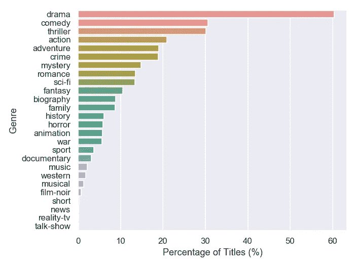

# 未来的工作

*   这项工作可以通过比较用户的统计数据和整个 IMDb 的用户人口平均值来扩展
*   该表可以通过加入来自 https://www.imdb.com/interfaces/[IMDb 开放数据库的其他表来扩展](https://www.imdb.com/interfaces/)
*   在用其他表扩展该表之后，可以对演员、作家等进行一些频率分析。