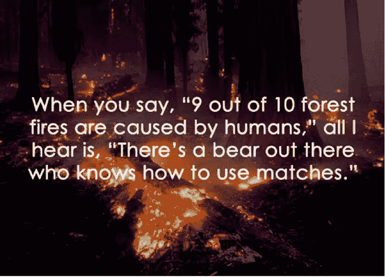
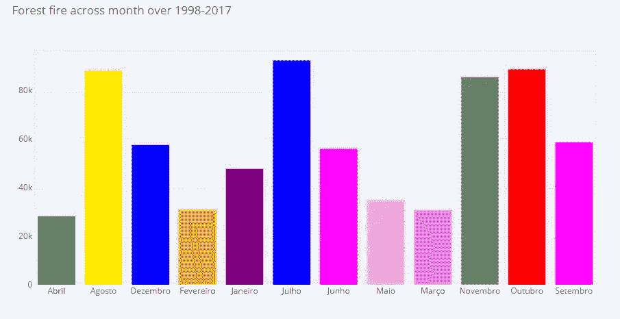

# 利用 Plotly 对巴西森林火灾的探索性数据分析

> 原文：<https://medium.com/analytics-vidhya/exploratory-data-analysis-on-brazil-forest-fire-using-plotly-d2e98060886a?source=collection_archive---------7----------------------->

**EDA(探索性数据分析):**这是一个术语，指用数据集完成的某些类型的初始分析和洞察，通常在分析过程的早期。“这有点像是通过图形的可视化来讲述故事”。

为了获得对数据的“感觉”，对于一个数据科学家来说，仅仅知道数据中有什么是不够的；此外，数据科学家必须知道数据中没有什么，唯一的方法是利用我们人类的模式识别和比较能力，对数据应用一系列明智的图形技术。

**Plotly:** 这是一个交互式的分析/统计仪表板，可以让用户看到更好的可视化效果。

每个数据科学家和有抱负的数据科学家都必须了解交互式分析/统计仪表板可视化，如 plotly、tableau、microsoft power BI 等。

让我们进入巴西森林火灾的 eda 分析:在这里，数据集包含 1998 年至 2017 年期间巴西各州森林火灾数量的信息。要下载数据集，请点击下面的链接【https://www.kaggle.com/gustavomodelli/forest-fires-in-brazi 

观看互动情节的链接贴在博客的末尾:

# 1998 年至 2017 年期间，前 10 个州报告的森林火灾发生率:

该图显示了 20 年间前 10 个州报告的森林火灾发生率。多年来(1998 年至 2017 年)，马托格罗索州发生了约 9 万次森林火灾。亚马逊地区已经发生了 3 万次森林火灾。巴黎和圣保罗的森林火灾次数为 50k。

**代码:**

# 前 10 个州每月的森林火灾总数:

下图解释了每月十大州报告的森林火灾数量。与其余月份相比，Marco、Abril、Fevereiro、Maio(3 月、4 月、2 月、5 月)的森林火灾发生率较低。在接下来的几年中，七月、八月、十一月和十月的森林火灾发生率很高。

**代码:**

# 巴西各州的地图位置:

下图显示了巴西各州报告森林火灾的位置。

**代码:**

# 1998-2017 年期间跨月森林火灾报告:

下面的图表说明了，10 个月来的森林火灾报告.在过去 20 年中，8 月、7 月、10 月和 11 月的森林火灾发生次数最多，约为 8 万至 9 万次。

# 前 10 个州历年森林火灾的贡献:

下图提供了从 1998 年到 2017 年每年发生森林火灾的数量，包括报告森林火灾数量最多的前 10 个州。

**代码:**

# 多年来森林火灾的发生率:

下图解释了 1998 年至 2017 年间的森林火灾。随后，2001 年至 2003 年期间，森林火灾有所增加，2003 年至 2008 年期间有所下降。

从 2008 年到现在逐渐增加。

**代码:**

# 各州和各月的森林火灾百分比分布:

下图说明了几个月内森林火灾报告的百分比分布。在 7 月、10 月、8 月和 11 月期间，平均有 12%至 13%的森林火灾发生。3 月至 5 月期间森林火灾发生率的 4%至 5%。

下图说明了各州森林火灾报告的百分比分布。圣保罗、马托格罗索和巴伊亚州平均有 7%到 8%的森林火灾发生。整个阿拉戈斯、联邦区和塞尔希培的森林火灾发生率为 0%至 1%(森林火灾报告率最低)。

**代号:**

# 结论:

2001 年至 2003 年报告的森林火灾数量最高。圣保罗州和马托格罗索州的森林火灾报告很高。在过去的 1998-2017 年间，阿拉戈斯、联邦区和塞尔希培的森林火灾发生率最低。8 月至 11 月询问随后各年森林火灾的高数量。

查看交互式图表和代码的链接:

 [## 森林 _ 火灾 _ 巴西 _ 埃达

### 下载数千个项目的开放数据集+在一个平台上共享项目。探索热门话题，如政府…

www.kaggle.com](https://www.kaggle.com/tinurohith18/forest-fire-brazil-eda)